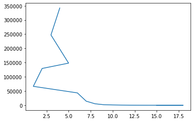
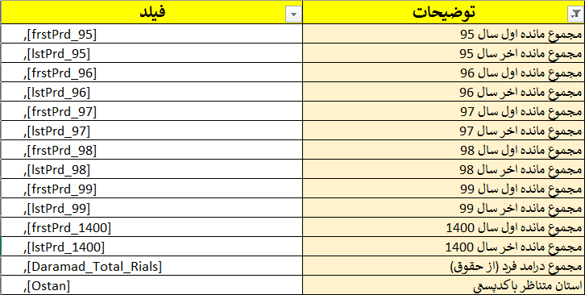
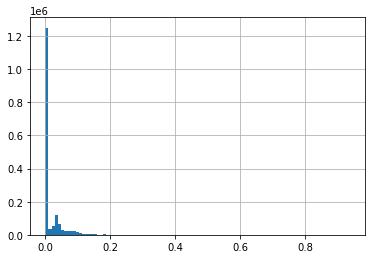

# Advanced Pandas course - Day 1


## Starting discussion

- Introduction
- Who we are?
- What do you expect from this course?
  - Working experiences
  - High level Syllabus overview

<br>

   - Programming 
   
     - [Teach Yourself Programming in Ten Years by Peter Norvig](http://norvig.com/21-days.html?goodforonemore)
     
     > **Knowledge** is a _treasure_, but _practice_ is the **key** to it.
   
   
   - [Python](http://python.org/)
     - [Guido van Rossum](https://en.wikipedia.org/wiki/Guido_van_Rossum)
     
     - https://www.py4e.com/
   
   
   - [Pandas library](https://pandas.pydata.org/) 
   
     - Initiated by [Wes McKinney](https://www.google.com/search?client=firefox-b-d&q=wes+mckinney)
     - The name is derived from the term "**pan**el **da**ta", an econometrics term for data sets that include observations over
     multiple time periods for the same individuals. Its name is a play on the phrase **"Python data analysis"** itself.
     
    > pandas is a software library written for the Python programming language for data manipulation and analysis.[2] In particular, it offers data structures and operations for manipulating numerical tables and time series. It is free software released under the three-clause BSD license.[3] The name is derived from the term "**panel da**ta", an econometrics term for data sets that include observations over multiple time periods for the same individuals.[4] Its name is a play on the phrase "**Python data analysis**" itself.[5] Wes McKinney started building what would become pandas at AQR Capital while he was a researcher there from 2007 to 2010.[6]
    
    Wikipedia
    
     


```python
from os import chdir, getcwd, listdir
```


```python
getcwd()
```


    'D:\\Hesam\\Python related activities'


Reference book **Python for Data Analysis: Data Wrangling with pandas, NumPy, and Jupyter** <br>
By [Wes McKinney](https://wesmckinney.com)

[Python for Data Analysis, 3E Download](http://library.lol/main/FE2799007BC57CBFD45809344399721F)

_Excerpt from the Book_

As a bit of background, I started building pandas in early 2008 during my tenure at AQR Capital Management, a quantitative investment management firm. At the time, I had a distinct set of requirements that were not well addressed by any single tool at my disposal:

   - Data structures with labeled axes supporting automatic or explicit data alignment— this prevents common errors resulting from misaligned data and working with differently indexed data coming from different sources
   - Integrated time series functionality
   - The same data structures handle both time series data and non-time series data
   - Arithmetic operations and reductions that preserve metadata
   - Flexible handling of missing data
   - Merge and other relational operations found in popular databases (SQL-based, for example)
   
I wanted to be able to do all of these things in one place, preferably in a language well suited to general-purpose software development. Python was a good candidate language for this, but at that time an integrated set of data structures and tools providing this functionality did not exist. As a result of having been built initially to solve finance and business analytics problems, pandas features especially deep time series functionality and tools well suited for working with time-indexed data generated by business processes.

I spent a large part of 2011 and 2012 expanding pandas’s capabilities with some of my former AQR colleagues, Adam Klein and Chang She. In 2013, I stopped being as involved in day-to-day project development, and pandas has since become a fully community-owned and community-maintained project with well over two thousand unique contributors around the world.

The pandas name itself is derived from panel data, an econometrics term for multidimensional structured datasets, and a play on the phrase Python data analysis.
    
[Excerpt from the Book](https://wesmckinney.com/book/preliminaries.html)


  - Typical works need of excel, txt, CSV, DB, ... 
  - Reporting, analysis development, etc. 
  
     - Any experinces?
     - Not so simple to remember after few days/weeks
     - Repeating tasks what so ever
     - Automating the investigation, analysis, etc
  
  - Excel hell
      - [Escaping Excel Hell with Python & Pandas](https://github.com/chris1610/pbpython/blob/master/presentations/Escaping-Excel-Hell-with-Python-and-Pandas.pdf)


You can download to simplify your use of [Pandas documentation](https://pandas.pydata.org/docs/index.html) .


```python
from IPython.display import IFrame, Image
Image(filename='./images/Pandas_doc.png',width=900, height=600)
```


    

    


```python
from os import chdir, getcwd, listdir
```


```python
chdir('D:/Hesam/Data Science/Pandas course notebook')
```


```python

```

Read the English version of essay by **[Peter Norvig](http://norvig.com)** 

- What is his message?


```python
IFrame(src='http://norvig.com/21-days.html?goodforonemore', width=1000, height=400)
```


<iframe
    width="1000"
    height="400"
    src="http://norvig.com/21-days.html?goodforonemore"
    frameborder="0"
    allowfullscreen
></iframe>


## The fundamentals of data analysis

**Data analysis** is a highly **iterative** process involving 


1. **Data collection**
2. **Data preparation (wrangling)**
3. **Exploratory Data Analysis (EDA)** 
4. **Drawing conclusions** 

During an analysis, we will frequently revisit each of these steps. 


```python
Image(filename='./images/BS_problem_framework.png',width=900, height=600)
# "D:\Hesam\Data Science\Pandas course notebook\images\BS_problem_framework.png"
Image(filename="D:\Hesam\Data Science\Pandas course notebook\images\BS_problem_framework.png",width=900, height=600)
```


    

    


```python
chdir('D:/Hesam/Data Science/Pandas course notebook')
```


Business Science University [university.business-science.io](https://university.business-science.io/)

What is CRISP DM? 

The [CRoss Industry Standard Process for Data Mining (CRISP-DM)](https://www.datascience-pm.com/crisp-dm-2) is a process model with six phases that naturally describes the data science life cycle. It’s like a set of guardrails to help you plan, organize, and implement your data science (or machine learning) project.

1. **Business understanding** – What does the business need?

2. **Data understanding** – What data do we have / need? Is it clean?

3. **Data preparation** – How do we organize the data for modeling?

4. **Modeling** – What modeling techniques should we apply?

5. **Evaluation** – Which model best meets the business objectives?

6. **Deployment** – How do stakeholders access the results?


```python
#Image(filename='./images/Python_workflow.png', width=900, height=600)
from IPython.display import IFrame, Image, display
path="D:/Hesam/Data Science/Pandas course notebook/images/" #./images/Python_workflow.png'

def img(name = 'Python_workflow.png', path = "D:/Hesam/Data Science/Pandas course notebook/images/", width=900, height=600):
    # print(path + name, type(path + name))
    display(Image(path + name))

input_dict = {'path':"D:/Hesam/Data Science/Pandas course notebook/images/", 'width':900, 'height':600}
   
img('Python_workflow.png', **input_dict)
```


    

    


```python
path="D:/Hesam/Data Science/Pandas course notebook/images/"
def img(a):
    display(Image(filename=path+str(a),width=900, height=600))
    
img('Python_workflow.png')
```


    

    


```python

```

[data-manipulation-with-python](https://www.mit.edu/~amidi/teaching/data-science-tools/study-guide/data-manipulation-with-python/)

#### Few points on folder, address we are now and change address

- Windows vs. Linux folder addressing
   - Windows : 
   
      `'D:\\Data Science\\Pandas course notebook'` <br>
       `r'D:\Data Science\Pandas course notebook'` 
       <br> 
   - Linux : `'D:/Data Science/Pandas course notebook'` 
   <br>
   
- Linux format works for Windows as well `'D:/Data Science/Pandas course notebook'`


```python
getcwd()
```


    'D:\\Hesam\\Data Science\\Pandas course notebook'


<div class="mobile-container">
<center>
<table>
<tbody>
<tr>
<td align="center"><b>Category</b></td>
<td align="center"><b>Action</b></td>
<td align="center"><b>Command</b></td>
</tr>
<tr>
</tr><tr>
<td rowspan="3" align="center">Paths</td>
<td align="left">Change directory to another path</td>
<td class="python" align="left"><code><span><span class="python-object">os</span>.<span class="python-function">chdir</span>(path)</span></code></td>
</tr>
<tr>
<td align="left">Get current working directory</td>
<td class="python" align="left"><code><span><span class="python-object">os</span>.<span class="python-function">getcwd</span>()</span></code></td>
</tr>
<tr>
<td align="left">Join paths</td>
<td class="python" align="left"><code><span><span class="python-object">os</span>.<span class="python-attribute">path</span>.<span class="python-function">join</span>(path_1,&nbsp;...,&nbsp;path_n)</span></code></td>
</tr>
<tr>
<td rowspan="5" align="center">Files</td>
<td align="left">List files and folders in a given directory</td>
<td class="python" align="left"><code><span><span class="python-object">os</span>.<span class="python-function">listdir</span>(path)</span></code></td>
</tr>
<tr>
<td rowspan="2" align="left">Check if path is a file / folder</td>
<td class="python" align="left"><code><span><span class="python-object">os</span>.<span class="python-attribute">path</span>.<span class="python-function">isfile</span>(path)</span></code></td>
</tr>
<tr>
<td class="python" align="left"><code><span><span class="python-object">os</span>.<span class="python-attribute">path</span>.<span class="python-function">isdir</span>(path)</span></code></td>
</tr>
<tr>
<td rowspan="2" align="left">Read / write csv file</td>
<td class="python" align="left"><code><span><span class="python-object">pd</span>.<span class="python-function">read_csv</span>(path_to_csv_file)</span></code></td>
</tr>
<tr>
<td class="python" align="left"><code><span><span class="python-object">df</span>.<span class="python-function">to_csv</span>(path_to_csv_file)</span></code></td>
</tr>
</tbody>
</table>
</center>
</div>


```python
%pwd
```


    'D:\\Hesam\\Data Science\\Pandas course notebook'


## Questions you have on data set

Explore data sets and write your Questions which could be answered by exploring this data set in [Googlesheet]()


```python
from os import getcwd, listdir, chdir
chdir(r'D:\Hesam\Data Science\Pandas course notebook') 
# chdir('D:\\Hesam\\Data Science\\Pandas course notebook') 
# chdir('D:/Hesam/Data Science/Pandas course notebook') 
```


```python
from IPython.display import Image, HTML, display
```


```python
#
Image(filename="D:\Hesam\Data Science\Pandas course notebook\images\DS_pyramid.png",width=800, height=400)
```


    

    


We will work on sample data provided at [sample stats from Refah database of Iranian welfare ](https://refahdb.mcls.gov.ir/fa/sample) by means of [Pandas](https://pandas.pydata.org/). 

- Short review of Pandas functionalities
- take a look at some advanced functionalities by means of investigating and analysing a sample dataset 


<p dir="rtl" >
پایگاه اطلاعات رفاه ایرانیان وزارت تعاون، کار و رفاه اجتماعی / نمونه 2 درصدی از پایگاه اطلاعات رفاه ایرانیان

</p>

https://refahdb.mcls.gov.ir/fa/sample


```python
Image(filename='./images/refah-stats-webpage.png',width=800, height=400)
```


    

    


## Data Tech stack

- Review tech stack
- [Numpy webpage](https://numpy.org/) $	\Longrightarrow $ Ecosystem $\Longrightarrow$ Data Science 


- Numpy and other Python DS tech stack 
    - What are relations and dependencies?
    
    [Case Study: First Image of a Black Hole](https://numpy.org/case-studies/blackhole-image/)


```python
Image(filename=r"D:\Hesam\Data Science\Pandas course notebook\images\blackhole.jpg",width=800, height=400)
```


    

    


```python
Image(filename='./images/bh_numpy_role.png',width=800, height=400)
```


    

    


```python
Image(filename="D:\Hesam\Data Science\Pandas course notebook\images\Tech-Stack.png",width=800, height=400)
```


    

    


```python
chdir('D:\\Hesam\\Data Science\\Pandas course notebook')
```


```python
listdir()
```


    ['.ipynb_checkpoints',
     'Course work - Part 2.ipynb',
     'data',
     'Escaping-Excel-Hell-with-Python-and-Pandas.pdf',
     'ID and Birth investigation.ipynb',
     'images',
     'Introduction.ipynb',
     'section1_test.py',
     'some notes on Pandas course.docx',
     'Untitled.ipynb',
     'untitled.md',
     'Useful_resources.ipynb']


```python
Image(filename="D:\Hesam\Data Science\Pandas course notebook\images\Data_Analysis_Workflow.jpg",width=800, height=400)
```


    

    


What are subpart we review

- [ ] Data collection - not to be covered in this course!
- [x] Data analysis
  
Data collection

   - Web scraping to extract data from a website's HTML (oftn with Python packages such as selenium, requests, scrapy, and beautifulsoup)
   - Application programming interfaces (APIs) for web services from which we can collect data with HTTP requests (perhaps using **cURL** or the **requests** Python package)
   - Databases (data can be extracted with SQL or another database-querying language)
   - Internet resources that provide data for download, such as government websites or Yahoo! Finance
   - Log fies

## Data wrangling

**Data wrangling** is the process of preparing the data and getting it into a format that can
be used for analysis. Th unfortunate reality of data is that it is oftn dirty, meaning that
it requires cleaning (preparation) before it can be used. Th following are some issues we
may encounter with our data:

   - Human errors: Data is recorded (or even collected) incorrectly, such as putting 100 instead of 1000, or typos. In addition, there may be multiple versions of the same entry recorded, such as `New York City`, `NYC`, and `nyc`.

   - Computer error: Perhaps we weren't recording entries for a while (missing data).
   
   - Unexpected values: Maybe whoever was recording the data decided to use a question mark for a missing value in a numeric column, so now all the entries in the column will be treated as text instead of numeric values.

   - Incomplete information: Thnk of a survey with optional questions; not everyone will answer them, so we will have missing data, but not due to computer or human error.

   - Resolution: Th data may have been collected per second, while we need hourly data for our analysis.

   - Relevance of the filds: Oftn, data is collected or generated as a product of some process rather than explicitly for our analysis. In order to get it to a usable state, we will have to clean it up.

   - Format of the data: Data may be recorded in a format that isn't conducive to analysis, which will require us to reshape it.

   - Misconfiurations in the data-recording process: Data coming from sources such as misconfiured trackers and/or webhooks may be missing filds or passed in the wrong order.

## Check and change folder


```python
%pwd
```


    'D:\\Hesam\\Data Science\\Pandas course notebook'


```python
%cd r'D:/Hesam/Data Science/Pandas course notebook'
```

    [WinError 123] The filename, directory name, or volume label syntax is incorrect: "r'D:/Hesam/Data Science/Pandas course notebook'"
    D:\Hesam\Python related activities
    

### IPython 
**UPython - An enhanced Interactive Python**
  
   - Quick Reference Card


```python
%quickref
```


    
    IPython -- An enhanced Interactive Python - Quick Reference Card
    ================================================================
    
    obj?, obj??      : Get help, or more help for object (also works as
                       ?obj, ??obj).
    ?foo.*abc*       : List names in 'foo' containing 'abc' in them.
    %magic           : Information about IPython's 'magic' % functions.
    
    Magic functions are prefixed by % or %%, and typically take their arguments
    without parentheses, quotes or even commas for convenience.  Line magics take a
    single % and cell magics are prefixed with two %%.
    
    Example magic function calls:
    
    %alias d ls -F   : 'd' is now an alias for 'ls -F'
    alias d ls -F    : Works if 'alias' not a python name
    alist = %alias   : Get list of aliases to 'alist'
    cd /usr/share    : Obvious. cd -<tab> to choose from visited dirs.
    %cd??            : See help AND source for magic %cd
    %timeit x=10     : time the 'x=10' statement with high precision.
    %%timeit x=2**100
    x**100           : time 'x**100' with a setup of 'x=2**100'; setup code is not
                       counted.  This is an example of a cell magic.
    
    System commands:
    
    !cp a.txt b/     : System command escape, calls os.system()
    cp a.txt b/      : after %rehashx, most system commands work without !
    cp ${f}.txt $bar : Variable expansion in magics and system commands
    files = !ls /usr : Capture system command output
    files.s, files.l, files.n: "a b c", ['a','b','c'], 'a\nb\nc'
    
    History:
    
    _i, _ii, _iii    : Previous, next previous, next next previous input
    _i4, _ih[2:5]    : Input history line 4, lines 2-4
    exec _i81        : Execute input history line #81 again
    %rep 81          : Edit input history line #81
    _, __, ___       : previous, next previous, next next previous output
    _dh              : Directory history
    _oh              : Output history
    %hist            : Command history of current session.
    %hist -g foo     : Search command history of (almost) all sessions for 'foo'.
    %hist -g         : Command history of (almost) all sessions.
    %hist 1/2-8      : Command history containing lines 2-8 of session 1.
    %hist 1/ ~2/     : Command history of session 1 and 2 sessions before current.
    %hist ~8/1-~6/5  : Command history from line 1 of 8 sessions ago to
                       line 5 of 6 sessions ago.
    %edit 0/         : Open editor to execute code with history of current session.
    
    Autocall:
    
    f 1,2            : f(1,2)  # Off by default, enable with %autocall magic.
    /f 1,2           : f(1,2) (forced autoparen)
    ,f 1 2           : f("1","2")
    ;f 1 2           : f("1 2")
    
    Remember: TAB completion works in many contexts, not just file names
    or python names.
    
    The following magic functions are currently available:
    
    %alias:
        Define an alias for a system command.
    %alias_magic:
        ::
    %autoawait:
        
    %autocall:
        Make functions callable without having to type parentheses.
    %automagic:
        Make magic functions callable without having to type the initial %.
    %autosave:
        Set the autosave interval in the notebook (in seconds).
    %bookmark:
        Manage IPython's bookmark system.
    %cd:
        Change the current working directory.
    %clear:
        Clear the terminal.
    %cls:
        Clear the terminal.
    %colors:
        Switch color scheme for prompts, info system and exception handlers.
    %conda:
        Run the conda package manager within the current kernel.
    %config:
        configure IPython
    %connect_info:
        Print information for connecting other clients to this kernel
    %copy:
        Alias for `!copy`
    %ddir:
        Alias for `!dir /ad /on`
    %debug:
        ::
    %dhist:
        Print your history of visited directories.
    %dirs:
        Return the current directory stack.
    %doctest_mode:
        Toggle doctest mode on and off.
    %echo:
        Alias for `!echo`
    %ed:
        Alias for `%edit`.
    %edit:
        Bring up an editor and execute the resulting code.
    %env:
        Get, set, or list environment variables.
    %gui:
        Enable or disable IPython GUI event loop integration.
    %hist:
        Alias for `%history`.
    %history:
        ::
    %killbgscripts:
        Kill all BG processes started by %%script and its family.
    %ldir:
        Alias for `!dir /ad /on`
    %less:
        Show a file through the pager.
    %load:
        Load code into the current frontend.
    %load_ext:
        Load an IPython extension by its module name.
    %loadpy:
        Alias of `%load`
    %logoff:
        Temporarily stop logging.
    %logon:
        Restart logging.
    %logstart:
        Start logging anywhere in a session.
    %logstate:
        Print the status of the logging system.
    %logstop:
        Fully stop logging and close log file.
    %ls:
        Alias for `!dir /on`
    %lsmagic:
        List currently available magic functions.
    %macro:
        Define a macro for future re-execution. It accepts ranges of history,
    %magic:
        Print information about the magic function system.
    %matplotlib:
        ::
    %mkdir:
        Alias for `!mkdir`
    %more:
        Show a file through the pager.
    %notebook:
        ::
    %page:
        Pretty print the object and display it through a pager.
    %pastebin:
        Upload code to dpaste's paste bin, returning the URL.
    %pdb:
        Control the automatic calling of the pdb interactive debugger.
    %pdef:
        Print the call signature for any callable object.
    %pdoc:
        Print the docstring for an object.
    %pfile:
        Print (or run through pager) the file where an object is defined.
    %pinfo:
        Provide detailed information about an object.
    %pinfo2:
        Provide extra detailed information about an object.
    %pip:
        Run the pip package manager within the current kernel.
    %popd:
        Change to directory popped off the top of the stack.
    %pprint:
        Toggle pretty printing on/off.
    %precision:
        Set floating point precision for pretty printing.
    %prun:
        Run a statement through the python code profiler.
    %psearch:
        Search for object in namespaces by wildcard.
    %psource:
        Print (or run through pager) the source code for an object.
    %pushd:
        Place the current dir on stack and change directory.
    %pwd:
        Return the current working directory path.
    %pycat:
        Show a syntax-highlighted file through a pager.
    %pylab:
        ::
    %qtconsole:
        Open a qtconsole connected to this kernel.
    %quickref:
        Show a quick reference sheet 
    %recall:
        Repeat a command, or get command to input line for editing.
    %rehashx:
        Update the alias table with all executable files in $PATH.
    %reload_ext:
        Reload an IPython extension by its module name.
    %ren:
        Alias for `!ren`
    %rep:
        Alias for `%recall`.
    %rerun:
        Re-run previous input
    %reset:
        Resets the namespace by removing all names defined by the user, if
    %reset_selective:
        Resets the namespace by removing names defined by the user.
    %rmdir:
        Alias for `!rmdir`
    %run:
        Run the named file inside IPython as a program.
    %save:
        Save a set of lines or a macro to a given filename.
    %sc:
        Shell capture - run shell command and capture output (DEPRECATED use !).
    %set_env:
        Set environment variables.  Assumptions are that either "val" is a
    %store:
        Lightweight persistence for python variables.
    %sx:
        Shell execute - run shell command and capture output (!! is short-hand).
    %system:
        Shell execute - run shell command and capture output (!! is short-hand).
    %tb:
        Print the last traceback.
    %time:
        Time execution of a Python statement or expression.
    %timeit:
        Time execution of a Python statement or expression
    %unalias:
        Remove an alias
    %unload_ext:
        Unload an IPython extension by its module name.
    %who:
        Print all interactive variables, with some minimal formatting.
    %who_ls:
        Return a sorted list of all interactive variables.
    %whos:
        Like %who, but gives some extra information about each variable.
    %xdel:
        Delete a variable, trying to clear it from anywhere that
    %xmode:
        Switch modes for the exception handlers.
    %%!:
        Shell execute - run shell command and capture output (!! is short-hand).
    %%HTML:
        Alias for `%%html`.
    %%SVG:
        Alias for `%%svg`.
    %%bash:
        %%bash script magic
    %%capture:
        ::
    %%cmd:
        %%cmd script magic
    %%debug:
        ::
    %%file:
        Alias for `%%writefile`.
    %%html:
        ::
    %%javascript:
        Run the cell block of Javascript code
    %%js:
        Run the cell block of Javascript code
    %%latex:
        Render the cell as a block of latex
    %%markdown:
        Render the cell as Markdown text block
    %%perl:
        %%perl script magic
    %%prun:
        Run a statement through the python code profiler.
    %%pypy:
        %%pypy script magic
    %%python:
        %%python script magic
    %%python2:
        %%python2 script magic
    %%python3:
        %%python3 script magic
    %%ruby:
        %%ruby script magic
    %%script:
        ::
    %%sh:
        %%sh script magic
    %%svg:
        Render the cell as an SVG literal
    %%sx:
        Shell execute - run shell command and capture output (!! is short-hand).
    %%system:
        Shell execute - run shell command and capture output (!! is short-hand).
    %%time:
        Time execution of a Python statement or expression.
    %%timeit:
        Time execution of a Python statement or expression
    %%writefile:
        ::
    


```python
from os import chdir, listdir, getcwd
```


```python
getcwd()
```


    'D:\\Hesam\\Python related activities'


```python
D:\Hesam\Data Science\Pandas course notebook\data
```


```python
# changing folder address - Windows and Linux difference
chdir('D:/Hesam/Data Science/Pandas course notebook')
```


```python
listdir()
```


    ['.ipynb_checkpoints',
     'Course work - Part 2.ipynb',
     'data',
     'Escaping-Excel-Hell-with-Python-and-Pandas.pdf',
     'ID and Birth investigation.ipynb',
     'images',
     'Introduction.ipynb',
     'section1_test.py',
     'some notes on Pandas course.docx',
     'Untitled.ipynb',
     'untitled.md',
     'Useful_resources.ipynb']


```python

```


```python
import numpy as np
import matplotlib.pyplot as plt
import pandas as pd
# %matplotlib inline
```

Check the version of library


```python
pd.__version__
```


    '1.1.3'


## Pandas dataframe jargons


```python
Image(filename="D:\Hesam\Data Science\Pandas course notebook\images\dataframe_attribiutes.jpg",width=800, height=400)
```


    

    


- Series
- Dataframe
- column
- Index

Check detailed in documentation [introduct](https://pandas.pydata.org/docs/user_guide/dsintro.html)

#### Data types in Pandas


- Main data types
    
    - that can be contained below table
    
- User defined based on other libraries we use 
    - List
    - Tuple
    - Dictionary
    - URL
    - IP address
    - ?


<tbody>
<tr>
<td align="center"><b>Data type</b></td>
<td align="left"><b>Description</b></td>
<td align="left"><b>Example</b></td>
</tr>
<tr>
<td class="python" align="center"><code><span>object</span></code></td>
<td align="left">String-related data</td>
<td class="python" align="left"><code><span><span class="python-string">'teddy bear'</span></span></code></td>
</tr>
<tr>
<td class="python" align="center"><code><span>float64</span></code></td>
<td align="left">Numerical data</td>
<td class="python" align="left"><code><span><span class="python-object">24</span><span class="python-num">.</span><span class="python-attribute">0</span></span></code></td>
</tr>
<tr>
<td class="python" align="center"><code><span>int64</span></code></td>
<td align="left">Numeric data that are integer</td>
<td class="python" align="left"><code><span><span class="python-num">24</span></span></code></td>
</tr>
<tr>
<td class="python" align="center"><code><span>datetime64</span></code></td>
<td align="left">Timestamps</td>
<td class="python" align="left"><code><span><span class="python-string">'2020-01-01 00:01:00'</span></span></code></td>
</tr>
<tr>
<td class="python" align="center"><code><span>categorical</span></code></td>
<td align="left">Categorical data</td>
<td class="python" align="left"><code><span><span class="python-string">'Male - Female'</span></span></code></td>
</tr>
</tbody>

### Reading data in Pandas - Introduction


```python
## reading old dataset
#df = pd.read_csv('Sample2Percent_Refah_4000412.xlsx.csv')
```


```python
cols = ['ID', 'ParentID', 'BirthDate', 'GenderId', 'postalcode', 'isurban', 'AmCrdtr_95', 'Amdbtr_95', 'frstPrd_95',
       'lstPrd_95', 'SmBnft_95', 'AmCrdtr_96', 'Amdbtr_96', 'frstPrd_96',
       'lstPrd_96', 'SmBnft_96', 'AmCrdtr_97', 'Amdbtr_97', 'frstPrd_97',
       'lstPrd_97', 'SmBnft_97', 'AmCrdtr_98', 'Amdbtr_98', 'frstPrd_98',
       'lstPrd_98', 'SmBnft_98', 'Card98_Rials', 'Card98_PaymentCount',
       'Card99_Rials', 'Card99PaymentCount', 'IsBiamrKhas', 'IsMalool',
       'IsBimePardaz_Sandoghha', 'IsBazneshaste_Sandoghha',
       'IsMaliati_Shaghel', 'daramad_Total_Rials', 'Cars_Count',
       'CarsPrice_Sum', 'Trips_Count_AirNotPilgrimage',
       'Trips_Count_NotAirNotPilgrimage', 'Trips_Count_AirPilgrimage',
       'Trips_Count_NotAirPilgrimage', 'HasMojavezSenfi', 'Senf',
       'HasBimeSalamat']

df = pd.read_csv('./data/Sample2Percent_Refah_4000412.xlsx.csv', nrows = 200_000, usecols= cols, encoding = "ISO-8859-1")
df.head()
```


<div>
<style scoped>
    .dataframe tbody tr th:only-of-type {
        vertical-align: middle;
    }

    .dataframe tbody tr th {
        vertical-align: top;
    }

    .dataframe thead th {
        text-align: right;
    }
</style>
<table border="1" class="dataframe">
  <thead>
    <tr style="text-align: right;">
      <th></th>
      <th>ID</th>
      <th>ParentID</th>
      <th>BirthDate</th>
      <th>GenderId</th>
      <th>postalcode</th>
      <th>isurban</th>
      <th>AmCrdtr_95</th>
      <th>Amdbtr_95</th>
      <th>frstPrd_95</th>
      <th>lstPrd_95</th>
      <th>...</th>
      <th>daramad_Total_Rials</th>
      <th>Cars_Count</th>
      <th>CarsPrice_Sum</th>
      <th>Trips_Count_AirNotPilgrimage</th>
      <th>Trips_Count_NotAirNotPilgrimage</th>
      <th>Trips_Count_AirPilgrimage</th>
      <th>Trips_Count_NotAirPilgrimage</th>
      <th>HasMojavezSenfi</th>
      <th>Senf</th>
      <th>HasBimeSalamat</th>
    </tr>
  </thead>
  <tbody>
    <tr>
      <th>0</th>
      <td>385996899</td>
      <td>391863876</td>
      <td>1978-03-22</td>
      <td>2</td>
      <td>6451967.0</td>
      <td>True</td>
      <td>207500000</td>
      <td>307500000</td>
      <td>227500000</td>
      <td>127500000</td>
      <td>...</td>
      <td>0</td>
      <td>0</td>
      <td>0</td>
      <td>0</td>
      <td>0</td>
      <td>0</td>
      <td>0</td>
      <td>0</td>
      <td>NaN</td>
      <td>0</td>
    </tr>
    <tr>
      <th>1</th>
      <td>2633686968</td>
      <td>2633686968</td>
      <td>1995-02-05</td>
      <td>1</td>
      <td>9577153.0</td>
      <td>True</td>
      <td>137500000</td>
      <td>110000000</td>
      <td>70000000</td>
      <td>80000000</td>
      <td>...</td>
      <td>0</td>
      <td>1</td>
      <td>795867494</td>
      <td>0</td>
      <td>0</td>
      <td>0</td>
      <td>0</td>
      <td>0</td>
      <td>NaN</td>
      <td>1</td>
    </tr>
    <tr>
      <th>2</th>
      <td>312125928</td>
      <td>1981002597</td>
      <td>1970-05-13</td>
      <td>2</td>
      <td>3898155.0</td>
      <td>False</td>
      <td>0</td>
      <td>0</td>
      <td>0</td>
      <td>0</td>
      <td>...</td>
      <td>0</td>
      <td>0</td>
      <td>0</td>
      <td>0</td>
      <td>0</td>
      <td>0</td>
      <td>0</td>
      <td>0</td>
      <td>NaN</td>
      <td>1</td>
    </tr>
    <tr>
      <th>3</th>
      <td>70847160</td>
      <td>70847160</td>
      <td>1969-03-21</td>
      <td>1</td>
      <td>8318747.0</td>
      <td>True</td>
      <td>135000000</td>
      <td>167500000</td>
      <td>10000000</td>
      <td>5000000</td>
      <td>...</td>
      <td>47096794</td>
      <td>1</td>
      <td>913334400</td>
      <td>0</td>
      <td>0</td>
      <td>0</td>
      <td>0</td>
      <td>0</td>
      <td>NaN</td>
      <td>0</td>
    </tr>
    <tr>
      <th>4</th>
      <td>663191175</td>
      <td>9230116821</td>
      <td>2004-06-19</td>
      <td>2</td>
      <td>451879.0</td>
      <td>True</td>
      <td>2500000</td>
      <td>0</td>
      <td>2500000</td>
      <td>2500000</td>
      <td>...</td>
      <td>0</td>
      <td>0</td>
      <td>0</td>
      <td>0</td>
      <td>0</td>
      <td>0</td>
      <td>0</td>
      <td>0</td>
      <td>NaN</td>
      <td>1</td>
    </tr>
  </tbody>
</table>
<p>5 rows × 45 columns</p>
</div>


```python
# encoding = "ISO-8859-1"), or alternatively encoding = "utf-8" for reading, and generally utf-8 for to_csv.
# 'utf-16'
# <https://docs.python.org/3/library/codecs.html#standard-encodings>
df = pd.read_csv('./data/Sample2Percent_Refah_4000412.xlsx.csv', nrows = 1000, encoding = "ISO-8859-1") #'iso8859_6') 'utf_8'
#"Arabic(Windows-1256)"
```


```python
per_cols = ['Provincename', 'countyname', 'BimeSalmat_Type']
df_per = pd.read_csv('./data/Sample2Percent_Refah_4000412.xlsx.csv', nrows = 1000, encoding = 'utf_8', usecols=per_cols) #'iso8859_6'
```


    ---------------------------------------------------------------------------

    UnicodeDecodeError                        Traceback (most recent call last)

    <ipython-input-51-8a478f81ab8c> in <module>
          1 per_cols = ['Provincename', 'countyname', 'BimeSalmat_Type']
    ----> 2 df_per = pd.read_csv('./data/Sample2Percent_Refah_4000412.xlsx.csv', nrows = 1000, encoding = 'utf_8', usecols=per_cols) #'iso8859_6'
    

    D:\ProgramData\Anaconda3\lib\site-packages\pandas\io\parsers.py in read_csv(filepath_or_buffer, sep, delimiter, header, names, index_col, usecols, squeeze, prefix, mangle_dupe_cols, dtype, engine, converters, true_values, false_values, skipinitialspace, skiprows, skipfooter, nrows, na_values, keep_default_na, na_filter, verbose, skip_blank_lines, parse_dates, infer_datetime_format, keep_date_col, date_parser, dayfirst, cache_dates, iterator, chunksize, compression, thousands, decimal, lineterminator, quotechar, quoting, doublequote, escapechar, comment, encoding, dialect, error_bad_lines, warn_bad_lines, delim_whitespace, low_memory, memory_map, float_precision)
        684     )
        685 
    --> 686     return _read(filepath_or_buffer, kwds)
        687 
        688 
    

    D:\ProgramData\Anaconda3\lib\site-packages\pandas\io\parsers.py in _read(filepath_or_buffer, kwds)
        450 
        451     # Create the parser.
    --> 452     parser = TextFileReader(fp_or_buf, **kwds)
        453 
        454     if chunksize or iterator:
    

    D:\ProgramData\Anaconda3\lib\site-packages\pandas\io\parsers.py in __init__(self, f, engine, **kwds)
        944             self.options["has_index_names"] = kwds["has_index_names"]
        945 
    --> 946         self._make_engine(self.engine)
        947 
        948     def close(self):
    

    D:\ProgramData\Anaconda3\lib\site-packages\pandas\io\parsers.py in _make_engine(self, engine)
       1176     def _make_engine(self, engine="c"):
       1177         if engine == "c":
    -> 1178             self._engine = CParserWrapper(self.f, **self.options)
       1179         else:
       1180             if engine == "python":
    

    D:\ProgramData\Anaconda3\lib\site-packages\pandas\io\parsers.py in __init__(self, src, **kwds)
       2006         kwds["usecols"] = self.usecols
       2007 
    -> 2008         self._reader = parsers.TextReader(src, **kwds)
       2009         self.unnamed_cols = self._reader.unnamed_cols
       2010 
    

    pandas\_libs\parsers.pyx in pandas._libs.parsers.TextReader.__cinit__()
    

    pandas\_libs\parsers.pyx in pandas._libs.parsers.TextReader._get_header()
    

    pandas\_libs\parsers.pyx in pandas._libs.parsers.TextReader._tokenize_rows()
    

    pandas\_libs\parsers.pyx in pandas._libs.parsers.raise_parser_error()
    

    UnicodeDecodeError: 'utf-8' codec can't decode byte 0xce in position 688: invalid continuation byte


[pandas.read_csv](https://pandas.pydata.org/docs/reference/api/pandas.read_csv.html)

pandas.read_csv(filepath_or_buffer, **sep=_NoDefault.no_default**, delimiter=None, **header='infer'**, **names=_NoDefault.no_default**, **index_col=None**, **usecols=None**, squeeze=None, prefix=_NoDefault.no_default, mangle_dupe_cols=True, dtype=None, engine=None, converters=None, true_values=None, false_values=None, skipinitialspace=False, **skiprows=None**, **skipfooter=0**, **nrows=None**, **na_values=None**, keep_default_na=True, na_filter=True, verbose=False, skip_blank_lines=True, **parse_dates=None**, infer_datetime_format=False, keep_date_col=False, date_parser=None, dayfirst=False, cache_dates=True, iterator=False, chunksize=None, compression='infer', thousands=None, **decimal='.'**, lineterminator=None, quotechar='"', quoting=0, doublequote=True, escapechar=None, **comment=None**, **encoding=None**, encoding_errors='strict', dialect=None, error_bad_lines=None, warn_bad_lines=None, on_bad_lines=None, delim_whitespace=False, low_memory=True, memory_map=False, float_precision=None, storage_options=None)

Other arguments:

   - `names`: set or override column names
   - `parse_dates`: accepts multiple argument types, see on the right
   - `converters`: manually process each element in a column
   - `comment`: character indicating commented line
   - `chunksize`: read only a certain number of rows each time

Possible values of `parse_dates`:

   - [0, 2] : Parse columns 0 and 2 as separate dates
   - [[0, 2]] : Group columns 0 and 2 and parse as single date
   - {'Date': [0, 2]}: Group columns 0 and 2, parse as single date in a column named Date.

Dates are parsed after the `converters` have been applied.

<table class="docutils align-default">
<colgroup>
<col style="width: 21%">
<col style="width: 40%">
<col style="width: 40%">
</colgroup>
<thead>
<tr class="row-odd"><th class="head"><p>Codec</p></th>
<th class="head"><p>Aliases</p></th>
<th class="head"><p>Languages</p></th>
</tr>
</thead>
<tbody>
<tr class="row-even"><td><p>ascii</p></td>
<td><p>646, us-ascii</p></td>
<td><p>English</p></td>
</tr>
<tr class="row-even"><td><p>latin_1</p></td>
<td><p>iso-8859-1, iso8859-1, 8859,
cp819, latin, latin1, L1</p></td>
<td><p>Western Europe</p></td>
</tr>    
<tr class="row-even"><td><p>utf_8_sig</p></td>
<td></td>
<td><p>all languages</p></td>
</tr>
<tr class="row-even"><td><p>cp1256</p></td>
<td><p>windows-1256</p></td>
<td><p>Arabic (Arabic, Persian, Urdu, English, French)</p></td>
</tr>
    
</tbody>
</table>

https://docs.python.org/3/library/codecs.html

https://en.wikipedia.org/wiki/Windows-1256


```python
df_fa = pd.read_csv('', nrows = 1_000, encoding = "cp1256")
```

 - Googling to **understand** issue?
 - You need time and practice to master
 - Learn from source / documentaion / book When possible
 
    - Have time like now

cartoon :D


```python
Image(filename="D:\Hesam\Data Science\Pandas course notebook\images\\Good_question.jpeg",width=400, height=200)
```


    

    


```python
chr(0xce), ord('Î')
```


    ('Î', 206)


#### VIEWING / INSPECTING DATA
`df.head(n)`                        - First n rows of the DataFrame <br>
`df.tail(n)`                        - Last n rows of the DataFrame <br>
`df.shape()`                        - Number of rows and columns <br>
`df.info()`                         - Index, Datatype and Memory information<br>
`df.describe() `                    - Summary statistics for numerical columns<br>
`s.value_counts(dropna=False)`      - Views unique values and counts<br>
`df.apply(pd.Series.value_counts)`  - Unique values and counts for all columns<br>


```python
df.head()
```


<div>
<style scoped>
    .dataframe tbody tr th:only-of-type {
        vertical-align: middle;
    }

    .dataframe tbody tr th {
        vertical-align: top;
    }

    .dataframe thead th {
        text-align: right;
    }
</style>
<table border="1" class="dataframe">
  <thead>
    <tr style="text-align: right;">
      <th></th>
      <th>ID</th>
      <th>ParentID</th>
      <th>BirthDate</th>
      <th>GenderId</th>
      <th>postalcode</th>
      <th>Provincename</th>
      <th>countyname</th>
      <th>isurban</th>
      <th>AmCrdtr_95</th>
      <th>Amdbtr_95</th>
      <th>...</th>
      <th>Cars_Count</th>
      <th>CarsPrice_Sum</th>
      <th>Trips_Count_AirNotPilgrimage</th>
      <th>Trips_Count_NotAirNotPilgrimage</th>
      <th>Trips_Count_AirPilgrimage</th>
      <th>Trips_Count_NotAirPilgrimage</th>
      <th>HasMojavezSenfi</th>
      <th>Senf</th>
      <th>HasBimeSalamat</th>
      <th>BimeSalmat_Type</th>
    </tr>
  </thead>
  <tbody>
    <tr>
      <th>0</th>
      <td>385996899</td>
      <td>391863876</td>
      <td>1978-03-22</td>
      <td>2</td>
      <td>6451967.0</td>
      <td>ÎæÒÓÊÇä</td>
      <td>ÔæÔÊÑ</td>
      <td>True</td>
      <td>207500000</td>
      <td>307500000</td>
      <td>...</td>
      <td>0</td>
      <td>0</td>
      <td>0</td>
      <td>0</td>
      <td>0</td>
      <td>0</td>
      <td>0</td>
      <td>NaN</td>
      <td>0</td>
      <td>NaN</td>
    </tr>
    <tr>
      <th>1</th>
      <td>2633686968</td>
      <td>2633686968</td>
      <td>1995-02-05</td>
      <td>1</td>
      <td>9577153.0</td>
      <td>ÎÑÇÓÇä ÑÖæí</td>
      <td>ÊÑÈÊ ÌÇã</td>
      <td>True</td>
      <td>137500000</td>
      <td>110000000</td>
      <td>...</td>
      <td>1</td>
      <td>795867494</td>
      <td>0</td>
      <td>0</td>
      <td>0</td>
      <td>0</td>
      <td>0</td>
      <td>NaN</td>
      <td>1</td>
      <td>ÑæÓÊÇííÇä</td>
    </tr>
    <tr>
      <th>2</th>
      <td>312125928</td>
      <td>1981002597</td>
      <td>1970-05-13</td>
      <td>2</td>
      <td>3898155.0</td>
      <td>ãјÒí</td>
      <td>Îãíä</td>
      <td>False</td>
      <td>0</td>
      <td>0</td>
      <td>...</td>
      <td>0</td>
      <td>0</td>
      <td>0</td>
      <td>0</td>
      <td>0</td>
      <td>0</td>
      <td>0</td>
      <td>NaN</td>
      <td>1</td>
      <td>ÑæÓÊÇííÇä</td>
    </tr>
    <tr>
      <th>3</th>
      <td>70847160</td>
      <td>70847160</td>
      <td>1969-03-21</td>
      <td>1</td>
      <td>8318747.0</td>
      <td>ÇÕÝåÇä</td>
      <td>ÔÇåíä ÔåÑ æ ãíãå</td>
      <td>True</td>
      <td>135000000</td>
      <td>167500000</td>
      <td>...</td>
      <td>1</td>
      <td>913334400</td>
      <td>0</td>
      <td>0</td>
      <td>0</td>
      <td>0</td>
      <td>0</td>
      <td>NaN</td>
      <td>0</td>
      <td>NaN</td>
    </tr>
    <tr>
      <th>4</th>
      <td>663191175</td>
      <td>9230116821</td>
      <td>2004-06-19</td>
      <td>2</td>
      <td>451879.0</td>
      <td>ÒäÌÇä</td>
      <td>ÒäÌÇä</td>
      <td>True</td>
      <td>2500000</td>
      <td>0</td>
      <td>...</td>
      <td>0</td>
      <td>0</td>
      <td>0</td>
      <td>0</td>
      <td>0</td>
      <td>0</td>
      <td>0</td>
      <td>NaN</td>
      <td>1</td>
      <td>˜ÇјäÇä ÏæáÊ</td>
    </tr>
  </tbody>
</table>
<p>5 rows × 48 columns</p>
</div>


```python
df.to_excel('sample_1000.xlsx',index=False)
```

**Exercise**

1. Divide dataset into 2 parts. One with Persian text, `Ostan` and `Shahrestan` columns and one with remainings cosidering that fact that `row index` could be column to join data again if needed.


2. What are the benefits of doing so?
   
   - Comapre detials like storage used in each case.
   

3. Investigate to provide Persian text of `Provincename`, `countyname`, `BimeSalmat_Type` columns.

## **`Pandas`** functions to review


```python
df.head()
```


<div>
<style scoped>
    .dataframe tbody tr th:only-of-type {
        vertical-align: middle;
    }

    .dataframe tbody tr th {
        vertical-align: top;
    }

    .dataframe thead th {
        text-align: right;
    }
</style>
<table border="1" class="dataframe">
  <thead>
    <tr style="text-align: right;">
      <th></th>
      <th>ID</th>
      <th>ParentID</th>
      <th>BirthDate</th>
      <th>GenderId</th>
      <th>postalcode</th>
      <th>Provincename</th>
      <th>countyname</th>
      <th>isurban</th>
      <th>AmCrdtr_95</th>
      <th>Amdbtr_95</th>
      <th>...</th>
      <th>Cars_Count</th>
      <th>CarsPrice_Sum</th>
      <th>Trips_Count_AirNotPilgrimage</th>
      <th>Trips_Count_NotAirNotPilgrimage</th>
      <th>Trips_Count_AirPilgrimage</th>
      <th>Trips_Count_NotAirPilgrimage</th>
      <th>HasMojavezSenfi</th>
      <th>Senf</th>
      <th>HasBimeSalamat</th>
      <th>BimeSalmat_Type</th>
    </tr>
  </thead>
  <tbody>
    <tr>
      <th>0</th>
      <td>385996899</td>
      <td>391863876</td>
      <td>1978-03-22</td>
      <td>2</td>
      <td>6451967.0</td>
      <td>ÎæÒÓÊÇä</td>
      <td>ÔæÔÊÑ</td>
      <td>True</td>
      <td>207500000</td>
      <td>307500000</td>
      <td>...</td>
      <td>0</td>
      <td>0</td>
      <td>0</td>
      <td>0</td>
      <td>0</td>
      <td>0</td>
      <td>0</td>
      <td>NaN</td>
      <td>0</td>
      <td>NaN</td>
    </tr>
    <tr>
      <th>1</th>
      <td>2633686968</td>
      <td>2633686968</td>
      <td>1995-02-05</td>
      <td>1</td>
      <td>9577153.0</td>
      <td>ÎÑÇÓÇä ÑÖæí</td>
      <td>ÊÑÈÊ ÌÇã</td>
      <td>True</td>
      <td>137500000</td>
      <td>110000000</td>
      <td>...</td>
      <td>1</td>
      <td>795867494</td>
      <td>0</td>
      <td>0</td>
      <td>0</td>
      <td>0</td>
      <td>0</td>
      <td>NaN</td>
      <td>1</td>
      <td>ÑæÓÊÇííÇä</td>
    </tr>
    <tr>
      <th>2</th>
      <td>312125928</td>
      <td>1981002597</td>
      <td>1970-05-13</td>
      <td>2</td>
      <td>3898155.0</td>
      <td>ãјÒí</td>
      <td>Îãíä</td>
      <td>False</td>
      <td>0</td>
      <td>0</td>
      <td>...</td>
      <td>0</td>
      <td>0</td>
      <td>0</td>
      <td>0</td>
      <td>0</td>
      <td>0</td>
      <td>0</td>
      <td>NaN</td>
      <td>1</td>
      <td>ÑæÓÊÇííÇä</td>
    </tr>
    <tr>
      <th>3</th>
      <td>70847160</td>
      <td>70847160</td>
      <td>1969-03-21</td>
      <td>1</td>
      <td>8318747.0</td>
      <td>ÇÕÝåÇä</td>
      <td>ÔÇåíä ÔåÑ æ ãíãå</td>
      <td>True</td>
      <td>135000000</td>
      <td>167500000</td>
      <td>...</td>
      <td>1</td>
      <td>913334400</td>
      <td>0</td>
      <td>0</td>
      <td>0</td>
      <td>0</td>
      <td>0</td>
      <td>NaN</td>
      <td>0</td>
      <td>NaN</td>
    </tr>
    <tr>
      <th>4</th>
      <td>663191175</td>
      <td>9230116821</td>
      <td>2004-06-19</td>
      <td>2</td>
      <td>451879.0</td>
      <td>ÒäÌÇä</td>
      <td>ÒäÌÇä</td>
      <td>True</td>
      <td>2500000</td>
      <td>0</td>
      <td>...</td>
      <td>0</td>
      <td>0</td>
      <td>0</td>
      <td>0</td>
      <td>0</td>
      <td>0</td>
      <td>0</td>
      <td>NaN</td>
      <td>1</td>
      <td>˜ÇјäÇä ÏæáÊ</td>
    </tr>
  </tbody>
</table>
<p>5 rows × 48 columns</p>
</div>


Sometimes there may be extraneous data at the end of the file, so checking the bottom few rows is also important:


```python
df.tail()
```


<div>
<style scoped>
    .dataframe tbody tr th:only-of-type {
        vertical-align: middle;
    }

    .dataframe tbody tr th {
        vertical-align: top;
    }

    .dataframe thead th {
        text-align: right;
    }
</style>
<table border="1" class="dataframe">
  <thead>
    <tr style="text-align: right;">
      <th></th>
      <th>ID</th>
      <th>ParentID</th>
      <th>BirthDate</th>
      <th>GenderId</th>
      <th>postalcode</th>
      <th>Provincename</th>
      <th>countyname</th>
      <th>isurban</th>
      <th>AmCrdtr_95</th>
      <th>Amdbtr_95</th>
      <th>...</th>
      <th>Cars_Count</th>
      <th>CarsPrice_Sum</th>
      <th>Trips_Count_AirNotPilgrimage</th>
      <th>Trips_Count_NotAirNotPilgrimage</th>
      <th>Trips_Count_AirPilgrimage</th>
      <th>Trips_Count_NotAirPilgrimage</th>
      <th>HasMojavezSenfi</th>
      <th>Senf</th>
      <th>HasBimeSalamat</th>
      <th>BimeSalmat_Type</th>
    </tr>
  </thead>
  <tbody>
    <tr>
      <th>995</th>
      <td>8327913051</td>
      <td>2771037132</td>
      <td>1985-04-01</td>
      <td>2</td>
      <td>947181.0</td>
      <td>ÎÑÇÓÇä ÑÖæí</td>
      <td>ÞæÇä</td>
      <td>True</td>
      <td>2500000</td>
      <td>2500000</td>
      <td>...</td>
      <td>0</td>
      <td>0</td>
      <td>0</td>
      <td>0</td>
      <td>0</td>
      <td>0</td>
      <td>0</td>
      <td>NaN</td>
      <td>1</td>
      <td>Èíãå ÓáÇãÊ åãÇäí</td>
    </tr>
    <tr>
      <th>996</th>
      <td>3525109542</td>
      <td>2723850888</td>
      <td>2005-03-09</td>
      <td>2</td>
      <td>8613673.0</td>
      <td>ÇÕÝåÇä</td>
      <td>ÔåÑÖÇ</td>
      <td>True</td>
      <td>40000000</td>
      <td>17500000</td>
      <td>...</td>
      <td>0</td>
      <td>0</td>
      <td>0</td>
      <td>0</td>
      <td>0</td>
      <td>0</td>
      <td>0</td>
      <td>NaN</td>
      <td>0</td>
      <td>NaN</td>
    </tr>
    <tr>
      <th>997</th>
      <td>9994597368</td>
      <td>3096572007</td>
      <td>1979-06-22</td>
      <td>2</td>
      <td>8715846.0</td>
      <td>ÇÕÝåÇä</td>
      <td>˜ÇÔÇä</td>
      <td>True</td>
      <td>0</td>
      <td>0</td>
      <td>...</td>
      <td>0</td>
      <td>0</td>
      <td>0</td>
      <td>0</td>
      <td>0</td>
      <td>0</td>
      <td>0</td>
      <td>NaN</td>
      <td>0</td>
      <td>NaN</td>
    </tr>
    <tr>
      <th>998</th>
      <td>6378192081</td>
      <td>273292491</td>
      <td>1996-01-28</td>
      <td>2</td>
      <td>915964.0</td>
      <td>ÎÑÇÓÇä ÑÖæí</td>
      <td>ãÔåÏ</td>
      <td>False</td>
      <td>32500000</td>
      <td>2500000</td>
      <td>...</td>
      <td>0</td>
      <td>0</td>
      <td>0</td>
      <td>0</td>
      <td>0</td>
      <td>0</td>
      <td>0</td>
      <td>NaN</td>
      <td>0</td>
      <td>NaN</td>
    </tr>
    <tr>
      <th>999</th>
      <td>7269778983</td>
      <td>5618485164</td>
      <td>1983-05-06</td>
      <td>2</td>
      <td>7159918.0</td>
      <td>ÝÇÑÓ</td>
      <td>ÔíÑÇÒ</td>
      <td>True</td>
      <td>4762500000</td>
      <td>4252500000</td>
      <td>...</td>
      <td>0</td>
      <td>0</td>
      <td>0</td>
      <td>0</td>
      <td>0</td>
      <td>0</td>
      <td>0</td>
      <td>NaN</td>
      <td>0</td>
      <td>NaN</td>
    </tr>
  </tbody>
</table>
<p>5 rows × 48 columns</p>
</div>


#### Get some information about the DataFrame


```python
df.info() # df.info
```

    <class 'pandas.core.frame.DataFrame'>
    RangeIndex: 1000 entries, 0 to 999
    Data columns (total 48 columns):
     #   Column                           Non-Null Count  Dtype  
    ---  ------                           --------------  -----  
     0   ID                               1000 non-null   int64  
     1   ParentID                         1000 non-null   int64  
     2   BirthDate                        991 non-null    object 
     3   GenderId                         1000 non-null   int64  
     4   postalcode                       983 non-null    float64
     5   Provincename                     983 non-null    object 
     6   countyname                       983 non-null    object 
     7   isurban                          983 non-null    object 
     8   AmCrdtr_95                       1000 non-null   int64  
     9   Amdbtr_95                        1000 non-null   int64  
     10  frstPrd_95                       1000 non-null   int64  
     11  lstPrd_95                        1000 non-null   int64  
     12  SmBnft_95                        1000 non-null   int64  
     13  AmCrdtr_96                       1000 non-null   int64  
     14  Amdbtr_96                        1000 non-null   int64  
     15  frstPrd_96                       1000 non-null   int64  
     16  lstPrd_96                        1000 non-null   int64  
     17  SmBnft_96                        1000 non-null   int64  
     18  AmCrdtr_97                       1000 non-null   int64  
     19  Amdbtr_97                        1000 non-null   int64  
     20  frstPrd_97                       1000 non-null   int64  
     21  lstPrd_97                        1000 non-null   int64  
     22  SmBnft_97                        1000 non-null   int64  
     23  AmCrdtr_98                       1000 non-null   int64  
     24  Amdbtr_98                        1000 non-null   int64  
     25  frstPrd_98                       1000 non-null   int64  
     26  lstPrd_98                        1000 non-null   int64  
     27  SmBnft_98                        1000 non-null   int64  
     28  Card98_Rials                     1000 non-null   int64  
     29  Card98_PaymentCount              1000 non-null   int64  
     30  Card99_Rials                     1000 non-null   int64  
     31  Card99PaymentCount               1000 non-null   int64  
     32  IsBiamrKhas                      1000 non-null   int64  
     33  IsMalool                         1000 non-null   int64  
     34  IsBimePardaz_Sandoghha           1000 non-null   int64  
     35  IsBazneshaste_Sandoghha          1000 non-null   int64  
     36  IsMaliati_Shaghel                1000 non-null   int64  
     37  daramad_Total_Rials              1000 non-null   int64  
     38  Cars_Count                       1000 non-null   int64  
     39  CarsPrice_Sum                    1000 non-null   int64  
     40  Trips_Count_AirNotPilgrimage     1000 non-null   int64  
     41  Trips_Count_NotAirNotPilgrimage  1000 non-null   int64  
     42  Trips_Count_AirPilgrimage        1000 non-null   int64  
     43  Trips_Count_NotAirPilgrimage     1000 non-null   int64  
     44  HasMojavezSenfi                  1000 non-null   int64  
     45  Senf                             29 non-null     object 
     46  HasBimeSalamat                   1000 non-null   int64  
     47  BimeSalmat_Type                  596 non-null    object 
    dtypes: float64(1), int64(41), object(6)
    memory usage: 375.1+ KB
    


```python
#df.info
```

#### What type of data does each column currently hold?


```python
df.dtypes
```


    ID                                   int64
    ParentID                             int64
    BirthDate                           object
    GenderId                             int64
    postalcode                         float64
    Provincename                        object
    countyname                          object
    isurban                             object
    AmCrdtr_95                           int64
    Amdbtr_95                            int64
    frstPrd_95                           int64
    lstPrd_95                            int64
    SmBnft_95                            int64
    AmCrdtr_96                           int64
    Amdbtr_96                            int64
    frstPrd_96                           int64
    lstPrd_96                            int64
    SmBnft_96                            int64
    AmCrdtr_97                           int64
    Amdbtr_97                            int64
    frstPrd_97                           int64
    lstPrd_97                            int64
    SmBnft_97                            int64
    AmCrdtr_98                           int64
    Amdbtr_98                            int64
    frstPrd_98                           int64
    lstPrd_98                            int64
    SmBnft_98                            int64
    Card98_Rials                         int64
    Card98_PaymentCount                  int64
    Card99_Rials                         int64
    Card99PaymentCount                   int64
    IsBiamrKhas                          int64
    IsMalool                             int64
    IsBimePardaz_Sandoghha               int64
    IsBazneshaste_Sandoghha              int64
    IsMaliati_Shaghel                    int64
    daramad_Total_Rials                  int64
    Cars_Count                           int64
    CarsPrice_Sum                        int64
    Trips_Count_AirNotPilgrimage         int64
    Trips_Count_NotAirNotPilgrimage      int64
    Trips_Count_AirPilgrimage            int64
    Trips_Count_NotAirPilgrimage         int64
    HasMojavezSenfi                      int64
    Senf                                object
    HasBimeSalamat                       int64
    BimeSalmat_Type                     object
    dtype: object


```python
df.describe() 
# percentiles=None,
#   include=None,
#   exclude=None,
#   datetime_is_numeric=False,
```


<div>
<style scoped>
    .dataframe tbody tr th:only-of-type {
        vertical-align: middle;
    }

    .dataframe tbody tr th {
        vertical-align: top;
    }

    .dataframe thead th {
        text-align: right;
    }
</style>
<table border="1" class="dataframe">
  <thead>
    <tr style="text-align: right;">
      <th></th>
      <th>ID</th>
      <th>ParentID</th>
      <th>GenderId</th>
      <th>postalcode</th>
      <th>AmCrdtr_95</th>
      <th>Amdbtr_95</th>
      <th>frstPrd_95</th>
      <th>lstPrd_95</th>
      <th>SmBnft_95</th>
      <th>AmCrdtr_96</th>
      <th>...</th>
      <th>IsMaliati_Shaghel</th>
      <th>daramad_Total_Rials</th>
      <th>Cars_Count</th>
      <th>CarsPrice_Sum</th>
      <th>Trips_Count_AirNotPilgrimage</th>
      <th>Trips_Count_NotAirNotPilgrimage</th>
      <th>Trips_Count_AirPilgrimage</th>
      <th>Trips_Count_NotAirPilgrimage</th>
      <th>HasMojavezSenfi</th>
      <th>HasBimeSalamat</th>
    </tr>
  </thead>
  <tbody>
    <tr>
      <th>count</th>
      <td>1.000000e+03</td>
      <td>1.000000e+03</td>
      <td>1000.000000</td>
      <td>9.830000e+02</td>
      <td>1.000000e+03</td>
      <td>1.000000e+03</td>
      <td>1.000000e+03</td>
      <td>1.000000e+03</td>
      <td>1.000000e+03</td>
      <td>1.000000e+03</td>
      <td>...</td>
      <td>1000.000000</td>
      <td>1.000000e+03</td>
      <td>1000.000000</td>
      <td>1.000000e+03</td>
      <td>1000.000000</td>
      <td>1000.000000</td>
      <td>1000.000000</td>
      <td>1000.000000</td>
      <td>1000.00000</td>
      <td>1000.000000</td>
    </tr>
    <tr>
      <th>mean</th>
      <td>5.630212e+09</td>
      <td>5.173133e+09</td>
      <td>1.471000</td>
      <td>4.463070e+06</td>
      <td>4.796175e+08</td>
      <td>4.816325e+08</td>
      <td>6.460750e+07</td>
      <td>8.089000e+07</td>
      <td>1.398000e+07</td>
      <td>6.184575e+08</td>
      <td>...</td>
      <td>0.087000</td>
      <td>9.034903e+06</td>
      <td>0.252000</td>
      <td>3.591159e+08</td>
      <td>0.091000</td>
      <td>0.078000</td>
      <td>0.014000</td>
      <td>0.096000</td>
      <td>0.02900</td>
      <td>0.596000</td>
    </tr>
    <tr>
      <th>std</th>
      <td>3.414268e+09</td>
      <td>3.074997e+09</td>
      <td>0.499408</td>
      <td>3.257402e+06</td>
      <td>1.287718e+09</td>
      <td>1.298521e+09</td>
      <td>3.457259e+08</td>
      <td>4.449467e+08</td>
      <td>1.047319e+08</td>
      <td>1.493332e+09</td>
      <td>...</td>
      <td>0.281976</td>
      <td>2.119113e+07</td>
      <td>0.542946</td>
      <td>1.267800e+09</td>
      <td>0.543152</td>
      <td>1.213833</td>
      <td>0.133498</td>
      <td>0.446075</td>
      <td>0.16789</td>
      <td>0.490943</td>
    </tr>
    <tr>
      <th>min</th>
      <td>1.922511e+06</td>
      <td>2.862532e+07</td>
      <td>1.000000</td>
      <td>1.143640e+05</td>
      <td>0.000000e+00</td>
      <td>0.000000e+00</td>
      <td>0.000000e+00</td>
      <td>0.000000e+00</td>
      <td>0.000000e+00</td>
      <td>0.000000e+00</td>
      <td>...</td>
      <td>0.000000</td>
      <td>0.000000e+00</td>
      <td>0.000000</td>
      <td>0.000000e+00</td>
      <td>0.000000</td>
      <td>0.000000</td>
      <td>0.000000</td>
      <td>0.000000</td>
      <td>0.00000</td>
      <td>0.000000</td>
    </tr>
    <tr>
      <th>25%</th>
      <td>2.721921e+09</td>
      <td>2.543604e+09</td>
      <td>1.000000</td>
      <td>8.278035e+05</td>
      <td>0.000000e+00</td>
      <td>0.000000e+00</td>
      <td>0.000000e+00</td>
      <td>0.000000e+00</td>
      <td>0.000000e+00</td>
      <td>2.500000e+06</td>
      <td>...</td>
      <td>0.000000</td>
      <td>0.000000e+00</td>
      <td>0.000000</td>
      <td>0.000000e+00</td>
      <td>0.000000</td>
      <td>0.000000</td>
      <td>0.000000</td>
      <td>0.000000</td>
      <td>0.00000</td>
      <td>0.000000</td>
    </tr>
    <tr>
      <th>50%</th>
      <td>5.647889e+09</td>
      <td>4.978144e+09</td>
      <td>1.000000</td>
      <td>4.749183e+06</td>
      <td>2.250000e+07</td>
      <td>1.750000e+07</td>
      <td>2.500000e+06</td>
      <td>5.000000e+06</td>
      <td>0.000000e+00</td>
      <td>4.000000e+07</td>
      <td>...</td>
      <td>0.000000</td>
      <td>0.000000e+00</td>
      <td>0.000000</td>
      <td>0.000000e+00</td>
      <td>0.000000</td>
      <td>0.000000</td>
      <td>0.000000</td>
      <td>0.000000</td>
      <td>0.00000</td>
      <td>1.000000</td>
    </tr>
    <tr>
      <th>75%</th>
      <td>8.441033e+09</td>
      <td>7.809090e+09</td>
      <td>2.000000</td>
      <td>7.342624e+06</td>
      <td>3.006250e+08</td>
      <td>2.850000e+08</td>
      <td>1.562500e+07</td>
      <td>2.000000e+07</td>
      <td>2.500000e+06</td>
      <td>4.500000e+08</td>
      <td>...</td>
      <td>0.000000</td>
      <td>3.578802e+05</td>
      <td>0.000000</td>
      <td>0.000000e+00</td>
      <td>0.000000</td>
      <td>0.000000</td>
      <td>0.000000</td>
      <td>0.000000</td>
      <td>0.00000</td>
      <td>1.000000</td>
    </tr>
    <tr>
      <th>max</th>
      <td>1.335158e+10</td>
      <td>1.237783e+10</td>
      <td>2.000000</td>
      <td>9.991635e+06</td>
      <td>1.000000e+10</td>
      <td>1.000000e+10</td>
      <td>5.425000e+09</td>
      <td>8.250000e+09</td>
      <td>2.250000e+09</td>
      <td>1.000000e+10</td>
      <td>...</td>
      <td>1.000000</td>
      <td>2.143100e+08</td>
      <td>4.000000</td>
      <td>1.584000e+10</td>
      <td>8.000000</td>
      <td>33.000000</td>
      <td>2.000000</td>
      <td>9.000000</td>
      <td>1.00000</td>
      <td>1.000000</td>
    </tr>
  </tbody>
</table>
<p>8 rows × 42 columns</p>
</div>


    - What does `NaN` mean?
       - `NaT`
    - Why might a value be missing?
    - Why mark it as NaN? Why not mark it as a 0 or an empty string or a string saying "Unknown"?


What are these counts? how does this work?


```python
df.isnull().sum()
```


    ID              0
    ParentID        0
    BirthDate     687
    GenderId        0
    child_rank      0
    dtype: int64


```python
df.isna().sum()
```


    ID              0
    ParentID        0
    BirthDate     687
    GenderId        0
    child_rank      0
    dtype: int64


Exersice: How to get list of all functions on df? 
   - All Dataframe methods (functions)
   - All series methods (functions)
   - 


```python
dir(df)
```


    ['AmCrdtr_95',
     'AmCrdtr_96',
     'AmCrdtr_97',
     'AmCrdtr_98',
     'Amdbtr_95',
     'Amdbtr_96',
     'Amdbtr_97',
     'Amdbtr_98',
     'BimeSalmat_Type',
     'BirthDate',
     'Card98_PaymentCount',
     'Card98_Rials',
     'Card99PaymentCount',
     'Card99_Rials',
     'CarsPrice_Sum',
     'Cars_Count',
     'GenderId',
     'HasBimeSalamat',
     'HasMojavezSenfi',
     'ID',
     'IsBazneshaste_Sandoghha',
     'IsBiamrKhas',
     'IsBimePardaz_Sandoghha',
     'IsMaliati_Shaghel',
     'IsMalool',
     'ParentID',
     'Provincename',
     'Senf',
     'SmBnft_95',
     'SmBnft_96',
     'SmBnft_97',
     'SmBnft_98',
     'T',
     'Trips_Count_AirNotPilgrimage',
     'Trips_Count_AirPilgrimage',
     'Trips_Count_NotAirNotPilgrimage',
     'Trips_Count_NotAirPilgrimage',
     '_AXIS_LEN',
     '_AXIS_NAMES',
     '_AXIS_NUMBERS',
     '_AXIS_ORDERS',
     '_AXIS_REVERSED',
     '_AXIS_TO_AXIS_NUMBER',
     '__abs__',
     '__add__',
     '__and__',
     '__annotations__',
     '__array__',
     '__array_priority__',
     '__array_wrap__',
     '__bool__',
     '__class__',
     '__contains__',
     '__copy__',
     '__deepcopy__',
     '__delattr__',
     '__delitem__',
     '__dict__',
     '__dir__',
     '__div__',
     '__doc__',
     '__eq__',
     '__finalize__',
     '__floordiv__',
     '__format__',
     '__ge__',
     '__getattr__',
     '__getattribute__',
     '__getitem__',
     '__getstate__',
     '__gt__',
     '__hash__',
     '__iadd__',
     '__iand__',
     '__ifloordiv__',
     '__imod__',
     '__imul__',
     '__init__',
     '__init_subclass__',
     '__invert__',
     '__ior__',
     '__ipow__',
     '__isub__',
     '__iter__',
     '__itruediv__',
     '__ixor__',
     '__le__',
     '__len__',
     '__lt__',
     '__matmul__',
     '__mod__',
     '__module__',
     '__mul__',
     '__ne__',
     '__neg__',
     '__new__',
     '__nonzero__',
     '__or__',
     '__pos__',
     '__pow__',
     '__radd__',
     '__rand__',
     '__rdiv__',
     '__reduce__',
     '__reduce_ex__',
     '__repr__',
     '__rfloordiv__',
     '__rmatmul__',
     '__rmod__',
     '__rmul__',
     '__ror__',
     '__round__',
     '__rpow__',
     '__rsub__',
     '__rtruediv__',
     '__rxor__',
     '__setattr__',
     '__setitem__',
     '__setstate__',
     '__sizeof__',
     '__str__',
     '__sub__',
     '__subclasshook__',
     '__truediv__',
     '__weakref__',
     '__xor__',
     '_accessors',
     '_add_numeric_operations',
     '_add_series_or_dataframe_operations',
     '_agg_by_level',
     '_agg_examples_doc',
     '_agg_summary_and_see_also_doc',
     '_aggregate',
     '_aggregate_multiple_funcs',
     '_align_frame',
     '_align_series',
     '_box_col_values',
     '_builtin_table',
     '_can_fast_transpose',
     '_check_inplace_setting',
     '_check_is_chained_assignment_possible',
     '_check_label_or_level_ambiguity',
     '_check_setitem_copy',
     '_clear_item_cache',
     '_clip_with_one_bound',
     '_clip_with_scalar',
     '_combine_frame',
     '_consolidate',
     '_consolidate_inplace',
     '_construct_axes_dict',
     '_construct_axes_from_arguments',
     '_construct_result',
     '_constructor',
     '_constructor_expanddim',
     '_constructor_sliced',
     '_convert',
     '_count_level',
     '_cython_table',
     '_data',
     '_deprecations',
     '_dir_additions',
     '_dir_deletions',
     '_drop_axis',
     '_drop_labels_or_levels',
     '_ensure_valid_index',
     '_find_valid_index',
     '_from_arrays',
     '_get_agg_axis',
     '_get_axis',
     '_get_axis_name',
     '_get_axis_number',
     '_get_axis_resolvers',
     '_get_block_manager_axis',
     '_get_bool_data',
     '_get_cacher',
     '_get_cleaned_column_resolvers',
     '_get_column_array',
     '_get_cython_func',
     '_get_index_resolvers',
     '_get_item_cache',
     '_get_label_or_level_values',
     '_get_numeric_data',
     '_get_value',
     '_getitem_bool_array',
     '_getitem_multilevel',
     '_gotitem',
     '_indexed_same',
     '_info_axis',
     '_info_axis_name',
     '_info_axis_number',
     '_info_repr',
     '_init_mgr',
     '_internal_names',
     '_internal_names_set',
     '_is_builtin_func',
     '_is_cached',
     '_is_copy',
     '_is_homogeneous_type',
     '_is_label_or_level_reference',
     '_is_label_reference',
     '_is_level_reference',
     '_is_mixed_type',
     '_is_view',
     '_iset_item',
     '_iter_column_arrays',
     '_ix',
     '_ixs',
     '_join_compat',
     '_maybe_cache_changed',
     '_maybe_update_cacher',
     '_metadata',
     '_needs_reindex_multi',
     '_obj_with_exclusions',
     '_protect_consolidate',
     '_reduce',
     '_reindex_axes',
     '_reindex_columns',
     '_reindex_index',
     '_reindex_multi',
     '_reindex_with_indexers',
     '_replace_columnwise',
     '_repr_data_resource_',
     '_repr_fits_horizontal_',
     '_repr_fits_vertical_',
     '_repr_html_',
     '_repr_latex_',
     '_reset_cache',
     '_reset_cacher',
     '_sanitize_column',
     '_selected_obj',
     '_selection',
     '_selection_list',
     '_selection_name',
     '_series',
     '_set_as_cached',
     '_set_axis',
     '_set_axis_name',
     '_set_is_copy',
     '_set_item',
     '_set_value',
     '_setitem_array',
     '_setitem_frame',
     '_setitem_slice',
     '_slice',
     '_stat_axis',
     '_stat_axis_name',
     '_stat_axis_number',
     '_take_with_is_copy',
     '_to_dict_of_blocks',
     '_try_aggregate_string_function',
     '_typ',
     '_update_inplace',
     '_validate_dtype',
     '_values',
     '_where',
     'abs',
     'add',
     'add_prefix',
     'add_suffix',
     'agg',
     'aggregate',
     'align',
     'all',
     'any',
     'append',
     'apply',
     'applymap',
     'asfreq',
     'asof',
     'assign',
     'astype',
     'at',
     'at_time',
     'attrs',
     'axes',
     'backfill',
     'between_time',
     'bfill',
     'bool',
     'boxplot',
     'clip',
     'columns',
     'combine',
     'combine_first',
     'compare',
     'convert_dtypes',
     'copy',
     'corr',
     'corrwith',
     'count',
     'countyname',
     'cov',
     'cummax',
     'cummin',
     'cumprod',
     'cumsum',
     'daramad_Total_Rials',
     'describe',
     'diff',
     'div',
     'divide',
     'dot',
     'drop',
     'drop_duplicates',
     'droplevel',
     'dropna',
     'dtypes',
     'duplicated',
     'empty',
     'eq',
     'equals',
     'eval',
     'ewm',
     'expanding',
     'explode',
     'ffill',
     'fillna',
     'filter',
     'first',
     'first_valid_index',
     'floordiv',
     'from_dict',
     'from_records',
     'frstPrd_95',
     'frstPrd_96',
     'frstPrd_97',
     'frstPrd_98',
     'ge',
     'get',
     'groupby',
     'gt',
     'head',
     'hist',
     'iat',
     'idxmax',
     'idxmin',
     'iloc',
     'index',
     'infer_objects',
     'info',
     'insert',
     'interpolate',
     'isin',
     'isna',
     'isnull',
     'isurban',
     'items',
     'iteritems',
     'iterrows',
     'itertuples',
     'join',
     'keys',
     'kurt',
     'kurtosis',
     'last',
     'last_valid_index',
     'le',
     'loc',
     'lookup',
     'lstPrd_95',
     'lstPrd_96',
     'lstPrd_97',
     'lstPrd_98',
     'lt',
     'mad',
     'mask',
     'max',
     'mean',
     'median',
     'melt',
     'memory_usage',
     'merge',
     'min',
     'mod',
     'mode',
     'mul',
     'multiply',
     'ndim',
     'ne',
     'nlargest',
     'notna',
     'notnull',
     'nsmallest',
     'nunique',
     'pad',
     'pct_change',
     'pipe',
     'pivot',
     'pivot_table',
     'plot',
     'pop',
     'postalcode',
     'pow',
     'prod',
     'product',
     'quantile',
     'query',
     'radd',
     'rank',
     'rdiv',
     'reindex',
     'reindex_like',
     'rename',
     'rename_axis',
     'reorder_levels',
     'replace',
     'resample',
     'reset_index',
     'rfloordiv',
     'rmod',
     'rmul',
     'rolling',
     'round',
     'rpow',
     'rsub',
     'rtruediv',
     'sample',
     'select_dtypes',
     'sem',
     'set_axis',
     'set_index',
     'shape',
     'shift',
     'size',
     'skew',
     'slice_shift',
     'sort_index',
     'sort_values',
     'squeeze',
     'stack',
     'std',
     'style',
     'sub',
     'subtract',
     'sum',
     'swapaxes',
     'swaplevel',
     'tail',
     'take',
     'to_clipboard',
     'to_csv',
     'to_dict',
     'to_excel',
     'to_feather',
     'to_gbq',
     'to_hdf',
     'to_html',
     'to_json',
     'to_latex',
     'to_markdown',
     'to_numpy',
     'to_parquet',
     'to_period',
     'to_pickle',
     'to_records',
     'to_sql',
     'to_stata',
     'to_string',
     'to_timestamp',
     'to_xarray',
     'transform',
     'transpose',
     'truediv',
     'truncate',
     'tz_convert',
     'tz_localize',
     'unstack',
     'update',
     'value_counts',
     'values',
     'var',
     'where',
     'xs']


```python
df.columns
```


    Index(['ID', 'ParentID', 'BirthDate', 'GenderId', 'postalcode', 'Provincename',
           'countyname', 'isurban', 'AmCrdtr_95', 'Amdbtr_95', 'frstPrd_95',
           'lstPrd_95', 'SmBnft_95', 'AmCrdtr_96', 'Amdbtr_96', 'frstPrd_96',
           'lstPrd_96', 'SmBnft_96', 'AmCrdtr_97', 'Amdbtr_97', 'frstPrd_97',
           'lstPrd_97', 'SmBnft_97', 'AmCrdtr_98', 'Amdbtr_98', 'frstPrd_98',
           'lstPrd_98', 'SmBnft_98', 'Card98_Rials', 'Card98_PaymentCount',
           'Card99_Rials', 'Card99PaymentCount', 'IsBiamrKhas', 'IsMalool',
           'IsBimePardaz_Sandoghha', 'IsBazneshaste_Sandoghha',
           'IsMaliati_Shaghel', 'daramad_Total_Rials', 'Cars_Count',
           'CarsPrice_Sum', 'Trips_Count_AirNotPilgrimage',
           'Trips_Count_NotAirNotPilgrimage', 'Trips_Count_AirPilgrimage',
           'Trips_Count_NotAirPilgrimage', 'HasMojavezSenfi', 'Senf',
           'HasBimeSalamat', 'BimeSalmat_Type'],
          dtype='object')


```python
pd.read_*?
```

pd.read_clipboard
<br>pd.read_csv
<br>pd.read_excel
<br>pd.read_feather
<br>pd.read_fwf
<br>pd.read_gbq
<br>pd.read_hdf
<br>pd.read_html
<br>pd.read_json
<br>pd.read_orc
<br>pd.read_parquet
<br>pd.read_pickle
<br>pd.read_sas
<br>pd.read_spss
<br>pd.read_sql
<br>pd.read_sql_query
<br>pd.read_sql_table
<br>pd.read_stata
<br>pd.read_table


```python
# how to check possible existing functions
pd.to_*?
```


```python
%pwd
```


    'D:\\Hesam\\Data Science\\Pandas course notebook'


```python
Image(filename='./images/Pandas_to_from.png')#,width=400, height=200)
```


    

    


**Make a habit** of checking [Pandas user documenetion](https://pandas.pydata.org/docs/user_guide/index.html)

   - review and explain rationality

<a class="reference internal" href="https://pandas.pydata.org/docs/user_guide/10min.html">
10 minutes to pandas
</a>
</li>
<li class="toctree-l1">
<a class="reference internal" href="https://pandas.pydata.org/docs/user_guide/dsintro.html">
Intro to data structures
</a>
</li>
<li class="toctree-l1">
<a class="reference internal" href="https://pandas.pydata.org/docs/user_guide/basics.html">
Essential basic functionality
</a>
</li>
<li class="toctree-l1">
<a class="reference internal" href="https://pandas.pydata.org/docs/user_guide/io.html">
IO tools (text, CSV, HDF5, …)
</a>
</li>
<li class="toctree-l1">
<a class="reference internal" href="https://pandas.pydata.org/docs/user_guide/indexing.html">
Indexing and selecting data
</a>
</li>
<li class="toctree-l1">
<a class="reference internal" href="https://pandas.pydata.org/docs/user_guide/advanced.html">
MultiIndex / advanced indexing
</a>
</li>
<li class="toctree-l1">
<a class="reference internal" href="https://pandas.pydata.org/docs/user_guide/merging.html">
Merge, join, concatenate and compare
</a>
</li>
<li class="toctree-l1">
<a class="reference internal" href="https://pandas.pydata.org/docs/user_guide/reshaping.html">
Reshaping and pivot tables
</a>
</li>
<li class="toctree-l1">
<a class="reference internal" href="https://pandas.pydata.org/docs/user_guide/text.html">
Working with text data
</a>
</li>
<li class="toctree-l1">
<a class="reference internal" href="https://pandas.pydata.org/docs/user_guide/missing_data.html">
Working with missing data
</a>
</li>
<li class="toctree-l1">
<a class="reference internal" href="https://pandas.pydata.org/docs/user_guide/duplicates.html">
Duplicate Labels
</a>
</li>
<li class="toctree-l1">
<a class="reference internal" href="https://pandas.pydata.org/docs/user_guide/categorical.html">
Categorical data
</a>
</li>
<li class="toctree-l1">
<a class="reference internal" href="https://pandas.pydata.org/docs/user_guide/integer_na.html">
Nullable integer data type
</a>
</li>
<li class="toctree-l1">
<a class="reference internal" href="https://pandas.pydata.org/docs/user_guide/boolean.html">
Nullable Boolean data type
</a>
</li>
<li class="toctree-l1">
<a class="reference internal" href="https://pandas.pydata.org/docs/user_guide/visualization.html">
Chart Visualization
</a>
</li>
<li class="toctree-l1 current active">
<a class="current reference internal" href="https://pandas.pydata.org/docs/user_guide/">
Table Visualization
</a>
</li>
<li class="toctree-l1">
<a class="reference internal" href="https://pandas.pydata.org/docs/user_guide/computation.html">
Computational tools
</a>
</li>
<li class="toctree-l1">
<a class="reference internal" href="https://pandas.pydata.org/docs/user_guide/groupby.html">
Group by: split-apply-combine
</a>
</li>
<li class="toctree-l1">
<a class="reference internal" href="https://pandas.pydata.org/docs/user_guide/window.html">
Windowing Operations
</a>
</li>
<li class="toctree-l1">
<a class="reference internal" href="https://pandas.pydata.org/docs/user_guide/timeseries.html">
Time series / date functionality
</a>
</li>
<li class="toctree-l1">
<a class="reference internal" href="https://pandas.pydata.org/docs/user_guide/timedeltas.html">
Time deltas
</a>
</li>
<li class="toctree-l1">
<a class="reference internal" href="https://pandas.pydata.org/docs/user_guide/options.html">
Options and settings
</a>
</li>
<li class="toctree-l1">
<a class="reference internal" href="https://pandas.pydata.org/docs/user_guide/enhancingperf.html">
Enhancing performance
</a>
</li>
<li class="toctree-l1">
<a class="reference internal" href="https://pandas.pydata.org/docs/user_guide/scale.html">
Scaling to large datasets
</a>
</li>
<li class="toctree-l1">
<a class="reference internal" href="https://pandas.pydata.org/docs/user_guide/sparse.html">
Sparse data structures
</a>
</li>
<li class="toctree-l1">
<a class="reference internal" href="https://pandas.pydata.org/docs/user_guide/gotchas.html">
Frequently Asked Questions (FAQ)
</a>
</li>
<li class="toctree-l1">
<a class="reference internal" href="https://pandas.pydata.org/docs/user_guide/cookbook.html">
Cookbook
</a>
</li>
</ul>
</div>

## Day review + list remainings    

- [x] Explore dataset - Think and share at least 5 questions of your interest for more details exploration 
- [ ] Read Peter Norvig
  
   - Pls Remind me to discuss on this at the end of today session!
- [ ] Exersice on **National ID** 
   1. Group BY - count by county
   2. Check National ID - function

    https://academy.rayanita.com/national-code-validation-algorithm/
    https://exceliran.com/melli-code-checker-in-excel/
    http://www.aliarash.com/article/codemeli/codemeli.htm
    Google : منطق کد ملی
    NID and county relation
    https://www.yasa.co/%DA%A9%D8%AF-%D9%85%D9%84%DB%8C-%D9%88-%D8%B4%D9%87%D8%B1-%D9%85%D8%AD%D9%84-%D8%B5%D8%AF%D9%88%D8%B1-%D8%A2%D9%86-%D8%B4%D9%87%D8%B1-%D9%85%D8%AD%D9%84-%D8%AA%D9%88%D9%84%D8%AF/

- [x] Question review 
- [x] Project 


# Advanced Pandas course - Day 2
----


```python

```

1. Review / check for any question on Session 1
2. Cheat sheet I shared
3. Peter Norvig  
4. Data set inevestigation and quesions 

   1. Which columns are not useful for now to ignore

        - Why?

   2. List of questions based on column description we just see.

        - Number of Men and Women?
        - Selection of records based on Birthdate is random?
        - ID is random?
        - Province is random?
        - Distribution of Daramad
        - Is there a person with no income which has more than 1 car?
5. [Numpy webpage](https://numpy.org/) $	\Longrightarrow $ Ecosystem $\Longrightarrow$ Data Science 

## Pandas data structures

   1. Series
   2. DataFrame
   


```python
img('Pandas_ dstructure.jpg')
```


    

    


```python
from pandas import Series, DataFrame
```


```python
s1 = pd.Series([4, 7], index=['a' , 'b' ], name='sample')
s2 = pd.Series([9, -3], index=['c' , 'a' ])
```


```python
s1
```


    a    4
    b    7
    Name: sample, dtype: int64


```python
s2
```


    c    9
    a   -3
    dtype: int64


```python
s1 + s2
```


    a    1.0
    b    NaN
    c    NaN
    dtype: float64


```python
5 + np.nan
```


    nan


```python
s3 = s1.add(s2, fill_value = 0) # in SQL: NVL()
s3
```


    a    1.0
    b    7.0
    c    9.0
    dtype: float64


```python
s3.is_monotonic_increasing
```


    True


```python
s1. # .?
```

[pandas.Series](https://pandas.pydata.org/docs/reference/api/pandas.Series.html)
    
 `pandas.Series.T`
<br> `pandas.Series.array`
<br> `pandas.Series.at`
<br> `pandas.Series.attrs`
<br> `pandas.Series.axes`
<br> `pandas.Series.dtype`
<br> `pandas.Series.dtypes`
<br> `pandas.Series.flags`
<br> `pandas.Series.hasnans`
<br> `pandas.Series.iat`
<br> `pandas.Series.iloc`
<br> `pandas.Series.index`
<br> `pandas.Series.is_monotonic`
<br> `pandas.Series.is_monotonic_decreasing`
<br> `pandas.Series.is_monotonic_increasing`
<br> `pandas.Series.is_unique`
<br> `pandas.Series.loc`
<br> `pandas.Series.name`

- Making `Dataframe`
   - By `read`ing from Python objects 
      - data types like `np.array`, `list`, `dict`
   
      - You will learn by doing! 
      
   - From a file
   - From a database 
 
   - From an API
      
## Pandas `Dataframe` explanation


```python
img('df_attribiutes.png')
```


    

    


```python
df_temp = pd.DataFrame()
```


```python
df_temp.values
```


    array([], shape=(0, 0), dtype=float64)


```python
df_temp.empty
```


    True


```python
cols = ['ID', 'ParentID', 'BirthDate', 'GenderId', 'postalcode', 'isurban', 'AmCrdtr_95', 'Amdbtr_95', 'frstPrd_95',
       'lstPrd_95', 'SmBnft_95', 'AmCrdtr_96', 'Amdbtr_96', 'frstPrd_96',
       'lstPrd_96', 'SmBnft_96', 'AmCrdtr_97', 'Amdbtr_97', 'frstPrd_97',
       'lstPrd_97', 'SmBnft_97', 'AmCrdtr_98', 'Amdbtr_98', 'frstPrd_98',
       'lstPrd_98', 'SmBnft_98', 'Card98_Rials', 'Card98_PaymentCount',
       'Card99_Rials', 'Card99PaymentCount', 'IsBiamrKhas', 'IsMalool',
       'IsBimePardaz_Sandoghha', 'IsBazneshaste_Sandoghha',
       'IsMaliati_Shaghel', 'daramad_Total_Rials', 'Cars_Count',
       'CarsPrice_Sum', 'Trips_Count_AirNotPilgrimage',
       'Trips_Count_NotAirNotPilgrimage', 'Trips_Count_AirPilgrimage',
       'Trips_Count_NotAirPilgrimage', 'HasMojavezSenfi', 'Senf',
       'HasBimeSalamat']

df = pd.read_csv('./data/Sample2Percent_Refah_4000412.xlsx.csv', nrows = 1_000_000, usecols= cols, encoding = "ISO-8859-1")
df.head()
```


<div>
<style scoped>
    .dataframe tbody tr th:only-of-type {
        vertical-align: middle;
    }

    .dataframe tbody tr th {
        vertical-align: top;
    }

    .dataframe thead th {
        text-align: right;
    }
</style>
<table border="1" class="dataframe">
  <thead>
    <tr style="text-align: right;">
      <th></th>
      <th>ID</th>
      <th>ParentID</th>
      <th>BirthDate</th>
      <th>GenderId</th>
      <th>postalcode</th>
      <th>isurban</th>
      <th>AmCrdtr_95</th>
      <th>Amdbtr_95</th>
      <th>frstPrd_95</th>
      <th>lstPrd_95</th>
      <th>...</th>
      <th>daramad_Total_Rials</th>
      <th>Cars_Count</th>
      <th>CarsPrice_Sum</th>
      <th>Trips_Count_AirNotPilgrimage</th>
      <th>Trips_Count_NotAirNotPilgrimage</th>
      <th>Trips_Count_AirPilgrimage</th>
      <th>Trips_Count_NotAirPilgrimage</th>
      <th>HasMojavezSenfi</th>
      <th>Senf</th>
      <th>HasBimeSalamat</th>
    </tr>
  </thead>
  <tbody>
    <tr>
      <th>0</th>
      <td>385996899</td>
      <td>391863876</td>
      <td>1978-03-22</td>
      <td>2</td>
      <td>6451967.0</td>
      <td>True</td>
      <td>207500000</td>
      <td>307500000</td>
      <td>227500000</td>
      <td>127500000</td>
      <td>...</td>
      <td>0</td>
      <td>0</td>
      <td>0</td>
      <td>0</td>
      <td>0</td>
      <td>0</td>
      <td>0</td>
      <td>0</td>
      <td>NaN</td>
      <td>0</td>
    </tr>
    <tr>
      <th>1</th>
      <td>2633686968</td>
      <td>2633686968</td>
      <td>1995-02-05</td>
      <td>1</td>
      <td>9577153.0</td>
      <td>True</td>
      <td>137500000</td>
      <td>110000000</td>
      <td>70000000</td>
      <td>80000000</td>
      <td>...</td>
      <td>0</td>
      <td>1</td>
      <td>795867494</td>
      <td>0</td>
      <td>0</td>
      <td>0</td>
      <td>0</td>
      <td>0</td>
      <td>NaN</td>
      <td>1</td>
    </tr>
    <tr>
      <th>2</th>
      <td>312125928</td>
      <td>1981002597</td>
      <td>1970-05-13</td>
      <td>2</td>
      <td>3898155.0</td>
      <td>False</td>
      <td>0</td>
      <td>0</td>
      <td>0</td>
      <td>0</td>
      <td>...</td>
      <td>0</td>
      <td>0</td>
      <td>0</td>
      <td>0</td>
      <td>0</td>
      <td>0</td>
      <td>0</td>
      <td>0</td>
      <td>NaN</td>
      <td>1</td>
    </tr>
    <tr>
      <th>3</th>
      <td>70847160</td>
      <td>70847160</td>
      <td>1969-03-21</td>
      <td>1</td>
      <td>8318747.0</td>
      <td>True</td>
      <td>135000000</td>
      <td>167500000</td>
      <td>10000000</td>
      <td>5000000</td>
      <td>...</td>
      <td>47096794</td>
      <td>1</td>
      <td>913334400</td>
      <td>0</td>
      <td>0</td>
      <td>0</td>
      <td>0</td>
      <td>0</td>
      <td>NaN</td>
      <td>0</td>
    </tr>
    <tr>
      <th>4</th>
      <td>663191175</td>
      <td>9230116821</td>
      <td>2004-06-19</td>
      <td>2</td>
      <td>451879.0</td>
      <td>True</td>
      <td>2500000</td>
      <td>0</td>
      <td>2500000</td>
      <td>2500000</td>
      <td>...</td>
      <td>0</td>
      <td>0</td>
      <td>0</td>
      <td>0</td>
      <td>0</td>
      <td>0</td>
      <td>0</td>
      <td>0</td>
      <td>NaN</td>
      <td>1</td>
    </tr>
  </tbody>
</table>
<p>5 rows × 45 columns</p>
</div>


### Filtering data with masking


```python
df.columns
```


    Index(['ID', 'ParentID', 'BirthDate', 'GenderId', 'postalcode', 'isurban',
           'AmCrdtr_95', 'Amdbtr_95', 'frstPrd_95', 'lstPrd_95', 'SmBnft_95',
           'AmCrdtr_96', 'Amdbtr_96', 'frstPrd_96', 'lstPrd_96', 'SmBnft_96',
           'AmCrdtr_97', 'Amdbtr_97', 'frstPrd_97', 'lstPrd_97', 'SmBnft_97',
           'AmCrdtr_98', 'Amdbtr_98', 'frstPrd_98', 'lstPrd_98', 'SmBnft_98',
           'Card98_Rials', 'Card98_PaymentCount', 'Card99_Rials',
           'Card99PaymentCount', 'IsBiamrKhas', 'IsMalool',
           'IsBimePardaz_Sandoghha', 'IsBazneshaste_Sandoghha',
           'IsMaliati_Shaghel', 'daramad_Total_Rials', 'Cars_Count',
           'CarsPrice_Sum', 'Trips_Count_AirNotPilgrimage',
           'Trips_Count_NotAirNotPilgrimage', 'Trips_Count_AirPilgrimage',
           'Trips_Count_NotAirPilgrimage', 'HasMojavezSenfi', 'Senf',
           'HasBimeSalamat'],
          dtype='object')


```python
df.info()
```

    <class 'pandas.core.frame.DataFrame'>
    RangeIndex: 1000000 entries, 0 to 999999
    Data columns (total 45 columns):
     #   Column                           Non-Null Count    Dtype  
    ---  ------                           --------------    -----  
     0   ID                               1000000 non-null  int64  
     1   ParentID                         1000000 non-null  int64  
     2   BirthDate                        990955 non-null   object 
     3   GenderId                         1000000 non-null  int64  
     4   postalcode                       986209 non-null   float64
     5   isurban                          986203 non-null   object 
     6   AmCrdtr_95                       1000000 non-null  int64  
     7   Amdbtr_95                        1000000 non-null  int64  
     8   frstPrd_95                       1000000 non-null  int64  
     9   lstPrd_95                        1000000 non-null  int64  
     10  SmBnft_95                        1000000 non-null  int64  
     11  AmCrdtr_96                       1000000 non-null  int64  
     12  Amdbtr_96                        1000000 non-null  int64  
     13  frstPrd_96                       1000000 non-null  int64  
     14  lstPrd_96                        1000000 non-null  int64  
     15  SmBnft_96                        1000000 non-null  int64  
     16  AmCrdtr_97                       1000000 non-null  int64  
     17  Amdbtr_97                        1000000 non-null  int64  
     18  frstPrd_97                       1000000 non-null  int64  
     19  lstPrd_97                        1000000 non-null  int64  
     20  SmBnft_97                        1000000 non-null  int64  
     21  AmCrdtr_98                       1000000 non-null  int64  
     22  Amdbtr_98                        1000000 non-null  int64  
     23  frstPrd_98                       1000000 non-null  int64  
     24  lstPrd_98                        1000000 non-null  int64  
     25  SmBnft_98                        1000000 non-null  int64  
     26  Card98_Rials                     1000000 non-null  int64  
     27  Card98_PaymentCount              1000000 non-null  int64  
     28  Card99_Rials                     1000000 non-null  int64  
     29  Card99PaymentCount               1000000 non-null  int64  
     30  IsBiamrKhas                      1000000 non-null  int64  
     31  IsMalool                         1000000 non-null  int64  
     32  IsBimePardaz_Sandoghha           1000000 non-null  int64  
     33  IsBazneshaste_Sandoghha          1000000 non-null  int64  
     34  IsMaliati_Shaghel                1000000 non-null  int64  
     35  daramad_Total_Rials              1000000 non-null  int64  
     36  Cars_Count                       1000000 non-null  int64  
     37  CarsPrice_Sum                    1000000 non-null  int64  
     38  Trips_Count_AirNotPilgrimage     1000000 non-null  int64  
     39  Trips_Count_NotAirNotPilgrimage  1000000 non-null  int64  
     40  Trips_Count_AirPilgrimage        1000000 non-null  int64  
     41  Trips_Count_NotAirPilgrimage     1000000 non-null  int64  
     42  HasMojavezSenfi                  1000000 non-null  int64  
     43  Senf                             25301 non-null    object 
     44  HasBimeSalamat                   1000000 non-null  int64  
    dtypes: float64(1), int64(41), object(3)
    memory usage: 343.3+ MB
    


```python
%whos
```

    Variable               Type                          Data/Info
    --------------------------------------------------------------
    DataFrame              type                          <class 'pandas.core.frame.DataFrame'>
    HTML                   type                          <class 'IPython.core.display.HTML'>
    IFrame                 type                          <class 'IPython.lib.display.IFrame'>
    Image                  type                          <class 'IPython.core.display.Image'>
    Series                 type                          <class 'pandas.core.series.Series'>
    chdir                  builtin_function_or_method    <built-in function chdir>
    cols                   list                          n=45
    contain_nulls          DataFrame                                      ID     P<...>[13797 rows x 45 columns]
    df                     DataFrame                                     ID    Par<...>000000 rows x 45 columns]
    df1                    DataFrame                         0                    <...>sourcing popular cultu...
    df_list                list                          n=7
    df_temp                DataFrame                     Empty DataFrame\nColumns: []\nIndex: []
    display                function                      <function display at 0x000001F86C2EBA60>
    getcwd                 builtin_function_or_method    <built-in function getcwd>
    img                    function                      <function img at 0x000001F871DFBDC0>
    listdir                builtin_function_or_method    <built-in function listdir>
    missing_details        DataFrame                                 Missing Value<...>  9045                0.9
    missing_values_table   function                      <function missing_values_<...>le at 0x000001F8074000D0>
    np                     module                        <module 'numpy' from 'D:\<...>ges\\numpy\\__init__.py'>
    path                   str                           D:/Hesam/Data Science/Pan<...>s course notebook/images/
    pd                     module                        <module 'pandas' from 'D:<...>es\\pandas\\__init__.py'>
    per_cols               list                          n=3
    plt                    module                        <module 'matplotlib.pyplo<...>\\matplotlib\\pyplot.py'>
    s1                     Series                        a    4\nb    7\nName: sample, dtype: int64
    s2                     Series                        c    9\na   -3\ndtype: int64
    s3                     Series                        a    1.0\nb    7.0\nc    9.0\ndtype: float64
    url                    str                           https://en.wikipedia.org/<...>_TCP_and_UDP_port_numbers
    


```python
del ? # delet unused items from cache
```


```python
df.GenderId.head()
```


    0    2
    1    1
    2    2
    3    1
    4    2
    Name: GenderId, dtype: int64


```python
df.GenderId.value_counts()
```


    1    506447
    2    493553
    Name: GenderId, dtype: int64


```python
print(type(df.GenderId.value_counts()), df.GenderId.value_counts().sum(), sep='\n ------ \n')
```

    <class 'pandas.core.series.Series'>
     ------ 
    1000000
    


```python
s3.sum()
```


    17.0


```python
# DataFrame iteration methods
df.iteritems() # (col-index, Series) pairs
df.iterrows() # (row-index, Series) pairs
# example ... iterating over columns ...
for (name, series) in df.iteritems():
    print('\nCol name: ' + str(name))
    print('1st value: ' + str(series.iat[0]))
```

Book page 85 
### Why not using `iter...` when possible?
What is `%timeit`


```python
my_arr = np. arange(1_000_000)
my_list = list(range(1_000_000))
```

Now let’s multiply each sequence by 2:


```python
%timeit my_arr2 = my_arr * 2
```

    1.99 ms ± 72.4 µs per loop (mean ± std. dev. of 7 runs, 100 loops each)
    


```python
%timeit my_list2 = [x * 2 for x in my_list]
```

    96.9 ms ± 954 µs per loop (mean ± std. dev. of 7 runs, 10 loops each)
    

**NumPy-based algorithms are generally 10 to 100 times faster (or more) than their
pure Python counterparts and use significantly less memory.**

# Day 3.1


```python

```


```python

```


```python
df.head()
```


<div>
<style scoped>
    .dataframe tbody tr th:only-of-type {
        vertical-align: middle;
    }

    .dataframe tbody tr th {
        vertical-align: top;
    }

    .dataframe thead th {
        text-align: right;
    }
</style>
<table border="1" class="dataframe">
  <thead>
    <tr style="text-align: right;">
      <th></th>
      <th>IsBiamrKhas</th>
      <th>IsMalool</th>
      <th>M&amp;B</th>
      <th>Both</th>
    </tr>
  </thead>
  <tbody>
    <tr>
      <th>0</th>
      <td>0</td>
      <td>0</td>
      <td>NaN</td>
      <td>0</td>
    </tr>
    <tr>
      <th>1</th>
      <td>0</td>
      <td>0</td>
      <td>NaN</td>
      <td>0</td>
    </tr>
    <tr>
      <th>2</th>
      <td>0</td>
      <td>0</td>
      <td>NaN</td>
      <td>0</td>
    </tr>
    <tr>
      <th>3</th>
      <td>0</td>
      <td>0</td>
      <td>NaN</td>
      <td>0</td>
    </tr>
    <tr>
      <th>4</th>
      <td>0</td>
      <td>0</td>
      <td>NaN</td>
      <td>0</td>
    </tr>
  </tbody>
</table>
</div>


    - What does `NaN` mean?
       - `NaT`
    - Why might a value be missing?
    - Why mark it as NaN? Why not mark it as a 0 or an empty string or a string saying "Unknown"?


    What are these counts? how does this work?


```python
df.isnull().sum()
```


```python
df.isna().sum()
```


```python
contain_nulls = df[ df.postalcode.isna() | df.isurban.isna()]  # | and &
contain_nulls.shape[0]
```


    13797


Learn and make **a habit of** developing a function to fullfill your needs


```python
## check missing in pandas
def missing_values_table(df):
        mis_val = df.isnull().sum()
        mis_val_percent = 100 * df.isnull().sum() / len(df)
        mis_val_table = pd.concat([mis_val, mis_val_percent], axis=1)
        mis_val_table_ren_columns = mis_val_table.rename(
        columns = {0 : 'Missing Values', 1 : '% of Total Values'})
        mis_val_table_ren_columns = mis_val_table_ren_columns[
            mis_val_table_ren_columns.iloc[:,1] != 0].sort_values(
        '% of Total Values', ascending=False).round(1)
        print (f"Your selected dataframe has {df.shape[1]} columns.\n"      
            f"There are {mis_val_table_ren_columns.shape[0]} columns that have missing values.")
        return mis_val_table_ren_columns

# https://stackoverflow.com/questions/26266362/how-to-count-the-nan-values-in-a-column-in-pandas-dataframe
```


```python
missing_values_table(df_2)
```

    Your selected dataframe has 4 columns.
    There are 0 columns that have missing values.
    


<div>
<style scoped>
    .dataframe tbody tr th:only-of-type {
        vertical-align: middle;
    }

    .dataframe tbody tr th {
        vertical-align: top;
    }

    .dataframe thead th {
        text-align: right;
    }
</style>
<table border="1" class="dataframe">
  <thead>
    <tr style="text-align: right;">
      <th></th>
      <th>Missing Values</th>
      <th>% of Total Values</th>
    </tr>
  </thead>
  <tbody>
  </tbody>
</table>
</div>


```python
missing_details = missing_values_table(df)
```

    Your selected dataframe has 45 columns.
    There are 4 columns that have missing values.
    


```python
df.shape
```


```python
df.GenderId.value_counts()
```


    1    506447
    2    493553
    Name: GenderId, dtype: int64


```python
img('data_to_wisdom.jpg')
```


    

    


```python
img('Data_workflow.jpg')
```


    

    


```python
img('DS_in_Bussiness.png')
```


    

    


```python
chdir('D:\\Hesam\\Data Science\\Pandas course notebook\data')
```


```python
# encoding = "ISO-8859-1"), or alternatively encoding = "utf-8" for reading, and generally utf-8 for to_csv.
# 'utf-16'
# <https://docs.python.org/3/library/codecs.html#standard-encodings>
df = pd.read_csv('Sample2Percent_Refah_4000412.xlsx.csv', nrows = 1_000, encoding = "ISO-8859-1") #'iso8859_6') 'utf_8'
```


```python
df.columns
```

### Working with only subset of columns: **`usecols`** or **`drop`**

- `usecols` : Know columns in advance
- `drop` :  drop columns you do not need 

- Explore first and use partial parts per need
- Do not Load whole data from start

## Partial investigation based on columns

   1. Sample 1 : "  'IsBiamrKhas' and 'IsMalool'


```python
cols = ['IsBiamrKhas', 'IsMalool']
df = pd.read_csv('Sample2Percent_Refah_4000412.xlsx.csv', nrows = 4_000_000, usecols= cols)# encoding = "ISO-8859-1")  
```


```python
df.shape
```


    (1490991, 2)


```python
print(f'head \n {df.head()} \n\n tail \n {df.tail()}')#, sep='\t---------\n')
```

    head 
        IsBiamrKhas  IsMalool
    0            0         0
    1            0         0
    2            0         0
    3            0         0
    4            0         0 
    
     tail 
              IsBiamrKhas  IsMalool
    1490986            0         0
    1490987            0         0
    1490988            0         0
    1490989            0         0
    1490990            0         0
    


```python
df.sum()
```


    IsBiamrKhas     2724
    IsMalool       27481
    dtype: int64


```python
df.value_counts()
```


    IsBiamrKhas  IsMalool
    0            0           1461206
                 1             27061
    1            0              2304
                 1               420
    dtype: int64


```python
temp_df = df[(df.IsBiamrKhas == 1)  & (df.IsMalool == 1 )] 
temp_df.shape
```


    (420, 2)


```python
temp_df.head()
```


<div>
<style scoped>
    .dataframe tbody tr th:only-of-type {
        vertical-align: middle;
    }

    .dataframe tbody tr th {
        vertical-align: top;
    }

    .dataframe thead th {
        text-align: right;
    }
</style>
<table border="1" class="dataframe">
  <thead>
    <tr style="text-align: right;">
      <th></th>
      <th>IsBiamrKhas</th>
      <th>IsMalool</th>
    </tr>
  </thead>
  <tbody>
    <tr>
      <th>1354</th>
      <td>1</td>
      <td>1</td>
    </tr>
    <tr>
      <th>3365</th>
      <td>1</td>
      <td>1</td>
    </tr>
    <tr>
      <th>8388</th>
      <td>1</td>
      <td>1</td>
    </tr>
    <tr>
      <th>8523</th>
      <td>1</td>
      <td>1</td>
    </tr>
    <tr>
      <th>10663</th>
      <td>1</td>
      <td>1</td>
    </tr>
  </tbody>
</table>
</div>


```python
df.loc[(df.IsBiamrKhas == 1) and (df.IsMalool == 1 ) , "M&B"] = 1
# Why we get such error?
```


    ---------------------------------------------------------------------------

    ValueError                                Traceback (most recent call last)

    <ipython-input-135-22b01cdfeb3a> in <module>
    ----> 1 df.loc[(df.IsBiamrKhas == 1) and (df.IsMalool == 1 ) , "M&B"] = 1
          2 # Why we get such error?
    

    D:\ProgramData\Anaconda3\lib\site-packages\pandas\core\generic.py in __nonzero__(self)
       1327 
       1328     def __nonzero__(self):
    -> 1329         raise ValueError(
       1330             f"The truth value of a {type(self).__name__} is ambiguous. "
       1331             "Use a.empty, a.bool(), a.item(), a.any() or a.all()."
    

    ValueError: The truth value of a Series is ambiguous. Use a.empty, a.bool(), a.item(), a.any() or a.all().


```python
(df.IsBiamrKhas == 1)  # check the type if you are not sure
```


    0          False
    1          False
    2          False
    3          False
    4          False
               ...  
    1490986    False
    1490987    False
    1490988    False
    1490989    False
    1490990    False
    Name: IsBiamrKhas, Length: 1490991, dtype: bool


```python
df.loc[(df.IsBiamrKhas == 1) & (df.IsMalool == 1 ) , "M&B"] = 1
df.head()
```


<div>
<style scoped>
    .dataframe tbody tr th:only-of-type {
        vertical-align: middle;
    }

    .dataframe tbody tr th {
        vertical-align: top;
    }

    .dataframe thead th {
        text-align: right;
    }
</style>
<table border="1" class="dataframe">
  <thead>
    <tr style="text-align: right;">
      <th></th>
      <th>IsBiamrKhas</th>
      <th>IsMalool</th>
      <th>M&amp;B</th>
    </tr>
  </thead>
  <tbody>
    <tr>
      <th>0</th>
      <td>0</td>
      <td>0</td>
      <td>NaN</td>
    </tr>
    <tr>
      <th>1</th>
      <td>0</td>
      <td>0</td>
      <td>NaN</td>
    </tr>
    <tr>
      <th>2</th>
      <td>0</td>
      <td>0</td>
      <td>NaN</td>
    </tr>
    <tr>
      <th>3</th>
      <td>0</td>
      <td>0</td>
      <td>NaN</td>
    </tr>
    <tr>
      <th>4</th>
      <td>0</td>
      <td>0</td>
      <td>NaN</td>
    </tr>
  </tbody>
</table>
</div>


```python
df1 = df[(df['M&B'] == 1) & (df.IsBiamrKhas ==1)]
df1.shape
```


    (420, 3)


```python
df.dtypes
```


    IsBiamrKhas      int64
    IsMalool         int64
    M&B            float64
    dtype: object


```python
df[df['M&B'] > 0]
```


<div>
<style scoped>
    .dataframe tbody tr th:only-of-type {
        vertical-align: middle;
    }

    .dataframe tbody tr th {
        vertical-align: top;
    }

    .dataframe thead th {
        text-align: right;
    }
</style>
<table border="1" class="dataframe">
  <thead>
    <tr style="text-align: right;">
      <th></th>
      <th>IsBiamrKhas</th>
      <th>IsMalool</th>
      <th>M&amp;B</th>
    </tr>
  </thead>
  <tbody>
    <tr>
      <th>1354</th>
      <td>1</td>
      <td>1</td>
      <td>1.0</td>
    </tr>
    <tr>
      <th>3365</th>
      <td>1</td>
      <td>1</td>
      <td>1.0</td>
    </tr>
    <tr>
      <th>8388</th>
      <td>1</td>
      <td>1</td>
      <td>1.0</td>
    </tr>
    <tr>
      <th>8523</th>
      <td>1</td>
      <td>1</td>
      <td>1.0</td>
    </tr>
    <tr>
      <th>10663</th>
      <td>1</td>
      <td>1</td>
      <td>1.0</td>
    </tr>
    <tr>
      <th>...</th>
      <td>...</td>
      <td>...</td>
      <td>...</td>
    </tr>
    <tr>
      <th>1481625</th>
      <td>1</td>
      <td>1</td>
      <td>1.0</td>
    </tr>
    <tr>
      <th>1483637</th>
      <td>1</td>
      <td>1</td>
      <td>1.0</td>
    </tr>
    <tr>
      <th>1486471</th>
      <td>1</td>
      <td>1</td>
      <td>1.0</td>
    </tr>
    <tr>
      <th>1489342</th>
      <td>1</td>
      <td>1</td>
      <td>1.0</td>
    </tr>
    <tr>
      <th>1489388</th>
      <td>1</td>
      <td>1</td>
      <td>1.0</td>
    </tr>
  </tbody>
</table>
<p>420 rows × 3 columns</p>
</div>


```python
df.query('"IsBiamrKhas" = 1 and "IsMalool" = 1 ')
```


    Traceback (most recent call last):
    

      File "D:\ProgramData\Anaconda3\lib\site-packages\IPython\core\interactiveshell.py", line 3418, in run_code
        exec(code_obj, self.user_global_ns, self.user_ns)
    

      File "<ipython-input-141-b02be9d5b548>", line 1, in <module>
        df.query('"IsBiamrKhas" = 1 and "IsMalool" = 1 ')
    

      File "D:\ProgramData\Anaconda3\lib\site-packages\pandas\core\frame.py", line 3341, in query
        res = self.eval(expr, **kwargs)
    

      File "D:\ProgramData\Anaconda3\lib\site-packages\pandas\core\frame.py", line 3471, in eval
        return _eval(expr, inplace=inplace, **kwargs)
    

      File "D:\ProgramData\Anaconda3\lib\site-packages\pandas\core\computation\eval.py", line 341, in eval
        parsed_expr = Expr(expr, engine=engine, parser=parser, env=env)
    

      File "D:\ProgramData\Anaconda3\lib\site-packages\pandas\core\computation\expr.py", line 787, in __init__
        self.terms = self.parse()
    

      File "D:\ProgramData\Anaconda3\lib\site-packages\pandas\core\computation\expr.py", line 806, in parse
        return self._visitor.visit(self.expr)
    

      File "D:\ProgramData\Anaconda3\lib\site-packages\pandas\core\computation\expr.py", line 394, in visit
        raise e
    

      File "D:\ProgramData\Anaconda3\lib\site-packages\pandas\core\computation\expr.py", line 390, in visit
        node = ast.fix_missing_locations(ast.parse(clean))
    

      File "D:\ProgramData\Anaconda3\lib\ast.py", line 47, in parse
        return compile(source, filename, mode, flags,
    

      File "<unknown>", line 1
    SyntaxError: Python keyword not valid identifier in numexpr query
    


```python
df.query('"M&B" > 0') # or  df.query('M&B > 0')
```


    ---------------------------------------------------------------------------

    TypeError                                 Traceback (most recent call last)

    <ipython-input-142-d8083c53e4e7> in <module>
    ----> 1 df.query('"M&B" > 0')
    

    D:\ProgramData\Anaconda3\lib\site-packages\pandas\core\frame.py in query(self, expr, inplace, **kwargs)
       3339         kwargs["level"] = kwargs.pop("level", 0) + 1
       3340         kwargs["target"] = None
    -> 3341         res = self.eval(expr, **kwargs)
       3342 
       3343         try:
    

    D:\ProgramData\Anaconda3\lib\site-packages\pandas\core\frame.py in eval(self, expr, inplace, **kwargs)
       3469         kwargs["resolvers"] = kwargs.get("resolvers", ()) + tuple(resolvers)
       3470 
    -> 3471         return _eval(expr, inplace=inplace, **kwargs)
       3472 
       3473     def select_dtypes(self, include=None, exclude=None) -> "DataFrame":
    

    D:\ProgramData\Anaconda3\lib\site-packages\pandas\core\computation\eval.py in eval(expr, parser, engine, truediv, local_dict, global_dict, resolvers, level, target, inplace)
        344         eng = _engines[engine]
        345         eng_inst = eng(parsed_expr)
    --> 346         ret = eng_inst.evaluate()
        347 
        348         if parsed_expr.assigner is None:
    

    D:\ProgramData\Anaconda3\lib\site-packages\pandas\core\computation\engines.py in evaluate(self)
         68         """
         69         if not self._is_aligned:
    ---> 70             self.result_type, self.aligned_axes = align_terms(self.expr.terms)
         71 
         72         # make sure no names in resolvers and locals/globals clash
    

    D:\ProgramData\Anaconda3\lib\site-packages\pandas\core\computation\align.py in align_terms(terms)
        142     # if all resolved variables are numeric scalars
        143     if all(term.is_scalar for term in terms):
    --> 144         return result_type_many(*(term.value for term in terms)).type, None
        145 
        146     # perform the main alignment
    

    D:\ProgramData\Anaconda3\lib\site-packages\pandas\core\computation\common.py in result_type_many(*arrays_and_dtypes)
         21     """
         22     try:
    ---> 23         return np.result_type(*arrays_and_dtypes)
         24     except ValueError:
         25         # we have > NPY_MAXARGS terms in our expression
    

    <__array_function__ internals> in result_type(*args, **kwargs)
    

    TypeError: data type 'M&B' not understood


```python
# another way to make such - mathematical way
df['Both'] = df.IsBiamrKhas + df.IsMalool
```


```python
df.query('Both > 0')
```


<div>
<style scoped>
    .dataframe tbody tr th:only-of-type {
        vertical-align: middle;
    }

    .dataframe tbody tr th {
        vertical-align: top;
    }

    .dataframe thead th {
        text-align: right;
    }
</style>
<table border="1" class="dataframe">
  <thead>
    <tr style="text-align: right;">
      <th></th>
      <th>IsBiamrKhas</th>
      <th>IsMalool</th>
      <th>M&amp;B</th>
      <th>Both</th>
    </tr>
  </thead>
  <tbody>
    <tr>
      <th>73</th>
      <td>0</td>
      <td>1</td>
      <td>NaN</td>
      <td>1</td>
    </tr>
    <tr>
      <th>97</th>
      <td>0</td>
      <td>1</td>
      <td>NaN</td>
      <td>1</td>
    </tr>
    <tr>
      <th>109</th>
      <td>0</td>
      <td>1</td>
      <td>NaN</td>
      <td>1</td>
    </tr>
    <tr>
      <th>175</th>
      <td>0</td>
      <td>1</td>
      <td>NaN</td>
      <td>1</td>
    </tr>
    <tr>
      <th>564</th>
      <td>0</td>
      <td>1</td>
      <td>NaN</td>
      <td>1</td>
    </tr>
    <tr>
      <th>...</th>
      <td>...</td>
      <td>...</td>
      <td>...</td>
      <td>...</td>
    </tr>
    <tr>
      <th>1490919</th>
      <td>0</td>
      <td>1</td>
      <td>NaN</td>
      <td>1</td>
    </tr>
    <tr>
      <th>1490922</th>
      <td>0</td>
      <td>1</td>
      <td>NaN</td>
      <td>1</td>
    </tr>
    <tr>
      <th>1490926</th>
      <td>1</td>
      <td>0</td>
      <td>NaN</td>
      <td>1</td>
    </tr>
    <tr>
      <th>1490928</th>
      <td>0</td>
      <td>1</td>
      <td>NaN</td>
      <td>1</td>
    </tr>
    <tr>
      <th>1490952</th>
      <td>0</td>
      <td>1</td>
      <td>NaN</td>
      <td>1</td>
    </tr>
  </tbody>
</table>
<p>29785 rows × 4 columns</p>
</div>


```python
# syntax is like SQL
df.query('IsBiamrKhas == 1 and IsMalool == 1'
        'or Both > 1')
```


<div>
<style scoped>
    .dataframe tbody tr th:only-of-type {
        vertical-align: middle;
    }

    .dataframe tbody tr th {
        vertical-align: top;
    }

    .dataframe thead th {
        text-align: right;
    }
</style>
<table border="1" class="dataframe">
  <thead>
    <tr style="text-align: right;">
      <th></th>
      <th>IsBiamrKhas</th>
      <th>IsMalool</th>
      <th>M&amp;B</th>
      <th>Both</th>
    </tr>
  </thead>
  <tbody>
    <tr>
      <th>1354</th>
      <td>1</td>
      <td>1</td>
      <td>1.0</td>
      <td>2</td>
    </tr>
    <tr>
      <th>3365</th>
      <td>1</td>
      <td>1</td>
      <td>1.0</td>
      <td>2</td>
    </tr>
    <tr>
      <th>8388</th>
      <td>1</td>
      <td>1</td>
      <td>1.0</td>
      <td>2</td>
    </tr>
    <tr>
      <th>8523</th>
      <td>1</td>
      <td>1</td>
      <td>1.0</td>
      <td>2</td>
    </tr>
    <tr>
      <th>10663</th>
      <td>1</td>
      <td>1</td>
      <td>1.0</td>
      <td>2</td>
    </tr>
    <tr>
      <th>...</th>
      <td>...</td>
      <td>...</td>
      <td>...</td>
      <td>...</td>
    </tr>
    <tr>
      <th>1481625</th>
      <td>1</td>
      <td>1</td>
      <td>1.0</td>
      <td>2</td>
    </tr>
    <tr>
      <th>1483637</th>
      <td>1</td>
      <td>1</td>
      <td>1.0</td>
      <td>2</td>
    </tr>
    <tr>
      <th>1486471</th>
      <td>1</td>
      <td>1</td>
      <td>1.0</td>
      <td>2</td>
    </tr>
    <tr>
      <th>1489342</th>
      <td>1</td>
      <td>1</td>
      <td>1.0</td>
      <td>2</td>
    </tr>
    <tr>
      <th>1489388</th>
      <td>1</td>
      <td>1</td>
      <td>1.0</td>
      <td>2</td>
    </tr>
  </tbody>
</table>
<p>420 rows × 4 columns</p>
</div>


The equivalent of above in `Pandas` is


```python
df[(df.IsBiamrKhas == 1 ) &
   (df.IsMalool == 1) |
   (df.Both > 1)]
```


<div>
<style scoped>
    .dataframe tbody tr th:only-of-type {
        vertical-align: middle;
    }

    .dataframe tbody tr th {
        vertical-align: top;
    }

    .dataframe thead th {
        text-align: right;
    }
</style>
<table border="1" class="dataframe">
  <thead>
    <tr style="text-align: right;">
      <th></th>
      <th>IsBiamrKhas</th>
      <th>IsMalool</th>
      <th>M&amp;B</th>
      <th>Both</th>
    </tr>
  </thead>
  <tbody>
    <tr>
      <th>1354</th>
      <td>1</td>
      <td>1</td>
      <td>1.0</td>
      <td>2</td>
    </tr>
    <tr>
      <th>3365</th>
      <td>1</td>
      <td>1</td>
      <td>1.0</td>
      <td>2</td>
    </tr>
    <tr>
      <th>8388</th>
      <td>1</td>
      <td>1</td>
      <td>1.0</td>
      <td>2</td>
    </tr>
    <tr>
      <th>8523</th>
      <td>1</td>
      <td>1</td>
      <td>1.0</td>
      <td>2</td>
    </tr>
    <tr>
      <th>10663</th>
      <td>1</td>
      <td>1</td>
      <td>1.0</td>
      <td>2</td>
    </tr>
    <tr>
      <th>...</th>
      <td>...</td>
      <td>...</td>
      <td>...</td>
      <td>...</td>
    </tr>
    <tr>
      <th>1481625</th>
      <td>1</td>
      <td>1</td>
      <td>1.0</td>
      <td>2</td>
    </tr>
    <tr>
      <th>1483637</th>
      <td>1</td>
      <td>1</td>
      <td>1.0</td>
      <td>2</td>
    </tr>
    <tr>
      <th>1486471</th>
      <td>1</td>
      <td>1</td>
      <td>1.0</td>
      <td>2</td>
    </tr>
    <tr>
      <th>1489342</th>
      <td>1</td>
      <td>1</td>
      <td>1.0</td>
      <td>2</td>
    </tr>
    <tr>
      <th>1489388</th>
      <td>1</td>
      <td>1</td>
      <td>1.0</td>
      <td>2</td>
    </tr>
  </tbody>
</table>
<p>420 rows × 4 columns</p>
</div>


```python
True == 1
```


    True


```python
False == 0
```


    True


----  
  2. Other analysis on data
  
----
  3. 
  
----


```python
%pwd
```


    'D:\\Hesam\\Data Science\\Pandas course notebook'


```python
"D:\Hesam\Data Science\Pandas course notebook\data\2Percent140105\Sample2Percent_140105.csv"
```


```python

```


```python
cols = ['ID', 'Parentid', 'genderid', 'birthdate', 'Familysize']

df = pd.read_csv('./data/2Percent140105/Sample2Percent_140105.csv', nrows = 2_000_000, usecols=cols,
                 encoding = "ISO-8859-1")
df.head()
```


<div>
<style scoped>
    .dataframe tbody tr th:only-of-type {
        vertical-align: middle;
    }

    .dataframe tbody tr th {
        vertical-align: top;
    }

    .dataframe thead th {
        text-align: right;
    }
</style>
<table border="1" class="dataframe">
  <thead>
    <tr style="text-align: right;">
      <th></th>
      <th>ID</th>
      <th>Parentid</th>
      <th>genderid</th>
      <th>birthdate</th>
      <th>Familysize</th>
    </tr>
  </thead>
  <tbody>
    <tr>
      <th>0</th>
      <td>6935414289</td>
      <td>624876816764</td>
      <td>2.0</td>
      <td>1990-07-29</td>
      <td>5</td>
    </tr>
    <tr>
      <th>1</th>
      <td>18872613557</td>
      <td>18872613557</td>
      <td>1.0</td>
      <td>1990-08-11</td>
      <td>2</td>
    </tr>
    <tr>
      <th>2</th>
      <td>795522316531</td>
      <td>795522316531</td>
      <td>1.0</td>
      <td>1990-07-10</td>
      <td>2</td>
    </tr>
    <tr>
      <th>3</th>
      <td>116538004642</td>
      <td>190144220988</td>
      <td>2.0</td>
      <td>1990-08-11</td>
      <td>3</td>
    </tr>
    <tr>
      <th>4</th>
      <td>431583521610</td>
      <td>431583521610</td>
      <td>2.0</td>
      <td>1990-06-03</td>
      <td>1</td>
    </tr>
  </tbody>
</table>
</div>


```python
df = pd.read_csv('./data/2Percent140105/Sample2Percent_140105.csv', nrows = 1_000_000, encoding = "cp1256")
```


```python
df.columns
```


    Index(['ID', 'Parentid', 'genderid', 'birthdate', 'Familysize', 'AmCrdtr_95',
           'Amdbtr_95', 'frstPrd_95', 'lstPrd_95', 'SmBnft_95', 'AmCrdtr_96',
           'Amdbtr_96', 'frstPrd_96', 'lstPrd_96', 'SmBnft_96', 'AmCrdtr_97',
           'Amdbtr_97', 'frstPrd_97', 'lstPrd_97', 'SmBnft_97', 'AmCrdtr_98',
           'Amdbtr_98', 'frstPrd_98', 'lstPrd_98', 'SmBnft_98', 'AmCrdtr_99',
           'Amdbtr_99', 'frstPrd_99', 'lstPrd_99', 'SmBnft_99', 'AmCrdtr_1400',
           'Amdbtr_1400', 'frstPrd_1400', 'lstPrd_1400', 'SmBnft_1400',
           'Card98_Percentile', 'Card99_SumMonth1To6_Percentile',
           'Card99_SumMonth6To12_Percentile', 'Card1400_SumMonth01To06_Percentile',
           'Card1400_SumMonth06to12_Percentile', 'Loan_99', 'Loan_1400',
           'CarsPrice_Omoomi_Sum', 'CarsPrice_Omoomi_Max', 'CarsPrice_Omoomi_Min',
           'Cars_Omoomi_Count', 'CarsPrice_GheyrOmoomi_Sum',
           'CarsPrice_GheyrOmoomi_Max', 'CarsPrice_GheyrOmoomi_Min',
           'Cars_GheyrOmoomi_Count', 'CarsPrice_Sum', 'CarsPrice_Max',
           'CarsPrice_Min', 'HasMojavezSenfi', 'MojavezSenfi_Type',
           'IsBimePardaz_Sandoghha', 'IsBazneshaste_Sandoghha',
           'ISMaliati_Shaghel_1399', 'Daramad_Total_Rials', 'HasBimeDarman',
           'ISBimarKhas', 'IsMalool', 'Postalcode_7Digit', 'Ostan', 'Shahrestan'],
          dtype='object')


```python
df.Familysize.nunique()
```


    7


```python
df.Familysize.value_counts()
```


    4     342080
    3     247216
    5     148126
    2     129359
    1      66472
    6      43409
    7      14283
    8       5121
    9       1838
    10      1011
    11       515
    12       285
    13       149
    14        72
    16        25
    18        21
    15        18
    Name: Familysize, dtype: int64


```python
df.Familysize.value_counts().plot()
```


    <AxesSubplot:>


    

    


```python
df.Familysize.value_counts().sort_index().plot(kind='bar')
```


    <AxesSubplot:>


    

    


```python
df.Familysize.value_counts(bins=5)
```


    (0.982, 4.4]    785127
    (4.4, 7.8]      205818
    (7.8, 11.2]       8485
    (11.2, 14.6]       506
    (14.6, 18.0]        64
    Name: Familysize, dtype: int64


```python
import matplotlib.pyplot as plt
```


```python
df.Familysize.hist(bins=30)
```


    <AxesSubplot:>


    

    


```python
df.Familysize.plot(kind='box')
```


    <AxesSubplot:>


    

    


```python
df.Familysize.value_counts() # with distinct familiy 
```


```python

```

Make new coulmn with `assign`


```python
df.assign()
```


```python

```


```python
df.columns
```


```python

```


```python
df.filter(items=['one', 'three']) #dtypes
```

### Indexing and Slicing

> _explicit_ is better than _implicit_

Since pandas 0.12, these tasks have been cleanly separated into two methods:
   
   1. `.loc` for label-based indexing
   2. `.iloc` for positional indexing

Use these attributes on Series and DataFrames for indexing,
slicing, and assignments:
    
   - `s_df.loc[]`               Refers only to the index labels
   - `s_df.iloc[]`              Refers only to the integer location, similar to lists or Numpy arrays
   - `s_df.xs(key, level)`      Select rows with label `key` in `level` level of an object with MultiIndex.

Sample help

```python
df.xs(key, axis=0, level=None, drop_level: bool = True)


Return cross-section from the Series/DataFrame.

This method takes a `key` argument to select data at a particular
level of a MultiIndex.

Parameters
----------
key : label or tuple of label
    Label contained in the index, or partially in a MultiIndex.
axis : {0 or 'index', 1 or 'columns'}, default 0
    Axis to retrieve cross-section on.
level : object, defaults to first n levels (n=1 or len(key))
    In case of a key partially contained in a MultiIndex, indicate
    which levels are used. Levels can be referred by label or position.
drop_level : bool, default True
    If False, returns object with same levels as self.

Returns
-------
Series or DataFrame
    Cross-section from the original Series or DataFrame
    corresponding to the selected index levels.

See Also
--------
DataFrame.loc : Access a group of rows and columns
    by label(s) or a boolean array.
DataFrame.iloc : Purely integer-location based indexing
    for selection by position.

Notes
-----
`xs` can not be used to set values.

MultiIndex Slicers is a generic way to get/set values on
any level or levels.
It is a superset of `xs` functionality, see
:ref:`MultiIndex Slicers <advanced.mi_slicers>`.

Examples
--------
d = {'num_legs': [4, 4, 2, 2],
     'num_wings': [0, 0, 2, 2],
     'class': ['mammal', 'mammal', 'mammal', 'bird'],
     'animal': ['cat', 'dog', 'bat', 'penguin'],
     'locomotion': ['walks', 'walks', 'flies', 'walks']}
df = pd.DataFrame(data=d)
df = df.set_index(['class', 'animal', 'locomotion'])
df
                           num_legs  num_wings
class  animal  locomotion
mammal cat     walks              4          0
       dog     walks              4          0
       bat     flies              2          2
bird   penguin walks              2          2

Get values at specified index

df.xs('mammal')
                   num_legs  num_wings
animal locomotion
cat    walks              4          0
dog    walks              4          0
bat    flies              2          2

Get values at several indexes

df.xs(('mammal', 'dog'))
            num_legs  num_wings
locomotion
walks              4          0

Get values at specified index and level

df.xs('cat', level=1)
                   num_legs  num_wings
class  locomotion
mammal walks              4          0

Get values at several indexes and levels

df.xs(('bird', 'walks'),
      level=[0, 'locomotion'])
         num_legs  num_wings
animal
penguin         2          2

Get values at specified column and axis

df.xs('num_wings', axis=1)
class   animal   locomotion
mammal  cat      walks         0
        dog      walks         0
        bat      flies         2
bird    penguin  walks         2
```

Pandas objects do not behave exactly like Numpy arrays. They follow **three
main rules**.

Aligning objects on the index (or columns) before calculations might be the most important difference. There are
built-in methods for most common statistical operations, such as `mean` or `sum`, and they apply across one-dimension at a time. To apply custom functions, use one of three methods to do tablewise (`pipe`), row or column-wise (`apply`) or elementwise (`applymap`) operations.

   - Rule 1:
   
    Operations between multiple Pandas objects implement auto-alignment based on index first.
    
   
   - Rule 2:
   
    Mathematical operators (+ - * / exp, log, ...) apply element by element, on the values.
    
    
   - Rule 3:
   
    Reduction operations (mean, std, skew, kurt, sum, prod, ...) are applied column by column by default.


```python

```


```python

```


```python

```

### rename columns + function to clean


```python
new_names =  {'Unnamed: 0': 'Country',
              '? Summer': 'Summer Olympics',
              '01 !': 'Gold',
              '02 !': 'Silver',
              '03 !': 'Bronze',
              '? Winter': 'Winter Olympics',
              '01 !.1': 'Gold.1',
              '02 !.1': 'Silver.1',
              '03 !.1': 'Bronze.1',
              '? Games': '# Games',
              '01 !.2': 'Gold.2',
              '02 !.2': 'Silver.2',
              '03 !.2': 'Bronze.2'}

df.rename(columns=new_names, inplace=True)
```


```python
def get_citystate(item):
    if ' (' in item:
        return item[:item.find(' (')]
    elif '[' in item:
        return item[:item.find('[')]
    else:
        return item
    
towns_df =  towns_df.applymap(get_citystate)
```


```python
df.head()
```


<div>
<style scoped>
    .dataframe tbody tr th:only-of-type {
        vertical-align: middle;
    }

    .dataframe tbody tr th {
        vertical-align: top;
    }

    .dataframe thead th {
        text-align: right;
    }
</style>
<table border="1" class="dataframe">
  <thead>
    <tr style="text-align: right;">
      <th></th>
      <th>ID</th>
      <th>Parentid</th>
      <th>genderid</th>
      <th>birthdate</th>
      <th>Familysize</th>
      <th>AmCrdtr_95</th>
      <th>Amdbtr_95</th>
      <th>frstPrd_95</th>
      <th>lstPrd_95</th>
      <th>SmBnft_95</th>
      <th>...</th>
      <th>IsBimePardaz_Sandoghha</th>
      <th>IsBazneshaste_Sandoghha</th>
      <th>ISMaliati_Shaghel_1399</th>
      <th>Daramad_Total_Rials</th>
      <th>HasBimeDarman</th>
      <th>ISBimarKhas</th>
      <th>IsMalool</th>
      <th>Postalcode_7Digit</th>
      <th>Ostan</th>
      <th>Shahrestan</th>
    </tr>
  </thead>
  <tbody>
    <tr>
      <th>0</th>
      <td>6935414289</td>
      <td>624876816764</td>
      <td>2.0</td>
      <td>1990-07-29</td>
      <td>5</td>
      <td>2500000</td>
      <td>2500000</td>
      <td>2500000</td>
      <td>2500000</td>
      <td>2500000</td>
      <td>...</td>
      <td>0</td>
      <td>0</td>
      <td>0</td>
      <td>0</td>
      <td>1</td>
      <td>0</td>
      <td>0</td>
      <td>1765655.0</td>
      <td>تهران</td>
      <td>تهران</td>
    </tr>
    <tr>
      <th>1</th>
      <td>18872613557</td>
      <td>18872613557</td>
      <td>1.0</td>
      <td>1990-08-11</td>
      <td>2</td>
      <td>65000000</td>
      <td>62500000</td>
      <td>5000000</td>
      <td>5000000</td>
      <td>2500000</td>
      <td>...</td>
      <td>1</td>
      <td>0</td>
      <td>1</td>
      <td>68557846</td>
      <td>1</td>
      <td>0</td>
      <td>0</td>
      <td>3514987.0</td>
      <td>سمنان</td>
      <td>سمنان</td>
    </tr>
    <tr>
      <th>2</th>
      <td>795522316531</td>
      <td>795522316531</td>
      <td>1.0</td>
      <td>1990-07-10</td>
      <td>2</td>
      <td>132500000</td>
      <td>132500000</td>
      <td>5000000</td>
      <td>5000000</td>
      <td>0</td>
      <td>...</td>
      <td>0</td>
      <td>0</td>
      <td>0</td>
      <td>0</td>
      <td>1</td>
      <td>0</td>
      <td>0</td>
      <td>3175487.0</td>
      <td>NaN</td>
      <td>NaN</td>
    </tr>
    <tr>
      <th>3</th>
      <td>116538004642</td>
      <td>190144220988</td>
      <td>2.0</td>
      <td>1990-08-11</td>
      <td>3</td>
      <td>182500000</td>
      <td>177500000</td>
      <td>5000000</td>
      <td>10000000</td>
      <td>5000000</td>
      <td>...</td>
      <td>0</td>
      <td>0</td>
      <td>0</td>
      <td>0</td>
      <td>1</td>
      <td>0</td>
      <td>0</td>
      <td>1651977.0</td>
      <td>تهران</td>
      <td>تهران</td>
    </tr>
    <tr>
      <th>4</th>
      <td>431583521610</td>
      <td>431583521610</td>
      <td>2.0</td>
      <td>1990-06-03</td>
      <td>1</td>
      <td>7500000</td>
      <td>7500000</td>
      <td>5000000</td>
      <td>5000000</td>
      <td>2500000</td>
      <td>...</td>
      <td>0</td>
      <td>0</td>
      <td>0</td>
      <td>0</td>
      <td>1</td>
      <td>0</td>
      <td>0</td>
      <td>1779764.0</td>
      <td>تهران</td>
      <td>تهران</td>
    </tr>
  </tbody>
</table>
<p>5 rows × 65 columns</p>
</div>


```python
'Daramad_Total_Rials'
```


```python

```


```python

```


```python

```


```python

```


```python

```


```python

```


## Extracting subsets

A crucial part of working with DataFrames is extracting subsets of the data: finding rows that meet a certain set of criteria, isolating columns/rows of interest, etc. After narrowing down our data, we are closer to discovering insights. This section will be the backbone of many analysis tasks.


#### Selecting columns

We can select columns as attributes if their names would be valid Python variables:


If they aren't, we have to select them as keys. However, we can select multiple columns at once this way:

`df[['name', 'mass (g)']]`
#### Selecting rows
`df[100:104]`


#### Indexing

We use `iloc[]` to select rows and columns by their position:

`df.iloc[100:104, [0, 3, 4, 6]]`

We use `loc[]` to select by name:

`.loc[100:104, 'mass (g)':'year']`

### Filtering with Boolean masks

A **Boolean mask** is a array-like structure of Boolean values – it's a way to specify which rows/columns we want to select (`True`) and which we don't (`False`).


Here's an example of a Boolean mask:

`(meteorites['mass (g)'] > 50) & (meteorites.fall == 'Found')`


**Important**: Take note of the syntax here. We surround each condition with parentheses, and we use bitwise operators (`&`, `|`, `~`) instead of logical operators (`and`, `or`, `not`). Why?


`meteorites[(meteorites['mass (g)'] > 1e6) & (meteorites.fall == 'Fell')]`

Tip: Boolean masks can be used with loc[] and iloc[].


An alternative to this is the query() method:

`meteorites.query("`mass (g)` > 1e6 and fall == 'Fell'")`


```python

```


```python

```


```python

```


```python

```


```python

```


```python

```


```python

```


```python

```


```python

```


```python

```


```python

```


```python

```


```python

```


```python

```

Read file option

Simulation 
Task for class
Exercises 


Comparing histogram of age of men and women on on their first child birth

Second child birth

Longest series of parental relationship you found

Highest slibing count? 
Child per family distribution

# Advanced Pandas course - Day 2.5

## Review dataset column definitions


```python
getcwd()
```


    'D:\\Hesam\\Data Science\\Pandas course notebook'


```python
chdir(r'D:\Hesam\Data Science\Pandas course notebook\data')
df_columns = pd.read_excel('2Percent140105\شناسنامه.xlsx')
```


```python
df_columns.T
```


<div>
<style scoped>
    .dataframe tbody tr th:only-of-type {
        vertical-align: middle;
    }

    .dataframe tbody tr th {
        vertical-align: top;
    }

    .dataframe thead th {
        text-align: right;
    }
</style>
<table border="1" class="dataframe">
  <thead>
    <tr style="text-align: right;">
      <th></th>
      <th>0</th>
      <th>1</th>
      <th>2</th>
      <th>3</th>
      <th>4</th>
      <th>5</th>
      <th>6</th>
      <th>7</th>
      <th>8</th>
      <th>9</th>
      <th>...</th>
      <th>55</th>
      <th>56</th>
      <th>57</th>
      <th>58</th>
      <th>59</th>
      <th>60</th>
      <th>61</th>
      <th>62</th>
      <th>63</th>
      <th>64</th>
    </tr>
  </thead>
  <tbody>
    <tr>
      <th>فیلد</th>
      <td>[ID]</td>
      <td>,[Parentid]</td>
      <td>,[genderid]</td>
      <td>,[birthdate]</td>
      <td>,[Familysize]</td>
      <td>,[AmCrdtr_95]</td>
      <td>,[Amdbtr_95]</td>
      <td>,[frstPrd_95]</td>
      <td>,[lstPrd_95]</td>
      <td>,[SmBnft_95]</td>
      <td>...</td>
      <td>,[IsBimePardaz_Sandoghha]</td>
      <td>,[IsBazneshaste_Sandoghha]</td>
      <td>,[ISMaliati_Shaghel_1399]</td>
      <td>,[Daramad_Total_Rials]</td>
      <td>,[HasBimeDarman]</td>
      <td>,[ISBimarKhas]</td>
      <td>,[IsMalool]</td>
      <td>,[Postalcode_7Digit]</td>
      <td>,[Ostan]</td>
      <td>,[Shahrestan]</td>
    </tr>
    <tr>
      <th>توضیحات</th>
      <td>شناسه فرد</td>
      <td>شناسه سرپرست</td>
      <td>جنسیت (1:مرد ، 2:زن )</td>
      <td>تاریخ تولد</td>
      <td>بعد خانوار</td>
      <td>مجموع واریز سال 95</td>
      <td>مجموع برداشت سال 95</td>
      <td>مجموع مانده اول سال 95</td>
      <td>مجموع مانده اخر سال 95</td>
      <td>مجموع سود سال 95</td>
      <td>...</td>
      <td>آیا فرد بیمه‌پرداز صندوقهای بازنشستگی است؟</td>
      <td>آیا فرد بازنشسته صندوقهای بازنشستگی است؟</td>
      <td>آیا فرد، شاغل مشمول مالیات است؟</td>
      <td>مجموع درامد فرد (از حقوق)</td>
      <td>آیا فرد بیمه درمان دارد؟</td>
      <td>آیا فرد بیمار خاص است؟</td>
      <td>آیا فرد معلول است؟</td>
      <td>کدپستی احتمالی محل سکونت (7رقم)</td>
      <td>استان متناظر با کدپستی</td>
      <td>شهرستان متناظر با کدپستی</td>
    </tr>
    <tr>
      <th>Unnamed: 2</th>
      <td>NaN</td>
      <td>NaN</td>
      <td>NaN</td>
      <td>NaN</td>
      <td>NaN</td>
      <td>NaN</td>
      <td>NaN</td>
      <td>NaN</td>
      <td>NaN</td>
      <td>NaN</td>
      <td>...</td>
      <td>NaN</td>
      <td>NaN</td>
      <td>NaN</td>
      <td>NaN</td>
      <td>NaN</td>
      <td>NaN</td>
      <td>NaN</td>
      <td>NaN</td>
      <td>NaN</td>
      <td>NaN</td>
    </tr>
  </tbody>
</table>
<p>3 rows × 65 columns</p>
</div>


```python

```

## Investigate the National ID relation

Let's read only very few needed columns. 

- Which ones? 

    - How to select

        
- and how?

Read part of data

- How to filter 
- How to select
    - Random selection


```python
import numpy as np
import matplotlib.pyplot as plt
import pandas as pd
# %matplotlib inline

from os import chdir, listdir, getcwd
```


```python
chdir(r'D:\Hesam\Data Science\Pandas course notebook\data')
# '\n' '\t' '\\'

cols = ['ID', 'ParentID', 'BirthDate', 'GenderId']

df = pd.read_csv('Sample2Percent_Refah_4000412.xlsx.csv', usecols= cols)#,  nrows = 4_000_000)
```


```python
df.head()
```


<div>
<style scoped>
    .dataframe tbody tr th:only-of-type {
        vertical-align: middle;
    }

    .dataframe tbody tr th {
        vertical-align: top;
    }

    .dataframe thead th {
        text-align: right;
    }
</style>
<table border="1" class="dataframe">
  <thead>
    <tr style="text-align: right;">
      <th></th>
      <th>ID</th>
      <th>Parentid</th>
      <th>genderid</th>
      <th>birthdate</th>
      <th>Familysize</th>
    </tr>
  </thead>
  <tbody>
    <tr>
      <th>0</th>
      <td>6935414289</td>
      <td>624876816764</td>
      <td>2.0</td>
      <td>1990-07-29</td>
      <td>5</td>
    </tr>
    <tr>
      <th>1</th>
      <td>18872613557</td>
      <td>18872613557</td>
      <td>1.0</td>
      <td>1990-08-11</td>
      <td>2</td>
    </tr>
    <tr>
      <th>2</th>
      <td>795522316531</td>
      <td>795522316531</td>
      <td>1.0</td>
      <td>1990-07-10</td>
      <td>2</td>
    </tr>
    <tr>
      <th>3</th>
      <td>116538004642</td>
      <td>190144220988</td>
      <td>2.0</td>
      <td>1990-08-11</td>
      <td>3</td>
    </tr>
    <tr>
      <th>4</th>
      <td>431583521610</td>
      <td>431583521610</td>
      <td>2.0</td>
      <td>1990-06-03</td>
      <td>1</td>
    </tr>
  </tbody>
</table>
</div>


```sql
SELECT C2, C5, C7
FROM table1
```


```python
df.columns = ['ID', 'ParentID', 'GenderId', 'BirthDate', 'Familysize']
```


    ---------------------------------------------------------------------------

    ValueError                                Traceback (most recent call last)

    <ipython-input-302-68461ddff7b7> in <module>
    ----> 1 df.columns = ['ID', 'ParentID', 'GenderId', 'BirthDate', 'Familysize']
    

    D:\ProgramData\Anaconda3\lib\site-packages\pandas\core\generic.py in __setattr__(self, name, value)
       5150         try:
       5151             object.__getattribute__(self, name)
    -> 5152             return object.__setattr__(self, name, value)
       5153         except AttributeError:
       5154             pass
    

    pandas\_libs\properties.pyx in pandas._libs.properties.AxisProperty.__set__()
    

    D:\ProgramData\Anaconda3\lib\site-packages\pandas\core\generic.py in _set_axis(self, axis, labels)
        562     def _set_axis(self, axis: int, labels: Index) -> None:
        563         labels = ensure_index(labels)
    --> 564         self._mgr.set_axis(axis, labels)
        565         self._clear_item_cache()
        566 
    

    D:\ProgramData\Anaconda3\lib\site-packages\pandas\core\internals\managers.py in set_axis(self, axis, new_labels)
        224 
        225         if new_len != old_len:
    --> 226             raise ValueError(
        227                 f"Length mismatch: Expected axis has {old_len} elements, new "
        228                 f"values have {new_len} elements"
    

    ValueError: Length mismatch: Expected axis has 4 elements, new values have 5 elements


```python
df = df[['ID', 'ParentID', 'BirthDate', 'GenderId']]
df.head()
```


<div>
<style scoped>
    .dataframe tbody tr th:only-of-type {
        vertical-align: middle;
    }

    .dataframe tbody tr th {
        vertical-align: top;
    }

    .dataframe thead th {
        text-align: right;
    }
</style>
<table border="1" class="dataframe">
  <thead>
    <tr style="text-align: right;">
      <th></th>
      <th>ID</th>
      <th>ParentID</th>
      <th>BirthDate</th>
      <th>GenderId</th>
    </tr>
  </thead>
  <tbody>
    <tr>
      <th>0</th>
      <td>385996899</td>
      <td>391863876</td>
      <td>1978-03-22</td>
      <td>2</td>
    </tr>
    <tr>
      <th>1</th>
      <td>2633686968</td>
      <td>2633686968</td>
      <td>1995-02-05</td>
      <td>1</td>
    </tr>
    <tr>
      <th>2</th>
      <td>312125928</td>
      <td>1981002597</td>
      <td>1970-05-13</td>
      <td>2</td>
    </tr>
    <tr>
      <th>3</th>
      <td>70847160</td>
      <td>70847160</td>
      <td>1969-03-21</td>
      <td>1</td>
    </tr>
    <tr>
      <th>4</th>
      <td>663191175</td>
      <td>9230116821</td>
      <td>2004-06-19</td>
      <td>2</td>
    </tr>
  </tbody>
</table>
</div>


```python
cols
```


    ['ID', 'Parentid', 'genderid', 'birthdate', 'Familysize']


```python
df.shape
```


    (1693935, 5)


```python
df.dtypes
```


    ID              int64
    ParentID        int64
    genderid      float64
    BirthDate      object
    Familysize      int64
    dtype: object


```python
df.info()
```

    <class 'pandas.core.frame.DataFrame'>
    RangeIndex: 1693935 entries, 0 to 1693934
    Data columns (total 5 columns):
     #   Column      Dtype  
    ---  ------      -----  
     0   ID          int64  
     1   ParentID    int64  
     2   genderid    float64
     3   BirthDate   object 
     4   Familysize  int64  
    dtypes: float64(1), int64(3), object(1)
    memory usage: 64.6+ MB
    


```python
# ['ID', 'ParentID', 'BirthDate', 'GenderId']
df.describe()
```


<div>
<style scoped>
    .dataframe tbody tr th:only-of-type {
        vertical-align: middle;
    }

    .dataframe tbody tr th {
        vertical-align: top;
    }

    .dataframe thead th {
        text-align: right;
    }
</style>
<table border="1" class="dataframe">
  <thead>
    <tr style="text-align: right;">
      <th></th>
      <th>ID</th>
      <th>ParentID</th>
      <th>GenderId</th>
    </tr>
  </thead>
  <tbody>
    <tr>
      <th>count</th>
      <td>1.693935e+06</td>
      <td>1.693935e+06</td>
      <td>1.687480e+06</td>
    </tr>
    <tr>
      <th>mean</th>
      <td>4.243689e+11</td>
      <td>4.243578e+11</td>
      <td>1.494068e+00</td>
    </tr>
    <tr>
      <th>std</th>
      <td>2.450022e+11</td>
      <td>2.449471e+11</td>
      <td>4.999650e-01</td>
    </tr>
    <tr>
      <th>min</th>
      <td>8.072220e+05</td>
      <td>1.111894e+06</td>
      <td>1.000000e+00</td>
    </tr>
    <tr>
      <th>25%</th>
      <td>2.121764e+11</td>
      <td>2.122933e+11</td>
      <td>1.000000e+00</td>
    </tr>
    <tr>
      <th>50%</th>
      <td>4.248000e+11</td>
      <td>4.246029e+11</td>
      <td>1.000000e+00</td>
    </tr>
    <tr>
      <th>75%</th>
      <td>6.365346e+11</td>
      <td>6.359407e+11</td>
      <td>2.000000e+00</td>
    </tr>
    <tr>
      <th>max</th>
      <td>8.487125e+11</td>
      <td>8.487125e+11</td>
      <td>2.000000e+00</td>
    </tr>
  </tbody>
</table>
</div>


```python
df.head()
```


<div>
<style scoped>
    .dataframe tbody tr th:only-of-type {
        vertical-align: middle;
    }

    .dataframe tbody tr th {
        vertical-align: top;
    }

    .dataframe thead th {
        text-align: right;
    }
</style>
<table border="1" class="dataframe">
  <thead>
    <tr style="text-align: right;">
      <th></th>
      <th>ID</th>
      <th>ParentID</th>
      <th>BirthDate</th>
      <th>GenderId</th>
    </tr>
  </thead>
  <tbody>
    <tr>
      <th>0</th>
      <td>6935414289</td>
      <td>624876816764</td>
      <td>1990-07-29</td>
      <td>2.0</td>
    </tr>
    <tr>
      <th>1</th>
      <td>18872613557</td>
      <td>18872613557</td>
      <td>1990-08-11</td>
      <td>1.0</td>
    </tr>
    <tr>
      <th>2</th>
      <td>795522316531</td>
      <td>795522316531</td>
      <td>1990-07-10</td>
      <td>1.0</td>
    </tr>
    <tr>
      <th>3</th>
      <td>116538004642</td>
      <td>190144220988</td>
      <td>1990-08-11</td>
      <td>2.0</td>
    </tr>
    <tr>
      <th>4</th>
      <td>431583521610</td>
      <td>431583521610</td>
      <td>1990-06-03</td>
      <td>2.0</td>
    </tr>
  </tbody>
</table>
</div>


```python
df[['BirthDate', 'ID', 'GenderId']] 
```


<div>
<style scoped>
    .dataframe tbody tr th:only-of-type {
        vertical-align: middle;
    }

    .dataframe tbody tr th {
        vertical-align: top;
    }

    .dataframe thead th {
        text-align: right;
    }
</style>
<table border="1" class="dataframe">
  <thead>
    <tr style="text-align: right;">
      <th></th>
      <th>BirthDate</th>
      <th>ID</th>
      <th>GenderId</th>
    </tr>
  </thead>
  <tbody>
    <tr>
      <th>0</th>
      <td>1978-03-22</td>
      <td>385996899</td>
      <td>2</td>
    </tr>
    <tr>
      <th>1</th>
      <td>1995-02-05</td>
      <td>2633686968</td>
      <td>1</td>
    </tr>
    <tr>
      <th>2</th>
      <td>1970-05-13</td>
      <td>312125928</td>
      <td>2</td>
    </tr>
    <tr>
      <th>3</th>
      <td>1969-03-21</td>
      <td>70847160</td>
      <td>1</td>
    </tr>
    <tr>
      <th>4</th>
      <td>2004-06-19</td>
      <td>663191175</td>
      <td>2</td>
    </tr>
    <tr>
      <th>...</th>
      <td>...</td>
      <td>...</td>
      <td>...</td>
    </tr>
    <tr>
      <th>1490986</th>
      <td>1973-04-21</td>
      <td>4822361022</td>
      <td>1</td>
    </tr>
    <tr>
      <th>1490987</th>
      <td>1942-07-01</td>
      <td>2816587107</td>
      <td>1</td>
    </tr>
    <tr>
      <th>1490988</th>
      <td>1945-09-11</td>
      <td>6680054253</td>
      <td>1</td>
    </tr>
    <tr>
      <th>1490989</th>
      <td>1977-09-21</td>
      <td>4142421696</td>
      <td>1</td>
    </tr>
    <tr>
      <th>1490990</th>
      <td>2005-05-12</td>
      <td>1424664495</td>
      <td>1</td>
    </tr>
  </tbody>
</table>
<p>1490991 rows × 3 columns</p>
</div>


## End of Day 2

# Advanced Pandas course - Day 3
## Data investigation, preprocessing and cleaning

- Why we should do this? 
  - What do you think?

Let's see!

panads string method 
https://pandas.pydata.org/docs/reference/series.html


```python
df[' '] = df.ID.astype('str').str.len()
```


```python
df.tail(5)
```


<div>
<style scoped>
    .dataframe tbody tr th:only-of-type {
        vertical-align: middle;
    }

    .dataframe tbody tr th {
        vertical-align: top;
    }

    .dataframe thead th {
        text-align: right;
    }
</style>
<table border="1" class="dataframe">
  <thead>
    <tr style="text-align: right;">
      <th></th>
      <th>ID</th>
      <th>ParentID</th>
      <th>BirthDate</th>
      <th>GenderId</th>
      <th>ID_length</th>
    </tr>
  </thead>
  <tbody>
    <tr>
      <th>1693930</th>
      <td>372748809908</td>
      <td>118563744389</td>
      <td>NaN</td>
      <td>2.0</td>
      <td>12</td>
    </tr>
    <tr>
      <th>1693931</th>
      <td>757504619424</td>
      <td>345144128383</td>
      <td>2021-08-17</td>
      <td>2.0</td>
      <td>12</td>
    </tr>
    <tr>
      <th>1693932</th>
      <td>168450083523</td>
      <td>167007474714</td>
      <td>2021-09-13</td>
      <td>2.0</td>
      <td>12</td>
    </tr>
    <tr>
      <th>1693933</th>
      <td>198245853673</td>
      <td>696368609462</td>
      <td>NaN</td>
      <td>NaN</td>
      <td>12</td>
    </tr>
    <tr>
      <th>1693934</th>
      <td>383745352565</td>
      <td>455214549954</td>
      <td>2021-11-18</td>
      <td>2.0</td>
      <td>12</td>
    </tr>
  </tbody>
</table>
</div>


```python
df['ID_length'].value_counts()
```


    12    1493755
    11     180005
    10      18156
    9        1824
    8         176
    7          18
    6           1
    Name: ID_length, dtype: int64


```python
df[df['ID_length'] > 10].head(20)
```


<div>
<style scoped>
    .dataframe tbody tr th:only-of-type {
        vertical-align: middle;
    }

    .dataframe tbody tr th {
        vertical-align: top;
    }

    .dataframe thead th {
        text-align: right;
    }
</style>
<table border="1" class="dataframe">
  <thead>
    <tr style="text-align: right;">
      <th></th>
      <th>ID</th>
      <th>ParentID</th>
      <th>BirthDate</th>
      <th>GenderId</th>
      <th>ID_length</th>
    </tr>
  </thead>
  <tbody>
    <tr>
      <th>1</th>
      <td>18872613557</td>
      <td>18872613557</td>
      <td>1990-08-11</td>
      <td>1.0</td>
      <td>11</td>
    </tr>
    <tr>
      <th>2</th>
      <td>795522316531</td>
      <td>795522316531</td>
      <td>1990-07-10</td>
      <td>1.0</td>
      <td>12</td>
    </tr>
    <tr>
      <th>3</th>
      <td>116538004642</td>
      <td>190144220988</td>
      <td>1990-08-11</td>
      <td>2.0</td>
      <td>12</td>
    </tr>
    <tr>
      <th>4</th>
      <td>431583521610</td>
      <td>431583521610</td>
      <td>1990-06-03</td>
      <td>2.0</td>
      <td>12</td>
    </tr>
    <tr>
      <th>5</th>
      <td>820103503579</td>
      <td>682881077524</td>
      <td>1990-08-02</td>
      <td>2.0</td>
      <td>12</td>
    </tr>
    <tr>
      <th>6</th>
      <td>531404811765</td>
      <td>664756347990</td>
      <td>1990-02-18</td>
      <td>2.0</td>
      <td>12</td>
    </tr>
    <tr>
      <th>7</th>
      <td>170487727576</td>
      <td>170487727576</td>
      <td>1990-07-04</td>
      <td>1.0</td>
      <td>12</td>
    </tr>
    <tr>
      <th>8</th>
      <td>508389930519</td>
      <td>423699732118</td>
      <td>1990-08-07</td>
      <td>2.0</td>
      <td>12</td>
    </tr>
    <tr>
      <th>9</th>
      <td>183329682076</td>
      <td>332522429489</td>
      <td>1990-07-31</td>
      <td>2.0</td>
      <td>12</td>
    </tr>
    <tr>
      <th>10</th>
      <td>121064227598</td>
      <td>121064227598</td>
      <td>1989-11-30</td>
      <td>1.0</td>
      <td>12</td>
    </tr>
    <tr>
      <th>11</th>
      <td>740576980430</td>
      <td>702174882998</td>
      <td>1990-08-13</td>
      <td>2.0</td>
      <td>12</td>
    </tr>
    <tr>
      <th>12</th>
      <td>335297658935</td>
      <td>335297658935</td>
      <td>1990-07-01</td>
      <td>1.0</td>
      <td>12</td>
    </tr>
    <tr>
      <th>13</th>
      <td>616457331746</td>
      <td>56108142482</td>
      <td>1990-08-17</td>
      <td>1.0</td>
      <td>12</td>
    </tr>
    <tr>
      <th>14</th>
      <td>817778917214</td>
      <td>484197890989</td>
      <td>1990-06-24</td>
      <td>2.0</td>
      <td>12</td>
    </tr>
    <tr>
      <th>15</th>
      <td>353181147940</td>
      <td>155170807059</td>
      <td>1990-07-22</td>
      <td>2.0</td>
      <td>12</td>
    </tr>
    <tr>
      <th>16</th>
      <td>545339568175</td>
      <td>510844501394</td>
      <td>1990-08-10</td>
      <td>1.0</td>
      <td>12</td>
    </tr>
    <tr>
      <th>17</th>
      <td>842410606281</td>
      <td>842410606281</td>
      <td>1990-07-08</td>
      <td>1.0</td>
      <td>12</td>
    </tr>
    <tr>
      <th>18</th>
      <td>341538398976</td>
      <td>341538398976</td>
      <td>1990-04-04</td>
      <td>1.0</td>
      <td>12</td>
    </tr>
    <tr>
      <th>19</th>
      <td>529166606832</td>
      <td>105660634748</td>
      <td>1990-08-01</td>
      <td>2.0</td>
      <td>12</td>
    </tr>
    <tr>
      <th>20</th>
      <td>756718280630</td>
      <td>756718280630</td>
      <td>1990-02-07</td>
      <td>2.0</td>
      <td>12</td>
    </tr>
  </tbody>
</table>
</div>


```python
len(' 9552231653 ')
```


    12


```python
df['ID'] = df.ID.astype('str').str.strip()
```


```python
df['ID_length'].value_counts()
```


    12    1493755
    11     180005
    10      18156
    9        1824
    8         176
    7          18
    6           1
    Name: ID_length, dtype: int64


ID * $a$ + $b$

where $a$ and $b$ int between 1 , ... , 9


```python
df['PID_length'] = df.ParentID.astype('str').str.len()
```


```python
df.PID_length.value_counts()
```


    12    1493939
    11     179942
    10      18060
    9        1783
    8         186
    7          25
    Name: PID_length, dtype: int64


```python
df['ParentID'] = df.ParentID.astype('str').str.strip()
```


```python
df[(df.PID_length >= 10) & (df.ID_length > 9)].shape[0] 
```


    1690591


```python
df.shape[0]
```


    1693935


```python
df[(df.PID_length >= 10) & (df.ID_length > 9)].shape[0] / df.shape[0] * 100
```


    99.80258982782692


```python
df[(df.PID_length >= 10) & (df.ID_length > 9)].shape
```


    (1690591, 6)


```python
(df.PID_length >= 10).sum()
```


    1691941


```python
(df.ID_length > 9)
```


    0          True
    1          True
    2          True
    3          True
    4          True
               ... 
    1693930    True
    1693931    True
    1693932    True
    1693933    True
    1693934    True
    Name: ID_length, Length: 1693935, dtype: bool


Apply condition on *National ID* length

- Exercise: Logic on *National ID* 


```python
df['ID_length'] = df.ID.astype('str').str.len()
df['PID_length'] = df.ParentID.astype('str').str.len()
```


```python
df_ten = df[(df['PID_length'] == 10 ) & (df['ID_length'] == 10 )]
df_ten.shape
```


    (6284, 6)


About 25% of dataset has issue!


```python
(1_000_000 - 743242)/10**6 * 100
```


    25.6758


```python
df.head(10)
```


<div>
<style scoped>
    .dataframe tbody tr th:only-of-type {
        vertical-align: middle;
    }

    .dataframe tbody tr th {
        vertical-align: top;
    }

    .dataframe thead th {
        text-align: right;
    }
</style>
<table border="1" class="dataframe">
  <thead>
    <tr style="text-align: right;">
      <th></th>
      <th>ID</th>
      <th>ParentID</th>
      <th>BirthDate</th>
      <th>GenderId</th>
      <th>ID_length</th>
      <th>ParentID_length</th>
    </tr>
  </thead>
  <tbody>
    <tr>
      <th>1</th>
      <td>2633686968</td>
      <td>2633686968</td>
      <td>1995-02-05</td>
      <td>1</td>
      <td>10</td>
      <td>10</td>
    </tr>
    <tr>
      <th>6</th>
      <td>3274221522</td>
      <td>5459677650</td>
      <td>2002-09-21</td>
      <td>2</td>
      <td>10</td>
      <td>10</td>
    </tr>
    <tr>
      <th>7</th>
      <td>2376999375</td>
      <td>5848907706</td>
      <td>1994-02-07</td>
      <td>2</td>
      <td>10</td>
      <td>10</td>
    </tr>
    <tr>
      <th>8</th>
      <td>9857876841</td>
      <td>8845436658</td>
      <td>1967-02-12</td>
      <td>2</td>
      <td>10</td>
      <td>10</td>
    </tr>
    <tr>
      <th>9</th>
      <td>6987751668</td>
      <td>9286957827</td>
      <td>2009-04-03</td>
      <td>2</td>
      <td>10</td>
      <td>10</td>
    </tr>
    <tr>
      <th>10</th>
      <td>6236060907</td>
      <td>6236060907</td>
      <td>1969-09-24</td>
      <td>2</td>
      <td>10</td>
      <td>10</td>
    </tr>
    <tr>
      <th>11</th>
      <td>5710446360</td>
      <td>5710446360</td>
      <td>1977-03-21</td>
      <td>1</td>
      <td>10</td>
      <td>10</td>
    </tr>
    <tr>
      <th>12</th>
      <td>9356814078</td>
      <td>1410325770</td>
      <td>2012-03-19</td>
      <td>1</td>
      <td>10</td>
      <td>10</td>
    </tr>
    <tr>
      <th>17</th>
      <td>1183437018</td>
      <td>6456405567</td>
      <td>2006-11-18</td>
      <td>2</td>
      <td>10</td>
      <td>10</td>
    </tr>
    <tr>
      <th>18</th>
      <td>3444579351</td>
      <td>9543509751</td>
      <td>2014-11-20</td>
      <td>2</td>
      <td>10</td>
      <td>10</td>
    </tr>
  </tbody>
</table>
</div>


These 2 columns are not useful any more. 

- Why?

    > Better to drop any not useful data, especially those you can simply add again!
    
- What to do?

    ```python
    df.drop(columns=['ID_length', 'ParentID_length'], inplace =True) 

    ```


```python
df.drop(columns=['ID_length', 'ParentID_length'], inplace =True)
```

## How to count number of childern?


```python
df.ParentID.value_counts()
```


    119088246419    18
    816722293999    18
    764874633152    16
    761407071323    16
    39994557254     16
                    ..
    776401297832     1
    558723077295     1
    560448517224     1
    388453489483     1
    718610132688     1
    Name: ParentID, Length: 570120, dtype: int64


```python
df.ParentID.astype(int).value_counts(bins=3)
```


    ---------------------------------------------------------------------------

    OverflowError                             Traceback (most recent call last)

    <ipython-input-273-0ac5c637a1dc> in <module>
    ----> 1 df.ParentID.astype(int).value_counts(bins=3)
    

    D:\ProgramData\Anaconda3\lib\site-packages\pandas\core\generic.py in astype(self, dtype, copy, errors)
       5544         else:
       5545             # else, only a single dtype is given
    -> 5546             new_data = self._mgr.astype(dtype=dtype, copy=copy, errors=errors,)
       5547             return self._constructor(new_data).__finalize__(self, method="astype")
       5548 
    

    D:\ProgramData\Anaconda3\lib\site-packages\pandas\core\internals\managers.py in astype(self, dtype, copy, errors)
        593         self, dtype, copy: bool = False, errors: str = "raise"
        594     ) -> "BlockManager":
    --> 595         return self.apply("astype", dtype=dtype, copy=copy, errors=errors)
        596 
        597     def convert(
    

    D:\ProgramData\Anaconda3\lib\site-packages\pandas\core\internals\managers.py in apply(self, f, align_keys, **kwargs)
        404                 applied = b.apply(f, **kwargs)
        405             else:
    --> 406                 applied = getattr(b, f)(**kwargs)
        407             result_blocks = _extend_blocks(applied, result_blocks)
        408 
    

    D:\ProgramData\Anaconda3\lib\site-packages\pandas\core\internals\blocks.py in astype(self, dtype, copy, errors)
        593             vals1d = values.ravel()
        594             try:
    --> 595                 values = astype_nansafe(vals1d, dtype, copy=True)
        596             except (ValueError, TypeError):
        597                 # e.g. astype_nansafe can fail on object-dtype of strings
    

    D:\ProgramData\Anaconda3\lib\site-packages\pandas\core\dtypes\cast.py in astype_nansafe(arr, dtype, copy, skipna)
        970         # work around NumPy brokenness, #1987
        971         if np.issubdtype(dtype.type, np.integer):
    --> 972             return lib.astype_intsafe(arr.ravel(), dtype).reshape(arr.shape)
        973 
        974         # if we have a datetime/timedelta array of objects
    

    pandas\_libs\lib.pyx in pandas._libs.lib.astype_intsafe()
    

    OverflowError: Python int too large to convert to C long


```python

```


```python
df.query('ParentID == "119088246419"')
```


<div>
<style scoped>
    .dataframe tbody tr th:only-of-type {
        vertical-align: middle;
    }

    .dataframe tbody tr th {
        vertical-align: top;
    }

    .dataframe thead th {
        text-align: right;
    }
</style>
<table border="1" class="dataframe">
  <thead>
    <tr style="text-align: right;">
      <th></th>
      <th>ID</th>
      <th>ParentID</th>
      <th>BirthDate</th>
      <th>GenderId</th>
      <th>ID_length</th>
      <th>PID_length</th>
    </tr>
  </thead>
  <tbody>
    <tr>
      <th>424492</th>
      <td>780496348018</td>
      <td>119088246419</td>
      <td>1979-03-21</td>
      <td>1.0</td>
      <td>12</td>
      <td>12</td>
    </tr>
    <tr>
      <th>506021</th>
      <td>615259791940</td>
      <td>119088246419</td>
      <td>3219-09-30</td>
      <td>2.0</td>
      <td>12</td>
      <td>12</td>
    </tr>
    <tr>
      <th>506026</th>
      <td>119088246419</td>
      <td>119088246419</td>
      <td>1925-09-23</td>
      <td>2.0</td>
      <td>12</td>
      <td>12</td>
    </tr>
    <tr>
      <th>506041</th>
      <td>437666880065</td>
      <td>119088246419</td>
      <td>1933-05-29</td>
      <td>1.0</td>
      <td>12</td>
      <td>12</td>
    </tr>
    <tr>
      <th>507035</th>
      <td>445196928734</td>
      <td>119088246419</td>
      <td>3208-09-22</td>
      <td>2.0</td>
      <td>12</td>
      <td>12</td>
    </tr>
    <tr>
      <th>507046</th>
      <td>510576090783</td>
      <td>119088246419</td>
      <td>1950-12-22</td>
      <td>1.0</td>
      <td>12</td>
      <td>12</td>
    </tr>
    <tr>
      <th>507047</th>
      <td>62930681842</td>
      <td>119088246419</td>
      <td>1949-05-27</td>
      <td>2.0</td>
      <td>11</td>
      <td>12</td>
    </tr>
    <tr>
      <th>507939</th>
      <td>17997211436</td>
      <td>119088246419</td>
      <td>1984-01-10</td>
      <td>2.0</td>
      <td>11</td>
      <td>12</td>
    </tr>
    <tr>
      <th>507940</th>
      <td>106020314654</td>
      <td>119088246419</td>
      <td>1979-08-26</td>
      <td>2.0</td>
      <td>12</td>
      <td>12</td>
    </tr>
    <tr>
      <th>508940</th>
      <td>623177877837</td>
      <td>119088246419</td>
      <td>1925-01-29</td>
      <td>2.0</td>
      <td>12</td>
      <td>12</td>
    </tr>
    <tr>
      <th>508941</th>
      <td>501296322608</td>
      <td>119088246419</td>
      <td>1921-04-25</td>
      <td>2.0</td>
      <td>12</td>
      <td>12</td>
    </tr>
    <tr>
      <th>508945</th>
      <td>40074746967</td>
      <td>119088246419</td>
      <td>1926-08-30</td>
      <td>2.0</td>
      <td>11</td>
      <td>12</td>
    </tr>
    <tr>
      <th>508955</th>
      <td>361666177798</td>
      <td>119088246419</td>
      <td>1930-09-24</td>
      <td>1.0</td>
      <td>12</td>
      <td>12</td>
    </tr>
    <tr>
      <th>508968</th>
      <td>447827960887</td>
      <td>119088246419</td>
      <td>1973-05-14</td>
      <td>2.0</td>
      <td>12</td>
      <td>12</td>
    </tr>
    <tr>
      <th>508984</th>
      <td>55921213496</td>
      <td>119088246419</td>
      <td>1933-01-07</td>
      <td>1.0</td>
      <td>11</td>
      <td>12</td>
    </tr>
    <tr>
      <th>1007511</th>
      <td>510341787613</td>
      <td>119088246419</td>
      <td>1988-12-22</td>
      <td>2.0</td>
      <td>12</td>
      <td>12</td>
    </tr>
    <tr>
      <th>1190621</th>
      <td>598406541151</td>
      <td>119088246419</td>
      <td>1992-09-21</td>
      <td>2.0</td>
      <td>12</td>
      <td>12</td>
    </tr>
    <tr>
      <th>1190655</th>
      <td>555946929794</td>
      <td>119088246419</td>
      <td>1989-04-04</td>
      <td>1.0</td>
      <td>12</td>
      <td>12</td>
    </tr>
  </tbody>
</table>
</div>


```python
df_temp = df[(df.ID == df.ParentID )] # Parent
df_temp.head(20)
```


<div>
<style scoped>
    .dataframe tbody tr th:only-of-type {
        vertical-align: middle;
    }

    .dataframe tbody tr th {
        vertical-align: top;
    }

    .dataframe thead th {
        text-align: right;
    }
</style>
<table border="1" class="dataframe">
  <thead>
    <tr style="text-align: right;">
      <th></th>
      <th>ID</th>
      <th>ParentID</th>
      <th>BirthDate</th>
      <th>GenderId</th>
      <th>ID_length</th>
      <th>PID_length</th>
    </tr>
  </thead>
  <tbody>
    <tr>
      <th>1</th>
      <td>18872613557</td>
      <td>18872613557</td>
      <td>1990-08-11</td>
      <td>1.0</td>
      <td>11</td>
      <td>11</td>
    </tr>
    <tr>
      <th>2</th>
      <td>795522316531</td>
      <td>795522316531</td>
      <td>1990-07-10</td>
      <td>1.0</td>
      <td>12</td>
      <td>12</td>
    </tr>
    <tr>
      <th>4</th>
      <td>431583521610</td>
      <td>431583521610</td>
      <td>1990-06-03</td>
      <td>2.0</td>
      <td>12</td>
      <td>12</td>
    </tr>
    <tr>
      <th>7</th>
      <td>170487727576</td>
      <td>170487727576</td>
      <td>1990-07-04</td>
      <td>1.0</td>
      <td>12</td>
      <td>12</td>
    </tr>
    <tr>
      <th>10</th>
      <td>121064227598</td>
      <td>121064227598</td>
      <td>1989-11-30</td>
      <td>1.0</td>
      <td>12</td>
      <td>12</td>
    </tr>
    <tr>
      <th>12</th>
      <td>335297658935</td>
      <td>335297658935</td>
      <td>1990-07-01</td>
      <td>1.0</td>
      <td>12</td>
      <td>12</td>
    </tr>
    <tr>
      <th>17</th>
      <td>842410606281</td>
      <td>842410606281</td>
      <td>1990-07-08</td>
      <td>1.0</td>
      <td>12</td>
      <td>12</td>
    </tr>
    <tr>
      <th>18</th>
      <td>341538398976</td>
      <td>341538398976</td>
      <td>1990-04-04</td>
      <td>1.0</td>
      <td>12</td>
      <td>12</td>
    </tr>
    <tr>
      <th>20</th>
      <td>756718280630</td>
      <td>756718280630</td>
      <td>1990-02-07</td>
      <td>2.0</td>
      <td>12</td>
      <td>12</td>
    </tr>
    <tr>
      <th>25</th>
      <td>724072086470</td>
      <td>724072086470</td>
      <td>1990-07-22</td>
      <td>2.0</td>
      <td>12</td>
      <td>12</td>
    </tr>
    <tr>
      <th>27</th>
      <td>230166740112</td>
      <td>230166740112</td>
      <td>1990-08-07</td>
      <td>1.0</td>
      <td>12</td>
      <td>12</td>
    </tr>
    <tr>
      <th>29</th>
      <td>329744052706</td>
      <td>329744052706</td>
      <td>1990-06-07</td>
      <td>1.0</td>
      <td>12</td>
      <td>12</td>
    </tr>
    <tr>
      <th>30</th>
      <td>328842088116</td>
      <td>328842088116</td>
      <td>1990-08-08</td>
      <td>1.0</td>
      <td>12</td>
      <td>12</td>
    </tr>
    <tr>
      <th>33</th>
      <td>361713743471</td>
      <td>361713743471</td>
      <td>1990-08-09</td>
      <td>1.0</td>
      <td>12</td>
      <td>12</td>
    </tr>
    <tr>
      <th>42</th>
      <td>179560409142</td>
      <td>179560409142</td>
      <td>1990-07-30</td>
      <td>1.0</td>
      <td>12</td>
      <td>12</td>
    </tr>
    <tr>
      <th>44</th>
      <td>454394209063</td>
      <td>454394209063</td>
      <td>1990-08-14</td>
      <td>2.0</td>
      <td>12</td>
      <td>12</td>
    </tr>
    <tr>
      <th>56</th>
      <td>373430320406</td>
      <td>373430320406</td>
      <td>1990-05-26</td>
      <td>1.0</td>
      <td>12</td>
      <td>12</td>
    </tr>
    <tr>
      <th>58</th>
      <td>243362461988</td>
      <td>243362461988</td>
      <td>1990-08-21</td>
      <td>1.0</td>
      <td>12</td>
      <td>12</td>
    </tr>
    <tr>
      <th>60</th>
      <td>614373256029</td>
      <td>614373256029</td>
      <td>1990-08-07</td>
      <td>1.0</td>
      <td>12</td>
      <td>12</td>
    </tr>
    <tr>
      <th>61</th>
      <td>835217781562</td>
      <td>835217781562</td>
      <td>1990-08-23</td>
      <td>2.0</td>
      <td>12</td>
      <td>12</td>
    </tr>
  </tbody>
</table>
</div>


```python
-----------------
```


```python

```


```python
temp_df = df[(df.ParentID == 8323722933) | (df.ParentID ==9690770763)]
temp_df
```


<div>
<style scoped>
    .dataframe tbody tr th:only-of-type {
        vertical-align: middle;
    }

    .dataframe tbody tr th {
        vertical-align: top;
    }

    .dataframe thead th {
        text-align: right;
    }
</style>
<table border="1" class="dataframe">
  <thead>
    <tr style="text-align: right;">
      <th></th>
      <th>ID</th>
      <th>ParentID</th>
      <th>BirthDate</th>
      <th>GenderId</th>
      <th>ID_length</th>
      <th>ParentID_length</th>
    </tr>
  </thead>
  <tbody>
    <tr>
      <th>16410</th>
      <td>9131954334</td>
      <td>9690770763</td>
      <td>2005-03-23</td>
      <td>1</td>
      <td>10</td>
      <td>10</td>
    </tr>
    <tr>
      <th>16447</th>
      <td>7548644952</td>
      <td>9690770763</td>
      <td>1999-06-23</td>
      <td>2</td>
      <td>10</td>
      <td>10</td>
    </tr>
    <tr>
      <th>30321</th>
      <td>7135657569</td>
      <td>9690770763</td>
      <td>2011-05-07</td>
      <td>2</td>
      <td>10</td>
      <td>10</td>
    </tr>
    <tr>
      <th>39847</th>
      <td>9482258457</td>
      <td>8323722933</td>
      <td>2011-04-19</td>
      <td>2</td>
      <td>10</td>
      <td>10</td>
    </tr>
    <tr>
      <th>66317</th>
      <td>7804182372</td>
      <td>8323722933</td>
      <td>2014-11-08</td>
      <td>1</td>
      <td>10</td>
      <td>10</td>
    </tr>
    <tr>
      <th>73817</th>
      <td>8558163639</td>
      <td>9690770763</td>
      <td>2013-08-30</td>
      <td>1</td>
      <td>10</td>
      <td>10</td>
    </tr>
    <tr>
      <th>74295</th>
      <td>1969120797</td>
      <td>8323722933</td>
      <td>2014-11-08</td>
      <td>1</td>
      <td>10</td>
      <td>10</td>
    </tr>
    <tr>
      <th>318843</th>
      <td>3279279282</td>
      <td>8323722933</td>
      <td>1980-05-20</td>
      <td>2</td>
      <td>10</td>
      <td>10</td>
    </tr>
    <tr>
      <th>327629</th>
      <td>9510717705</td>
      <td>8323722933</td>
      <td>1995-10-26</td>
      <td>2</td>
      <td>10</td>
      <td>10</td>
    </tr>
    <tr>
      <th>366196</th>
      <td>9074667207</td>
      <td>9690770763</td>
      <td>2009-05-16</td>
      <td>1</td>
      <td>10</td>
      <td>10</td>
    </tr>
    <tr>
      <th>388908</th>
      <td>9692041107</td>
      <td>9690770763</td>
      <td>2017-02-15</td>
      <td>1</td>
      <td>10</td>
      <td>10</td>
    </tr>
    <tr>
      <th>394526</th>
      <td>9690941610</td>
      <td>9690770763</td>
      <td>2015-11-17</td>
      <td>1</td>
      <td>10</td>
      <td>10</td>
    </tr>
    <tr>
      <th>415670</th>
      <td>7964202912</td>
      <td>8323722933</td>
      <td>2003-07-13</td>
      <td>1</td>
      <td>10</td>
      <td>10</td>
    </tr>
    <tr>
      <th>460002</th>
      <td>8323722933</td>
      <td>8323722933</td>
      <td>1975-06-11</td>
      <td>1</td>
      <td>10</td>
      <td>10</td>
    </tr>
    <tr>
      <th>505033</th>
      <td>6757991358</td>
      <td>9690770763</td>
      <td>2001-09-03</td>
      <td>1</td>
      <td>10</td>
      <td>10</td>
    </tr>
    <tr>
      <th>630656</th>
      <td>2319041406</td>
      <td>9690770763</td>
      <td>1996-07-22</td>
      <td>1</td>
      <td>10</td>
      <td>10</td>
    </tr>
    <tr>
      <th>756699</th>
      <td>5733280695</td>
      <td>8323722933</td>
      <td>2004-01-01</td>
      <td>2</td>
      <td>10</td>
      <td>10</td>
    </tr>
    <tr>
      <th>791848</th>
      <td>3713936067</td>
      <td>8323722933</td>
      <td>2000-04-13</td>
      <td>2</td>
      <td>10</td>
      <td>10</td>
    </tr>
    <tr>
      <th>916487</th>
      <td>2921508321</td>
      <td>8323722933</td>
      <td>2001-10-26</td>
      <td>2</td>
      <td>10</td>
      <td>10</td>
    </tr>
    <tr>
      <th>990267</th>
      <td>6706975140</td>
      <td>9690770763</td>
      <td>2007-01-27</td>
      <td>1</td>
      <td>10</td>
      <td>10</td>
    </tr>
  </tbody>
</table>
</div>


```python
temp_df.ID.value_counts()
```


    7964202912    1
    7135657569    1
    6757991358    1
    1969120797    1
    5733280695    1
    7548644952    1
    8558163639    1
    8323722933    1
    3279279282    1
    2921508321    1
    2319041406    1
    9690941610    1
    6706975140    1
    9692041107    1
    9510717705    1
    9482258457    1
    9074667207    1
    7804182372    1
    3713936067    1
    9131954334    1
    Name: ID, dtype: int64


*Exersice*

Look for algorithm to verfiy `National ID` and apply it as next integrity check to data set?

- How many records out of 1_000_000, pass this?

http://www.aliarash.com/article/codemeli/codemeli.htm 


```python
>>> repl = lambda m: m.group(0)[::-1]
>>> ser = pd.Series(['foo 123', 'bar baz', np.nan])
>>> ser.str.replace(r'[a-z]+', repl, regex=True)
0    oof 123
1    rab zab
2        NaN
dtype: object
```

# Investigate number of childern, order birth and age
## How to do?
   - Any recommendation
   - Use rank and partition to label child rank
   - Any other method?
   
   
## Data issue identification


```python
df = df.assign(child_rank = df.groupby('ParentID').cumcount() + 1)
#df['row_num'] = df.groupby('city').cumcount() + 1
```

 - What is cumcount?
    - check pandas website
    - Let's check 
        - trick on investigate of investigate to see what exist ;-)


```python
df.head()
```


<div>
<style scoped>
    .dataframe tbody tr th:only-of-type {
        vertical-align: middle;
    }

    .dataframe tbody tr th {
        vertical-align: top;
    }

    .dataframe thead th {
        text-align: right;
    }
</style>
<table border="1" class="dataframe">
  <thead>
    <tr style="text-align: right;">
      <th></th>
      <th>ID</th>
      <th>ParentID</th>
      <th>BirthDate</th>
      <th>GenderId</th>
      <th>child_rank</th>
    </tr>
  </thead>
  <tbody>
    <tr>
      <th>1</th>
      <td>2633686968</td>
      <td>2633686968</td>
      <td>1995-02-05</td>
      <td>1</td>
      <td>1</td>
    </tr>
    <tr>
      <th>6</th>
      <td>3274221522</td>
      <td>5459677650</td>
      <td>2002-09-21</td>
      <td>2</td>
      <td>1</td>
    </tr>
    <tr>
      <th>7</th>
      <td>2376999375</td>
      <td>5848907706</td>
      <td>1994-02-07</td>
      <td>2</td>
      <td>1</td>
    </tr>
    <tr>
      <th>8</th>
      <td>9857876841</td>
      <td>8845436658</td>
      <td>1967-02-12</td>
      <td>2</td>
      <td>1</td>
    </tr>
    <tr>
      <th>9</th>
      <td>6987751668</td>
      <td>9286957827</td>
      <td>2009-04-03</td>
      <td>2</td>
      <td>1</td>
    </tr>
  </tbody>
</table>
</div>


```python
df[(df.ParentID == 8323722933) ]
```


<div>
<style scoped>
    .dataframe tbody tr th:only-of-type {
        vertical-align: middle;
    }

    .dataframe tbody tr th {
        vertical-align: top;
    }

    .dataframe thead th {
        text-align: right;
    }
</style>
<table border="1" class="dataframe">
  <thead>
    <tr style="text-align: right;">
      <th></th>
      <th>ID</th>
      <th>ParentID</th>
      <th>BirthDate</th>
      <th>GenderId</th>
      <th>child_rank</th>
    </tr>
  </thead>
  <tbody>
    <tr>
      <th>39847</th>
      <td>9482258457</td>
      <td>8323722933</td>
      <td>2011-04-19</td>
      <td>2</td>
      <td>1</td>
    </tr>
    <tr>
      <th>66317</th>
      <td>7804182372</td>
      <td>8323722933</td>
      <td>2014-11-08</td>
      <td>1</td>
      <td>2</td>
    </tr>
    <tr>
      <th>74295</th>
      <td>1969120797</td>
      <td>8323722933</td>
      <td>2014-11-08</td>
      <td>1</td>
      <td>3</td>
    </tr>
    <tr>
      <th>318843</th>
      <td>3279279282</td>
      <td>8323722933</td>
      <td>1980-05-20</td>
      <td>2</td>
      <td>4</td>
    </tr>
    <tr>
      <th>327629</th>
      <td>9510717705</td>
      <td>8323722933</td>
      <td>1995-10-26</td>
      <td>2</td>
      <td>5</td>
    </tr>
    <tr>
      <th>415670</th>
      <td>7964202912</td>
      <td>8323722933</td>
      <td>2003-07-13</td>
      <td>1</td>
      <td>6</td>
    </tr>
    <tr>
      <th>460002</th>
      <td>8323722933</td>
      <td>8323722933</td>
      <td>1975-06-11</td>
      <td>1</td>
      <td>7</td>
    </tr>
    <tr>
      <th>756699</th>
      <td>5733280695</td>
      <td>8323722933</td>
      <td>2004-01-01</td>
      <td>2</td>
      <td>8</td>
    </tr>
    <tr>
      <th>791848</th>
      <td>3713936067</td>
      <td>8323722933</td>
      <td>2000-04-13</td>
      <td>2</td>
      <td>9</td>
    </tr>
    <tr>
      <th>916487</th>
      <td>2921508321</td>
      <td>8323722933</td>
      <td>2001-10-26</td>
      <td>2</td>
      <td>10</td>
    </tr>
  </tbody>
</table>
</div>


```python
df = (df.assign(family_rank = df.sort_values(['BirthDate'], ascending=True)
.groupby(['ParentID'])
.cumcount()+1)
#.query('r < 3')
.sort_values(['ParentID', 'family_rank']))
```


```python
df[df.family_rank>17].head()
```


<div>
<style scoped>
    .dataframe tbody tr th:only-of-type {
        vertical-align: middle;
    }

    .dataframe tbody tr th {
        vertical-align: top;
    }

    .dataframe thead th {
        text-align: right;
    }
</style>
<table border="1" class="dataframe">
  <thead>
    <tr style="text-align: right;">
      <th></th>
      <th>ID</th>
      <th>ParentID</th>
      <th>BirthDate</th>
      <th>GenderId</th>
      <th>ID_length</th>
      <th>PID_length</th>
      <th>family_rank</th>
    </tr>
  </thead>
  <tbody>
    <tr>
      <th>506021</th>
      <td>615259791940</td>
      <td>119088246419</td>
      <td>3219-09-30</td>
      <td>2.0</td>
      <td>12</td>
      <td>12</td>
      <td>18</td>
    </tr>
    <tr>
      <th>1146842</th>
      <td>166268860722</td>
      <td>816722293999</td>
      <td>2020-06-08</td>
      <td>2.0</td>
      <td>12</td>
      <td>12</td>
      <td>18</td>
    </tr>
  </tbody>
</table>
</div>


Explain *assign*, SQL logic, ...


```python
df[(df.ParentID == '816722293999')]
```


<div>
<style scoped>
    .dataframe tbody tr th:only-of-type {
        vertical-align: middle;
    }

    .dataframe tbody tr th {
        vertical-align: top;
    }

    .dataframe thead th {
        text-align: right;
    }
</style>
<table border="1" class="dataframe">
  <thead>
    <tr style="text-align: right;">
      <th></th>
      <th>ID</th>
      <th>ParentID</th>
      <th>BirthDate</th>
      <th>GenderId</th>
      <th>ID_length</th>
      <th>PID_length</th>
      <th>family_rank</th>
    </tr>
  </thead>
  <tbody>
    <tr>
      <th>1497064</th>
      <td>816722293999</td>
      <td>816722293999</td>
      <td>1959-03-23</td>
      <td>1.0</td>
      <td>12</td>
      <td>12</td>
      <td>1</td>
    </tr>
    <tr>
      <th>1008901</th>
      <td>230885759520</td>
      <td>816722293999</td>
      <td>1977-03-11</td>
      <td>2.0</td>
      <td>12</td>
      <td>12</td>
      <td>2</td>
    </tr>
    <tr>
      <th>1008903</th>
      <td>802618453509</td>
      <td>816722293999</td>
      <td>1982-01-25</td>
      <td>2.0</td>
      <td>12</td>
      <td>12</td>
      <td>3</td>
    </tr>
    <tr>
      <th>428882</th>
      <td>214217031858</td>
      <td>816722293999</td>
      <td>1996-02-11</td>
      <td>1.0</td>
      <td>12</td>
      <td>12</td>
      <td>4</td>
    </tr>
    <tr>
      <th>425009</th>
      <td>147016247351</td>
      <td>816722293999</td>
      <td>1997-04-14</td>
      <td>1.0</td>
      <td>12</td>
      <td>12</td>
      <td>5</td>
    </tr>
    <tr>
      <th>425010</th>
      <td>476656530595</td>
      <td>816722293999</td>
      <td>1998-09-06</td>
      <td>1.0</td>
      <td>12</td>
      <td>12</td>
      <td>6</td>
    </tr>
    <tr>
      <th>425011</th>
      <td>98804458547</td>
      <td>816722293999</td>
      <td>1999-11-11</td>
      <td>2.0</td>
      <td>11</td>
      <td>12</td>
      <td>7</td>
    </tr>
    <tr>
      <th>1503843</th>
      <td>382757323446</td>
      <td>816722293999</td>
      <td>2001-03-10</td>
      <td>2.0</td>
      <td>12</td>
      <td>12</td>
      <td>8</td>
    </tr>
    <tr>
      <th>1503844</th>
      <td>764455000322</td>
      <td>816722293999</td>
      <td>2002-03-11</td>
      <td>1.0</td>
      <td>12</td>
      <td>12</td>
      <td>9</td>
    </tr>
    <tr>
      <th>421266</th>
      <td>572645731379</td>
      <td>816722293999</td>
      <td>2003-11-07</td>
      <td>2.0</td>
      <td>12</td>
      <td>12</td>
      <td>10</td>
    </tr>
    <tr>
      <th>421265</th>
      <td>233744036201</td>
      <td>816722293999</td>
      <td>2004-12-16</td>
      <td>1.0</td>
      <td>12</td>
      <td>12</td>
      <td>11</td>
    </tr>
    <tr>
      <th>1151562</th>
      <td>449122803923</td>
      <td>816722293999</td>
      <td>2006-01-25</td>
      <td>1.0</td>
      <td>12</td>
      <td>12</td>
      <td>12</td>
    </tr>
    <tr>
      <th>1151563</th>
      <td>212289344427</td>
      <td>816722293999</td>
      <td>2007-03-15</td>
      <td>1.0</td>
      <td>12</td>
      <td>12</td>
      <td>13</td>
    </tr>
    <tr>
      <th>1151612</th>
      <td>699001454379</td>
      <td>816722293999</td>
      <td>2008-09-10</td>
      <td>1.0</td>
      <td>12</td>
      <td>12</td>
      <td>14</td>
    </tr>
    <tr>
      <th>1148733</th>
      <td>475072937318</td>
      <td>816722293999</td>
      <td>2014-03-07</td>
      <td>2.0</td>
      <td>12</td>
      <td>12</td>
      <td>15</td>
    </tr>
    <tr>
      <th>1147764</th>
      <td>28404893146</td>
      <td>816722293999</td>
      <td>2016-11-24</td>
      <td>2.0</td>
      <td>11</td>
      <td>12</td>
      <td>16</td>
    </tr>
    <tr>
      <th>1147823</th>
      <td>688020107088</td>
      <td>816722293999</td>
      <td>2018-01-13</td>
      <td>2.0</td>
      <td>12</td>
      <td>12</td>
      <td>17</td>
    </tr>
    <tr>
      <th>1146842</th>
      <td>166268860722</td>
      <td>816722293999</td>
      <td>2020-06-08</td>
      <td>2.0</td>
      <td>12</td>
      <td>12</td>
      <td>18</td>
    </tr>
  </tbody>
</table>
</div>


Is there any change?

Why do you think ranking does not work?

How to fix?

    - Fix date format 


```python
df.dtypes
```


    ID              object
    ParentID        object
    BirthDate       object
    GenderId       float64
    ID_length        int64
    PID_length       int64
    family_rank      int64
    dtype: object


```python
df.head()
```


<div>
<style scoped>
    .dataframe tbody tr th:only-of-type {
        vertical-align: middle;
    }

    .dataframe tbody tr th {
        vertical-align: top;
    }

    .dataframe thead th {
        text-align: right;
    }
</style>
<table border="1" class="dataframe">
  <thead>
    <tr style="text-align: right;">
      <th></th>
      <th>ID</th>
      <th>ParentID</th>
      <th>BirthDate</th>
      <th>GenderId</th>
      <th>ID_length</th>
      <th>PID_length</th>
      <th>family_rank</th>
    </tr>
  </thead>
  <tbody>
    <tr>
      <th>898063</th>
      <td>100000084203</td>
      <td>100000084203</td>
      <td>1976-08-23</td>
      <td>1.0</td>
      <td>12</td>
      <td>12</td>
      <td>1</td>
    </tr>
    <tr>
      <th>306627</th>
      <td>771524325502</td>
      <td>100000084203</td>
      <td>1988-01-27</td>
      <td>2.0</td>
      <td>12</td>
      <td>12</td>
      <td>2</td>
    </tr>
    <tr>
      <th>1431818</th>
      <td>583491317569</td>
      <td>100000084203</td>
      <td>2003-06-28</td>
      <td>2.0</td>
      <td>12</td>
      <td>12</td>
      <td>3</td>
    </tr>
    <tr>
      <th>1166732</th>
      <td>100000168587</td>
      <td>100000168587</td>
      <td>1972-09-23</td>
      <td>1.0</td>
      <td>12</td>
      <td>12</td>
      <td>1</td>
    </tr>
    <tr>
      <th>1166730</th>
      <td>668002521453</td>
      <td>100000168587</td>
      <td>1974-03-21</td>
      <td>2.0</td>
      <td>12</td>
      <td>12</td>
      <td>2</td>
    </tr>
  </tbody>
</table>
</div>


```python
# check error result and explain reason 
# ways to manage
df.BirthDate = pd.to_datetime(df.BirthDate, format='%Y-%m-%d')
```


    ---------------------------------------------------------------------------

    TypeError                                 Traceback (most recent call last)

    D:\ProgramData\Anaconda3\lib\site-packages\pandas\core\arrays\datetimes.py in objects_to_datetime64ns(data, dayfirst, yearfirst, utc, errors, require_iso8601, allow_object)
       2053         try:
    -> 2054             values, tz_parsed = conversion.datetime_to_datetime64(data)
       2055             # If tzaware, these values represent unix timestamps, so we
    

    pandas\_libs\tslibs\conversion.pyx in pandas._libs.tslibs.conversion.datetime_to_datetime64()
    

    TypeError: Unrecognized value type: <class 'str'>

    
    During handling of the above exception, another exception occurred:
    

    OutOfBoundsDatetime                       Traceback (most recent call last)

    <ipython-input-290-c8f462bb6248> in <module>
          1 # check error result and explain reason
          2 # ways to manage
    ----> 3 df.BirthDate = pd.to_datetime(df.BirthDate, format='%Y-%m-%d')
    

    D:\ProgramData\Anaconda3\lib\site-packages\pandas\core\tools\datetimes.py in to_datetime(arg, errors, dayfirst, yearfirst, utc, format, exact, unit, infer_datetime_format, origin, cache)
        801             result = arg.map(cache_array)
        802         else:
    --> 803             values = convert_listlike(arg._values, format)
        804             result = arg._constructor(values, index=arg.index, name=arg.name)
        805     elif isinstance(arg, (ABCDataFrame, abc.MutableMapping)):
    

    D:\ProgramData\Anaconda3\lib\site-packages\pandas\core\tools\datetimes.py in _convert_listlike_datetimes(arg, format, name, tz, unit, errors, infer_datetime_format, dayfirst, yearfirst, exact)
        457         assert format is None or infer_datetime_format
        458         utc = tz == "utc"
    --> 459         result, tz_parsed = objects_to_datetime64ns(
        460             arg,
        461             dayfirst=dayfirst,
    

    D:\ProgramData\Anaconda3\lib\site-packages\pandas\core\arrays\datetimes.py in objects_to_datetime64ns(data, dayfirst, yearfirst, utc, errors, require_iso8601, allow_object)
       2057             return values.view("i8"), tz_parsed
       2058         except (ValueError, TypeError):
    -> 2059             raise e
       2060 
       2061     if tz_parsed is not None:
    

    D:\ProgramData\Anaconda3\lib\site-packages\pandas\core\arrays\datetimes.py in objects_to_datetime64ns(data, dayfirst, yearfirst, utc, errors, require_iso8601, allow_object)
       2042 
       2043     try:
    -> 2044         result, tz_parsed = tslib.array_to_datetime(
       2045             data,
       2046             errors=errors,
    

    pandas\_libs\tslib.pyx in pandas._libs.tslib.array_to_datetime()
    

    pandas\_libs\tslib.pyx in pandas._libs.tslib.array_to_datetime()
    

    pandas\_libs\tslib.pyx in pandas._libs.tslib.array_to_datetime()
    

    pandas\_libs\tslib.pyx in pandas._libs.tslib.array_to_datetime()
    

    pandas\_libs\tslibs\np_datetime.pyx in pandas._libs.tslibs.np_datetime.check_dts_bounds()
    

    OutOfBoundsDatetime: Out of bounds nanosecond timestamp: 3217-10-22 00:00:00


```python
df.BirthDate = pd.to_datetime(df.BirthDate, format='%Y-%m-%d', errors ='ignore')#'coerce')
```


```python
df.head(100)
```


<div>
<style scoped>
    .dataframe tbody tr th:only-of-type {
        vertical-align: middle;
    }

    .dataframe tbody tr th {
        vertical-align: top;
    }

    .dataframe thead th {
        text-align: right;
    }
</style>
<table border="1" class="dataframe">
  <thead>
    <tr style="text-align: right;">
      <th></th>
      <th>ID</th>
      <th>ParentID</th>
      <th>BirthDate</th>
      <th>GenderId</th>
      <th>ID_length</th>
      <th>PID_length</th>
      <th>family_rank</th>
    </tr>
  </thead>
  <tbody>
    <tr>
      <th>898063</th>
      <td>100000084203</td>
      <td>100000084203</td>
      <td>1976-08-23</td>
      <td>1.0</td>
      <td>12</td>
      <td>12</td>
      <td>1</td>
    </tr>
    <tr>
      <th>306627</th>
      <td>771524325502</td>
      <td>100000084203</td>
      <td>1988-01-27</td>
      <td>2.0</td>
      <td>12</td>
      <td>12</td>
      <td>2</td>
    </tr>
    <tr>
      <th>1431818</th>
      <td>583491317569</td>
      <td>100000084203</td>
      <td>2003-06-28</td>
      <td>2.0</td>
      <td>12</td>
      <td>12</td>
      <td>3</td>
    </tr>
    <tr>
      <th>1166732</th>
      <td>100000168587</td>
      <td>100000168587</td>
      <td>1972-09-23</td>
      <td>1.0</td>
      <td>12</td>
      <td>12</td>
      <td>1</td>
    </tr>
    <tr>
      <th>1166730</th>
      <td>668002521453</td>
      <td>100000168587</td>
      <td>1974-03-21</td>
      <td>2.0</td>
      <td>12</td>
      <td>12</td>
      <td>2</td>
    </tr>
    <tr>
      <th>...</th>
      <td>...</td>
      <td>...</td>
      <td>...</td>
      <td>...</td>
      <td>...</td>
      <td>...</td>
      <td>...</td>
    </tr>
    <tr>
      <th>593751</th>
      <td>112194578377</td>
      <td>100045156768</td>
      <td>NaT</td>
      <td>NaN</td>
      <td>12</td>
      <td>12</td>
      <td>4</td>
    </tr>
    <tr>
      <th>689293</th>
      <td>100045180310</td>
      <td>100045180310</td>
      <td>1976-09-06</td>
      <td>1.0</td>
      <td>12</td>
      <td>12</td>
      <td>1</td>
    </tr>
    <tr>
      <th>503313</th>
      <td>261705114733</td>
      <td>100045180310</td>
      <td>1976-09-23</td>
      <td>2.0</td>
      <td>12</td>
      <td>12</td>
      <td>2</td>
    </tr>
    <tr>
      <th>1264206</th>
      <td>835553031693</td>
      <td>100045180310</td>
      <td>2004-09-11</td>
      <td>1.0</td>
      <td>12</td>
      <td>12</td>
      <td>3</td>
    </tr>
    <tr>
      <th>1258345</th>
      <td>319444748089</td>
      <td>100045180310</td>
      <td>2013-12-04</td>
      <td>2.0</td>
      <td>12</td>
      <td>12</td>
      <td>4</td>
    </tr>
  </tbody>
</table>
<p>100 rows × 7 columns</p>
</div>


```python

```


```python
df.dtypes
```


    ID                     object
    ParentID               object
    BirthDate      datetime64[ns]
    GenderId              float64
    ID_length               int64
    PID_length              int64
    family_rank             int64
    dtype: object


```python
df.BirthDate.value_counts().sort_index()
```


    1910-09-24    1
    1911-12-23    1
    1913-09-23    1
    1915-09-24    1
    1915-12-14    1
                 ..
    2020-05-13    1
    2020-06-21    1
    2020-07-12    1
    2034-09-03    1
    2035-07-28    1
    Name: BirthDate, Length: 31528, dtype: int64


As soon as column is of type `datetime64[ns]`, datetime related functionalities are available

[dt-accessor](https://pandas.pydata.org/docs/user_guide/basics.html#dt-accessor)

`df.BirthDate.dt.`


```python
df = (df.assign(family_rank = df.sort_values(['BirthDate'], ascending=True)
.groupby(['ParentID'])
.cumcount()+1)
#.query('r < 3')
.sort_values(['ParentID', 'family_rank']))
```


```python
df[(df.ParentID == 8323722933) ]
```


<div>
<style scoped>
    .dataframe tbody tr th:only-of-type {
        vertical-align: middle;
    }

    .dataframe tbody tr th {
        vertical-align: top;
    }

    .dataframe thead th {
        text-align: right;
    }
</style>
<table border="1" class="dataframe">
  <thead>
    <tr style="text-align: right;">
      <th></th>
      <th>ID</th>
      <th>ParentID</th>
      <th>BirthDate</th>
      <th>GenderId</th>
      <th>child_rank</th>
    </tr>
  </thead>
  <tbody>
    <tr>
      <th>460002</th>
      <td>8323722933</td>
      <td>8323722933</td>
      <td>1975-06-11</td>
      <td>1</td>
      <td>1</td>
    </tr>
    <tr>
      <th>318843</th>
      <td>3279279282</td>
      <td>8323722933</td>
      <td>1980-05-20</td>
      <td>2</td>
      <td>2</td>
    </tr>
    <tr>
      <th>327629</th>
      <td>9510717705</td>
      <td>8323722933</td>
      <td>1995-10-26</td>
      <td>2</td>
      <td>3</td>
    </tr>
    <tr>
      <th>791848</th>
      <td>3713936067</td>
      <td>8323722933</td>
      <td>2000-04-13</td>
      <td>2</td>
      <td>4</td>
    </tr>
    <tr>
      <th>916487</th>
      <td>2921508321</td>
      <td>8323722933</td>
      <td>2001-10-26</td>
      <td>2</td>
      <td>5</td>
    </tr>
    <tr>
      <th>415670</th>
      <td>7964202912</td>
      <td>8323722933</td>
      <td>2003-07-13</td>
      <td>1</td>
      <td>6</td>
    </tr>
    <tr>
      <th>756699</th>
      <td>5733280695</td>
      <td>8323722933</td>
      <td>2004-01-01</td>
      <td>2</td>
      <td>7</td>
    </tr>
    <tr>
      <th>39847</th>
      <td>9482258457</td>
      <td>8323722933</td>
      <td>2011-04-19</td>
      <td>2</td>
      <td>8</td>
    </tr>
    <tr>
      <th>66317</th>
      <td>7804182372</td>
      <td>8323722933</td>
      <td>2014-11-08</td>
      <td>1</td>
      <td>9</td>
    </tr>
    <tr>
      <th>74295</th>
      <td>1969120797</td>
      <td>8323722933</td>
      <td>2014-11-08</td>
      <td>1</td>
      <td>10</td>
    </tr>
  </tbody>
</table>
</div>


- Work to identify twins?
- mother pregnancy age analysis?
- calculate age difference between first and last child?
       - max?
- Data issue identification
   - junk records 
     - Birthdates! __2034-09-03, 2035-07-28__
     
    |ID|ParentID|BirthDate|	GenderId|	child_rank|
    |--|------------|------------|----------|-------------|
    |8323722933	|8323722933|	1975-06-11|1|1|
    |3279279282	|8323722933|	1980-05-20|2|2|
    
   - Fraud detection?

In above example, we find a set of twin. How to label them with same rank?


```python
dff = df.pivot_table(index='ParentID', values = ['BirthDate'],
                     aggfunc= ['first','last'])   #np.max() - np.min())

```


```python
dff.head(20)
```


<div>
<style scoped>
    .dataframe tbody tr th:only-of-type {
        vertical-align: middle;
    }

    .dataframe tbody tr th {
        vertical-align: top;
    }

    .dataframe thead tr th {
        text-align: left;
    }

    .dataframe thead tr:last-of-type th {
        text-align: right;
    }
</style>
<table border="1" class="dataframe">
  <thead>
    <tr>
      <th></th>
      <th>first</th>
      <th>last</th>
    </tr>
    <tr>
      <th></th>
      <th>BirthDate</th>
      <th>BirthDate</th>
    </tr>
    <tr>
      <th>ParentID</th>
      <th></th>
      <th></th>
    </tr>
  </thead>
  <tbody>
    <tr>
      <th>1000022862</th>
      <td>1978-05-26</td>
      <td>1978-05-26</td>
    </tr>
    <tr>
      <th>1000023846</th>
      <td>2004-03-28</td>
      <td>2004-03-28</td>
    </tr>
    <tr>
      <th>1000048200</th>
      <td>1982-01-10</td>
      <td>2010-01-16</td>
    </tr>
    <tr>
      <th>1000050045</th>
      <td>1989-09-28</td>
      <td>1989-09-28</td>
    </tr>
    <tr>
      <th>1000056195</th>
      <td>1965-09-14</td>
      <td>1965-09-14</td>
    </tr>
    <tr>
      <th>1000065543</th>
      <td>1994-06-15</td>
      <td>2003-05-27</td>
    </tr>
    <tr>
      <th>1000074891</th>
      <td>1963-08-10</td>
      <td>1963-08-10</td>
    </tr>
    <tr>
      <th>1000086330</th>
      <td>1993-06-23</td>
      <td>1993-06-23</td>
    </tr>
    <tr>
      <th>1000111545</th>
      <td>1969-05-31</td>
      <td>1996-07-21</td>
    </tr>
    <tr>
      <th>1000135038</th>
      <td>1980-03-21</td>
      <td>2016-06-25</td>
    </tr>
    <tr>
      <th>1000148199</th>
      <td>1954-03-21</td>
      <td>1954-03-21</td>
    </tr>
    <tr>
      <th>1000150659</th>
      <td>1971-03-21</td>
      <td>1993-12-03</td>
    </tr>
    <tr>
      <th>1000151397</th>
      <td>1956-12-28</td>
      <td>1991-05-22</td>
    </tr>
    <tr>
      <th>1000173537</th>
      <td>1991-11-12</td>
      <td>1991-11-12</td>
    </tr>
    <tr>
      <th>1000174890</th>
      <td>1994-07-02</td>
      <td>1994-07-02</td>
    </tr>
    <tr>
      <th>1000182270</th>
      <td>1941-03-22</td>
      <td>1941-03-22</td>
    </tr>
    <tr>
      <th>1000204164</th>
      <td>1982-02-20</td>
      <td>1985-05-09</td>
    </tr>
    <tr>
      <th>1000245123</th>
      <td>1970-09-23</td>
      <td>1970-09-23</td>
    </tr>
    <tr>
      <th>1000288296</th>
      <td>1981-08-06</td>
      <td>1990-06-22</td>
    </tr>
    <tr>
      <th>1000341309</th>
      <td>1971-02-22</td>
      <td>2003-09-25</td>
    </tr>
  </tbody>
</table>
</div>


```python
df[df.ID == 8323722933]
```


<div>
<style scoped>
    .dataframe tbody tr th:only-of-type {
        vertical-align: middle;
    }

    .dataframe tbody tr th {
        vertical-align: top;
    }

    .dataframe thead th {
        text-align: right;
    }
</style>
<table border="1" class="dataframe">
  <thead>
    <tr style="text-align: right;">
      <th></th>
      <th>ID</th>
      <th>ParentID</th>
      <th>BirthDate</th>
      <th>GenderId</th>
      <th>child_rank</th>
    </tr>
  </thead>
  <tbody>
    <tr>
      <th>460002</th>
      <td>8323722933</td>
      <td>8323722933</td>
      <td>1975-06-11</td>
      <td>1</td>
      <td>1</td>
    </tr>
  </tbody>
</table>
</div>


```python
df[df.ID == df.ParentID].shape
```


    (286113, 5)


```python
df[df.ID == df.ParentID].head(20)
```


<div>
<style scoped>
    .dataframe tbody tr th:only-of-type {
        vertical-align: middle;
    }

    .dataframe tbody tr th {
        vertical-align: top;
    }

    .dataframe thead th {
        text-align: right;
    }
</style>
<table border="1" class="dataframe">
  <thead>
    <tr style="text-align: right;">
      <th></th>
      <th>ID</th>
      <th>ParentID</th>
      <th>BirthDate</th>
      <th>GenderId</th>
      <th>child_rank</th>
    </tr>
  </thead>
  <tbody>
    <tr>
      <th>995861</th>
      <td>1000050045</td>
      <td>1000050045</td>
      <td>1989-09-28</td>
      <td>2</td>
      <td>1</td>
    </tr>
    <tr>
      <th>67001</th>
      <td>1000065543</td>
      <td>1000065543</td>
      <td>1994-06-15</td>
      <td>1</td>
      <td>1</td>
    </tr>
    <tr>
      <th>561463</th>
      <td>1000074891</td>
      <td>1000074891</td>
      <td>1963-08-10</td>
      <td>1</td>
      <td>1</td>
    </tr>
    <tr>
      <th>963326</th>
      <td>1000086330</td>
      <td>1000086330</td>
      <td>1993-06-23</td>
      <td>1</td>
      <td>1</td>
    </tr>
    <tr>
      <th>970999</th>
      <td>1000111545</td>
      <td>1000111545</td>
      <td>1969-05-31</td>
      <td>1</td>
      <td>1</td>
    </tr>
    <tr>
      <th>134147</th>
      <td>1000135038</td>
      <td>1000135038</td>
      <td>1980-03-21</td>
      <td>1</td>
      <td>1</td>
    </tr>
    <tr>
      <th>18113</th>
      <td>1000148199</td>
      <td>1000148199</td>
      <td>1954-03-21</td>
      <td>2</td>
      <td>1</td>
    </tr>
    <tr>
      <th>687808</th>
      <td>1000150659</td>
      <td>1000150659</td>
      <td>1971-03-21</td>
      <td>1</td>
      <td>1</td>
    </tr>
    <tr>
      <th>528716</th>
      <td>1000151397</td>
      <td>1000151397</td>
      <td>1956-12-28</td>
      <td>1</td>
      <td>1</td>
    </tr>
    <tr>
      <th>466884</th>
      <td>1000174890</td>
      <td>1000174890</td>
      <td>1994-07-02</td>
      <td>2</td>
      <td>1</td>
    </tr>
    <tr>
      <th>48975</th>
      <td>1000204164</td>
      <td>1000204164</td>
      <td>1982-02-20</td>
      <td>1</td>
      <td>1</td>
    </tr>
    <tr>
      <th>549065</th>
      <td>1000288296</td>
      <td>1000288296</td>
      <td>1981-08-06</td>
      <td>1</td>
      <td>1</td>
    </tr>
    <tr>
      <th>874263</th>
      <td>1000341309</td>
      <td>1000341309</td>
      <td>1971-02-22</td>
      <td>1</td>
      <td>1</td>
    </tr>
    <tr>
      <th>472568</th>
      <td>1000363941</td>
      <td>1000363941</td>
      <td>1981-09-21</td>
      <td>1</td>
      <td>1</td>
    </tr>
    <tr>
      <th>969054</th>
      <td>1000365048</td>
      <td>1000365048</td>
      <td>1965-05-26</td>
      <td>1</td>
      <td>1</td>
    </tr>
    <tr>
      <th>437708</th>
      <td>1000397766</td>
      <td>1000397766</td>
      <td>1968-10-06</td>
      <td>2</td>
      <td>1</td>
    </tr>
    <tr>
      <th>289587</th>
      <td>1000398135</td>
      <td>1000398135</td>
      <td>1966-03-22</td>
      <td>1</td>
      <td>1</td>
    </tr>
    <tr>
      <th>399856</th>
      <td>1000460988</td>
      <td>1000460988</td>
      <td>1982-10-10</td>
      <td>1</td>
      <td>1</td>
    </tr>
    <tr>
      <th>982140</th>
      <td>1000485834</td>
      <td>1000485834</td>
      <td>1948-03-25</td>
      <td>2</td>
      <td>1</td>
    </tr>
    <tr>
      <th>238460</th>
      <td>1000542660</td>
      <td>1000542660</td>
      <td>1966-04-01</td>
      <td>1</td>
      <td>1</td>
    </tr>
  </tbody>
</table>
</div>


```python
df[df.ID != df.ParentID].shape
```


    (457129, 5)


From 1 milion records, how many seems to be rationally correct?

    -> Exercise. If other *National ID* verfication logic to be applied, what is the status on whole dataset?


```python
dff.shape
```


    (375574, 2)


```python
dff.head(20)
```


<div>
<style scoped>
    .dataframe tbody tr th:only-of-type {
        vertical-align: middle;
    }

    .dataframe tbody tr th {
        vertical-align: top;
    }

    .dataframe thead th {
        text-align: right;
    }
</style>
<table border="1" class="dataframe">
  <thead>
    <tr style="text-align: right;">
      <th></th>
      <th>first_child_BD</th>
      <th>last_child_BD</th>
    </tr>
    <tr>
      <th>ParentID</th>
      <th></th>
      <th></th>
    </tr>
  </thead>
  <tbody>
    <tr>
      <th>1000022862</th>
      <td>1978-05-26</td>
      <td>1978-05-26</td>
    </tr>
    <tr>
      <th>1000023846</th>
      <td>2004-03-28</td>
      <td>2004-03-28</td>
    </tr>
    <tr>
      <th>1000048200</th>
      <td>1982-01-10</td>
      <td>2010-01-16</td>
    </tr>
    <tr>
      <th>1000050045</th>
      <td>1989-09-28</td>
      <td>1989-09-28</td>
    </tr>
    <tr>
      <th>1000056195</th>
      <td>1965-09-14</td>
      <td>1965-09-14</td>
    </tr>
    <tr>
      <th>1000065543</th>
      <td>1994-06-15</td>
      <td>2003-05-27</td>
    </tr>
    <tr>
      <th>1000074891</th>
      <td>1963-08-10</td>
      <td>1963-08-10</td>
    </tr>
    <tr>
      <th>1000086330</th>
      <td>1993-06-23</td>
      <td>1993-06-23</td>
    </tr>
    <tr>
      <th>1000111545</th>
      <td>1969-05-31</td>
      <td>1996-07-21</td>
    </tr>
    <tr>
      <th>1000135038</th>
      <td>1980-03-21</td>
      <td>2016-06-25</td>
    </tr>
    <tr>
      <th>1000148199</th>
      <td>1954-03-21</td>
      <td>1954-03-21</td>
    </tr>
    <tr>
      <th>1000150659</th>
      <td>1971-03-21</td>
      <td>1993-12-03</td>
    </tr>
    <tr>
      <th>1000151397</th>
      <td>1956-12-28</td>
      <td>1991-05-22</td>
    </tr>
    <tr>
      <th>1000173537</th>
      <td>1991-11-12</td>
      <td>1991-11-12</td>
    </tr>
    <tr>
      <th>1000174890</th>
      <td>1994-07-02</td>
      <td>1994-07-02</td>
    </tr>
    <tr>
      <th>1000182270</th>
      <td>1941-03-22</td>
      <td>1941-03-22</td>
    </tr>
    <tr>
      <th>1000204164</th>
      <td>1982-02-20</td>
      <td>1985-05-09</td>
    </tr>
    <tr>
      <th>1000245123</th>
      <td>1970-09-23</td>
      <td>1970-09-23</td>
    </tr>
    <tr>
      <th>1000288296</th>
      <td>1981-08-06</td>
      <td>1990-06-22</td>
    </tr>
    <tr>
      <th>1000341309</th>
      <td>1971-02-22</td>
      <td>2003-09-25</td>
    </tr>
  </tbody>
</table>
</div>


```python
dff.
```


```python
dff.columns = ['first_child_BD', 'last_child_BD']
```


```python
dff.dtypes
```


    first_child_BD    datetime64[ns]
    last_child_BD     datetime64[ns]
    dtype: object


```python
dff['Delta'] = (dff['last_child_BD'] - dff['first_child_BD'])
```


```python
dff['Delta_year'] = dff.Delta/365.25
dff.head()
```


<div>
<style scoped>
    .dataframe tbody tr th:only-of-type {
        vertical-align: middle;
    }

    .dataframe tbody tr th {
        vertical-align: top;
    }

    .dataframe thead th {
        text-align: right;
    }
</style>
<table border="1" class="dataframe">
  <thead>
    <tr style="text-align: right;">
      <th></th>
      <th>first_child_BD</th>
      <th>last_child_BD</th>
      <th>Delta</th>
      <th>Delta_year</th>
    </tr>
    <tr>
      <th>ParentID</th>
      <th></th>
      <th></th>
      <th></th>
      <th></th>
    </tr>
  </thead>
  <tbody>
    <tr>
      <th>1000022862</th>
      <td>1978-05-26</td>
      <td>1978-05-26</td>
      <td>0 days</td>
      <td>0 days 00:00:00</td>
    </tr>
    <tr>
      <th>1000023846</th>
      <td>2004-03-28</td>
      <td>2004-03-28</td>
      <td>0 days</td>
      <td>0 days 00:00:00</td>
    </tr>
    <tr>
      <th>1000048200</th>
      <td>1982-01-10</td>
      <td>2010-01-16</td>
      <td>10233 days</td>
      <td>28 days 00:23:39.301848049</td>
    </tr>
    <tr>
      <th>1000050045</th>
      <td>1989-09-28</td>
      <td>1989-09-28</td>
      <td>0 days</td>
      <td>0 days 00:00:00</td>
    </tr>
    <tr>
      <th>1000056195</th>
      <td>1965-09-14</td>
      <td>1965-09-14</td>
      <td>0 days</td>
      <td>0 days 00:00:00</td>
    </tr>
  </tbody>
</table>
</div>


```python
dff.Delta_year.dt.year() # not working? why?

```


    ---------------------------------------------------------------------------

    AttributeError                            Traceback (most recent call last)

    C:\Users\H8DED~1.MOH\AppData\Local\Temp/ipykernel_23220/1228931696.py in <module>
    ----> 1 dff.Delta_year.dt.year()
    

    AttributeError: 'TimedeltaProperties' object has no attribute 'year'


```python
dff['Delta_year'] = round(( dff["last_child_BD"] - dff["first_child_BD"] ).dt.days / 365.25, 1)
dff.head(10)
```


<div>
<style scoped>
    .dataframe tbody tr th:only-of-type {
        vertical-align: middle;
    }

    .dataframe tbody tr th {
        vertical-align: top;
    }

    .dataframe thead th {
        text-align: right;
    }
</style>
<table border="1" class="dataframe">
  <thead>
    <tr style="text-align: right;">
      <th></th>
      <th>first_child_BD</th>
      <th>last_child_BD</th>
      <th>Delta</th>
      <th>Delta_year</th>
    </tr>
    <tr>
      <th>ParentID</th>
      <th></th>
      <th></th>
      <th></th>
      <th></th>
    </tr>
  </thead>
  <tbody>
    <tr>
      <th>1000022862</th>
      <td>1978-05-26</td>
      <td>1978-05-26</td>
      <td>0 days</td>
      <td>0.0</td>
    </tr>
    <tr>
      <th>1000023846</th>
      <td>2004-03-28</td>
      <td>2004-03-28</td>
      <td>0 days</td>
      <td>0.0</td>
    </tr>
    <tr>
      <th>1000048200</th>
      <td>1982-01-10</td>
      <td>2010-01-16</td>
      <td>10233 days</td>
      <td>28.0</td>
    </tr>
    <tr>
      <th>1000050045</th>
      <td>1989-09-28</td>
      <td>1989-09-28</td>
      <td>0 days</td>
      <td>0.0</td>
    </tr>
    <tr>
      <th>1000056195</th>
      <td>1965-09-14</td>
      <td>1965-09-14</td>
      <td>0 days</td>
      <td>0.0</td>
    </tr>
    <tr>
      <th>1000065543</th>
      <td>1994-06-15</td>
      <td>2003-05-27</td>
      <td>3268 days</td>
      <td>8.9</td>
    </tr>
    <tr>
      <th>1000074891</th>
      <td>1963-08-10</td>
      <td>1963-08-10</td>
      <td>0 days</td>
      <td>0.0</td>
    </tr>
    <tr>
      <th>1000086330</th>
      <td>1993-06-23</td>
      <td>1993-06-23</td>
      <td>0 days</td>
      <td>0.0</td>
    </tr>
    <tr>
      <th>1000111545</th>
      <td>1969-05-31</td>
      <td>1996-07-21</td>
      <td>9913 days</td>
      <td>27.1</td>
    </tr>
    <tr>
      <th>1000135038</th>
      <td>1980-03-21</td>
      <td>2016-06-25</td>
      <td>13245 days</td>
      <td>36.3</td>
    </tr>
  </tbody>
</table>
</div>


```python
dff.Delta.value_counts(bins=30)
# options of value_counts
```


    (-35 days +19:35:02.399999999, 1139 days 11:12:00]    168678
    (10255 days 04:48:00, 11394 days 16:00:00]             30614
    (11394 days 16:00:00, 12534 days 03:12:00]             28868
    (9115 days 17:36:00, 10255 days 04:48:00]              25855
    (12534 days 03:12:00, 13673 days 14:24:00]             22674
    (1139 days 11:12:00, 2278 days 22:24:00]               19202
    (7976 days 06:24:00, 9115 days 17:36:00]               15476
    (13673 days 14:24:00, 14813 days 01:36:00]             15042
    (2278 days 22:24:00, 3418 days 09:36:00]               13359
    (14813 days 01:36:00, 15952 days 12:48:00]              8449
    (6836 days 19:12:00, 7976 days 06:24:00]                6677
    (3418 days 09:36:00, 4557 days 20:48:00]                6350
    (15952 days 12:48:00, 17092 days 00:00:00]              4098
    (5697 days 08:00:00, 6836 days 19:12:00]                2629
    (4557 days 20:48:00, 5697 days 08:00:00]                2462
    (17092 days 00:00:00, 18231 days 11:12:00]              1995
    (18231 days 11:12:00, 19370 days 22:24:00]              1000
    (19370 days 22:24:00, 20510 days 09:36:00]               629
    (20510 days 09:36:00, 21649 days 20:48:00]               427
    (21649 days 20:48:00, 22789 days 08:00:00]               309
    (22789 days 08:00:00, 23928 days 19:12:00]               246
    (23928 days 19:12:00, 25068 days 06:24:00]               181
    (25068 days 06:24:00, 26207 days 17:36:00]               114
    (26207 days 17:36:00, 27347 days 04:48:00]                92
    (27347 days 04:48:00, 28486 days 16:00:00]                74
    (28486 days 16:00:00, 29626 days 03:12:00]                39
    (29626 days 03:12:00, 30765 days 14:24:00]                17
    (30765 days 14:24:00, 31905 days 01:36:00]                 9
    (31905 days 01:36:00, 33044 days 12:48:00]                 8
    (33044 days 12:48:00, 34184 days 00:00:00]                 1
    Name: Delta, dtype: int64


```python
dff.Delta.max()
```


    Timedelta('34184 days 00:00:00')


```python
34184/365.25
```


    93.59069130732375


What is reasonable range of child age difference, i.e. age eldest child - age youngest child?

```
365.25 * 20 = 93.5!

```


```python
365.25 * 20
```


    7305.0


```python
dff.Delta_year.hist(bins=50)
```


    <AxesSubplot:>


    

    


```python
dff.query('Delta_year > 0').Delta_year.hist(bins=100)
```


    <AxesSubplot:>


    

    


Google "pandas pivot_table aggfunc calculate date difference"

Take a look at sample [stackoverflow solution](https://stackoverflow.com/questions/61681897/how-to-create-a-pivot-table-on-pandas-date-column-and-calculate-time-difference)
    
from IPython.core.display import display, HTML


![Image][1]

[1]: http://url/b.jpg

## Calculate distribution of children per parent


```python
dfff = df.pivot_table(index='ParentID', values = ['ID', 'GenderId','BirthDate'],
                     aggfunc= {'ID': [np.count_nonzero, lambda x:','.join(str(x))],
                               'GenderId': lambda x:' '.join(str(x)),
                               'BirthDate':['first','last']
                              }
                     )#np.max() - np.min())

dfff.head()
```


<div>
<style scoped>
    .dataframe tbody tr th:only-of-type {
        vertical-align: middle;
    }

    .dataframe tbody tr th {
        vertical-align: top;
    }

    .dataframe thead tr th {
        text-align: left;
    }

    .dataframe thead tr:last-of-type th {
        text-align: right;
    }
</style>
<table border="1" class="dataframe">
  <thead>
    <tr>
      <th></th>
      <th colspan="2" halign="left">BirthDate</th>
      <th>GenderId</th>
      <th colspan="2" halign="left">ID</th>
    </tr>
    <tr>
      <th></th>
      <th>first</th>
      <th>last</th>
      <th>&lt;lambda&gt;</th>
      <th>&lt;lambda_0&gt;</th>
      <th>count_nonzero</th>
    </tr>
    <tr>
      <th>ParentID</th>
      <th></th>
      <th></th>
      <th></th>
      <th></th>
      <th></th>
    </tr>
  </thead>
  <tbody>
    <tr>
      <th>1000022862</th>
      <td>1978-05-26</td>
      <td>1978-05-26</td>
      <td>3 0 8 0 0 6         2 \n N a m e :   G e n d e...</td>
      <td>3,0,8,0,0,6, , , , ,1,5,3,4,1,9,0,7,0,6,\n,N,a...</td>
      <td>1</td>
    </tr>
    <tr>
      <th>1000023846</th>
      <td>2004-03-28</td>
      <td>2004-03-28</td>
      <td>3 1 1 4 6 1         1 \n N a m e :   G e n d e...</td>
      <td>3,1,1,4,6,1, , , , ,4,8,5,5,1,6,7,9,5,1,\n,N,a...</td>
      <td>1</td>
    </tr>
    <tr>
      <th>1000048200</th>
      <td>1982-01-10</td>
      <td>2010-01-16</td>
      <td>5 9 5 1 4 0         2 \n 2 9 4 2 7 3         2...</td>
      <td>5,9,5,1,4,0, , , , ,7,1,5,7,2,1,8,7,3,1,\n,2,9...</td>
      <td>2</td>
    </tr>
    <tr>
      <th>1000050045</th>
      <td>1989-09-28</td>
      <td>1989-09-28</td>
      <td>9 9 5 8 6 1         2 \n N a m e :   G e n d e...</td>
      <td>9,9,5,8,6,1, , , , ,1,0,0,0,0,5,0,0,4,5,\n,N,a...</td>
      <td>1</td>
    </tr>
    <tr>
      <th>1000056195</th>
      <td>1965-09-14</td>
      <td>1965-09-14</td>
      <td>7 3 1 8 9 2         2 \n N a m e :   G e n d e...</td>
      <td>7,3,1,8,9,2, , , , ,6,8,7,5,4,2,4,0,0,9,\n,N,a...</td>
      <td>1</td>
    </tr>
  </tbody>
</table>
</div>


What is the issue?


```python
df.dtypes
```


    ID                     int64
    ParentID               int64
    BirthDate     datetime64[ns]
    GenderId               int64
    child_rank             int64
    dtype: object


```python
df = df.assign(ID = lambda x: x['ID'].astype(str),   
               BirthDate = lambda x: x['BirthDate'].dt.strftime('%Y%m%d'),
               ParentID = lambda x: x['ParentID'].astype(str),
               GenderId = lambda x: x['GenderId'].astype('category'),
               child_rank = lambda x: x['child_rank'].astype('category')
              )

df.dtypes()

df.head()
```


    ---------------------------------------------------------------------------

    AttributeError                            Traceback (most recent call last)

    C:\Users\H8DED~1.MOH\AppData\Local\Temp/ipykernel_23220/2403221728.py in <module>
    ----> 1 df = df.assign(ID = lambda x: x['ID'].astype(str),   
          2                BirthDate = lambda x: x['BirthDate'].dt.strftime('%Y%m%d'),
          3                ParentID = lambda x: x['ParentID'].astype(str),
          4                GenderId = lambda x: x['GenderId'].astype('category'),
          5                child_rank = lambda x: x['child_rank'].astype('category')
    

    D:\h.mohammadhosseini\Anaconda3\lib\site-packages\pandas\core\frame.py in assign(self, **kwargs)
       3828 
       3829         for k, v in kwargs.items():
    -> 3830             data[k] = com.apply_if_callable(v, data)
       3831         return data
       3832 
    

    D:\h.mohammadhosseini\Anaconda3\lib\site-packages\pandas\core\common.py in apply_if_callable(maybe_callable, obj, **kwargs)
        327     """
        328     if callable(maybe_callable):
    --> 329         return maybe_callable(obj, **kwargs)
        330 
        331     return maybe_callable
    

    C:\Users\H8DED~1.MOH\AppData\Local\Temp/ipykernel_23220/2403221728.py in <lambda>(x)
          1 df = df.assign(ID = lambda x: x['ID'].astype(str),   
    ----> 2                BirthDate = lambda x: x['BirthDate'].dt.strftime('%Y%m%d'),
          3                ParentID = lambda x: x['ParentID'].astype(str),
          4                GenderId = lambda x: x['GenderId'].astype('category'),
          5                child_rank = lambda x: x['child_rank'].astype('category')
    

    D:\h.mohammadhosseini\Anaconda3\lib\site-packages\pandas\core\generic.py in __getattr__(self, name)
       5459             or name in self._accessors
       5460         ):
    -> 5461             return object.__getattribute__(self, name)
       5462         else:
       5463             if self._info_axis._can_hold_identifiers_and_holds_name(name):
    

    D:\h.mohammadhosseini\Anaconda3\lib\site-packages\pandas\core\accessor.py in __get__(self, obj, cls)
        178             # we're accessing the attribute of the class, i.e., Dataset.geo
        179             return self._accessor
    --> 180         accessor_obj = self._accessor(obj)
        181         # Replace the property with the accessor object. Inspired by:
        182         # https://www.pydanny.com/cached-property.html
    

    D:\h.mohammadhosseini\Anaconda3\lib\site-packages\pandas\core\indexes\accessors.py in __new__(cls, data)
        492             return PeriodProperties(data, orig)
        493 
    --> 494         raise AttributeError("Can only use .dt accessor with datetimelike values")
    

    AttributeError: Can only use .dt accessor with datetimelike values


```python
df.head(10)
```


<div>
<style scoped>
    .dataframe tbody tr th:only-of-type {
        vertical-align: middle;
    }

    .dataframe tbody tr th {
        vertical-align: top;
    }

    .dataframe thead th {
        text-align: right;
    }
</style>
<table border="1" class="dataframe">
  <thead>
    <tr style="text-align: right;">
      <th></th>
      <th>ID</th>
      <th>ParentID</th>
      <th>BirthDate</th>
      <th>GenderId</th>
      <th>child_rank</th>
    </tr>
  </thead>
  <tbody>
    <tr>
      <th>308006</th>
      <td>1534190706</td>
      <td>1000022862</td>
      <td>19780526</td>
      <td>2</td>
      <td>1</td>
    </tr>
    <tr>
      <th>311461</th>
      <td>4855167951</td>
      <td>1000023846</td>
      <td>20040328</td>
      <td>1</td>
      <td>1</td>
    </tr>
    <tr>
      <th>595140</th>
      <td>7157218731</td>
      <td>1000048200</td>
      <td>19820110</td>
      <td>2</td>
      <td>1</td>
    </tr>
    <tr>
      <th>294273</th>
      <td>2518691685</td>
      <td>1000048200</td>
      <td>20100116</td>
      <td>2</td>
      <td>2</td>
    </tr>
    <tr>
      <th>995861</th>
      <td>1000050045</td>
      <td>1000050045</td>
      <td>19890928</td>
      <td>2</td>
      <td>1</td>
    </tr>
    <tr>
      <th>731892</th>
      <td>6875424009</td>
      <td>1000056195</td>
      <td>19650914</td>
      <td>2</td>
      <td>1</td>
    </tr>
    <tr>
      <th>67001</th>
      <td>1000065543</td>
      <td>1000065543</td>
      <td>19940615</td>
      <td>1</td>
      <td>1</td>
    </tr>
    <tr>
      <th>13026</th>
      <td>7990790469</td>
      <td>1000065543</td>
      <td>20030527</td>
      <td>2</td>
      <td>2</td>
    </tr>
    <tr>
      <th>561463</th>
      <td>1000074891</td>
      <td>1000074891</td>
      <td>19630810</td>
      <td>1</td>
      <td>1</td>
    </tr>
    <tr>
      <th>963326</th>
      <td>1000086330</td>
      <td>1000086330</td>
      <td>19930623</td>
      <td>1</td>
      <td>1</td>
    </tr>
  </tbody>
</table>
</div>


```python
dfff = df.pivot_table(index='ParentID', values = ['ID', 'GenderId','BirthDate'],
                     aggfunc= {'ID': [np.count_nonzero, lambda x:','.join(x)],
                               'GenderId': lambda x:' '.join(x),
                               'BirthDate':['first','last']
                              }
                     )#np.max() - np.min())

dfff.head()


```


    ---------------------------------------------------------------------------

    TypeError                                 Traceback (most recent call last)

    C:\Users\H8DED~1.MOH\AppData\Local\Temp/ipykernel_23220/42559184.py in <module>
    ----> 1 dfff = df.pivot_table(index='ParentID', values = ['ID', 'GenderId','BirthDate'],
          2                      aggfunc= {'ID': [np.count_nonzero, lambda x:','.join(x)],
          3                                'GenderId': lambda x:' '.join(x),
          4                                'BirthDate':['first','last']
          5                               }
    

    D:\h.mohammadhosseini\Anaconda3\lib\site-packages\pandas\core\frame.py in pivot_table(self, values, index, columns, aggfunc, fill_value, margins, dropna, margins_name, observed)
       7029         from pandas.core.reshape.pivot import pivot_table
       7030 
    -> 7031         return pivot_table(
       7032             self,
       7033             values=values,
    

    D:\h.mohammadhosseini\Anaconda3\lib\site-packages\pandas\core\reshape\pivot.py in pivot_table(data, values, index, columns, aggfunc, fill_value, margins, dropna, margins_name, observed)
        111 
        112     grouped = data.groupby(keys, observed=observed)
    --> 113     agged = grouped.agg(aggfunc)
        114     if dropna and isinstance(agged, ABCDataFrame) and len(agged.columns):
        115         agged = agged.dropna(how="all")
    

    D:\h.mohammadhosseini\Anaconda3\lib\site-packages\pandas\core\groupby\generic.py in aggregate(self, func, engine, engine_kwargs, *args, **kwargs)
        943         func = maybe_mangle_lambdas(func)
        944 
    --> 945         result, how = aggregate(self, func, *args, **kwargs)
        946         if how is None:
        947             return result
    

    D:\h.mohammadhosseini\Anaconda3\lib\site-packages\pandas\core\aggregation.py in aggregate(obj, arg, *args, **kwargs)
        580     elif is_dict_like(arg):
        581         arg = cast(AggFuncTypeDict, arg)
    --> 582         return agg_dict_like(obj, arg, _axis), True
        583     elif is_list_like(arg):
        584         # we require a list, but not an 'str'
    

    D:\h.mohammadhosseini\Anaconda3\lib\site-packages\pandas\core\aggregation.py in agg_dict_like(obj, arg, _axis)
        766     else:
        767         # key used for column selection and output
    --> 768         results = {key: obj._gotitem(key, ndim=1).agg(how) for key, how in arg.items()}
        769 
        770     # set the final keys
    

    D:\h.mohammadhosseini\Anaconda3\lib\site-packages\pandas\core\aggregation.py in <dictcomp>(.0)
        766     else:
        767         # key used for column selection and output
    --> 768         results = {key: obj._gotitem(key, ndim=1).agg(how) for key, how in arg.items()}
        769 
        770     # set the final keys
    

    D:\h.mohammadhosseini\Anaconda3\lib\site-packages\pandas\core\groupby\generic.py in aggregate(self, func, engine, engine_kwargs, *args, **kwargs)
        245             # but not the class list / tuple itself.
        246             func = maybe_mangle_lambdas(func)
    --> 247             ret = self._aggregate_multiple_funcs(func)
        248             if relabeling:
        249                 ret.columns = columns
    

    D:\h.mohammadhosseini\Anaconda3\lib\site-packages\pandas\core\groupby\generic.py in _aggregate_multiple_funcs(self, arg)
        313                 obj._reset_cache()
        314                 obj._selection = name
    --> 315             results[base.OutputKey(label=name, position=idx)] = obj.aggregate(func)
        316 
        317         if any(isinstance(x, DataFrame) for x in results.values()):
    

    D:\h.mohammadhosseini\Anaconda3\lib\site-packages\pandas\core\groupby\generic.py in aggregate(self, func, engine, engine_kwargs, *args, **kwargs)
        257 
        258             try:
    --> 259                 return self._python_agg_general(func, *args, **kwargs)
        260             except (ValueError, KeyError):
        261                 # TODO: KeyError is raised in _python_agg_general,
    

    D:\h.mohammadhosseini\Anaconda3\lib\site-packages\pandas\core\groupby\groupby.py in _python_agg_general(self, func, *args, **kwargs)
       1194 
       1195         if not output:
    -> 1196             return self._python_apply_general(f, self._selected_obj)
       1197 
       1198         return self._wrap_aggregated_output(output, index=self.grouper.result_index)
    

    D:\h.mohammadhosseini\Anaconda3\lib\site-packages\pandas\core\groupby\groupby.py in _python_apply_general(self, f, data)
        926             data after applying f
        927         """
    --> 928         keys, values, mutated = self.grouper.apply(f, data, self.axis)
        929 
        930         return self._wrap_applied_output(
    

    D:\h.mohammadhosseini\Anaconda3\lib\site-packages\pandas\core\groupby\ops.py in apply(self, f, data, axis)
        236             # group might be modified
        237             group_axes = group.axes
    --> 238             res = f(group)
        239             if not _is_indexed_like(res, group_axes, axis):
        240                 mutated = True
    

    D:\h.mohammadhosseini\Anaconda3\lib\site-packages\pandas\core\groupby\groupby.py in <lambda>(x)
       1158     def _python_agg_general(self, func, *args, **kwargs):
       1159         func = self._is_builtin_func(func)
    -> 1160         f = lambda x: func(x, *args, **kwargs)
       1161 
       1162         # iterate through "columns" ex exclusions to populate output dict
    

    C:\Users\H8DED~1.MOH\AppData\Local\Temp/ipykernel_23220/42559184.py in <lambda>(x)
          1 dfff = df.pivot_table(index='ParentID', values = ['ID', 'GenderId','BirthDate'],
          2                      aggfunc= {'ID': [np.count_nonzero, lambda x:','.join(x)],
    ----> 3                                'GenderId': lambda x:' '.join(x),
          4                                'BirthDate':['first','last']
          5                               }
    

    TypeError: sequence item 0: expected str instance, int found


```python
df_child1 = df[df.child_rank == 1]
df_child1.shape

```


    (376178, 5)


```python
df_child1.head()
```


<div>
<style scoped>
    .dataframe tbody tr th:only-of-type {
        vertical-align: middle;
    }

    .dataframe tbody tr th {
        vertical-align: top;
    }

    .dataframe thead th {
        text-align: right;
    }
</style>
<table border="1" class="dataframe">
  <thead>
    <tr style="text-align: right;">
      <th></th>
      <th>ID</th>
      <th>ParentID</th>
      <th>BirthDate</th>
      <th>GenderId</th>
      <th>child_rank</th>
    </tr>
  </thead>
  <tbody>
    <tr>
      <th>308006</th>
      <td>1534190706</td>
      <td>1000022862</td>
      <td>1978-05-26</td>
      <td>2</td>
      <td>1</td>
    </tr>
    <tr>
      <th>311461</th>
      <td>4855167951</td>
      <td>1000023846</td>
      <td>2004-03-28</td>
      <td>1</td>
      <td>1</td>
    </tr>
    <tr>
      <th>595140</th>
      <td>7157218731</td>
      <td>1000048200</td>
      <td>1982-01-10</td>
      <td>2</td>
      <td>1</td>
    </tr>
    <tr>
      <th>995861</th>
      <td>1000050045</td>
      <td>1000050045</td>
      <td>1989-09-28</td>
      <td>2</td>
      <td>1</td>
    </tr>
    <tr>
      <th>731892</th>
      <td>6875424009</td>
      <td>1000056195</td>
      <td>1965-09-14</td>
      <td>2</td>
      <td>1</td>
    </tr>
  </tbody>
</table>
</div>


The `expanding()` method will accumulate a given operation ( `sum()` as one example) for all the members of each particular group.


## Our aim for end of class

Sample of complex data cleaning - Data preprocessing you can write with `Pandas`

```python
def data_cleaning(input_csv):
    df = (pd.read_csv(input_csv, parse_dates=['date', 'tansaction_rdate'])   
          # basic read file. It is highly recommended to use `read_csv` features. Here we convert `date`, `tansaction_rdate`  columns into `datetime` in read operation.  
            .rename(columns=str.lower) # rename columns or change all to lower or upper
            .rename(columns=lambda s: s.strip())  # to remove out of name 'spaces' in name of columns 
            .rename(columns= {'date':'date_key', 'customer_msisdn':'msisdn_nsk'}) # rename columns or change all to lower or upper
            .drop('payment_id', axis=1) # drop column or drop row
            .assign(date_key=lambda x: x['date_key'].dt.strftime('%Y%m%d'),  # make new columns from existintg - useful for calculation, data_time, change to categorical
                    msisdn_nsk_clean=lambda x: x['msisdn_nsk'].astype(str).str[2:],  # get rid of the first 2 digits - substr in SQL
                    msisdn_lastdigit=lambda x: x['msisdn_nsk'].astype(str).str[-1],  # extract last digit to be used
                    msisdn_nsk_extended=lambda x: '935' + x['msisdn_nsk'].astype(str).str[2:] + '935',  # add text - Concatenate in SQL
                    msisdn_check=lambda x: x['msisdn_nsk'].str.contains(r'\d{11}'),  # regex usecase sample: check if columns contains pattern of 11 decimal digit
                    tansaction=lambda x: x['tansaction'].replace({'%':''}, regex=True).astype('float'),  # remove '%' character from 'tansaction' column and convert to float
                    temp_hour=lambda x: x['transaction_date'].dt.hour)  # extract hour 
            .query('delearname in ("SNAPCAB", "SNAPFOOD", "SNAPMARKET")')   # filtering on column with `in`
            #.sort_values(by = ['granted_gift_irr'], ascending=False)
            .assign(rank=lambda x: x.sort_values(['granted_gift_irr', 'msisdn_lastdigit','temp_hour'], #  make rank based on 3 columns; similar to `SQL` partition by
                                                 ascending=(False, True, True)
                                                 )
                    .groupby(['date_key', 'msisdn_lastdigit'])
                    .cumcount()
                    + 1    
                    )
            #.query("rank < 3")
            .sort_values(["date_key", "rank"])  # sort values
          )
    return df
    
df = data_cleaning('marketplace_cashback_20perc_20220517.csv')
```


```python

```


```python
# 20220517
df['Date'] = df['Year'] + '/' + df['Month'] + '/' + df['Day']  # 2022/05/17
# type change
```


```python
df.head()
```


<div>
<style scoped>
    .dataframe tbody tr th:only-of-type {
        vertical-align: middle;
    }

    .dataframe tbody tr th {
        vertical-align: top;
    }

    .dataframe thead th {
        text-align: right;
    }
</style>
<table border="1" class="dataframe">
  <thead>
    <tr style="text-align: right;">
      <th></th>
      <th>ID</th>
      <th>ParentID</th>
      <th>BirthDate</th>
      <th>GenderId</th>
      <th>ID_length</th>
      <th>PID_length</th>
      <th>family_rank</th>
    </tr>
  </thead>
  <tbody>
    <tr>
      <th>898063</th>
      <td>100000084203</td>
      <td>100000084203</td>
      <td>1976-08-23</td>
      <td>1.0</td>
      <td>12</td>
      <td>12</td>
      <td>1</td>
    </tr>
    <tr>
      <th>306627</th>
      <td>771524325502</td>
      <td>100000084203</td>
      <td>1988-01-27</td>
      <td>2.0</td>
      <td>12</td>
      <td>12</td>
      <td>2</td>
    </tr>
    <tr>
      <th>1431818</th>
      <td>583491317569</td>
      <td>100000084203</td>
      <td>2003-06-28</td>
      <td>2.0</td>
      <td>12</td>
      <td>12</td>
      <td>3</td>
    </tr>
    <tr>
      <th>1166732</th>
      <td>100000168587</td>
      <td>100000168587</td>
      <td>1972-09-23</td>
      <td>1.0</td>
      <td>12</td>
      <td>12</td>
      <td>1</td>
    </tr>
    <tr>
      <th>1166730</th>
      <td>668002521453</td>
      <td>100000168587</td>
      <td>1974-03-21</td>
      <td>2.0</td>
      <td>12</td>
      <td>12</td>
      <td>2</td>
    </tr>
  </tbody>
</table>
</div>


```python
df.dtypes
```


    ID                     object
    ParentID               object
    BirthDate      datetime64[ns]
    GenderId              float64
    ID_length               int64
    PID_length              int64
    family_rank             int64
    dtype: object


```python
df.assign(date=lambda x: x['BirthDate'].dt.strftime('%Y_%m_%d  %c:%B'))

```


<div>
<style scoped>
    .dataframe tbody tr th:only-of-type {
        vertical-align: middle;
    }

    .dataframe tbody tr th {
        vertical-align: top;
    }

    .dataframe thead th {
        text-align: right;
    }
</style>
<table border="1" class="dataframe">
  <thead>
    <tr style="text-align: right;">
      <th></th>
      <th>ID</th>
      <th>ParentID</th>
      <th>BirthDate</th>
      <th>GenderId</th>
      <th>ID_length</th>
      <th>PID_length</th>
      <th>family_rank</th>
      <th>date</th>
    </tr>
  </thead>
  <tbody>
    <tr>
      <th>898063</th>
      <td>100000084203</td>
      <td>100000084203</td>
      <td>1976-08-23</td>
      <td>1.0</td>
      <td>12</td>
      <td>12</td>
      <td>1</td>
      <td>1976_08_23  Mon Aug 23 00:00:00 1976:August</td>
    </tr>
    <tr>
      <th>306627</th>
      <td>771524325502</td>
      <td>100000084203</td>
      <td>1988-01-27</td>
      <td>2.0</td>
      <td>12</td>
      <td>12</td>
      <td>2</td>
      <td>1988_01_27  Wed Jan 27 00:00:00 1988:January</td>
    </tr>
    <tr>
      <th>1431818</th>
      <td>583491317569</td>
      <td>100000084203</td>
      <td>2003-06-28</td>
      <td>2.0</td>
      <td>12</td>
      <td>12</td>
      <td>3</td>
      <td>2003_06_28  Sat Jun 28 00:00:00 2003:June</td>
    </tr>
    <tr>
      <th>1166732</th>
      <td>100000168587</td>
      <td>100000168587</td>
      <td>1972-09-23</td>
      <td>1.0</td>
      <td>12</td>
      <td>12</td>
      <td>1</td>
      <td>1972_09_23  Sat Sep 23 00:00:00 1972:September</td>
    </tr>
    <tr>
      <th>1166730</th>
      <td>668002521453</td>
      <td>100000168587</td>
      <td>1974-03-21</td>
      <td>2.0</td>
      <td>12</td>
      <td>12</td>
      <td>2</td>
      <td>1974_03_21  Thu Mar 21 00:00:00 1974:March</td>
    </tr>
    <tr>
      <th>...</th>
      <td>...</td>
      <td>...</td>
      <td>...</td>
      <td>...</td>
      <td>...</td>
      <td>...</td>
      <td>...</td>
      <td>...</td>
    </tr>
    <tr>
      <th>651081</th>
      <td>532972816182</td>
      <td>99999609648</td>
      <td>1986-11-22</td>
      <td>2.0</td>
      <td>12</td>
      <td>11</td>
      <td>1</td>
      <td>1986_11_22  Sat Nov 22 00:00:00 1986:November</td>
    </tr>
    <tr>
      <th>1077017</th>
      <td>99999609648</td>
      <td>99999609648</td>
      <td>1988-02-20</td>
      <td>1.0</td>
      <td>11</td>
      <td>11</td>
      <td>2</td>
      <td>1988_02_20  Sat Feb 20 00:00:00 1988:February</td>
    </tr>
    <tr>
      <th>289703</th>
      <td>99999615663</td>
      <td>99999615663</td>
      <td>1988-04-21</td>
      <td>1.0</td>
      <td>11</td>
      <td>11</td>
      <td>1</td>
      <td>1988_04_21  Thu Apr 21 00:00:00 1988:April</td>
    </tr>
    <tr>
      <th>1062162</th>
      <td>694048789387</td>
      <td>99999615663</td>
      <td>1998-09-03</td>
      <td>2.0</td>
      <td>12</td>
      <td>11</td>
      <td>2</td>
      <td>1998_09_03  Thu Sep  3 00:00:00 1998:September</td>
    </tr>
    <tr>
      <th>1497743</th>
      <td>89135617683</td>
      <td>99999615663</td>
      <td>2021-07-14</td>
      <td>1.0</td>
      <td>11</td>
      <td>11</td>
      <td>3</td>
      <td>2021_07_14  Wed Jul 14 00:00:00 2021:July</td>
    </tr>
  </tbody>
</table>
<p>1693935 rows × 8 columns</p>
</div>


```python
df.head()

```


<div>
<style scoped>
    .dataframe tbody tr th:only-of-type {
        vertical-align: middle;
    }

    .dataframe tbody tr th {
        vertical-align: top;
    }

    .dataframe thead th {
        text-align: right;
    }
</style>
<table border="1" class="dataframe">
  <thead>
    <tr style="text-align: right;">
      <th></th>
      <th>ID</th>
      <th>ParentID</th>
      <th>BirthDate</th>
      <th>GenderId</th>
    </tr>
  </thead>
  <tbody>
    <tr>
      <th>0</th>
      <td>385996899</td>
      <td>391863876</td>
      <td>1978-03-22</td>
      <td>2</td>
    </tr>
    <tr>
      <th>1</th>
      <td>2633686968</td>
      <td>2633686968</td>
      <td>1995-02-05</td>
      <td>1</td>
    </tr>
    <tr>
      <th>2</th>
      <td>312125928</td>
      <td>1981002597</td>
      <td>1970-05-13</td>
      <td>2</td>
    </tr>
    <tr>
      <th>3</th>
      <td>70847160</td>
      <td>70847160</td>
      <td>1969-03-21</td>
      <td>1</td>
    </tr>
    <tr>
      <th>4</th>
      <td>663191175</td>
      <td>9230116821</td>
      <td>2004-06-19</td>
      <td>2</td>
    </tr>
  </tbody>
</table>
</div>


```python
%pwd
```


    'D:\\Hesam\\Data Science\\Pandas course notebook\\data'


```python

```

## Some handy Notebook tricks + managing loaded data


```python
%whos
```

    Variable     Type                          Data/Info
    ----------------------------------------------------
    chdir        builtin_function_or_method    <built-in function chdir>
    cols         list                          n=4
    debugpy      module                        <module 'debugpy' from 'D<...>s\\debugpy\\__init__.py'>
    df           DataFrame                                     ID    Par<...>[743242 rows x 5 columns]
    df_child1    DataFrame                                     ID    Par<...>[376178 rows x 5 columns]
    df_parents   DataFrame                               ParentID       <...>[743242 rows x 2 columns]
    dff          DataFrame                                first_child_BD<...>[375574 rows x 4 columns]
    dfff         DataFrame                                 BirthDate    <...>[376178 rows x 4 columns]
    getcwd       builtin_function_or_method    <built-in function getcwd>
    listdir      builtin_function_or_method    <built-in function listdir>
    np           module                        <module 'numpy' from 'D:\<...>ges\\numpy\\__init__.py'>
    pd           module                        <module 'pandas' from 'D:<...>es\\pandas\\__init__.py'>
    plt          module                        <module 'matplotlib.pyplo<...>\\matplotlib\\pyplot.py'>
    


```python
df_parents.info() # df_parents.size
```

    <class 'pandas.core.frame.DataFrame'>
    Int64Index: 743242 entries, 1 to 999999
    Data columns (total 2 columns):
     #   Column    Non-Null Count   Dtype
    ---  ------    --------------   -----
     0   ParentID  743242 non-null  int64
     1   ID        743242 non-null  int64
    dtypes: int64(2)
    memory usage: 33.1 MB
    


```python
del dfff
```

## Project for course:

In group of 2, delve into and investigate the introduced dataset in one Jupyter notebook and metion:

  - data issues
  - any other logical issues you face in dataset.
  
Preferebly in Persian.

----
# Advanced Pandas course - Day 4

## Review [Pandas documentation ](https://pandas.pydata.org/pandas-docs/stable/)

- Where to start?
    
    - 10 min Pandas 
    
    
- How to do it effectively?

https://github.com/jupihes/SQL-versus-Pandas/blob/master/Pandas%20SQL-like%20functionality.ipynb

<ul class="nav bd-sidenav">
<li class="toctree-l1">
<a class="reference internal" href="https://pandas.pydata.org/pandas-docs/stable/user_guide/10min.html">
10 minutes to pandas
</a>
</li>
<li class="toctree-l1">
<a class="reference internal" href="https://pandas.pydata.org/pandas-docs/stable/user_guide/dsintro.html">
Intro to data structures
</a>
</li>
<li class="toctree-l1">
<a class="reference internal" href="https://pandas.pydata.org/pandas-docs/stable/user_guide/basics.html">
Essential basic functionality
</a>
</li>
<li class="toctree-l1">
<a class="reference internal" href="https://pandas.pydata.org/pandas-docs/stable/user_guide/io.html">
IO tools (text, CSV, HDF5, …)
</a>
</li>
<li class="toctree-l1">
<a class="reference internal" href="https://pandas.pydata.org/pandas-docs/stable/user_guide/indexing.html">
Indexing and selecting data
</a>
</li>
<li class="toctree-l1">
<a class="reference internal" href="https://pandas.pydata.org/pandas-docs/stable/user_guide/advanced.html">
MultiIndex / advanced indexing
</a>
</li>
<li class="toctree-l1">
<a class="reference internal" href="https://pandas.pydata.org/pandas-docs/stable/user_guide/merging.html">
Merge, join, concatenate and compare
</a>
</li>
<li class="toctree-l1">
<a class="reference internal" href="https://pandas.pydata.org/pandas-docs/stable/user_guide/reshaping.html">
Reshaping and pivot tables
</a>
</li>
<li class="toctree-l1">
<a class="reference internal" href="https://pandas.pydata.org/pandas-docs/stable/user_guide/text.html">
Working with text data
</a>
</li>
<li class="toctree-l1">
<a class="reference internal" href="https://pandas.pydata.org/pandas-docs/stable/user_guide/missing_data.html">
Working with missing data
</a>
</li>
<li class="toctree-l1">
<a class="reference internal" href="https://pandas.pydata.org/pandas-docs/stable/user_guide/duplicates.html">
Duplicate Labels
</a>
</li>
<li class="toctree-l1">
<a class="reference internal" href="https://pandas.pydata.org/pandas-docs/stable/user_guide/categorical.html">
Categorical data
</a>
</li>
<li class="toctree-l1">
<a class="reference internal" href="https://pandas.pydata.org/pandas-docs/stable/user_guide/integer_na.html">
Nullable integer data type
</a>
</li>
<li class="toctree-l1">
<a class="reference internal" href="https://pandas.pydata.org/pandas-docs/stable/user_guide/boolean.html">
Nullable Boolean data type
</a>
</li>
<li class="toctree-l1">
<a class="reference internal" href="https://pandas.pydata.org/pandas-docs/stable/user_guide/visualization.html">
Chart Visualization
</a>
</li>
<li class="toctree-l1">
<a class="reference internal" href="https://pandas.pydata.org/pandas-docs/stable/user_guide/style.html">
Table Visualization
</a>
</li>
<li class="toctree-l1">
<a class="reference internal" href="https://pandas.pydata.org/pandas-docs/stable/user_guide/computation.html">
Computational tools
</a>
</li>
<li class="toctree-l1">
<a class="reference internal" href="https://pandas.pydata.org/pandas-docs/stable/user_guide/groupby.html">
Group by: split-apply-combine
</a>
</li>
<li class="toctree-l1">
<a class="reference internal" href="https://pandas.pydata.org/pandas-docs/stable/user_guide/window.html">
Windowing Operations
</a>
</li>
<li class="toctree-l1">
<a class="reference internal" href="https://pandas.pydata.org/pandas-docs/stable/user_guide/timeseries.html">
Time series / date functionality
</a>
</li>
<li class="toctree-l1">
<a class="reference internal" href="https://pandas.pydata.org/pandas-docs/stable/user_guide/timedeltas.html">
Time deltas
</a>
</li>
<li class="toctree-l1">
<a class="reference internal" href="https://pandas.pydata.org/pandas-docs/stable/user_guide/options.html">
Options and settings
</a>
</li>
<li class="toctree-l1">
<a class="reference internal" href="https://pandas.pydata.org/pandas-docs/stable/user_guide/enhancingperf.html">
Enhancing performance
</a>
</li>
<li class="toctree-l1">
<a class="reference internal" href="https://pandas.pydata.org/pandas-docs/stable/user_guide/scale.html">
Scaling to large datasets
</a>
</li>
<li class="toctree-l1">
<a class="reference internal" href="https://pandas.pydata.org/pandas-docs/stable/user_guide/sparse.html">
Sparse data structures
</a>
</li>
<li class="toctree-l1">
<a class="reference internal" href="https://pandas.pydata.org/pandas-docs/stable/user_guide/gotchas.html">
Frequently Asked Questions (FAQ)
</a>
</li>
<li class="toctree-l1">
<a class="reference internal" href="https://pandas.pydata.org/pandas-docs/stable/user_guide/cookbook.html">
Cookbook
</a>
</li>
</ul>

## Date-time techniuques

- Explain and review date_time logics in systems like
    - Unix based
        - epoch 
           - Count passed `Seconds` starting from `1970/01/01 00:00:00`.
           - [on_line_epoch_converter](https://www.epochconverter.com/)
    - Excel
        - Gerigorian
           - Count passed `Days` starting from `1900/01/01` as day 1.
        - Persian - Jalali


https://www.analyticsvidhya.com/blog/2020/05/datetime-variables-python-pandas/

https://man7.org/linux/man-pages/man3/strftime.3.html

https://www.dataquest.io/blog/python-datetime-tutorial/

https://realpython.com/python-datetime/

[Python strftime cheatsheet](https://strftime.org/)

#### Summary of Date

strptime : str **parse** time 

<br>

`STRING` $\xrightarrow[\text{}]{\text{ parse STRING and convert to DATE}}$ `DATE`
           

strftime : str **format** time 

<br>

`DATE` $\xrightarrow[\text{}]{\text{ parse DATE and convert to STRING}}$ `STRING`


```python
# import datetime
from datetime import datetime
dt_string = "12/11/2018 09:15:32"
# Considering date is in dd/mm/yyyy format
dt_object1 = datetime.strptime(dt_string, "%d/%m/%Y %H:%M:%S")
print("dt_object1:", dt_object1)
# Considering date is in mm/dd/yyyy format
dt_object2 = datetime.strptime(dt_string, "%m/%d/%Y %H:%M:%S")
print("dt_object2:", dt_object2)
```

    dt_object1: 2018-11-12 09:15:32
    dt_object2: 2018-12-11 09:15:32
    Unix Timestamp:  1544507132.0
    Output 1: Tue Dec 11 09:15:32 2018
    Output 2: 12/11/18
    Output 3: 09:15:32
    


```python
# Convert dt_object2 to Unix Timestamp
timestamp = datetime.timestamp(dt_object2)
print('Unix Timestamp: ', timestamp)
```


```python
# Convert back into datetime
date_time = datetime.fromtimestamp(timestamp)
d = date_time.strftime("%c")
print("Output 1:", d)
d = date_time.strftime("%x")
print("Output 2:", d)
d = date_time.strftime("%X")
print("Output 3:", d)

```

<tbody>
        <tr>
          <td><code>%a</code></td>
          <td><code>Sun</code></td>
          <td>Weekday as locale’s abbreviated name.</td>
        </tr>
        <tr>
          <td><code>%A</code></td>
          <td><code>Sunday</code></td>
          <td>Weekday as locale’s full name.</td>
        </tr>
        <tr>
          <td><code>%w</code></td>
          <td><code>0</code></td>
          <td>Weekday as a decimal number, where 0 is Sunday and 6 is Saturday.</td>
        </tr>
        <tr>
          <td><code>%d</code></td>
          <td><code>08</code></td>
          <td>Day of the month as a zero-padded decimal number.</td>
        </tr>
        <tr>
          <td><code>%-d</code></td>
          <td><code>8</code></td>
          <td>Day of the month as a  decimal number. (Platform specific)</td>
        </tr>
        <tr>
          <td><code>%b</code></td>
          <td><code>Sep</code></td>
          <td>Month as locale’s abbreviated name.</td>
        </tr>
        <tr>
          <td><code>%B</code></td>
          <td><code>September</code></td>
          <td>Month as locale’s full name.</td>
        </tr>
        <tr>
          <td><code>%m</code></td>
          <td><code>09</code></td>
          <td>Month as a zero-padded decimal number.</td>
        </tr>
        <tr>
          <td><code>%-m</code></td>
          <td><code>9</code></td>
          <td>Month as a  decimal number. (Platform specific)</td>
        </tr>
        <tr>
          <td><code>%y</code></td>
          <td><code>13</code></td>
          <td>Year without century as a zero-padded decimal number.</td>
        </tr>
        <tr>
          <td><code>%Y</code></td>
          <td><code>2013</code></td>
          <td>Year with century as a decimal number.</td>
        </tr>
        <tr>
          <td><code>%H</code></td>
          <td><code>07</code></td>
          <td>Hour (24-hour clock) as a zero-padded decimal number.</td>
        </tr>
        <tr>
          <td><code>%-H</code></td>
          <td><code>7</code></td>
          <td>Hour (24-hour clock) as a  decimal number. (Platform specific)</td>
        </tr>
        <tr>
          <td><code>%I</code></td>
          <td><code>07</code></td>
          <td>Hour (12-hour clock) as a zero-padded decimal number.</td>
        </tr>
        <tr>
          <td><code>%-I</code></td>
          <td><code>7</code></td>
          <td>Hour (12-hour clock) as a  decimal number. (Platform specific)</td>
        </tr>
        <tr>
          <td><code>%p</code></td>
          <td><code>AM</code></td>
          <td>Locale’s equivalent of either AM or PM.</td>
        </tr>
        <tr>
          <td><code>%M</code></td>
          <td><code>06</code></td>
          <td>Minute as a zero-padded decimal number.</td>
        </tr>
        <tr>
          <td><code>%-M</code></td>
          <td><code>6</code></td>
          <td>Minute as a  decimal number. (Platform specific)</td>
        </tr>
        <tr>
          <td><code>%S</code></td>
          <td><code>05</code></td>
          <td>Second as a zero-padded decimal number.</td>
        </tr>
        <tr>
          <td><code>%-S</code></td>
          <td><code>5</code></td>
          <td>Second as a  decimal number. (Platform specific)</td>
        </tr>
        <tr>
          <td><code>%f</code></td>
          <td><code>000000</code></td>
          <td>Microsecond as a decimal number, zero-padded on the left.</td>
        </tr>
        <tr>
          <td><code>%z</code></td>
          <td><code>+0000</code></td>
          <td>UTC offset in the form ±HHMM[SS[.ffffff]] (empty string if the object is naive).</td>
        </tr>
        <tr>
          <td><code>%Z</code></td>
          <td><code>UTC</code></td>
          <td>Time zone name (empty string if the object is naive).</td>
        </tr>
        <tr>
          <td><code>%j</code></td>
          <td><code>251</code></td>
          <td>Day of the year as a zero-padded decimal number.</td>
        </tr>
        <tr>
          <td><code>%-j</code></td>
          <td><code>251</code></td>
          <td>Day of the year as a  decimal number. (Platform specific)</td>
        </tr>
        <tr>
          <td><code>%U</code></td>
          <td><code>36</code></td>
          <td>Week number of the year (Sunday as the first day of the week) as a zero padded decimal number. All days in a new year preceding the first Sunday are considered to be in week 0.</td>
        </tr>
        <tr>
          <td><code>%W</code></td>
          <td><code>35</code></td>
          <td>Week number of the year (Monday as the first day of the week) as a decimal number. All days in a new year preceding the first Monday are considered to be in week 0.</td>
        </tr>
        <tr>
          <td><code>%c</code></td>
          <td><code>Sun Sep  8 07:06:05 2013</code></td>
          <td>Locale’s appropriate date and time representation.</td>
        </tr>
        <tr>
          <td><code>%x</code></td>
          <td><code>09/08/13</code></td>
          <td>Locale’s appropriate date representation.</td>
        </tr>
        <tr>
          <td><code>%X</code></td>
          <td><code>07:06:05</code></td>
          <td>Locale’s appropriate time representation.</td>
        </tr>
        <tr>
          <td><code>%%</code></td>
          <td><code>%</code></td>
          <td>A literal '%' character.</td>
        </tr>
      </tbody>

### DateTime in Pandas


```python
# Try on sample data set
```

<table class="table">
<colgroup>
<col style="width: 15%">
<col style="width: 12%">
<col style="width: 13%">
<col style="width: 31%">
<col style="width: 28%">
</colgroup>
<thead>
<tr class="row-odd"><th class="head"><p>Concept</p></th>
<th class="head"><p>Scalar Class</p></th>
<th class="head"><p>Array Class</p></th>
<th class="head"><p>pandas Data Type</p></th>
<th class="head"><p>Primary Creation Method</p></th>
</tr>
</thead>
<tbody>
<tr class="row-even"><td><p>Date times</p></td>
<td><p><code class="docutils literal notranslate"><span class="pre">Timestamp</span></code></p></td>
<td><p><code class="docutils literal notranslate"><span class="pre">DatetimeIndex</span></code></p></td>
<td><p><code class="docutils literal notranslate"><span class="pre">datetime64[ns]</span></code> or <code class="docutils literal notranslate"><span class="pre">datetime64[ns,</span> <span class="pre">tz]</span></code></p></td>
<td><p><code class="docutils literal notranslate"><span class="pre">to_datetime</span></code> or <code class="docutils literal notranslate"><span class="pre">date_range</span></code></p></td>
</tr>
<tr class="row-odd"><td><p>Time deltas</p></td>
<td><p><code class="docutils literal notranslate"><span class="pre">Timedelta</span></code></p></td>
<td><p><code class="docutils literal notranslate"><span class="pre">TimedeltaIndex</span></code></p></td>
<td><p><code class="docutils literal notranslate"><span class="pre">timedelta64[ns]</span></code></p></td>
<td><p><code class="docutils literal notranslate"><span class="pre">to_timedelta</span></code> or <code class="docutils literal notranslate"><span class="pre">timedelta_range</span></code></p></td>
</tr>
<tr class="row-even"><td><p>Time spans</p></td>
<td><p><code class="docutils literal notranslate"><span class="pre">Period</span></code></p></td>
<td><p><code class="docutils literal notranslate"><span class="pre">PeriodIndex</span></code></p></td>
<td><p><code class="docutils literal notranslate"><span class="pre">period[freq]</span></code></p></td>
<td><p><code class="docutils literal notranslate"><span class="pre">Period</span></code> or <code class="docutils literal notranslate"><span class="pre">period_range</span></code></p></td>
</tr>
<tr class="row-odd"><td><p>Date offsets</p></td>
<td><p><code class="docutils literal notranslate"><span class="pre">DateOffset</span></code></p></td>
<td><p><code class="docutils literal notranslate"><span class="pre">None</span></code></p></td>
<td><p><code class="docutils literal notranslate"><span class="pre">None</span></code></p></td>
<td><p><code class="docutils literal notranslate"><span class="pre">DateOffset</span></code></p></td>
</tr>
</tbody>
</table>

<table class="colwidths-given table">
<colgroup>
<col style="width: 19%">
<col style="width: 81%">
</colgroup>
<thead>
<tr class="row-odd"><th class="head"><p>Property</p></th>
<th class="head"><p>Description</p></th>
</tr>
</thead>
<tbody>
<tr class="row-even"><td><p>year</p></td>
<td><p>The year of the datetime</p></td>
</tr>
<tr class="row-odd"><td><p>month</p></td>
<td><p>The month of the datetime</p></td>
</tr>
<tr class="row-even"><td><p>day</p></td>
<td><p>The days of the datetime</p></td>
</tr>
<tr class="row-odd"><td><p>hour</p></td>
<td><p>The hour of the datetime</p></td>
</tr>
<tr class="row-even"><td><p>minute</p></td>
<td><p>The minutes of the datetime</p></td>
</tr>
<tr class="row-odd"><td><p>second</p></td>
<td><p>The seconds of the datetime</p></td>
</tr>
<tr class="row-even"><td><p>microsecond</p></td>
<td><p>The microseconds of the datetime</p></td>
</tr>
<tr class="row-odd"><td><p>nanosecond</p></td>
<td><p>The nanoseconds of the datetime</p></td>
</tr>
<tr class="row-even"><td><p>date</p></td>
<td><p>Returns datetime.date (does not contain timezone information)</p></td>
</tr>
<tr class="row-odd"><td><p>time</p></td>
<td><p>Returns datetime.time (does not contain timezone information)</p></td>
</tr>
<tr class="row-even"><td><p>timetz</p></td>
<td><p>Returns datetime.time as local time with timezone information</p></td>
</tr>
<tr class="row-odd"><td><p>dayofyear</p></td>
<td><p>The ordinal day of year</p></td>
</tr>
<tr class="row-even"><td><p>day_of_year</p></td>
<td><p>The ordinal day of year</p></td>
</tr>
<tr class="row-odd"><td><p>weekofyear</p></td>
<td><p>The week ordinal of the year</p></td>
</tr>
<tr class="row-even"><td><p>week</p></td>
<td><p>The week ordinal of the year</p></td>
</tr>
<tr class="row-odd"><td><p>dayofweek</p></td>
<td><p>The number of the day of the week with Monday=0, Sunday=6</p></td>
</tr>
<tr class="row-even"><td><p>day_of_week</p></td>
<td><p>The number of the day of the week with Monday=0, Sunday=6</p></td>
</tr>
<tr class="row-odd"><td><p>weekday</p></td>
<td><p>The number of the day of the week with Monday=0, Sunday=6</p></td>
</tr>
<tr class="row-even"><td><p>quarter</p></td>
<td><p>Quarter of the date: Jan-Mar = 1, Apr-Jun = 2, etc.</p></td>
</tr>
<tr class="row-odd"><td><p>days_in_month</p></td>
<td><p>The number of days in the month of the datetime</p></td>
</tr>
<tr class="row-even"><td><p>is_month_start</p></td>
<td><p>Logical indicating if first day of month (defined by frequency)</p></td>
</tr>
<tr class="row-odd"><td><p>is_month_end</p></td>
<td><p>Logical indicating if last day of month (defined by frequency)</p></td>
</tr>
<tr class="row-even"><td><p>is_quarter_start</p></td>
<td><p>Logical indicating if first day of quarter (defined by frequency)</p></td>
</tr>
<tr class="row-odd"><td><p>is_quarter_end</p></td>
<td><p>Logical indicating if last day of quarter (defined by frequency)</p></td>
</tr>
<tr class="row-even"><td><p>is_year_start</p></td>
<td><p>Logical indicating if first day of year (defined by frequency)</p></td>
</tr>
<tr class="row-odd"><td><p>is_year_end</p></td>
<td><p>Logical indicating if last day of year (defined by frequency)</p></td>
</tr>
<tr class="row-even"><td><p>is_leap_year</p></td>
<td><p>Logical indicating if the date belongs to a leap year</p></td>
</tr>
</tbody>
</table>

## Sting techniuques
- Review string functions
- `.str.`
- [Pandas_documentation](https://pandas.pydata.org/docs/reference/series.html#string-handling)

| **Method**                                              | **Short explanation**                           |
|----------------------------------------------------------------------|----------------------------------------------------------------------------------|
| Series.str.capitalize()                                              | Convert strings in the Series/Index to be capitalized.                           |
| Series.str.casefold()                                                | Convert strings in the Series/Index to be casefolded.                            |
| Series.str.cat([others,&nbsp;sep,&nbsp;na_rep,&nbsp;join])           | Concatenate strings in the Series/Index with given separator.                    |
| Series.str.center(width[,&nbsp;fillchar])                            | Pad left and right side of strings in the Series/Index.                          |
| Series.str.contains(pat[,&nbsp;case,&nbsp;flags,&nbsp;na,&nbsp;...]) | Test if pattern or regex is contained within a string of a Series or Index.      |
| Series.str.count(pat[,&nbsp;flags])                                  | Count occurrences of pattern in each string of the Series/Index.                 |
| Series.str.decode(encoding[,&nbsp;errors])                           | Decode character string in the Series/Index using indicated encoding.            |
| Series.str.encode(encoding[,&nbsp;errors])                           | Encode character string in the Series/Index using indicated encoding.            |
| Series.str.endswith(pat[,&nbsp;na])                                  | Test if the end of each string element matches a pattern.                        |
| Series.str.extract(pat[,&nbsp;flags,&nbsp;expand])                   | Extract capture groups in the regex pat as columns in a DataFrame.               |
| Series.str.extractall(pat[,&nbsp;flags])                             | Extract capture groups in the regex pat as columns in DataFrame.                 |
| Series.str.find(sub[,&nbsp;start,&nbsp;end])                         | Return lowest indexes in each strings in the Series/Index.                       |
| Series.str.findall(pat[,&nbsp;flags])                                | Find all occurrences of pattern or regular expression in the Series/Index.       |
| Series.str.fullmatch(pat[,&nbsp;case,&nbsp;flags,&nbsp;na])          | Determine if each string entirely matches a regular expression.                  |
| Series.str.get(i)                                                    | Extract element from each component at specified position or with specified key. |
| Series.str.index(sub[,&nbsp;start,&nbsp;end])                        | Return lowest indexes in each string in Series/Index.                            |
| Series.str.join(sep)                                                 | Join lists contained as elements in the Series/Index with passed delimiter.      |
| Series.str.len()                                                     | Compute the length of each element in the Series/Index.                          |
| Series.str.ljust(width[,&nbsp;fillchar])                             | Pad right side of strings in the Series/Index.                                   |
| Series.str.lower()                                                   | Convert strings in the Series/Index to lowercase.                                |
| Series.str.lstrip([to_strip])                                        | Remove leading characters.                                                       |
| Series.str.match(pat[,&nbsp;case,&nbsp;flags,&nbsp;na])              | Determine if each string starts with a match of a regular expression.            |
| Series.str.normalize(form)                                           | Return the Unicode normal form for the strings in the Series/Index.              |
| Series.str.pad(width[,&nbsp;side,&nbsp;fillchar])                    | Pad strings in the Series/Index up to width.                                     |
| Series.str.partition([sep,&nbsp;expand])                             | Split the string at the first occurrence of sep.                                 |
| Series.str.removeprefix(prefix)                                      | Remove a prefix from an object series.                                           |
| Series.str.removesuffix(suffix)                                      | Remove a suffix from an object series.                                           |
| Series.str.repeat(repeats)                                           | Duplicate each string in the Series or Index.                                    |
| Series.str.replace(pat,&nbsp;repl[,&nbsp;n,&nbsp;case,&nbsp;...])    | Replace each occurrence of pattern/regex in the Series/Index.                    |
| Series.str.rfind(sub[,&nbsp;start,&nbsp;end])                        | Return highest indexes in each strings in the Series/Index.                      |
| Series.str.rindex(sub[,&nbsp;start,&nbsp;end])                       | Return highest indexes in each string in Series/Index.                           |
| Series.str.rjust(width[,&nbsp;fillchar])                             | Pad left side of strings in the Series/Index.                                    |
| Series.str.rpartition([sep,&nbsp;expand])                            | Split the string at the last occurrence of sep.                                  |
| Series.str.rstrip([to_strip])                                        | Remove trailing characters.                                                      |
| Series.str.slice([start,&nbsp;stop,&nbsp;step])                      | Slice substrings from each element in the Series or Index.                       |
| Series.str.slice_replace([start,&nbsp;stop,&nbsp;repl])              | Replace a positional slice of a string with another value.                       |
| Series.str.split([pat,&nbsp;n,&nbsp;expand,&nbsp;regex])             | Split strings around given separator/delimiter.                                  |
| Series.str.rsplit([pat,&nbsp;n,&nbsp;expand])                        | Split strings around given separator/delimiter.                                  |
| Series.str.startswith(pat[,&nbsp;na])                                | Test if the start of each string element matches a pattern.                      |
| Series.str.strip([to_strip])                                         | Remove leading and trailing characters.                                          |
| Series.str.swapcase()                                                | Convert strings in the Series/Index to be swapcased.                             |
| Series.str.title()                                                   | Convert strings in the Series/Index to titlecase.                                |
| Series.str.translate(table)                                          | Map all characters in the string through the given mapping table.                |
| Series.str.upper()                                                   | Convert strings in the Series/Index to uppercase.                                |
| Series.str.wrap(width,&nbsp;**kwargs)                                | Wrap strings in Series/Index at specified line width.                            |
| Series.str.zfill(width)                                              | Pad strings in the Series/Index by prepending '0' characters.                    |
| Series.str.isalnum()                                                 | Check whether all characters in each string are alphanumeric.                    |
| Series.str.isalpha()                                                 | Check whether all characters in each string are alphabetic.                      |
| Series.str.isdigit()                                                 | Check whether all characters in each string are digits.                          |
| Series.str.isspace()                                                 | Check whether all characters in each string are whitespace.                      |
| Series.str.islower()                                                 | Check whether all characters in each string are lowercase.                       |
| Series.str.isupper()                                                 | Check whether all characters in each string are uppercase.                       |
| Series.str.istitle()                                                 | Check whether all characters in each string are titlecase.                       |
| Series.str.isnumeric()                                               | Check whether all characters in each string are numeric.                         |
| Series.str.isdecimal()                                               | Check whether all characters in each string are decimal.                         |
| Series.str.get_dummies([sep])                                        | Return DataFrame of dummy/indicator variables for Series.                        |


<section id="string-handling">
<span id="api-series-str"></span><h3>String handling<a class="headerlink" href="#string-handling" title="Permalink to this headline">#</a></h3>
<p><code class="docutils literal notranslate"><span class="pre">Series.str</span></code> can be used to access the values of the series as
strings and apply several methods to it. These can be accessed like
<code class="docutils literal notranslate"><span class="pre">Series.str.&lt;function/property&gt;</span></code>.</p>
<table class="autosummary longtable table autosummary">
<colgroup>
<!-- <col style="width: 10%">
<col style="width: 90%"> -->
</colgroup>
<tbody>
<tr class="row-odd"><td><p><a class="reference internal" href="api/pandas.Series.str.capitalize.html#pandas.Series.str.capitalize" title="pandas.Series.str.capitalize"><code class="xref py py-obj docutils literal notranslate"><span class="pre">Series.str.capitalize</span></code></a>()</p></td>
<td><p>Convert strings in the Series/Index to be capitalized.</p></td>
</tr>
<tr class="row-even"><td><p><a class="reference internal" href="api/pandas.Series.str.casefold.html#pandas.Series.str.casefold" title="pandas.Series.str.casefold"><code class="xref py py-obj docutils literal notranslate"><span class="pre">Series.str.casefold</span></code></a>()</p></td>
<td><p>Convert strings in the Series/Index to be casefolded.</p></td>
</tr>
<tr class="row-odd"><td><p><a class="reference internal" href="api/pandas.Series.str.cat.html#pandas.Series.str.cat" title="pandas.Series.str.cat"><code class="xref py py-obj docutils literal notranslate"><span class="pre">Series.str.cat</span></code></a>([others,&nbsp;sep,&nbsp;na_rep,&nbsp;join])</p></td>
<td><p>Concatenate strings in the Series/Index with given separator.</p></td>
</tr>
<tr class="row-even"><td><p><a class="reference internal" href="api/pandas.Series.str.center.html#pandas.Series.str.center" title="pandas.Series.str.center"><code class="xref py py-obj docutils literal notranslate"><span class="pre">Series.str.center</span></code></a>(width[,&nbsp;fillchar])</p></td>
<td><p>Pad left and right side of strings in the Series/Index.</p></td>
</tr>
<tr class="row-odd"><td><p><a class="reference internal" href="api/pandas.Series.str.contains.html#pandas.Series.str.contains" title="pandas.Series.str.contains"><code class="xref py py-obj docutils literal notranslate"><span class="pre">Series.str.contains</span></code></a>(pat[,&nbsp;case,&nbsp;flags,&nbsp;na,&nbsp;...])</p></td>
<td><p>Test if pattern or regex is contained within a string of a Series or Index.</p></td>
</tr>
<tr class="row-even"><td><p><a class="reference internal" href="api/pandas.Series.str.count.html#pandas.Series.str.count" title="pandas.Series.str.count"><code class="xref py py-obj docutils literal notranslate"><span class="pre">Series.str.count</span></code></a>(pat[,&nbsp;flags])</p></td>
<td><p>Count occurrences of pattern in each string of the Series/Index.</p></td>
</tr>
<tr class="row-odd"><td><p><a class="reference internal" href="api/pandas.Series.str.decode.html#pandas.Series.str.decode" title="pandas.Series.str.decode"><code class="xref py py-obj docutils literal notranslate"><span class="pre">Series.str.decode</span></code></a>(encoding[,&nbsp;errors])</p></td>
<td><p>Decode character string in the Series/Index using indicated encoding.</p></td>
</tr>
<tr class="row-even"><td><p><a class="reference internal" href="api/pandas.Series.str.encode.html#pandas.Series.str.encode" title="pandas.Series.str.encode"><code class="xref py py-obj docutils literal notranslate"><span class="pre">Series.str.encode</span></code></a>(encoding[,&nbsp;errors])</p></td>
<td><p>Encode character string in the Series/Index using indicated encoding.</p></td>
</tr>
<tr class="row-odd"><td><p><a class="reference internal" href="api/pandas.Series.str.endswith.html#pandas.Series.str.endswith" title="pandas.Series.str.endswith"><code class="xref py py-obj docutils literal notranslate"><span class="pre">Series.str.endswith</span></code></a>(pat[,&nbsp;na])</p></td>
<td><p>Test if the end of each string element matches a pattern.</p></td>
</tr>
<tr class="row-even"><td><p><a class="reference internal" href="api/pandas.Series.str.extract.html#pandas.Series.str.extract" title="pandas.Series.str.extract"><code class="xref py py-obj docutils literal notranslate"><span class="pre">Series.str.extract</span></code></a>(pat[,&nbsp;flags,&nbsp;expand])</p></td>
<td><p>Extract capture groups in the regex <cite>pat</cite> as columns in a DataFrame.</p></td>
</tr>
<tr class="row-odd"><td><p><a class="reference internal" href="api/pandas.Series.str.extractall.html#pandas.Series.str.extractall" title="pandas.Series.str.extractall"><code class="xref py py-obj docutils literal notranslate"><span class="pre">Series.str.extractall</span></code></a>(pat[,&nbsp;flags])</p></td>
<td><p>Extract capture groups in the regex <cite>pat</cite> as columns in DataFrame.</p></td>
</tr>
<tr class="row-even"><td><p><a class="reference internal" href="api/pandas.Series.str.find.html#pandas.Series.str.find" title="pandas.Series.str.find"><code class="xref py py-obj docutils literal notranslate"><span class="pre">Series.str.find</span></code></a>(sub[,&nbsp;start,&nbsp;end])</p></td>
<td><p>Return lowest indexes in each strings in the Series/Index.</p></td>
</tr>
<tr class="row-odd"><td><p><a class="reference internal" href="api/pandas.Series.str.findall.html#pandas.Series.str.findall" title="pandas.Series.str.findall"><code class="xref py py-obj docutils literal notranslate"><span class="pre">Series.str.findall</span></code></a>(pat[,&nbsp;flags])</p></td>
<td><p>Find all occurrences of pattern or regular expression in the Series/Index.</p></td>
</tr>
<tr class="row-even"><td><p><a class="reference internal" href="api/pandas.Series.str.fullmatch.html#pandas.Series.str.fullmatch" title="pandas.Series.str.fullmatch"><code class="xref py py-obj docutils literal notranslate"><span class="pre">Series.str.fullmatch</span></code></a>(pat[,&nbsp;case,&nbsp;flags,&nbsp;na])</p></td>
<td><p>Determine if each string entirely matches a regular expression.</p></td>
</tr>
<tr class="row-odd"><td><p><a class="reference internal" href="api/pandas.Series.str.get.html#pandas.Series.str.get" title="pandas.Series.str.get"><code class="xref py py-obj docutils literal notranslate"><span class="pre">Series.str.get</span></code></a>(i)</p></td>
<td><p>Extract element from each component at specified position or with specified key.</p></td>
</tr>
<tr class="row-even"><td><p><a class="reference internal" href="api/pandas.Series.str.index.html#pandas.Series.str.index" title="pandas.Series.str.index"><code class="xref py py-obj docutils literal notranslate"><span class="pre">Series.str.index</span></code></a>(sub[,&nbsp;start,&nbsp;end])</p></td>
<td><p>Return lowest indexes in each string in Series/Index.</p></td>
</tr>
<tr class="row-odd"><td><p><a class="reference internal" href="api/pandas.Series.str.join.html#pandas.Series.str.join" title="pandas.Series.str.join"><code class="xref py py-obj docutils literal notranslate"><span class="pre">Series.str.join</span></code></a>(sep)</p></td>
<td><p>Join lists contained as elements in the Series/Index with passed delimiter.</p></td>
</tr>
<tr class="row-even"><td><p><a class="reference internal" href="api/pandas.Series.str.len.html#pandas.Series.str.len" title="pandas.Series.str.len"><code class="xref py py-obj docutils literal notranslate"><span class="pre">Series.str.len</span></code></a>()</p></td>
<td><p>Compute the length of each element in the Series/Index.</p></td>
</tr>
<tr class="row-odd"><td><p><a class="reference internal" href="api/pandas.Series.str.ljust.html#pandas.Series.str.ljust" title="pandas.Series.str.ljust"><code class="xref py py-obj docutils literal notranslate"><span class="pre">Series.str.ljust</span></code></a>(width[,&nbsp;fillchar])</p></td>
<td><p>Pad right side of strings in the Series/Index.</p></td>
</tr>
<tr class="row-even"><td><p><a class="reference internal" href="api/pandas.Series.str.lower.html#pandas.Series.str.lower" title="pandas.Series.str.lower"><code class="xref py py-obj docutils literal notranslate"><span class="pre">Series.str.lower</span></code></a>()</p></td>
<td><p>Convert strings in the Series/Index to lowercase.</p></td>
</tr>
<tr class="row-odd"><td><p><a class="reference internal" href="api/pandas.Series.str.lstrip.html#pandas.Series.str.lstrip" title="pandas.Series.str.lstrip"><code class="xref py py-obj docutils literal notranslate"><span class="pre">Series.str.lstrip</span></code></a>([to_strip])</p></td>
<td><p>Remove leading characters.</p></td>
</tr>
<tr class="row-even"><td><p><a class="reference internal" href="api/pandas.Series.str.match.html#pandas.Series.str.match" title="pandas.Series.str.match"><code class="xref py py-obj docutils literal notranslate"><span class="pre">Series.str.match</span></code></a>(pat[,&nbsp;case,&nbsp;flags,&nbsp;na])</p></td>
<td><p>Determine if each string starts with a match of a regular expression.</p></td>
</tr>
<tr class="row-odd"><td><p><a class="reference internal" href="api/pandas.Series.str.normalize.html#pandas.Series.str.normalize" title="pandas.Series.str.normalize"><code class="xref py py-obj docutils literal notranslate"><span class="pre">Series.str.normalize</span></code></a>(form)</p></td>
<td><p>Return the Unicode normal form for the strings in the Series/Index.</p></td>
</tr>
<tr class="row-even"><td><p><a class="reference internal" href="api/pandas.Series.str.pad.html#pandas.Series.str.pad" title="pandas.Series.str.pad"><code class="xref py py-obj docutils literal notranslate"><span class="pre">Series.str.pad</span></code></a>(width[,&nbsp;side,&nbsp;fillchar])</p></td>
<td><p>Pad strings in the Series/Index up to width.</p></td>
</tr>
<tr class="row-odd"><td><p><a class="reference internal" href="api/pandas.Series.str.partition.html#pandas.Series.str.partition" title="pandas.Series.str.partition"><code class="xref py py-obj docutils literal notranslate"><span class="pre">Series.str.partition</span></code></a>([sep,&nbsp;expand])</p></td>
<td><p>Split the string at the first occurrence of <cite>sep</cite>.</p></td>
</tr>
<tr class="row-even"><td><p><a class="reference internal" href="api/pandas.Series.str.removeprefix.html#pandas.Series.str.removeprefix" title="pandas.Series.str.removeprefix"><code class="xref py py-obj docutils literal notranslate"><span class="pre">Series.str.removeprefix</span></code></a>(prefix)</p></td>
<td><p>Remove a prefix from an object series.</p></td>
</tr>
<tr class="row-odd"><td><p><a class="reference internal" href="api/pandas.Series.str.removesuffix.html#pandas.Series.str.removesuffix" title="pandas.Series.str.removesuffix"><code class="xref py py-obj docutils literal notranslate"><span class="pre">Series.str.removesuffix</span></code></a>(suffix)</p></td>
<td><p>Remove a suffix from an object series.</p></td>
</tr>
<tr class="row-even"><td><p><a class="reference internal" href="api/pandas.Series.str.repeat.html#pandas.Series.str.repeat" title="pandas.Series.str.repeat"><code class="xref py py-obj docutils literal notranslate"><span class="pre">Series.str.repeat</span></code></a>(repeats)</p></td>
<td><p>Duplicate each string in the Series or Index.</p></td>
</tr>
<tr class="row-odd"><td><p><a class="reference internal" href="api/pandas.Series.str.replace.html#pandas.Series.str.replace" title="pandas.Series.str.replace"><code class="xref py py-obj docutils literal notranslate"><span class="pre">Series.str.replace</span></code></a>(pat,&nbsp;repl[,&nbsp;n,&nbsp;case,&nbsp;...])</p></td>
<td><p>Replace each occurrence of pattern/regex in the Series/Index.</p></td>
</tr>
<tr class="row-even"><td><p><a class="reference internal" href="api/pandas.Series.str.rfind.html#pandas.Series.str.rfind" title="pandas.Series.str.rfind"><code class="xref py py-obj docutils literal notranslate"><span class="pre">Series.str.rfind</span></code></a>(sub[,&nbsp;start,&nbsp;end])</p></td>
<td><p>Return highest indexes in each strings in the Series/Index.</p></td>
</tr>
<tr class="row-odd"><td><p><a class="reference internal" href="api/pandas.Series.str.rindex.html#pandas.Series.str.rindex" title="pandas.Series.str.rindex"><code class="xref py py-obj docutils literal notranslate"><span class="pre">Series.str.rindex</span></code></a>(sub[,&nbsp;start,&nbsp;end])</p></td>
<td><p>Return highest indexes in each string in Series/Index.</p></td>
</tr>
<tr class="row-even"><td><p><a class="reference internal" href="api/pandas.Series.str.rjust.html#pandas.Series.str.rjust" title="pandas.Series.str.rjust"><code class="xref py py-obj docutils literal notranslate"><span class="pre">Series.str.rjust</span></code></a>(width[,&nbsp;fillchar])</p></td>
<td><p>Pad left side of strings in the Series/Index.</p></td>
</tr>
<tr class="row-odd"><td><p><a class="reference internal" href="api/pandas.Series.str.rpartition.html#pandas.Series.str.rpartition" title="pandas.Series.str.rpartition"><code class="xref py py-obj docutils literal notranslate"><span class="pre">Series.str.rpartition</span></code></a>([sep,&nbsp;expand])</p></td>
<td><p>Split the string at the last occurrence of <cite>sep</cite>.</p></td>
</tr>
<tr class="row-even"><td><p><a class="reference internal" href="api/pandas.Series.str.rstrip.html#pandas.Series.str.rstrip" title="pandas.Series.str.rstrip"><code class="xref py py-obj docutils literal notranslate"><span class="pre">Series.str.rstrip</span></code></a>([to_strip])</p></td>
<td><p>Remove trailing characters.</p></td>
</tr>
<tr class="row-odd"><td><p><a class="reference internal" href="api/pandas.Series.str.slice.html#pandas.Series.str.slice" title="pandas.Series.str.slice"><code class="xref py py-obj docutils literal notranslate"><span class="pre">Series.str.slice</span></code></a>([start,&nbsp;stop,&nbsp;step])</p></td>
<td><p>Slice substrings from each element in the Series or Index.</p></td>
</tr>
<tr class="row-even"><td><p><a class="reference internal" href="api/pandas.Series.str.slice_replace.html#pandas.Series.str.slice_replace" title="pandas.Series.str.slice_replace"><code class="xref py py-obj docutils literal notranslate"><span class="pre">Series.str.slice_replace</span></code></a>([start,&nbsp;stop,&nbsp;repl])</p></td>
<td><p>Replace a positional slice of a string with another value.</p></td>
</tr>
<tr class="row-odd"><td><p><a class="reference internal" href="api/pandas.Series.str.split.html#pandas.Series.str.split" title="pandas.Series.str.split"><code class="xref py py-obj docutils literal notranslate"><span class="pre">Series.str.split</span></code></a>([pat,&nbsp;n,&nbsp;expand,&nbsp;regex])</p></td>
<td><p>Split strings around given separator/delimiter.</p></td>
</tr>
<tr class="row-even"><td><p><a class="reference internal" href="api/pandas.Series.str.rsplit.html#pandas.Series.str.rsplit" title="pandas.Series.str.rsplit"><code class="xref py py-obj docutils literal notranslate"><span class="pre">Series.str.rsplit</span></code></a>([pat,&nbsp;n,&nbsp;expand])</p></td>
<td><p>Split strings around given separator/delimiter.</p></td>
</tr>
<tr class="row-odd"><td><p><a class="reference internal" href="api/pandas.Series.str.startswith.html#pandas.Series.str.startswith" title="pandas.Series.str.startswith"><code class="xref py py-obj docutils literal notranslate"><span class="pre">Series.str.startswith</span></code></a>(pat[,&nbsp;na])</p></td>
<td><p>Test if the start of each string element matches a pattern.</p></td>
</tr>
<tr class="row-even"><td><p><a class="reference internal" href="api/pandas.Series.str.strip.html#pandas.Series.str.strip" title="pandas.Series.str.strip"><code class="xref py py-obj docutils literal notranslate"><span class="pre">Series.str.strip</span></code></a>([to_strip])</p></td>
<td><p>Remove leading and trailing characters.</p></td>
</tr>
<tr class="row-odd"><td><p><a class="reference internal" href="api/pandas.Series.str.swapcase.html#pandas.Series.str.swapcase" title="pandas.Series.str.swapcase"><code class="xref py py-obj docutils literal notranslate"><span class="pre">Series.str.swapcase</span></code></a>()</p></td>
<td><p>Convert strings in the Series/Index to be swapcased.</p></td>
</tr>
<tr class="row-even"><td><p><a class="reference internal" href="api/pandas.Series.str.title.html#pandas.Series.str.title" title="pandas.Series.str.title"><code class="xref py py-obj docutils literal notranslate"><span class="pre">Series.str.title</span></code></a>()</p></td>
<td><p>Convert strings in the Series/Index to titlecase.</p></td>
</tr>
<tr class="row-odd"><td><p><a class="reference internal" href="api/pandas.Series.str.translate.html#pandas.Series.str.translate" title="pandas.Series.str.translate"><code class="xref py py-obj docutils literal notranslate"><span class="pre">Series.str.translate</span></code></a>(table)</p></td>
<td><p>Map all characters in the string through the given mapping table.</p></td>
</tr>
<tr class="row-even"><td><p><a class="reference internal" href="api/pandas.Series.str.upper.html#pandas.Series.str.upper" title="pandas.Series.str.upper"><code class="xref py py-obj docutils literal notranslate"><span class="pre">Series.str.upper</span></code></a>()</p></td>
<td><p>Convert strings in the Series/Index to uppercase.</p></td>
</tr>
<tr class="row-odd"><td><p><a class="reference internal" href="api/pandas.Series.str.wrap.html#pandas.Series.str.wrap" title="pandas.Series.str.wrap"><code class="xref py py-obj docutils literal notranslate"><span class="pre">Series.str.wrap</span></code></a>(width,&nbsp;**kwargs)</p></td>
<td><p>Wrap strings in Series/Index at specified line width.</p></td>
</tr>
<tr class="row-even"><td><p><a class="reference internal" href="api/pandas.Series.str.zfill.html#pandas.Series.str.zfill" title="pandas.Series.str.zfill"><code class="xref py py-obj docutils literal notranslate"><span class="pre">Series.str.zfill</span></code></a>(width)</p></td>
<td><p>Pad strings in the Series/Index by prepending '0' characters.</p></td>
</tr>
<tr class="row-odd"><td><p><a class="reference internal" href="api/pandas.Series.str.isalnum.html#pandas.Series.str.isalnum" title="pandas.Series.str.isalnum"><code class="xref py py-obj docutils literal notranslate"><span class="pre">Series.str.isalnum</span></code></a>()</p></td>
<td><p>Check whether all characters in each string are alphanumeric.</p></td>
</tr>
<tr class="row-even"><td><p><a class="reference internal" href="api/pandas.Series.str.isalpha.html#pandas.Series.str.isalpha" title="pandas.Series.str.isalpha"><code class="xref py py-obj docutils literal notranslate"><span class="pre">Series.str.isalpha</span></code></a>()</p></td>
<td><p>Check whether all characters in each string are alphabetic.</p></td>
</tr>
<tr class="row-odd"><td><p><a class="reference internal" href="api/pandas.Series.str.isdigit.html#pandas.Series.str.isdigit" title="pandas.Series.str.isdigit"><code class="xref py py-obj docutils literal notranslate"><span class="pre">Series.str.isdigit</span></code></a>()</p></td>
<td><p>Check whether all characters in each string are digits.</p></td>
</tr>
<tr class="row-even"><td><p><a class="reference internal" href="api/pandas.Series.str.isspace.html#pandas.Series.str.isspace" title="pandas.Series.str.isspace"><code class="xref py py-obj docutils literal notranslate"><span class="pre">Series.str.isspace</span></code></a>()</p></td>
<td><p>Check whether all characters in each string are whitespace.</p></td>
</tr>
<tr class="row-odd"><td><p><a class="reference internal" href="api/pandas.Series.str.islower.html#pandas.Series.str.islower" title="pandas.Series.str.islower"><code class="xref py py-obj docutils literal notranslate"><span class="pre">Series.str.islower</span></code></a>()</p></td>
<td><p>Check whether all characters in each string are lowercase.</p></td>
</tr>
<tr class="row-even"><td><p><a class="reference internal" href="api/pandas.Series.str.isupper.html#pandas.Series.str.isupper" title="pandas.Series.str.isupper"><code class="xref py py-obj docutils literal notranslate"><span class="pre">Series.str.isupper</span></code></a>()</p></td>
<td><p>Check whether all characters in each string are uppercase.</p></td>
</tr>
<tr class="row-odd"><td><p><a class="reference internal" href="api/pandas.Series.str.istitle.html#pandas.Series.str.istitle" title="pandas.Series.str.istitle"><code class="xref py py-obj docutils literal notranslate"><span class="pre">Series.str.istitle</span></code></a>()</p></td>
<td><p>Check whether all characters in each string are titlecase.</p></td>
</tr>
<tr class="row-even"><td><p><a class="reference internal" href="api/pandas.Series.str.isnumeric.html#pandas.Series.str.isnumeric" title="pandas.Series.str.isnumeric"><code class="xref py py-obj docutils literal notranslate"><span class="pre">Series.str.isnumeric</span></code></a>()</p></td>
<td><p>Check whether all characters in each string are numeric.</p></td>
</tr>
<tr class="row-odd"><td><p><a class="reference internal" href="api/pandas.Series.str.isdecimal.html#pandas.Series.str.isdecimal" title="pandas.Series.str.isdecimal"><code class="xref py py-obj docutils literal notranslate"><span class="pre">Series.str.isdecimal</span></code></a>()</p></td>
<td><p>Check whether all characters in each string are decimal.</p></td>
</tr>
<tr class="row-even"><td><p><a class="reference internal" href="api/pandas.Series.str.get_dummies.html#pandas.Series.str.get_dummies" title="pandas.Series.str.get_dummies"><code class="xref py py-obj docutils literal notranslate"><span class="pre">Series.str.get_dummies</span></code></a>([sep])</p></td>
<td><p>Return DataFrame of dummy/indicator variables for Series.</p></td>
</tr>
</tbody>
</table>
</section>

## Regex

- Review Regex based on [Charles Severance - P4E - REGEX](https://www.py4e.com/lessons/regex)
- Look at cheat sheats

   - [Online_regex](https://regex101.com/)
   - Google for regex pattern
   - Sample at my github
   
   
```python
# filter on column name with REXEG
vel = df.filter(regex='Vel*')
```


```python

```


```python

```


```python

```


```python
df.convert_dtypes(infer_objects=True, convert_string=True, convert_integer=True, convert_boolean=True, convert_floating=True)
```

------------------------
# Day 4


## Merge, Group and reshape

- Why to reshape data?
- Overall overview
  
  [reshaping](https://pandas.pydata.org/docs/user_guide/reshaping.html)
  
  <!--  -->
  
  
  
  <!--  -->
  
  

### Reshaping data - Pivot and Melt  

- Tidy data concept

  - [tiday data concept](https://dataio.ir/%D8%AF%D8%A7%D8%AF%D9%87-%D9%87%D8%A7%DB%8C-%D9%85%D8%B1%D8%AA%D8%A8-tidy-data-%D9%BE%D8%A7%DB%8C%D8%AA%D9%88%D9%86-%D9%BE%D8%A7%D9%86%D8%AF%D8%A7%D8%B3-daq5hol5cav0)
  - [simplified-tidy-data](https://medium.com/@ArjunThoughts/datascience-simplified-tidy-data-3c6dbabab0b2)


- Tall versus wide data format

- Pivot table
   - margin
   - user defined aggregation function
   
   - set aggregation

- Crosstab


```python
df = pd.read_csv('./data/Sample2Percent_Refah_4000412.xlsx.csv', nrows = 1_000_000, usecols= cols, encoding = "ISO-8859-1")
df.head()
```


```python
%pwd
```


    'D:\\Hesam\\Data Science\\Pandas course notebook'


```python
%whos
```

    Variable               Type                          Data/Info
    --------------------------------------------------------------
    IFrame                 type                          <class 'IPython.lib.display.IFrame'>
    Image                  type                          <class 'IPython.core.display.Image'>
    a                      float                         0.03837
    bin_levels             list                          n=4
    bins                   list                          n=4
    chdir                  builtin_function_or_method    <built-in function chdir>
    col                    str                           lstPrd_1400
    cols                   Index                         Index(['ID', 'Parentid', <...>],\n      dtype='object')
    cols_sample_year       list                          n=6
    cols_val               list                          n=61
    df2                    DataFrame                                Dar_100MT     <...>n\n[2 rows x 341 columns]
    df_99                  DataFrame                                        ID  Am<...>693935 rows x 10 columns]
    df_columns             DataFrame                                              <...>\n\n[65 rows x 3 columns]
    df_ostan               DataFrame                                Dar_100MT     <...>n\n[2 rows x 341 columns]
    df_sample              DataFrame                                   ID      Par<...>n\n[20 rows x 65 columns]
    display                function                      <function display at 0x000002688D20BA60>
    getcwd                 builtin_function_or_method    <built-in function getcwd>
    img                    function                      <function img at 0x000002690A3DF5E0>
    input_dict             dict                          n=3
    listdir                builtin_function_or_method    <built-in function listdir>
    missing_values_table   function                      <function missing_values_<...>le at 0x0000026896BE1820>
    needed_cols            list                          n=9
    np                     module                        <module 'numpy' from 'D:\<...>ges\\numpy\\__init__.py'>
    path                   str                           D:/Hesam/Data Science/Pan<...>s course notebook/images/
    pd                     module                        <module 'pandas' from 'D:<...>es\\pandas\\__init__.py'>
    plt                    module                        <module 'matplotlib.pyplo<...>\\matplotlib\\pyplot.py'>
    range_boundries        Series                        830244                   <...>.0684] < (0.0684, 0.937]]
    re                     module                        <module 're' from 'D:\\Pr<...>\\Anaconda3\\lib\\re.py'>
    read_df_year           function                      <function read_df_year at 0x0000026881E59940>
    sample_cols            list                          n=4
    sample_year            str                           _99
    str_col                str                           lstPrd_1400
    str_col_year           str                           1400
    temp                   str                           dfdsfds_99
    temp_df                DataFrame                                A  B          <...>     [3, 4]  1     [d, e]
    


```python
df_2 = pd.read_csv('./data/2Percent140105/Sample2Percent_140105.csv', nrows = 2_000,
                 encoding = "ISO-8859-1") #Daramad_Total_Rials
```


```python
df_2.head()
```


<div>
<style scoped>
    .dataframe tbody tr th:only-of-type {
        vertical-align: middle;
    }

    .dataframe tbody tr th {
        vertical-align: top;
    }

    .dataframe thead th {
        text-align: right;
    }
</style>
<table border="1" class="dataframe">
  <thead>
    <tr style="text-align: right;">
      <th></th>
      <th>ID</th>
      <th>Parentid</th>
      <th>genderid</th>
      <th>birthdate</th>
      <th>Familysize</th>
      <th>AmCrdtr_95</th>
      <th>Amdbtr_95</th>
      <th>frstPrd_95</th>
      <th>lstPrd_95</th>
      <th>SmBnft_95</th>
      <th>...</th>
      <th>IsBimePardaz_Sandoghha</th>
      <th>IsBazneshaste_Sandoghha</th>
      <th>ISMaliati_Shaghel_1399</th>
      <th>Daramad_Total_Rials</th>
      <th>HasBimeDarman</th>
      <th>ISBimarKhas</th>
      <th>IsMalool</th>
      <th>Postalcode_7Digit</th>
      <th>Ostan</th>
      <th>Shahrestan</th>
    </tr>
  </thead>
  <tbody>
    <tr>
      <th>0</th>
      <td>6935414289</td>
      <td>624876816764</td>
      <td>2</td>
      <td>1990-07-29</td>
      <td>5</td>
      <td>2500000</td>
      <td>2500000</td>
      <td>2500000</td>
      <td>2500000</td>
      <td>2500000</td>
      <td>...</td>
      <td>0</td>
      <td>0</td>
      <td>0</td>
      <td>0</td>
      <td>1</td>
      <td>0</td>
      <td>0</td>
      <td>1765655.0</td>
      <td>ÊåÑÇä</td>
      <td>ÊåÑÇä</td>
    </tr>
    <tr>
      <th>1</th>
      <td>18872613557</td>
      <td>18872613557</td>
      <td>1</td>
      <td>1990-08-11</td>
      <td>2</td>
      <td>65000000</td>
      <td>62500000</td>
      <td>5000000</td>
      <td>5000000</td>
      <td>2500000</td>
      <td>...</td>
      <td>1</td>
      <td>0</td>
      <td>1</td>
      <td>68557846</td>
      <td>1</td>
      <td>0</td>
      <td>0</td>
      <td>3514987.0</td>
      <td>ÓãäÇä</td>
      <td>ÓãäÇä</td>
    </tr>
    <tr>
      <th>2</th>
      <td>795522316531</td>
      <td>795522316531</td>
      <td>1</td>
      <td>1990-07-10</td>
      <td>2</td>
      <td>132500000</td>
      <td>132500000</td>
      <td>5000000</td>
      <td>5000000</td>
      <td>0</td>
      <td>...</td>
      <td>0</td>
      <td>0</td>
      <td>0</td>
      <td>0</td>
      <td>1</td>
      <td>0</td>
      <td>0</td>
      <td>3175487.0</td>
      <td>NaN</td>
      <td>NaN</td>
    </tr>
    <tr>
      <th>3</th>
      <td>116538004642</td>
      <td>190144220988</td>
      <td>2</td>
      <td>1990-08-11</td>
      <td>3</td>
      <td>182500000</td>
      <td>177500000</td>
      <td>5000000</td>
      <td>10000000</td>
      <td>5000000</td>
      <td>...</td>
      <td>0</td>
      <td>0</td>
      <td>0</td>
      <td>0</td>
      <td>1</td>
      <td>0</td>
      <td>0</td>
      <td>1651977.0</td>
      <td>ÊåÑÇä</td>
      <td>ÊåÑÇä</td>
    </tr>
    <tr>
      <th>4</th>
      <td>431583521610</td>
      <td>431583521610</td>
      <td>2</td>
      <td>1990-06-03</td>
      <td>1</td>
      <td>7500000</td>
      <td>7500000</td>
      <td>5000000</td>
      <td>5000000</td>
      <td>2500000</td>
      <td>...</td>
      <td>0</td>
      <td>0</td>
      <td>0</td>
      <td>0</td>
      <td>1</td>
      <td>0</td>
      <td>0</td>
      <td>1779764.0</td>
      <td>ÊåÑÇä</td>
      <td>ÊåÑÇä</td>
    </tr>
  </tbody>
</table>
<p>5 rows × 65 columns</p>
</div>


```python
df_2.columns

```


    Index(['ID', 'Parentid', 'genderid', 'birthdate', 'Familysize', 'AmCrdtr_95',
           'Amdbtr_95', 'frstPrd_95', 'lstPrd_95', 'SmBnft_95', 'AmCrdtr_96',
           'Amdbtr_96', 'frstPrd_96', 'lstPrd_96', 'SmBnft_96', 'AmCrdtr_97',
           'Amdbtr_97', 'frstPrd_97', 'lstPrd_97', 'SmBnft_97', 'AmCrdtr_98',
           'Amdbtr_98', 'frstPrd_98', 'lstPrd_98', 'SmBnft_98', 'AmCrdtr_99',
           'Amdbtr_99', 'frstPrd_99', 'lstPrd_99', 'SmBnft_99', 'AmCrdtr_1400',
           'Amdbtr_1400', 'frstPrd_1400', 'lstPrd_1400', 'SmBnft_1400',
           'Card98_Percentile', 'Card99_SumMonth1To6_Percentile',
           'Card99_SumMonth6To12_Percentile', 'Card1400_SumMonth01To06_Percentile',
           'Card1400_SumMonth06to12_Percentile', 'Loan_99', 'Loan_1400',
           'CarsPrice_Omoomi_Sum', 'CarsPrice_Omoomi_Max', 'CarsPrice_Omoomi_Min',
           'Cars_Omoomi_Count', 'CarsPrice_GheyrOmoomi_Sum',
           'CarsPrice_GheyrOmoomi_Max', 'CarsPrice_GheyrOmoomi_Min',
           'Cars_GheyrOmoomi_Count', 'CarsPrice_Sum', 'CarsPrice_Max',
           'CarsPrice_Min', 'HasMojavezSenfi', 'MojavezSenfi_Type',
           'IsBimePardaz_Sandoghha', 'IsBazneshaste_Sandoghha',
           'ISMaliati_Shaghel_1399', 'Daramad_Total_Rials', 'HasBimeDarman',
           'ISBimarKhas', 'IsMalool', 'Postalcode_7Digit', 'Ostan', 'Shahrestan'],
          dtype='object')


```python
cols_val = ['Familysize', 'AmCrdtr_95',
       'Amdbtr_95', 'frstPrd_95', 'lstPrd_95', 'SmBnft_95', 'AmCrdtr_96',
       'Amdbtr_96', 'frstPrd_96', 'lstPrd_96', 'SmBnft_96', 'AmCrdtr_97',
       'Amdbtr_97', 'frstPrd_97', 'lstPrd_97', 'SmBnft_97', 'AmCrdtr_98',
       'Amdbtr_98', 'frstPrd_98', 'lstPrd_98', 'SmBnft_98', 'AmCrdtr_99',
       'Amdbtr_99', 'frstPrd_99', 'lstPrd_99', 'SmBnft_99', 'AmCrdtr_1400',
       'Amdbtr_1400', 'frstPrd_1400', 'lstPrd_1400', 'SmBnft_1400',
       'Card98_Percentile', 'Card99_SumMonth1To6_Percentile',
       'Card99_SumMonth6To12_Percentile', 'Card1400_SumMonth01To06_Percentile',
       'Card1400_SumMonth06to12_Percentile', 'Loan_99', 'Loan_1400',
       'CarsPrice_Omoomi_Sum', 'CarsPrice_Omoomi_Max', 'CarsPrice_Omoomi_Min',
       'Cars_Omoomi_Count', 'CarsPrice_GheyrOmoomi_Sum',
       'CarsPrice_GheyrOmoomi_Max', 'CarsPrice_GheyrOmoomi_Min',
       'Cars_GheyrOmoomi_Count', 'CarsPrice_Sum', 'CarsPrice_Max',
       'CarsPrice_Min', 'HasMojavezSenfi', 'MojavezSenfi_Type',
       'IsBimePardaz_Sandoghha', 'IsBazneshaste_Sandoghha',
       'ISMaliati_Shaghel_1399', 'Daramad_Total_Rials', 'HasBimeDarman',
       'ISBimarKhas', 'IsMalool', 'Postalcode_7Digit', 'Ostan', 'Shahrestan']
```


```python
df_2melted = df_2.melt(id_vars= ['ID'],
    value_vars=cols_val)
```


```python
df_2melted.head()
```


<div>
<style scoped>
    .dataframe tbody tr th:only-of-type {
        vertical-align: middle;
    }

    .dataframe tbody tr th {
        vertical-align: top;
    }

    .dataframe thead th {
        text-align: right;
    }
</style>
<table border="1" class="dataframe">
  <thead>
    <tr style="text-align: right;">
      <th></th>
      <th>ID</th>
      <th>variable</th>
      <th>value</th>
    </tr>
  </thead>
  <tbody>
    <tr>
      <th>0</th>
      <td>6935414289</td>
      <td>Familysize</td>
      <td>5</td>
    </tr>
    <tr>
      <th>1</th>
      <td>18872613557</td>
      <td>Familysize</td>
      <td>2</td>
    </tr>
    <tr>
      <th>2</th>
      <td>795522316531</td>
      <td>Familysize</td>
      <td>2</td>
    </tr>
    <tr>
      <th>3</th>
      <td>116538004642</td>
      <td>Familysize</td>
      <td>3</td>
    </tr>
    <tr>
      <th>4</th>
      <td>431583521610</td>
      <td>Familysize</td>
      <td>1</td>
    </tr>
  </tbody>
</table>
</div>


```python
df_2melted.variable.value_counts()
```


    Card99_SumMonth6To12_Percentile       2000
    SmBnft_1400                           2000
    ISMaliati_Shaghel_1399                2000
    Card1400_SumMonth01To06_Percentile    2000
    SmBnft_99                             2000
                                          ... 
    Shahrestan                            2000
    lstPrd_1400                           2000
    HasMojavezSenfi                       2000
    IsBazneshaste_Sandoghha               2000
    frstPrd_99                            2000
    Name: variable, Length: 61, dtype: int64


```python
len(cols_val)
```


    61


```python
print(df_2melted.shape, df_2.shape)
```

    (122000, 3) (2000, 65)
    


```python
df_2melted.shape[0] // df_2.shape[0]
```


    61


What we did on `df_2`

Melting `df_2` $\rightarrow$ `df_2melted`

Pivoting `df_2melted` $\rightarrow$ `df_2`

<br>

`df` $\xrightarrow[\text{}]{\text{ melting}}$ `df_melted` $\xrightarrow[\text{}]{\text{ pivoting}}$ `df`


$ f^{-1}(f(x)) = x $


```python
df_2unmelted = df_2melted.pivot(index= ['ID'],
    columns='variable', values='value')
df_2unmelted.head()
```


<div>
<style scoped>
    .dataframe tbody tr th:only-of-type {
        vertical-align: middle;
    }

    .dataframe tbody tr th {
        vertical-align: top;
    }

    .dataframe thead th {
        text-align: right;
    }
</style>
<table border="1" class="dataframe">
  <thead>
    <tr style="text-align: right;">
      <th>variable</th>
      <th>AmCrdtr_1400</th>
      <th>AmCrdtr_95</th>
      <th>AmCrdtr_96</th>
      <th>AmCrdtr_97</th>
      <th>AmCrdtr_98</th>
      <th>AmCrdtr_99</th>
      <th>Amdbtr_1400</th>
      <th>Amdbtr_95</th>
      <th>Amdbtr_96</th>
      <th>Amdbtr_97</th>
      <th>...</th>
      <th>frstPrd_96</th>
      <th>frstPrd_97</th>
      <th>frstPrd_98</th>
      <th>frstPrd_99</th>
      <th>lstPrd_1400</th>
      <th>lstPrd_95</th>
      <th>lstPrd_96</th>
      <th>lstPrd_97</th>
      <th>lstPrd_98</th>
      <th>lstPrd_99</th>
    </tr>
    <tr>
      <th>ID</th>
      <th></th>
      <th></th>
      <th></th>
      <th></th>
      <th></th>
      <th></th>
      <th></th>
      <th></th>
      <th></th>
      <th></th>
      <th></th>
      <th></th>
      <th></th>
      <th></th>
      <th></th>
      <th></th>
      <th></th>
      <th></th>
      <th></th>
      <th></th>
      <th></th>
    </tr>
  </thead>
  <tbody>
    <tr>
      <th>34280910</th>
      <td>1650000000</td>
      <td>2200000000</td>
      <td>1272500000</td>
      <td>5500000000</td>
      <td>2252500000</td>
      <td>100000000001</td>
      <td>1250000000</td>
      <td>1800000000</td>
      <td>1267500000</td>
      <td>5500000000</td>
      <td>...</td>
      <td>40000000</td>
      <td>110000000</td>
      <td>377500000</td>
      <td>225000000</td>
      <td>475000000</td>
      <td>872500000</td>
      <td>90000000</td>
      <td>417500000</td>
      <td>277500000</td>
      <td>550000000</td>
    </tr>
    <tr>
      <th>1235163010</th>
      <td>17500000000</td>
      <td>3100000000</td>
      <td>2200000000</td>
      <td>6100000000</td>
      <td>6500000000</td>
      <td>3750000000</td>
      <td>12500000000</td>
      <td>3200000000</td>
      <td>2300000000</td>
      <td>5400000000</td>
      <td>...</td>
      <td>867500000</td>
      <td>402500000</td>
      <td>725000000</td>
      <td>475000000</td>
      <td>6250000000</td>
      <td>402500000</td>
      <td>775000000</td>
      <td>1225000000</td>
      <td>2307500000</td>
      <td>1550000000</td>
    </tr>
    <tr>
      <th>1804222690</th>
      <td>650000000</td>
      <td>392500000</td>
      <td>775000000</td>
      <td>350000000</td>
      <td>437500000</td>
      <td>1250000000</td>
      <td>650000000</td>
      <td>442500000</td>
      <td>775000000</td>
      <td>400000000</td>
      <td>...</td>
      <td>15000000</td>
      <td>55000000</td>
      <td>132500000</td>
      <td>17500000</td>
      <td>125000000</td>
      <td>15000000</td>
      <td>40000000</td>
      <td>20000000</td>
      <td>50000000</td>
      <td>82500000</td>
    </tr>
    <tr>
      <th>2790197446</th>
      <td>62500000000</td>
      <td>1050000000</td>
      <td>1025000000</td>
      <td>20250000000</td>
      <td>33750000000</td>
      <td>100000000001</td>
      <td>62500000000</td>
      <td>950000000</td>
      <td>1025000000</td>
      <td>20250000000</td>
      <td>...</td>
      <td>5000000</td>
      <td>10000000</td>
      <td>377500000</td>
      <td>77500000</td>
      <td>32500000</td>
      <td>10000000</td>
      <td>5000000</td>
      <td>377500000</td>
      <td>75000000</td>
      <td>225000000</td>
    </tr>
    <tr>
      <th>2796032422</th>
      <td>2500000</td>
      <td>60000000</td>
      <td>25000000</td>
      <td>55000000</td>
      <td>170000000</td>
      <td>12500000</td>
      <td>0</td>
      <td>35000000</td>
      <td>55000000</td>
      <td>47500000</td>
      <td>...</td>
      <td>35000000</td>
      <td>5000000</td>
      <td>10000000</td>
      <td>17500000</td>
      <td>7500000</td>
      <td>35000000</td>
      <td>5000000</td>
      <td>10000000</td>
      <td>15000000</td>
      <td>7500000</td>
    </tr>
  </tbody>
</table>
<p>5 rows × 61 columns</p>
</div>


```python
df_2unpivoted.columns
```


    Index(['AmCrdtr_1400', 'AmCrdtr_95', 'AmCrdtr_96', 'AmCrdtr_97', 'AmCrdtr_98',
           'AmCrdtr_99', 'Amdbtr_1400', 'Amdbtr_95', 'Amdbtr_96', 'Amdbtr_97',
           'Amdbtr_98', 'Amdbtr_99', 'Card1400_SumMonth01To06_Percentile',
           'Card1400_SumMonth06to12_Percentile', 'Card98_Percentile',
           'Card99_SumMonth1To6_Percentile', 'Card99_SumMonth6To12_Percentile',
           'CarsPrice_GheyrOmoomi_Max', 'CarsPrice_GheyrOmoomi_Min',
           'CarsPrice_GheyrOmoomi_Sum', 'CarsPrice_Max', 'CarsPrice_Min',
           'CarsPrice_Omoomi_Max', 'CarsPrice_Omoomi_Min', 'CarsPrice_Omoomi_Sum',
           'CarsPrice_Sum', 'Cars_GheyrOmoomi_Count', 'Cars_Omoomi_Count',
           'Daramad_Total_Rials', 'Familysize', 'HasBimeDarman', 'HasMojavezSenfi',
           'ISBimarKhas', 'ISMaliati_Shaghel_1399', 'IsBazneshaste_Sandoghha',
           'IsBimePardaz_Sandoghha', 'IsMalool', 'Loan_1400', 'Loan_99',
           'MojavezSenfi_Type', 'Ostan', 'Postalcode_7Digit', 'Shahrestan',
           'SmBnft_1400', 'SmBnft_95', 'SmBnft_96', 'SmBnft_97', 'SmBnft_98',
           'SmBnft_99', 'frstPrd_1400', 'frstPrd_95', 'frstPrd_96', 'frstPrd_97',
           'frstPrd_98', 'frstPrd_99', 'lstPrd_1400', 'lstPrd_95', 'lstPrd_96',
           'lstPrd_97', 'lstPrd_98', 'lstPrd_99'],
          dtype='object', name='variable')


**Make a hibit of cleaning unused and dummy dataframes you make for analysis**


```python
del df_2melted; del df_2unpivoted; del df_2unmelted
```


    ---------------------------------------------------------------------------

    NameError                                 Traceback (most recent call last)

    <ipython-input-50-545c9c6055bf> in <module>
    ----> 1 del df_2melted;del df_2unpivoted
    

    NameError: name 'df_2melted' is not defined


```python
%whos
```

    Variable               Type                          Data/Info
    --------------------------------------------------------------
    IFrame                 type                          <class 'IPython.lib.display.IFrame'>
    Image                  type                          <class 'IPython.core.display.Image'>
    chdir                  builtin_function_or_method    <built-in function chdir>
    cols_val               list                          n=61
    df_2                   DataFrame                           frstPrd_99  lstPrd_<...>\n[2000 rows x 4 columns]
    getcwd                 builtin_function_or_method    <built-in function getcwd>
    listdir                builtin_function_or_method    <built-in function listdir>
    missing_values_table   function                      <function missing_values_<...>le at 0x0000026896BE1820>
    np                     module                        <module 'numpy' from 'D:\<...>ges\\numpy\\__init__.py'>
    pd                     module                        <module 'pandas' from 'D:<...>es\\pandas\\__init__.py'>
    plt                    module                        <module 'matplotlib.pyplo<...>\\matplotlib\\pyplot.py'>
    sample_cols            list                          n=4
    

#### Summary of Reshaping and Grouping

`melt`

    Unpivot a DataFrame from wide to long format, optionally leaving identifiers set.

`pivot`

    Create a spreadsheet-style pivot table as a DataFrame.


`pandas.wide_to_long(df, stubnames, i, j, sep='', suffix='\\d+')`

    Unpivot a DataFrame from wide to long format. Less flexible but more user-friendly than melt.
    
`DataFrame.pivot(*, index=None, columns=None, values=None)`

    Pivot without aggregation that can handle non-numeric data.

`DataFrame.pivot_table(values=None, index=None, columns=None, aggfunc='mean', fill_value=None, margins=False, dropna=True, margins_name='All', observed=False, sort=True)`

    Generalization of pivot that can handle duplicate values for one index/column pair.

`DataFrame.unstack(level=- 1, fill_value=None)`

    Pivot based on the index values instead of a column.
    Pivot a level of the (necessarily hierarchical) index labels.

`DataFrame.stack(level=- 1, dropna)`

    Pivot a level of the column labels (inverse operation from unstack).


```python

```


```python

```


```python

```


```python

[Merge, join, concatenate and compare](https://pandas.pydata.org/docs/user_guide/merging.html)
```


      File "<ipython-input-323-20a9e98bc780>", line 1
        [Merge, join, concatenate and compare](https://pandas.pydata.org/docs/user_guide/merging.html)
                                                    ^
    SyntaxError: invalid syntax
    


```python
https://pandas.pydata.org/docs/user_guide/merging.html
```


```python

pd.concat(
    objs,
    axis=0,
    join="outer",
    ignore_index=False,
    keys=None,
    levels=None,
    names=None,
    verify_integrity=False,
    copy=True,
)
```


### [Database-style DataFrame or named Series joining/merging](https://pandas.pydata.org/docs/user_guide/merging.html#database-style-dataframe-or-named-series-joining-merging)


```python
pd.merge(
    left,
    right,
    how="inner",
    on=None, # 'ID'
    left_on=None, # col from left example 'ID' 
    right_on= '', # col from left example 'NID' 
    left_index= True,
    right_index=False,
    sort=True,
    suffixes=("_left", "_meanprovince"),
    copy=True,
    indicator=False,
    validate=None,
)
```

<table style="table-layout:fixed;">
<colgroup>
<col style="width:130px">
<col style="width:130px">
<col style="width:400px">
</colgroup>
<tbody>
<tr>
<td align="center"><b>Join type</b></td>
<td align="center"><b>Option</b></td>
<td align="center"><b>Illustration</b></td>
</tr>
<tr>
<td align="center">Inner join</td>
<td class="python" align="center"><code><span><span class="python-positional_argument">how</span><span class="python-maths">=</span><span class="python-string">'inner'</span></span></code></td>
<td align="center"></td>
</tr>
<tr>
<td align="center">Left join</td>
<td class="python" align="center"><code><span><span class="python-positional_argument">how</span><span class="python-maths">=</span><span class="python-string">'left'</span></span></code></td>
<td align="center"></td>
</tr>
<tr>
<td align="center">Right join</td>
<td class="python" align="center"><code><span><span class="python-positional_argument">how</span><span class="python-maths">=</span><span class="python-string">'right'</span></span></code></td>
<td align="center"></td>
</tr>
<tr>
<td align="center">Full join</td>
<td class="python" align="center"><code><span><span class="python-positional_argument">how</span><span class="python-maths">=</span><span class="python-string">'outer'</span></span></code></td>
<td align="center"></td>
</tr>
</tbody>
</table>

<table class="colwidths-given table">
<colgroup>
<col style="width: 20%">
<col style="width: 20%">
<col style="width: 60%">
</colgroup>
<thead>
<tr class="row-odd"><th class="head"><p>Merge method</p></th>
<th class="head"><p>SQL Join Name</p></th>
<th class="head"><p>Description</p></th>
</tr>
</thead>
<tbody>
<tr class="row-even"><td><p><code class="docutils literal notranslate"><span class="pre">left</span></code></p></td>
<td><p><code class="docutils literal notranslate"><span class="pre">LEFT</span> <span class="pre">OUTER</span> <span class="pre">JOIN</span></code></p></td>
<td><p>Use keys from left frame only</p></td>
</tr>
<tr class="row-odd"><td><p><code class="docutils literal notranslate"><span class="pre">right</span></code></p></td>
<td><p><code class="docutils literal notranslate"><span class="pre">RIGHT</span> <span class="pre">OUTER</span> <span class="pre">JOIN</span></code></p></td>
<td><p>Use keys from right frame only</p></td>
</tr>
<tr class="row-even"><td><p><code class="docutils literal notranslate"><span class="pre">outer</span></code></p></td>
<td><p><code class="docutils literal notranslate"><span class="pre">FULL</span> <span class="pre">OUTER</span> <span class="pre">JOIN</span></code></p></td>
<td><p>Use union of keys from both frames</p></td>
</tr>
<tr class="row-odd"><td><p><code class="docutils literal notranslate"><span class="pre">inner</span></code></p></td>
<td><p><code class="docutils literal notranslate"><span class="pre">INNER</span> <span class="pre">JOIN</span></code></p></td>
<td><p>Use intersection of keys from both frames</p></td>
</tr>
<tr class="row-even"><td><p><code class="docutils literal notranslate"><span class="pre">cross</span></code></p></td>
<td><p><code class="docutils literal notranslate"><span class="pre">CROSS</span> <span class="pre">JOIN</span></code></p></td>
<td><p>Create the cartesian product of rows of both frames</p></td>
</tr>
</tbody>
</table>

The merge indicator

`merge()` accepts the argument `indicator`. If `True`, a Categorical-type column called `_merge` will be added to the output object that takes on values:


<table class="table">
<colgroup>
<col style="width: 69%">
<col style="width: 31%">
</colgroup>
<thead>
<tr class="row-odd"><th class="head"><p>Observation Origin</p></th>
<th class="head"><p><code class="docutils literal notranslate"><span class="pre">_merge</span></code> value</p></th>
</tr>
</thead>
<tbody>
<tr class="row-even"><td><p>Merge key only in <code class="docutils literal notranslate"><span class="pre">'left'</span></code> frame</p></td>
<td><p><code class="docutils literal notranslate"><span class="pre">left_only</span></code></p></td>
</tr>
<tr class="row-odd"><td><p>Merge key only in <code class="docutils literal notranslate"><span class="pre">'right'</span></code> frame</p></td>
<td><p><code class="docutils literal notranslate"><span class="pre">right_only</span></code></p></td>
</tr>
<tr class="row-even"><td><p>Merge key in both frames</p></td>
<td><p><code class="docutils literal notranslate"><span class="pre">both</span></code></p></td>
</tr>
</tbody>
</table>

### Comparision with SQL


```python
IFrame(src='https://github.com/jupihes/SQL-versus-Pandas/blob/master/Pandas%20SQL-like%20functionality.ipynb', width=1000, height=400)
```


<iframe
    width="1000"
    height="400"
    src="https://github.com/jupihes/SQL-versus-Pandas/blob/master/Pandas%20SQL-like%20functionality.ipynb"
    frameborder="0"
    allowfullscreen
></iframe>


**Exercise:**

Write a function to do `fuzzyjoin`.


```python
del df_2
```


```python
sample_cols = ['frstPrd_99', 'lstPrd_99', 'frstPrd_1400', 'lstPrd_1400', 'Daramad_Total_Rials','Ostan']
```


```python
df = pd.read_csv('./2Percent140105/Sample2Percent_140105.csv', nrows = 2_000_000, usecols=sample_cols,
                 encoding = "cp1256") # index_col = ['ID']

```

### Grouping data - Group by and Pivot_table

[How to Think About Group Operations](https://wesmckinney.com/book/data-aggregation.html#groupby_fundamentals)

Hadley Wickham, an author of many popular packages for the R programming language, coined the term `split-apply-combine` for describing group operations. In the first stage of the process, data contained in a pandas object, whether a Series, DataFrame, or otherwise, is `split into groups` based on one or more `keys` that you provide. The `splitting` is performed on a particular axis of an object. For example, a DataFrame can be grouped on its rows (axis="index") or its columns (axis="columns"). Once this is done, a `function is applied to each group`, producing a new value. Finally, the results of all those function applications are `combined` into a result object. 

<!-- [Image](https://wesmckinney.com/book/images/pda3_1001.png) --> 


The Python command is as follows:

```python
(df
 .groupby(['col_1', ..., 'col_n'])
 .agg({'col': builtin_agg})
```
where `builtin_agg` is among the following:

<table class="table">
<caption>Table 10.1: Optimized <code>groupby</code> methods</caption>
<thead>
<tr class="header">
<th style="text-align: left;">Function name</th>
<th style="text-align: left;">Description</th>
</tr>
</thead>
<tbody>
<tr class="odd">
<td style="text-align: left;"><code>any, all</code></td>
<td style="text-align: left;">Return <code>True</code> if any (one or more values) or all non-NA values are "truthy"</td>
</tr>
<tr class="even">
<td style="text-align: left;"><code>count</code></td>
<td style="text-align: left;">Number of non-NA values</td>
</tr>
<tr class="odd">
<td style="text-align: left;"><code>cummin, cummax</code></td>
<td style="text-align: left;">Cumulative minimum and maximum of non-NA values</td>
</tr>
<tr class="even">
<td style="text-align: left;"><code>cumsum</code></td>
<td style="text-align: left;">Cumulative sum of non-NA values</td>
</tr>
<tr class="odd">
<td style="text-align: left;"><code>cumprod</code></td>
<td style="text-align: left;">Cumulative product of non-NA values</td>
</tr>
<tr class="even">
<td style="text-align: left;"><code>first, last</code></td>
<td style="text-align: left;">First and last non-NA values</td>
</tr>
<tr class="odd">
<td style="text-align: left;"><code>mean</code></td>
<td style="text-align: left;">Mean of non-NA values</td>
</tr>
<tr class="even">
<td style="text-align: left;"><code>median</code></td>
<td style="text-align: left;">Arithmetic median of non-NA values</td>
</tr>
<tr class="odd">
<td style="text-align: left;"><code>min, max</code></td>
<td style="text-align: left;">Minimum and maximum of non-NA values</td>
</tr>
<tr class="even">
<td style="text-align: left;"><code>nth</code></td>
<td style="text-align: left;">Retrieve value that would appear at position <code>n</code> with the data in sorted order</td>
</tr>
<tr class="odd">
<td style="text-align: left;"><code>ohlc</code></td>
<td style="text-align: left;">Compute four "open-high-low-close" statistics for time series-like data</td>
</tr>
<tr class="even">
<td style="text-align: left;"><code>prod</code></td>
<td style="text-align: left;">Product of non-NA values</td>
</tr>
<tr class="odd">
<td style="text-align: left;"><code>quantile</code></td>
<td style="text-align: left;">Compute sample quantile</td>
</tr>
<tr class="even">
<td style="text-align: left;"><code>rank</code></td>
<td style="text-align: left;">Ordinal ranks of non-NA values, like calling <code>Series.rank</code></td>
</tr>
<tr class="odd">
<td style="text-align: left;"><code>size</code></td>
<td style="text-align: left;">Compute group sizes, returning result as a Series</td>
</tr>
<tr class="even">
<td style="text-align: left;"><code>sum</code></td>
<td style="text-align: left;">Sum of non-NA values</td>
</tr>
<tr class="odd">
<td style="text-align: left;"><code>std, var</code></td>
<td style="text-align: left;">Sample standard deviation and variance</td>
</tr>
</tbody>
</table>

**SQL Group by** 

```SQL
SELECT KEY1, KEY2, KEY3, SUM(Data1), MIN(Data2)
FROM table1
GROUP BY KEY1, KEY2, KEY3
```


```python
df.head()
```


<div>
<style scoped>
    .dataframe tbody tr th:only-of-type {
        vertical-align: middle;
    }

    .dataframe tbody tr th {
        vertical-align: top;
    }

    .dataframe thead th {
        text-align: right;
    }
</style>
<table border="1" class="dataframe">
  <thead>
    <tr style="text-align: right;">
      <th></th>
      <th>frstPrd_99</th>
      <th>lstPrd_99</th>
      <th>frstPrd_1400</th>
      <th>lstPrd_1400</th>
      <th>Daramad_Total_Rials</th>
      <th>Ostan</th>
    </tr>
  </thead>
  <tbody>
    <tr>
      <th>0</th>
      <td>2500000</td>
      <td>2500000</td>
      <td>2500000</td>
      <td>2500000</td>
      <td>0</td>
      <td>تهران</td>
    </tr>
    <tr>
      <th>1</th>
      <td>57500000</td>
      <td>82500000</td>
      <td>87500000</td>
      <td>32500000</td>
      <td>68557846</td>
      <td>سمنان</td>
    </tr>
    <tr>
      <th>2</th>
      <td>2500000</td>
      <td>7500000</td>
      <td>7500000</td>
      <td>42500000</td>
      <td>0</td>
      <td>NaN</td>
    </tr>
    <tr>
      <th>3</th>
      <td>22500000</td>
      <td>7500000</td>
      <td>7500000</td>
      <td>22500000</td>
      <td>0</td>
      <td>تهران</td>
    </tr>
    <tr>
      <th>4</th>
      <td>2500000</td>
      <td>2500000</td>
      <td>2500000</td>
      <td>2500000</td>
      <td>0</td>
      <td>تهران</td>
    </tr>
  </tbody>
</table>
</div>


```python
sample_cols
```


    ['frstPrd_99', 'lstPrd_99', 'frstPrd_1400', 'lstPrd_1400']


```python
(df.groupby([sample_cols]).agg(min, max))
```


    ---------------------------------------------------------------------------

    ValueError                                Traceback (most recent call last)

    <ipython-input-257-b5094b759ac0> in <module>
    ----> 1 (df.groupby([sample_cols]).agg(min, max))
    

    D:\ProgramData\Anaconda3\lib\site-packages\pandas\core\frame.py in groupby(self, by, axis, level, as_index, sort, group_keys, squeeze, observed, dropna)
       6509         axis = self._get_axis_number(axis)
       6510 
    -> 6511         return DataFrameGroupBy(
       6512             obj=self,
       6513             keys=by,
    

    D:\ProgramData\Anaconda3\lib\site-packages\pandas\core\groupby\groupby.py in __init__(self, obj, keys, axis, level, grouper, exclusions, selection, as_index, sort, group_keys, squeeze, observed, mutated, dropna)
        523             from pandas.core.groupby.grouper import get_grouper
        524 
    --> 525             grouper, exclusions, obj = get_grouper(
        526                 obj,
        527                 keys,
    

    D:\ProgramData\Anaconda3\lib\site-packages\pandas\core\groupby\grouper.py in get_grouper(obj, key, axis, level, sort, observed, mutated, validate, dropna)
        796         # allow us to passing the actual Grouping as the gpr
        797         ping = (
    --> 798             Grouping(
        799                 group_axis,
        800                 gpr,
    

    D:\ProgramData\Anaconda3\lib\site-packages\pandas\core\groupby\grouper.py in __init__(self, index, grouper, obj, name, level, sort, observed, in_axis, dropna)
        425         self.name = name
        426         self.level = level
    --> 427         self.grouper = _convert_grouper(index, grouper)
        428         self.all_grouper = None
        429         self.index = index
    

    D:\ProgramData\Anaconda3\lib\site-packages\pandas\core\groupby\grouper.py in _convert_grouper(axis, grouper)
        837     elif isinstance(grouper, (list, Series, Index, np.ndarray)):
        838         if len(grouper) != len(axis):
    --> 839             raise ValueError("Grouper and axis must be same length")
        840         return grouper
        841     else:
    

    ValueError: Grouper and axis must be same length


```python
(df[sample_cols].groupby([sample_cols]).agg(min, max))
```


    ---------------------------------------------------------------------------

    ValueError                                Traceback (most recent call last)

    <ipython-input-258-10aa28adf186> in <module>
    ----> 1 (df[sample_cols].groupby([sample_cols]).agg(min, max))
    

    D:\ProgramData\Anaconda3\lib\site-packages\pandas\core\frame.py in groupby(self, by, axis, level, as_index, sort, group_keys, squeeze, observed, dropna)
       6509         axis = self._get_axis_number(axis)
       6510 
    -> 6511         return DataFrameGroupBy(
       6512             obj=self,
       6513             keys=by,
    

    D:\ProgramData\Anaconda3\lib\site-packages\pandas\core\groupby\groupby.py in __init__(self, obj, keys, axis, level, grouper, exclusions, selection, as_index, sort, group_keys, squeeze, observed, mutated, dropna)
        523             from pandas.core.groupby.grouper import get_grouper
        524 
    --> 525             grouper, exclusions, obj = get_grouper(
        526                 obj,
        527                 keys,
    

    D:\ProgramData\Anaconda3\lib\site-packages\pandas\core\groupby\grouper.py in get_grouper(obj, key, axis, level, sort, observed, mutated, validate, dropna)
        796         # allow us to passing the actual Grouping as the gpr
        797         ping = (
    --> 798             Grouping(
        799                 group_axis,
        800                 gpr,
    

    D:\ProgramData\Anaconda3\lib\site-packages\pandas\core\groupby\grouper.py in __init__(self, index, grouper, obj, name, level, sort, observed, in_axis, dropna)
        425         self.name = name
        426         self.level = level
    --> 427         self.grouper = _convert_grouper(index, grouper)
        428         self.all_grouper = None
        429         self.index = index
    

    D:\ProgramData\Anaconda3\lib\site-packages\pandas\core\groupby\grouper.py in _convert_grouper(axis, grouper)
        837     elif isinstance(grouper, (list, Series, Index, np.ndarray)):
        838         if len(grouper) != len(axis):
    --> 839             raise ValueError("Grouper and axis must be same length")
        840         return grouper
        841     else:
    

    ValueError: Grouper and axis must be same length


Applying multiple aggregating functions

`gb = df.groupby('cat')`

apply multiple functions to one column

`dfx = gb['col2'].agg([np.sum, np.mean])`

apply to multiple fns to multiple cols

`dfy = gb.agg({
 'cat': np.count_nonzero,
 'col1': [np.sum, np.mean, np.std],
 'col2': [np.min, np.max]
})`


```python
df.columns
```


    Index(['frstPrd_99', 'lstPrd_99', 'frstPrd_1400', 'lstPrd_1400',
           'Daramad_Total_Rials', 'Ostan'],
          dtype='object')


```python
df['Dar_100MT'] = df['Daramad_Total_Rials']/ 10**9
```


```python
del df['Daramad_Total_Rials']
```


```python
df.groupby(by= 'frstPrd_99' ).agg({
 'frstPrd_99': np.count_nonzero,
 'lstPrd_99': [np.sum, np.mean, np.std, np.median],
 'lstPrd_1400': [np.min, np.max],
 'Dar_100MT': [np.count_nonzero, np.sum, np.mean, np.std]  
})
```


<div>
<style scoped>
    .dataframe tbody tr th:only-of-type {
        vertical-align: middle;
    }

    .dataframe tbody tr th {
        vertical-align: top;
    }

    .dataframe thead tr th {
        text-align: left;
    }

    .dataframe thead tr:last-of-type th {
        text-align: right;
    }
</style>
<table border="1" class="dataframe">
  <thead>
    <tr>
      <th></th>
      <th>frstPrd_99</th>
      <th colspan="4" halign="left">lstPrd_99</th>
      <th colspan="2" halign="left">lstPrd_1400</th>
      <th colspan="4" halign="left">Dar_100MT</th>
    </tr>
    <tr>
      <th></th>
      <th>count_nonzero</th>
      <th>sum</th>
      <th>mean</th>
      <th>std</th>
      <th>median</th>
      <th>amin</th>
      <th>amax</th>
      <th>count_nonzero</th>
      <th>sum</th>
      <th>mean</th>
      <th>std</th>
    </tr>
    <tr>
      <th>frstPrd_99</th>
      <th></th>
      <th></th>
      <th></th>
      <th></th>
      <th></th>
      <th></th>
      <th></th>
      <th></th>
      <th></th>
      <th></th>
      <th></th>
    </tr>
  </thead>
  <tbody>
    <tr>
      <th>0</th>
      <td>0</td>
      <td>2894377500001</td>
      <td>7.743159e+06</td>
      <td>3.885324e+08</td>
      <td>0</td>
      <td>0</td>
      <td>100000000001</td>
      <td>8718.0</td>
      <td>406.563111</td>
      <td>0.001088</td>
      <td>0.008745</td>
    </tr>
    <tr>
      <th>2500000</th>
      <td>563186</td>
      <td>25125955000004</td>
      <td>4.461396e+07</td>
      <td>6.395172e+08</td>
      <td>2500000</td>
      <td>0</td>
      <td>100000000001</td>
      <td>94640.0</td>
      <td>3602.218330</td>
      <td>0.006396</td>
      <td>0.017250</td>
    </tr>
    <tr>
      <th>7500000</th>
      <td>104942</td>
      <td>8746412500003</td>
      <td>8.334520e+07</td>
      <td>9.481866e+08</td>
      <td>12500000</td>
      <td>0</td>
      <td>100000000001</td>
      <td>31773.0</td>
      <td>1321.954495</td>
      <td>0.012597</td>
      <td>0.024360</td>
    </tr>
    <tr>
      <th>12500000</th>
      <td>68703</td>
      <td>7061325000001</td>
      <td>1.027804e+08</td>
      <td>9.240186e+08</td>
      <td>17500000</td>
      <td>0</td>
      <td>87500000000</td>
      <td>23713.0</td>
      <td>1038.948520</td>
      <td>0.015122</td>
      <td>0.026546</td>
    </tr>
    <tr>
      <th>17500000</th>
      <td>47538</td>
      <td>6192675000002</td>
      <td>1.302679e+08</td>
      <td>1.443896e+09</td>
      <td>22500000</td>
      <td>0</td>
      <td>62500000000</td>
      <td>19180.0</td>
      <td>876.104950</td>
      <td>0.018430</td>
      <td>0.028991</td>
    </tr>
    <tr>
      <th>22500000</th>
      <td>41008</td>
      <td>5460587500002</td>
      <td>1.331591e+08</td>
      <td>1.281916e+09</td>
      <td>27500000</td>
      <td>0</td>
      <td>100000000001</td>
      <td>16490.0</td>
      <td>783.579109</td>
      <td>0.019108</td>
      <td>0.030061</td>
    </tr>
    <tr>
      <th>27500000</th>
      <td>38080</td>
      <td>5314792500000</td>
      <td>1.395691e+08</td>
      <td>9.242227e+08</td>
      <td>32500000</td>
      <td>0</td>
      <td>100000000001</td>
      <td>15273.0</td>
      <td>752.741037</td>
      <td>0.019767</td>
      <td>0.031199</td>
    </tr>
    <tr>
      <th>32500000</th>
      <td>29955</td>
      <td>4367762500000</td>
      <td>1.458108e+08</td>
      <td>8.184947e+08</td>
      <td>42500000</td>
      <td>0</td>
      <td>100000000001</td>
      <td>13237.0</td>
      <td>672.124511</td>
      <td>0.022438</td>
      <td>0.033191</td>
    </tr>
    <tr>
      <th>37500000</th>
      <td>23026</td>
      <td>3865477500000</td>
      <td>1.678745e+08</td>
      <td>9.346920e+08</td>
      <td>47500000</td>
      <td>0</td>
      <td>62500000000</td>
      <td>11081.0</td>
      <td>576.021029</td>
      <td>0.025016</td>
      <td>0.034549</td>
    </tr>
    <tr>
      <th>42500000</th>
      <td>20253</td>
      <td>3516637500000</td>
      <td>1.736354e+08</td>
      <td>8.476883e+08</td>
      <td>52500000</td>
      <td>0</td>
      <td>45000000000</td>
      <td>9700.0</td>
      <td>516.367987</td>
      <td>0.025496</td>
      <td>0.035042</td>
    </tr>
    <tr>
      <th>47500000</th>
      <td>16982</td>
      <td>3159995000000</td>
      <td>1.860791e+08</td>
      <td>9.469597e+08</td>
      <td>57500000</td>
      <td>0</td>
      <td>62500000000</td>
      <td>8483.0</td>
      <td>461.256658</td>
      <td>0.027162</td>
      <td>0.036290</td>
    </tr>
    <tr>
      <th>52500000</th>
      <td>17484</td>
      <td>3414302500000</td>
      <td>1.952815e+08</td>
      <td>9.144319e+08</td>
      <td>62500000</td>
      <td>0</td>
      <td>45000000000</td>
      <td>8504.0</td>
      <td>464.390697</td>
      <td>0.026561</td>
      <td>0.036279</td>
    </tr>
    <tr>
      <th>57500000</th>
      <td>13817</td>
      <td>3314940000001</td>
      <td>2.399175e+08</td>
      <td>1.695573e+09</td>
      <td>72500000</td>
      <td>0</td>
      <td>45000000000</td>
      <td>7120.0</td>
      <td>395.289037</td>
      <td>0.028609</td>
      <td>0.037496</td>
    </tr>
    <tr>
      <th>62500000</th>
      <td>13142</td>
      <td>2990000000001</td>
      <td>2.275148e+08</td>
      <td>1.386521e+09</td>
      <td>72500000</td>
      <td>0</td>
      <td>100000000001</td>
      <td>6691.0</td>
      <td>375.760503</td>
      <td>0.028592</td>
      <td>0.037784</td>
    </tr>
    <tr>
      <th>67500000</th>
      <td>11304</td>
      <td>2840910000000</td>
      <td>2.513190e+08</td>
      <td>1.607222e+09</td>
      <td>82500000</td>
      <td>0</td>
      <td>62500000000</td>
      <td>6117.0</td>
      <td>346.852532</td>
      <td>0.030684</td>
      <td>0.038692</td>
    </tr>
    <tr>
      <th>72500000</th>
      <td>10691</td>
      <td>2667095000001</td>
      <td>2.494711e+08</td>
      <td>1.442836e+09</td>
      <td>87500000</td>
      <td>0</td>
      <td>45000000000</td>
      <td>5522.0</td>
      <td>319.339388</td>
      <td>0.029870</td>
      <td>0.039526</td>
    </tr>
    <tr>
      <th>77500000</th>
      <td>9316</td>
      <td>2337442500001</td>
      <td>2.509062e+08</td>
      <td>1.344875e+09</td>
      <td>92500000</td>
      <td>0</td>
      <td>87500000000</td>
      <td>4966.0</td>
      <td>291.522054</td>
      <td>0.031293</td>
      <td>0.040719</td>
    </tr>
    <tr>
      <th>82500000</th>
      <td>9077</td>
      <td>2621232500003</td>
      <td>2.887774e+08</td>
      <td>2.095159e+09</td>
      <td>97500000</td>
      <td>0</td>
      <td>100000000001</td>
      <td>4818.0</td>
      <td>279.480719</td>
      <td>0.030790</td>
      <td>0.039565</td>
    </tr>
    <tr>
      <th>87500000</th>
      <td>7850</td>
      <td>2038457500000</td>
      <td>2.596761e+08</td>
      <td>9.778539e+08</td>
      <td>125000000</td>
      <td>0</td>
      <td>62500000000</td>
      <td>4252.0</td>
      <td>248.584687</td>
      <td>0.031667</td>
      <td>0.040355</td>
    </tr>
    <tr>
      <th>92500000</th>
      <td>7420</td>
      <td>2015537500000</td>
      <td>2.716358e+08</td>
      <td>1.132059e+09</td>
      <td>125000000</td>
      <td>0</td>
      <td>87500000000</td>
      <td>3974.0</td>
      <td>230.916536</td>
      <td>0.031121</td>
      <td>0.040443</td>
    </tr>
    <tr>
      <th>97500000</th>
      <td>6812</td>
      <td>2085835000001</td>
      <td>3.062001e+08</td>
      <td>1.758075e+09</td>
      <td>125000000</td>
      <td>0</td>
      <td>100000000001</td>
      <td>3706.0</td>
      <td>216.011036</td>
      <td>0.031710</td>
      <td>0.039808</td>
    </tr>
    <tr>
      <th>125000000</th>
      <td>54607</td>
      <td>18197057500002</td>
      <td>3.332367e+08</td>
      <td>1.607210e+09</td>
      <td>125000000</td>
      <td>0</td>
      <td>100000000001</td>
      <td>29093.0</td>
      <td>1721.704179</td>
      <td>0.031529</td>
      <td>0.041563</td>
    </tr>
    <tr>
      <th>175000000</th>
      <td>32806</td>
      <td>14166952500000</td>
      <td>4.318403e+08</td>
      <td>1.739970e+09</td>
      <td>175000000</td>
      <td>0</td>
      <td>87500000000</td>
      <td>18095.0</td>
      <td>1093.580215</td>
      <td>0.033335</td>
      <td>0.043403</td>
    </tr>
    <tr>
      <th>225000000</th>
      <td>24572</td>
      <td>12318637500005</td>
      <td>5.013282e+08</td>
      <td>2.201744e+09</td>
      <td>225000000</td>
      <td>0</td>
      <td>100000000001</td>
      <td>13383.0</td>
      <td>813.979592</td>
      <td>0.033126</td>
      <td>0.043830</td>
    </tr>
    <tr>
      <th>275000000</th>
      <td>17358</td>
      <td>9931930000001</td>
      <td>5.721817e+08</td>
      <td>2.024741e+09</td>
      <td>275000000</td>
      <td>0</td>
      <td>87500000000</td>
      <td>9817.0</td>
      <td>610.916020</td>
      <td>0.035195</td>
      <td>0.045443</td>
    </tr>
    <tr>
      <th>325000000</th>
      <td>14643</td>
      <td>9237250000005</td>
      <td>6.308304e+08</td>
      <td>2.441051e+09</td>
      <td>325000000</td>
      <td>0</td>
      <td>100000000001</td>
      <td>8182.0</td>
      <td>498.368759</td>
      <td>0.034035</td>
      <td>0.044207</td>
    </tr>
    <tr>
      <th>375000000</th>
      <td>10656</td>
      <td>7877915000002</td>
      <td>7.392938e+08</td>
      <td>2.585347e+09</td>
      <td>375000000</td>
      <td>0</td>
      <td>87500000000</td>
      <td>6279.0</td>
      <td>389.357817</td>
      <td>0.036539</td>
      <td>0.045529</td>
    </tr>
    <tr>
      <th>425000000</th>
      <td>9486</td>
      <td>7025190000000</td>
      <td>7.405851e+08</td>
      <td>1.914795e+09</td>
      <td>425000000</td>
      <td>0</td>
      <td>62500000000</td>
      <td>5446.0</td>
      <td>336.383780</td>
      <td>0.035461</td>
      <td>0.045436</td>
    </tr>
    <tr>
      <th>475000000</th>
      <td>7468</td>
      <td>5910095000000</td>
      <td>7.913893e+08</td>
      <td>2.294633e+09</td>
      <td>475000000</td>
      <td>0</td>
      <td>100000000001</td>
      <td>4317.0</td>
      <td>273.378976</td>
      <td>0.036607</td>
      <td>0.046262</td>
    </tr>
    <tr>
      <th>550000000</th>
      <td>13439</td>
      <td>12153015000004</td>
      <td>9.043095e+08</td>
      <td>2.684149e+09</td>
      <td>550000000</td>
      <td>0</td>
      <td>100000000001</td>
      <td>7719.0</td>
      <td>479.536021</td>
      <td>0.035682</td>
      <td>0.046034</td>
    </tr>
    <tr>
      <th>650000000</th>
      <td>9591</td>
      <td>10373155000003</td>
      <td>1.081551e+09</td>
      <td>3.298804e+09</td>
      <td>650000000</td>
      <td>0</td>
      <td>100000000001</td>
      <td>5785.0</td>
      <td>371.308718</td>
      <td>0.038714</td>
      <td>0.048210</td>
    </tr>
    <tr>
      <th>750000000</th>
      <td>7360</td>
      <td>8772642500001</td>
      <td>1.191935e+09</td>
      <td>2.901663e+09</td>
      <td>750000000</td>
      <td>0</td>
      <td>62500000000</td>
      <td>4514.0</td>
      <td>299.869133</td>
      <td>0.040743</td>
      <td>0.050106</td>
    </tr>
    <tr>
      <th>850000000</th>
      <td>5884</td>
      <td>7857955000002</td>
      <td>1.335478e+09</td>
      <td>3.613267e+09</td>
      <td>850000000</td>
      <td>0</td>
      <td>100000000001</td>
      <td>3617.0</td>
      <td>234.358110</td>
      <td>0.039830</td>
      <td>0.047771</td>
    </tr>
    <tr>
      <th>950000000</th>
      <td>4730</td>
      <td>6348305000001</td>
      <td>1.342136e+09</td>
      <td>2.998577e+09</td>
      <td>950000000</td>
      <td>0</td>
      <td>100000000001</td>
      <td>2930.0</td>
      <td>196.074819</td>
      <td>0.041453</td>
      <td>0.049762</td>
    </tr>
    <tr>
      <th>1050000000</th>
      <td>5011</td>
      <td>7714367500002</td>
      <td>1.539487e+09</td>
      <td>3.841232e+09</td>
      <td>1050000000</td>
      <td>0</td>
      <td>100000000001</td>
      <td>2970.0</td>
      <td>197.386255</td>
      <td>0.039391</td>
      <td>0.048879</td>
    </tr>
    <tr>
      <th>1150000000</th>
      <td>3701</td>
      <td>6463735000002</td>
      <td>1.746483e+09</td>
      <td>4.341366e+09</td>
      <td>1150000000</td>
      <td>0</td>
      <td>100000000001</td>
      <td>2313.0</td>
      <td>158.672654</td>
      <td>0.042873</td>
      <td>0.051239</td>
    </tr>
    <tr>
      <th>1250000000</th>
      <td>3119</td>
      <td>5735647500001</td>
      <td>1.838938e+09</td>
      <td>3.813880e+09</td>
      <td>1250000000</td>
      <td>0</td>
      <td>87500000000</td>
      <td>1995.0</td>
      <td>132.166138</td>
      <td>0.042375</td>
      <td>0.048833</td>
    </tr>
    <tr>
      <th>1350000000</th>
      <td>2591</td>
      <td>4886237500000</td>
      <td>1.885850e+09</td>
      <td>3.322531e+09</td>
      <td>1350000000</td>
      <td>0</td>
      <td>100000000001</td>
      <td>1678.0</td>
      <td>115.216705</td>
      <td>0.044468</td>
      <td>0.051030</td>
    </tr>
    <tr>
      <th>1450000000</th>
      <td>2215</td>
      <td>4631457500003</td>
      <td>2.090951e+09</td>
      <td>4.972074e+09</td>
      <td>1450000000</td>
      <td>0</td>
      <td>100000000001</td>
      <td>1489.0</td>
      <td>104.456882</td>
      <td>0.047159</td>
      <td>0.055992</td>
    </tr>
    <tr>
      <th>1550000000</th>
      <td>2178</td>
      <td>4757815000001</td>
      <td>2.184488e+09</td>
      <td>4.261019e+09</td>
      <td>1550000000</td>
      <td>0</td>
      <td>100000000001</td>
      <td>1388.0</td>
      <td>95.279132</td>
      <td>0.043746</td>
      <td>0.052485</td>
    </tr>
    <tr>
      <th>1650000000</th>
      <td>1795</td>
      <td>4375502500004</td>
      <td>2.437606e+09</td>
      <td>6.158404e+09</td>
      <td>1550000000</td>
      <td>0</td>
      <td>87500000000</td>
      <td>1167.0</td>
      <td>84.833763</td>
      <td>0.047261</td>
      <td>0.053958</td>
    </tr>
    <tr>
      <th>1750000000</th>
      <td>1540</td>
      <td>3739742500000</td>
      <td>2.428404e+09</td>
      <td>4.185782e+09</td>
      <td>1750000000</td>
      <td>0</td>
      <td>100000000001</td>
      <td>997.0</td>
      <td>69.864067</td>
      <td>0.045366</td>
      <td>0.052532</td>
    </tr>
    <tr>
      <th>1850000000</th>
      <td>1457</td>
      <td>3516470000000</td>
      <td>2.413500e+09</td>
      <td>5.483623e+09</td>
      <td>1750000000</td>
      <td>0</td>
      <td>87500000000</td>
      <td>963.0</td>
      <td>66.811573</td>
      <td>0.045856</td>
      <td>0.052983</td>
    </tr>
    <tr>
      <th>1950000000</th>
      <td>1329</td>
      <td>3301117500000</td>
      <td>2.483911e+09</td>
      <td>3.909631e+09</td>
      <td>1850000000</td>
      <td>0</td>
      <td>100000000001</td>
      <td>875.0</td>
      <td>65.419204</td>
      <td>0.049224</td>
      <td>0.057045</td>
    </tr>
    <tr>
      <th>2250000000</th>
      <td>5109</td>
      <td>15247170000005</td>
      <td>2.984375e+09</td>
      <td>5.923292e+09</td>
      <td>2250000000</td>
      <td>0</td>
      <td>100000000001</td>
      <td>3346.0</td>
      <td>237.249647</td>
      <td>0.046438</td>
      <td>0.053805</td>
    </tr>
    <tr>
      <th>2750000000</th>
      <td>3326</td>
      <td>11359530000001</td>
      <td>3.415373e+09</td>
      <td>5.666631e+09</td>
      <td>2750000000</td>
      <td>0</td>
      <td>100000000001</td>
      <td>2173.0</td>
      <td>161.896995</td>
      <td>0.048676</td>
      <td>0.056003</td>
    </tr>
    <tr>
      <th>3250000000</th>
      <td>2365</td>
      <td>9895915000004</td>
      <td>4.184319e+09</td>
      <td>7.027007e+09</td>
      <td>3250000000</td>
      <td>0</td>
      <td>100000000001</td>
      <td>1566.0</td>
      <td>117.386779</td>
      <td>0.049635</td>
      <td>0.057866</td>
    </tr>
    <tr>
      <th>3750000000</th>
      <td>1685</td>
      <td>8163022500002</td>
      <td>4.844524e+09</td>
      <td>7.559196e+09</td>
      <td>3750000000</td>
      <td>0</td>
      <td>100000000001</td>
      <td>1110.0</td>
      <td>82.038325</td>
      <td>0.048687</td>
      <td>0.055652</td>
    </tr>
    <tr>
      <th>4250000000</th>
      <td>1376</td>
      <td>7009215000002</td>
      <td>5.093906e+09</td>
      <td>7.712199e+09</td>
      <td>4250000000</td>
      <td>0</td>
      <td>87500000000</td>
      <td>928.0</td>
      <td>70.940300</td>
      <td>0.051555</td>
      <td>0.059356</td>
    </tr>
    <tr>
      <th>4750000000</th>
      <td>1108</td>
      <td>6560265000002</td>
      <td>5.920817e+09</td>
      <td>8.019158e+09</td>
      <td>4750000000</td>
      <td>0</td>
      <td>100000000001</td>
      <td>742.0</td>
      <td>55.208228</td>
      <td>0.049827</td>
      <td>0.059512</td>
    </tr>
    <tr>
      <th>6250000000</th>
      <td>3004</td>
      <td>21100885000008</td>
      <td>7.024263e+09</td>
      <td>9.628867e+09</td>
      <td>6250000000</td>
      <td>0</td>
      <td>100000000001</td>
      <td>1967.0</td>
      <td>153.473876</td>
      <td>0.051090</td>
      <td>0.061077</td>
    </tr>
    <tr>
      <th>8750000000</th>
      <td>1346</td>
      <td>13343587500009</td>
      <td>9.913512e+09</td>
      <td>1.226158e+10</td>
      <td>8750000000</td>
      <td>0</td>
      <td>100000000001</td>
      <td>926.0</td>
      <td>74.620447</td>
      <td>0.055439</td>
      <td>0.064116</td>
    </tr>
    <tr>
      <th>12500000000</th>
      <td>1254</td>
      <td>15812872500006</td>
      <td>1.260995e+10</td>
      <td>1.391557e+10</td>
      <td>12500000000</td>
      <td>0</td>
      <td>100000000001</td>
      <td>804.0</td>
      <td>64.901075</td>
      <td>0.051755</td>
      <td>0.065863</td>
    </tr>
    <tr>
      <th>17500000000</th>
      <td>557</td>
      <td>9435617500008</td>
      <td>1.694007e+10</td>
      <td>1.640706e+10</td>
      <td>17500000000</td>
      <td>2500000</td>
      <td>100000000001</td>
      <td>366.0</td>
      <td>29.169984</td>
      <td>0.052370</td>
      <td>0.064243</td>
    </tr>
    <tr>
      <th>25000000000</th>
      <td>449</td>
      <td>10166342500011</td>
      <td>2.264219e+10</td>
      <td>2.091703e+10</td>
      <td>25000000000</td>
      <td>0</td>
      <td>100000000001</td>
      <td>287.0</td>
      <td>25.067191</td>
      <td>0.055829</td>
      <td>0.070750</td>
    </tr>
    <tr>
      <th>35000000000</th>
      <td>166</td>
      <td>4759965000003</td>
      <td>2.867449e+10</td>
      <td>2.327759e+10</td>
      <td>25000000000</td>
      <td>7500000</td>
      <td>100000000001</td>
      <td>106.0</td>
      <td>8.668073</td>
      <td>0.052217</td>
      <td>0.068237</td>
    </tr>
    <tr>
      <th>45000000000</th>
      <td>94</td>
      <td>3847417500007</td>
      <td>4.092997e+10</td>
      <td>2.930452e+10</td>
      <td>45000000000</td>
      <td>7500000</td>
      <td>100000000001</td>
      <td>57.0</td>
      <td>4.696360</td>
      <td>0.049961</td>
      <td>0.076719</td>
    </tr>
    <tr>
      <th>62500000000</th>
      <td>97</td>
      <td>4960115000013</td>
      <td>5.113521e+10</td>
      <td>3.209831e+10</td>
      <td>62500000000</td>
      <td>0</td>
      <td>100000000001</td>
      <td>59.0</td>
      <td>5.953483</td>
      <td>0.061376</td>
      <td>0.081673</td>
    </tr>
    <tr>
      <th>87500000000</th>
      <td>28</td>
      <td>2061602500012</td>
      <td>7.362866e+10</td>
      <td>3.542870e+10</td>
      <td>87500000000</td>
      <td>2500000</td>
      <td>100000000001</td>
      <td>19.0</td>
      <td>1.679713</td>
      <td>0.059990</td>
      <td>0.076654</td>
    </tr>
    <tr>
      <th>100000000001</th>
      <td>51</td>
      <td>3747027500030</td>
      <td>7.347113e+10</td>
      <td>3.736684e+10</td>
      <td>100000000001</td>
      <td>7500000</td>
      <td>100000000001</td>
      <td>34.0</td>
      <td>3.951099</td>
      <td>0.077473</td>
      <td>0.079737</td>
    </tr>
  </tbody>
</table>
</div>


```python
df[['frstPrd_99', 'lstPrd_99', 'frstPrd_1400', 'lstPrd_1400']].describe().loc[["mean","min","max","std",]].T
```


<div>
<style scoped>
    .dataframe tbody tr th:only-of-type {
        vertical-align: middle;
    }

    .dataframe tbody tr th {
        vertical-align: top;
    }

    .dataframe thead th {
        text-align: right;
    }
</style>
<table border="1" class="dataframe">
  <thead>
    <tr style="text-align: right;">
      <th></th>
      <th>count</th>
      <th>mean</th>
      <th>std</th>
      <th>min</th>
      <th>25%</th>
      <th>50%</th>
      <th>75%</th>
      <th>max</th>
    </tr>
  </thead>
  <tbody>
    <tr>
      <th>frstPrd_99</th>
      <td>1693935.0</td>
      <td>1.510326e+08</td>
      <td>1.228713e+09</td>
      <td>0.0</td>
      <td>2500000.0</td>
      <td>2500000.0</td>
      <td>37500000.0</td>
      <td>1.000000e+11</td>
    </tr>
    <tr>
      <th>lstPrd_99</th>
      <td>1693935.0</td>
      <td>2.531352e+08</td>
      <td>1.993301e+09</td>
      <td>0.0</td>
      <td>2500000.0</td>
      <td>7500000.0</td>
      <td>62500000.0</td>
      <td>1.000000e+11</td>
    </tr>
    <tr>
      <th>frstPrd_1400</th>
      <td>1693935.0</td>
      <td>1.693864e+08</td>
      <td>1.354495e+09</td>
      <td>0.0</td>
      <td>2500000.0</td>
      <td>2500000.0</td>
      <td>47500000.0</td>
      <td>1.000000e+11</td>
    </tr>
    <tr>
      <th>lstPrd_1400</th>
      <td>1693935.0</td>
      <td>2.574650e+08</td>
      <td>1.918789e+09</td>
      <td>0.0</td>
      <td>2500000.0</td>
      <td>7500000.0</td>
      <td>67500000.0</td>
      <td>1.000000e+11</td>
    </tr>
  </tbody>
</table>
</div>


```python
import re
sample_cols = ['frstPrd_99', 'lstPrd_99', 'frstPrd_1400', 'lstPrd_1400']
      
```


```python
for col in sample_cols:
    # df[col_year] = 
    print(int(re.findall('[0-9]+', col)[0]))
    
```

    99
    99
    1400
    1400
    


```python
for str_col in sample_cols:
    str_col_year = str_col.split('_')[1]
    df[str_col_year] = str_col_year
```


```python
df['99'] = 1399
```


```python
df.columns()
```


```python
df.head()
```


<div>
<style scoped>
    .dataframe tbody tr th:only-of-type {
        vertical-align: middle;
    }

    .dataframe tbody tr th {
        vertical-align: top;
    }

    .dataframe thead th {
        text-align: right;
    }
</style>
<table border="1" class="dataframe">
  <thead>
    <tr style="text-align: right;">
      <th></th>
      <th>frstPrd_99</th>
      <th>lstPrd_99</th>
      <th>frstPrd_1400</th>
      <th>lstPrd_1400</th>
      <th>Ostan</th>
      <th>Dar_100MT</th>
      <th>99</th>
      <th>1400</th>
    </tr>
  </thead>
  <tbody>
    <tr>
      <th>0</th>
      <td>2500000</td>
      <td>2500000</td>
      <td>2500000</td>
      <td>2500000</td>
      <td>تهران</td>
      <td>0.000000</td>
      <td>1399</td>
      <td>1400</td>
    </tr>
    <tr>
      <th>1</th>
      <td>57500000</td>
      <td>82500000</td>
      <td>87500000</td>
      <td>32500000</td>
      <td>سمنان</td>
      <td>0.068558</td>
      <td>1399</td>
      <td>1400</td>
    </tr>
    <tr>
      <th>2</th>
      <td>2500000</td>
      <td>7500000</td>
      <td>7500000</td>
      <td>42500000</td>
      <td>NaN</td>
      <td>0.000000</td>
      <td>1399</td>
      <td>1400</td>
    </tr>
    <tr>
      <th>3</th>
      <td>22500000</td>
      <td>7500000</td>
      <td>7500000</td>
      <td>22500000</td>
      <td>تهران</td>
      <td>0.000000</td>
      <td>1399</td>
      <td>1400</td>
    </tr>
    <tr>
      <th>4</th>
      <td>2500000</td>
      <td>2500000</td>
      <td>2500000</td>
      <td>2500000</td>
      <td>تهران</td>
      <td>0.000000</td>
      <td>1399</td>
      <td>1400</td>
    </tr>
  </tbody>
</table>
</div>


```python
%whos
```

    Variable               Type                          Data/Info
    --------------------------------------------------------------
    IFrame                 type                          <class 'IPython.lib.display.IFrame'>
    Image                  type                          <class 'IPython.core.display.Image'>
    bin_levels             list                          n=4
    bins                   list                          n=4
    chdir                  builtin_function_or_method    <built-in function chdir>
    col                    str                           lstPrd_1400
    cols                   Index                         Index(['ID', 'Parentid', <...>],\n      dtype='object')
    cols_sample_year       list                          n=6
    cols_val               list                          n=61
    df                     DataFrame                              frstPrd_99  lstP<...>1693935 rows x 8 columns]
    df1                    DataFrame                              frstPrd_99  lstP<...>3387870 rows x 7 columns]
    df_columns             DataFrame                                              <...>\n\n[65 rows x 3 columns]
    df_ostan               DataFrame                                Dar_100MT     <...>n\n[2 rows x 341 columns]
    df_sample              DataFrame                                   ID      Par<...>n\n[20 rows x 65 columns]
    df_sample_year         DataFrame                                        ID   A<...>693935 rows x 11 columns]
    display                function                      <function display at 0x000002688D20BA60>
    getcwd                 builtin_function_or_method    <built-in function getcwd>
    img                    function                      <function img at 0x000002690A3DF5E0>
    input_dict             dict                          n=3
    listdir                builtin_function_or_method    <built-in function listdir>
    missing_values_table   function                      <function missing_values_<...>le at 0x0000026896BE1820>
    needed_cols            list                          n=9
    np                     module                        <module 'numpy' from 'D:\<...>ges\\numpy\\__init__.py'>
    path                   str                           D:/Hesam/Data Science/Pan<...>s course notebook/images/
    pd                     module                        <module 'pandas' from 'D:<...>es\\pandas\\__init__.py'>
    plt                    module                        <module 'matplotlib.pyplo<...>\\matplotlib\\pyplot.py'>
    range_boundries        Series                        830244      (0.0398, 0.93<...>.0398] < (0.0398, 0.937]]
    re                     module                        <module 're' from 'D:\\Pr<...>\\Anaconda3\\lib\\re.py'>
    sample_cols            list                          n=4
    sample_year            str                           _99
    str_col                str                           lstPrd_1400
    str_col_year           str                           1400
    temp                   str                           dfdsfds_99
    


```python
df.groupby(['99','1400'])['frstPrd_99'].sum()
```


    99    1400
    1399  1400    255839490000051
    Name: frstPrd_99, dtype: int64


```python
df.groupby(by= ['99','1400']).agg({
 'frstPrd_99': np.count_nonzero,
 'lstPrd_99': [np.sum, np.mean, np.std, np.median],
 'lstPrd_1400': [np.min, np.max],
 'Dar_100MT': [np.count_nonzero, np.sum, np.mean, np.std]  
})
```


<div>
<style scoped>
    .dataframe tbody tr th:only-of-type {
        vertical-align: middle;
    }

    .dataframe tbody tr th {
        vertical-align: top;
    }

    .dataframe thead tr th {
        text-align: left;
    }

    .dataframe thead tr:last-of-type th {
        text-align: right;
    }
</style>
<table border="1" class="dataframe">
  <thead>
    <tr>
      <th></th>
      <th></th>
      <th>frstPrd_99</th>
      <th colspan="4" halign="left">lstPrd_99</th>
      <th colspan="2" halign="left">lstPrd_1400</th>
      <th colspan="4" halign="left">Dar_100MT</th>
    </tr>
    <tr>
      <th></th>
      <th></th>
      <th>count_nonzero</th>
      <th>sum</th>
      <th>mean</th>
      <th>std</th>
      <th>median</th>
      <th>amin</th>
      <th>amax</th>
      <th>count_nonzero</th>
      <th>sum</th>
      <th>mean</th>
      <th>std</th>
    </tr>
    <tr>
      <th>99</th>
      <th>1400</th>
      <th></th>
      <th></th>
      <th></th>
      <th></th>
      <th></th>
      <th></th>
      <th></th>
      <th></th>
      <th></th>
      <th></th>
      <th></th>
    </tr>
  </thead>
  <tbody>
    <tr>
      <th>1399</th>
      <th>1400</th>
      <td>1320137</td>
      <td>428794492500183</td>
      <td>2.531352e+08</td>
      <td>1.993301e+09</td>
      <td>7500000</td>
      <td>0</td>
      <td>100000000001</td>
      <td>457460.0</td>
      <td>23681.85101</td>
      <td>0.01398</td>
      <td>0.030033</td>
    </tr>
  </tbody>
</table>
</div>


```python
df.groupby(by= ['99']).agg({
 'frstPrd_99': np.count_nonzero,
 'lstPrd_99': [np.sum, np.mean, np.std, np.median],
 'lstPrd_1400': [np.min, np.max],
 'Dar_100MT': [np.count_nonzero, np.sum, np.mean, np.std]  
})
```


<div>
<style scoped>
    .dataframe tbody tr th:only-of-type {
        vertical-align: middle;
    }

    .dataframe tbody tr th {
        vertical-align: top;
    }

    .dataframe thead tr th {
        text-align: left;
    }

    .dataframe thead tr:last-of-type th {
        text-align: right;
    }
</style>
<table border="1" class="dataframe">
  <thead>
    <tr>
      <th></th>
      <th>frstPrd_99</th>
      <th colspan="4" halign="left">lstPrd_99</th>
      <th colspan="2" halign="left">lstPrd_1400</th>
      <th colspan="4" halign="left">Dar_100MT</th>
    </tr>
    <tr>
      <th></th>
      <th>count_nonzero</th>
      <th>sum</th>
      <th>mean</th>
      <th>std</th>
      <th>median</th>
      <th>amin</th>
      <th>amax</th>
      <th>count_nonzero</th>
      <th>sum</th>
      <th>mean</th>
      <th>std</th>
    </tr>
    <tr>
      <th>99</th>
      <th></th>
      <th></th>
      <th></th>
      <th></th>
      <th></th>
      <th></th>
      <th></th>
      <th></th>
      <th></th>
      <th></th>
      <th></th>
    </tr>
  </thead>
  <tbody>
    <tr>
      <th>99</th>
      <td>1320137</td>
      <td>428794492500183</td>
      <td>2.531352e+08</td>
      <td>1.993301e+09</td>
      <td>7500000</td>
      <td>0</td>
      <td>100000000001</td>
      <td>457460.0</td>
      <td>23681.85101</td>
      <td>0.01398</td>
      <td>0.030033</td>
    </tr>
  </tbody>
</table>
</div>


```python
df.groupby(by= ['1400']).agg({
 'frstPrd_99': np.count_nonzero,
 'lstPrd_99': [np.sum, np.mean, np.std, np.median],
 'lstPrd_1400': [np.min, np.max],
 'Dar_100MT': [np.count_nonzero, np.sum, np.mean, np.std]  
})
```


<div>
<style scoped>
    .dataframe tbody tr th:only-of-type {
        vertical-align: middle;
    }

    .dataframe tbody tr th {
        vertical-align: top;
    }

    .dataframe thead tr th {
        text-align: left;
    }

    .dataframe thead tr:last-of-type th {
        text-align: right;
    }
</style>
<table border="1" class="dataframe">
  <thead>
    <tr>
      <th></th>
      <th>frstPrd_99</th>
      <th colspan="4" halign="left">lstPrd_99</th>
      <th colspan="2" halign="left">lstPrd_1400</th>
      <th colspan="4" halign="left">Dar_100MT</th>
    </tr>
    <tr>
      <th></th>
      <th>count_nonzero</th>
      <th>sum</th>
      <th>mean</th>
      <th>std</th>
      <th>median</th>
      <th>amin</th>
      <th>amax</th>
      <th>count_nonzero</th>
      <th>sum</th>
      <th>mean</th>
      <th>std</th>
    </tr>
    <tr>
      <th>1400</th>
      <th></th>
      <th></th>
      <th></th>
      <th></th>
      <th></th>
      <th></th>
      <th></th>
      <th></th>
      <th></th>
      <th></th>
      <th></th>
    </tr>
  </thead>
  <tbody>
    <tr>
      <th>1400</th>
      <td>1320137</td>
      <td>428794492500183</td>
      <td>2.531352e+08</td>
      <td>1.993301e+09</td>
      <td>7500000</td>
      <td>0</td>
      <td>100000000001</td>
      <td>457460.0</td>
      <td>23681.85101</td>
      <td>0.01398</td>
      <td>0.030033</td>
    </tr>
  </tbody>
</table>
</div>


```python
df.groupby(by= ['99', '1400']).agg({
 'frstPrd_99': np.count_nonzero,
 'lstPrd_99': [np.sum, np.mean, np.std, np.median],
 'lstPrd_1400': [np.min, np.max],
 'Dar_100MT': [np.count_nonzero, np.sum, np.mean, np.std]  
})
```


<div>
<style scoped>
    .dataframe tbody tr th:only-of-type {
        vertical-align: middle;
    }

    .dataframe tbody tr th {
        vertical-align: top;
    }

    .dataframe thead tr th {
        text-align: left;
    }

    .dataframe thead tr:last-of-type th {
        text-align: right;
    }
</style>
<table border="1" class="dataframe">
  <thead>
    <tr>
      <th></th>
      <th></th>
      <th>frstPrd_99</th>
      <th colspan="4" halign="left">lstPrd_99</th>
      <th colspan="2" halign="left">lstPrd_1400</th>
      <th colspan="4" halign="left">Dar_100MT</th>
    </tr>
    <tr>
      <th></th>
      <th></th>
      <th>count_nonzero</th>
      <th>sum</th>
      <th>mean</th>
      <th>std</th>
      <th>median</th>
      <th>amin</th>
      <th>amax</th>
      <th>count_nonzero</th>
      <th>sum</th>
      <th>mean</th>
      <th>std</th>
    </tr>
    <tr>
      <th>99</th>
      <th>1400</th>
      <th></th>
      <th></th>
      <th></th>
      <th></th>
      <th></th>
      <th></th>
      <th></th>
      <th></th>
      <th></th>
      <th></th>
      <th></th>
    </tr>
  </thead>
  <tbody>
    <tr>
      <th>99</th>
      <th>1400</th>
      <td>1320137</td>
      <td>428794492500183</td>
      <td>2.531352e+08</td>
      <td>1.993301e+09</td>
      <td>7500000</td>
      <td>0</td>
      <td>100000000001</td>
      <td>457460.0</td>
      <td>23681.85101</td>
      <td>0.01398</td>
      <td>0.030033</td>
    </tr>
  </tbody>
</table>
</div>


```python
df.head()
```


<div>
<style scoped>
    .dataframe tbody tr th:only-of-type {
        vertical-align: middle;
    }

    .dataframe tbody tr th {
        vertical-align: top;
    }

    .dataframe thead th {
        text-align: right;
    }
</style>
<table border="1" class="dataframe">
  <thead>
    <tr style="text-align: right;">
      <th></th>
      <th>frstPrd_99</th>
      <th>lstPrd_99</th>
      <th>frstPrd_1400</th>
      <th>lstPrd_1400</th>
      <th>Ostan</th>
      <th>Dar_100MT</th>
      <th>99</th>
      <th>1400</th>
    </tr>
  </thead>
  <tbody>
    <tr>
      <th>0</th>
      <td>2500000</td>
      <td>2500000</td>
      <td>2500000</td>
      <td>2500000</td>
      <td>تهران</td>
      <td>0.000000</td>
      <td>99</td>
      <td>1400</td>
    </tr>
    <tr>
      <th>1</th>
      <td>57500000</td>
      <td>82500000</td>
      <td>87500000</td>
      <td>32500000</td>
      <td>سمنان</td>
      <td>0.068558</td>
      <td>99</td>
      <td>1400</td>
    </tr>
    <tr>
      <th>2</th>
      <td>2500000</td>
      <td>7500000</td>
      <td>7500000</td>
      <td>42500000</td>
      <td>NaN</td>
      <td>0.000000</td>
      <td>99</td>
      <td>1400</td>
    </tr>
    <tr>
      <th>3</th>
      <td>22500000</td>
      <td>7500000</td>
      <td>7500000</td>
      <td>22500000</td>
      <td>تهران</td>
      <td>0.000000</td>
      <td>99</td>
      <td>1400</td>
    </tr>
    <tr>
      <th>4</th>
      <td>2500000</td>
      <td>2500000</td>
      <td>2500000</td>
      <td>2500000</td>
      <td>تهران</td>
      <td>0.000000</td>
      <td>99</td>
      <td>1400</td>
    </tr>
  </tbody>
</table>
</div>


```python
df.columns
```


    Index(['frstPrd_99', 'lstPrd_99', 'frstPrd_1400', 'lstPrd_1400', 'Ostan',
           'Dar_100MT', '99', '1400'],
          dtype='object')


```python
df1 = df.melt(id_vars= ['frstPrd_99', 'lstPrd_99', 'frstPrd_1400', 'lstPrd_1400', 'Dar_100MT','Ostan'],
    value_vars= ['99', '1400'],
    var_name= 'Year',
    value_name='value')
```


```python
df1.head()
```


<div>
<style scoped>
    .dataframe tbody tr th:only-of-type {
        vertical-align: middle;
    }

    .dataframe tbody tr th {
        vertical-align: top;
    }

    .dataframe thead th {
        text-align: right;
    }
</style>
<table border="1" class="dataframe">
  <thead>
    <tr style="text-align: right;">
      <th></th>
      <th>frstPrd_99</th>
      <th>lstPrd_99</th>
      <th>frstPrd_1400</th>
      <th>lstPrd_1400</th>
      <th>Dar_100MT</th>
      <th>Ostan</th>
      <th>Year</th>
      <th>value</th>
    </tr>
  </thead>
  <tbody>
    <tr>
      <th>0</th>
      <td>2500000</td>
      <td>2500000</td>
      <td>2500000</td>
      <td>2500000</td>
      <td>0.000000</td>
      <td>تهران</td>
      <td>1399</td>
      <td>1399</td>
    </tr>
    <tr>
      <th>1</th>
      <td>57500000</td>
      <td>82500000</td>
      <td>87500000</td>
      <td>32500000</td>
      <td>0.068558</td>
      <td>سمنان</td>
      <td>1399</td>
      <td>1399</td>
    </tr>
    <tr>
      <th>2</th>
      <td>2500000</td>
      <td>7500000</td>
      <td>7500000</td>
      <td>42500000</td>
      <td>0.000000</td>
      <td>NaN</td>
      <td>1399</td>
      <td>1399</td>
    </tr>
    <tr>
      <th>3</th>
      <td>22500000</td>
      <td>7500000</td>
      <td>7500000</td>
      <td>22500000</td>
      <td>0.000000</td>
      <td>تهران</td>
      <td>1399</td>
      <td>1399</td>
    </tr>
    <tr>
      <th>4</th>
      <td>2500000</td>
      <td>2500000</td>
      <td>2500000</td>
      <td>2500000</td>
      <td>0.000000</td>
      <td>تهران</td>
      <td>1399</td>
      <td>1399</td>
    </tr>
  </tbody>
</table>
</div>


```python
df1['Year'] = df1['value']
```


```python
del df1['value']
```


```python
df1.groupby(by= ['Year']).agg({
 'frstPrd_99': np.count_nonzero,
 'lstPrd_99': [np.sum, np.mean, np.std, np.median],
 'lstPrd_1400': [np.min, np.max],
 'Dar_100MT': [np.count_nonzero, np.sum, np.mean, np.std]  
})
```


<div>
<style scoped>
    .dataframe tbody tr th:only-of-type {
        vertical-align: middle;
    }

    .dataframe tbody tr th {
        vertical-align: top;
    }

    .dataframe thead tr th {
        text-align: left;
    }

    .dataframe thead tr:last-of-type th {
        text-align: right;
    }
</style>
<table border="1" class="dataframe">
  <thead>
    <tr>
      <th></th>
      <th>frstPrd_99</th>
      <th colspan="4" halign="left">lstPrd_99</th>
      <th colspan="2" halign="left">lstPrd_1400</th>
      <th colspan="4" halign="left">Dar_100MT</th>
    </tr>
    <tr>
      <th></th>
      <th>count_nonzero</th>
      <th>sum</th>
      <th>mean</th>
      <th>std</th>
      <th>median</th>
      <th>amin</th>
      <th>amax</th>
      <th>count_nonzero</th>
      <th>sum</th>
      <th>mean</th>
      <th>std</th>
    </tr>
    <tr>
      <th>Year</th>
      <th></th>
      <th></th>
      <th></th>
      <th></th>
      <th></th>
      <th></th>
      <th></th>
      <th></th>
      <th></th>
      <th></th>
      <th></th>
    </tr>
  </thead>
  <tbody>
    <tr>
      <th>1399</th>
      <td>1320137</td>
      <td>428794492500183</td>
      <td>2.531352e+08</td>
      <td>1.993301e+09</td>
      <td>7500000</td>
      <td>0</td>
      <td>100000000001</td>
      <td>457460.0</td>
      <td>23681.85101</td>
      <td>0.01398</td>
      <td>0.030033</td>
    </tr>
    <tr>
      <th>1400</th>
      <td>1320137</td>
      <td>428794492500183</td>
      <td>2.531352e+08</td>
      <td>1.993301e+09</td>
      <td>7500000</td>
      <td>0</td>
      <td>100000000001</td>
      <td>457460.0</td>
      <td>23681.85101</td>
      <td>0.01398</td>
      <td>0.030033</td>
    </tr>
  </tbody>
</table>
</div>


	

Custom aggregations It is possible to perform customized aggregations by using lambda functions as follows:
```python
df_agg = (
  df
  .groupby(['col_1', ..., 'col_n'])
  .apply(lambda x: pd.Series({
    'agg_metric': some_aggregation(x)
  }))
)
```


```python
#### Transforming functions
# transform to group z-scores, which have
# a group mean of 0, and a std dev of 1.
zscore = lambda x: (x-x.mean())/x.std()
```


```python
dfz = df_99.groupby('Ostan').transform(zscore)
```


    ---------------------------------------------------------------------------

    ValueError                                Traceback (most recent call last)

    <ipython-input-427-8ebf06e1a53d> in <module>
    ----> 1 dfz = df_99.groupby('Ostan').transform(zscore)
    

    D:\ProgramData\Anaconda3\lib\site-packages\pandas\core\groupby\generic.py in transform(self, func, engine, engine_kwargs, *args, **kwargs)
       1461 
       1462         if not isinstance(func, str):
    -> 1463             return self._transform_general(
       1464                 func, *args, engine=engine, engine_kwargs=engine_kwargs, **kwargs
       1465             )
    

    D:\ProgramData\Anaconda3\lib\site-packages\pandas\core\groupby\generic.py in _transform_general(self, func, engine, engine_kwargs, *args, **kwargs)
       1451         concatenated = concat(applied, axis=self.axis, verify_integrity=False)
       1452         concatenated = concatenated.reindex(concat_index, axis=other_axis, copy=False)
    -> 1453         return self._set_result_index_ordered(concatenated)
       1454 
       1455     @Substitution(klass="DataFrame")
    

    D:\ProgramData\Anaconda3\lib\site-packages\pandas\core\groupby\groupby.py in _set_result_index_ordered(self, result)
        689             result = result.sort_index(axis=self.axis)
        690 
    --> 691         result.set_axis(self.obj._get_axis(self.axis), axis=self.axis, inplace=True)
        692         return result
        693 
    

    D:\ProgramData\Anaconda3\lib\site-packages\pandas\core\frame.py in set_axis(self, labels, axis, inplace)
       4009     @Appender(NDFrame.set_axis.__doc__)
       4010     def set_axis(self, labels, axis: Axis = 0, inplace: bool = False):
    -> 4011         return super().set_axis(labels, axis=axis, inplace=inplace)
       4012 
       4013     @Substitution(**_shared_doc_kwargs)
    

    D:\ProgramData\Anaconda3\lib\site-packages\pandas\core\generic.py in set_axis(self, labels, axis, inplace)
        554         """
        555         if inplace:
    --> 556             setattr(self, self._get_axis_name(axis), labels)
        557         else:
        558             obj = self.copy()
    

    D:\ProgramData\Anaconda3\lib\site-packages\pandas\core\generic.py in __setattr__(self, name, value)
       5150         try:
       5151             object.__getattribute__(self, name)
    -> 5152             return object.__setattr__(self, name, value)
       5153         except AttributeError:
       5154             pass
    

    pandas\_libs\properties.pyx in pandas._libs.properties.AxisProperty.__set__()
    

    D:\ProgramData\Anaconda3\lib\site-packages\pandas\core\generic.py in _set_axis(self, axis, labels)
        562     def _set_axis(self, axis: int, labels: Index) -> None:
        563         labels = ensure_index(labels)
    --> 564         self._mgr.set_axis(axis, labels)
        565         self._clear_item_cache()
        566 
    

    D:\ProgramData\Anaconda3\lib\site-packages\pandas\core\internals\managers.py in set_axis(self, axis, new_labels)
        224 
        225         if new_len != old_len:
    --> 226             raise ValueError(
        227                 f"Length mismatch: Expected axis has {old_len} elements, new "
        228                 f"values have {new_len} elements"
    

    ValueError: Length mismatch: Expected axis has 1559091 elements, new values have 1693935 elements


```python

```


```python

# replace missing data with group mean
mean_r = lambda x: x.fillna(x.mean())
dfm = df.groupby('cat').transform(mean_r)
                                  
df_99.Dar_100MT
```


```python
%whos
```

    Variable               Type                          Data/Info
    --------------------------------------------------------------
    IFrame                 type                          <class 'IPython.lib.display.IFrame'>
    Image                  type                          <class 'IPython.core.display.Image'>
    a                      float                         0.03837
    ax_box                 AxesSubplot                   AxesSubplot(0.125,0.777045;0.775x0.102955)
    ax_hist                AxesSubplot                   AxesSubplot(0.125,0.125;0.775x0.583409)
    bin_levels             list                          n=4
    bins                   list                          n=4
    boxplot_sorted         function                      <function boxplot_sorted at 0x0000026908E79790>
    chdir                  builtin_function_or_method    <built-in function chdir>
    col                    str                           lstPrd_1400
    cols                   Index                         Index(['ID', 'Parentid', <...>],\n      dtype='object')
    cols_sample_year       list                          n=6
    cols_val               list                          n=61
    df2                    DataFrame                                Dar_100MT     <...>n\n[2 rows x 341 columns]
    df_99                  DataFrame                                        ID  Am<...>693935 rows x 10 columns]
    df_columns             DataFrame                                              <...>\n\n[65 rows x 3 columns]
    df_ostan               DataFrame                                Dar_100MT     <...>n\n[2 rows x 341 columns]
    display                function                      <function display at 0x000002688D20BA60>
    f                      Figure                        Figure(432x288)
    getcwd                 builtin_function_or_method    <built-in function getcwd>
    img                    function                      <function img at 0x000002690A3DF5E0>
    input_dict             dict                          n=3
    listdir                builtin_function_or_method    <built-in function listdir>
    meds                   Series                                           Ostan <...>ngth: 341, dtype: float64
    missing_values_table   function                      <function missing_values_<...>le at 0x0000026896BE1820>
    needed_cols            list                          n=9
    np                     module                        <module 'numpy' from 'D:\<...>ges\\numpy\\__init__.py'>
    path                   str                           D:/Hesam/Data Science/Pan<...>s course notebook/images/
    pd                     module                        <module 'pandas' from 'D:<...>es\\pandas\\__init__.py'>
    plt                    module                        <module 'matplotlib.pyplo<...>\\matplotlib\\pyplot.py'>
    range_boundries        Series                        830244                   <...>.0684] < (0.0684, 0.937]]
    re                     module                        <module 're' from 'D:\\Pr<...>\\Anaconda3\\lib\\re.py'>
    read_df_year           function                      <function read_df_year at 0x0000026889311CA0>
    sample_cols            list                          n=4
    sample_year            str                           _99
    sns                    module                        <module 'seaborn' from 'D<...>s\\seaborn\\__init__.py'>
    str_col                str                           lstPrd_1400
    str_col_year           str                           1400
    temp                   str                           dfdsfds_99
    temp_df                DataFrame                                A  B          <...>     [3, 4]  1     [d, e]
    year_clean             function                      <function year_clean at 0x0000026888F395E0>
    


```python
%who_ls
```


    ['IFrame',
     'Image',
     'a',
     'ax_box',
     'ax_hist',
     'bin_levels',
     'bins',
     'boxplot_sorted',
     'chdir',
     'col',
     'cols',
     'cols_sample_year',
     'cols_val',
     'df2',
     'df_99',
     'df_columns',
     'df_ostan',
     'display',
     'f',
     'getcwd',
     'img',
     'input_dict',
     'listdir',
     'meds',
     'missing_values_table',
     'needed_cols',
     'np',
     'path',
     'pd',
     'plt',
     'range_boundries',
     're',
     'read_df_year',
     'sample_cols',
     'sample_year',
     'sns',
     'str_col',
     'str_col_year',
     'temp',
     'temp_df',
     'year_clean']


```python

```


```python

```


```python
df1.pivot_table(index='Year', 
                values=['frstPrd_99', 'lstPrd_99', 'frstPrd_1400', 'lstPrd_1400', 'Dar_100MT'],
                aggfunc={'frstPrd_99': np.count_nonzero,
                         'lstPrd_99': [np.sum, np.mean, np.std, np.median],
                         'lstPrd_1400': [np.min, np.max],
                         'Dar_100MT': [np.count_nonzero, np.sum, np.mean, np.std]
                        }
               )
```


<div>
<style scoped>
    .dataframe tbody tr th:only-of-type {
        vertical-align: middle;
    }

    .dataframe tbody tr th {
        vertical-align: top;
    }

    .dataframe thead tr th {
        text-align: left;
    }

    .dataframe thead tr:last-of-type th {
        text-align: right;
    }
</style>
<table border="1" class="dataframe">
  <thead>
    <tr>
      <th></th>
      <th colspan="4" halign="left">Dar_100MT</th>
      <th>frstPrd_99</th>
      <th colspan="2" halign="left">lstPrd_1400</th>
      <th colspan="4" halign="left">lstPrd_99</th>
    </tr>
    <tr>
      <th></th>
      <th>count_nonzero</th>
      <th>mean</th>
      <th>std</th>
      <th>sum</th>
      <th>count_nonzero</th>
      <th>amax</th>
      <th>amin</th>
      <th>mean</th>
      <th>median</th>
      <th>std</th>
      <th>sum</th>
    </tr>
    <tr>
      <th>Year</th>
      <th></th>
      <th></th>
      <th></th>
      <th></th>
      <th></th>
      <th></th>
      <th></th>
      <th></th>
      <th></th>
      <th></th>
      <th></th>
    </tr>
  </thead>
  <tbody>
    <tr>
      <th>1399</th>
      <td>457460.0</td>
      <td>0.01398</td>
      <td>0.030033</td>
      <td>23681.85101</td>
      <td>1320137</td>
      <td>100000000001</td>
      <td>0</td>
      <td>2.531352e+08</td>
      <td>7500000.0</td>
      <td>1.993301e+09</td>
      <td>4.287945e+14</td>
    </tr>
    <tr>
      <th>1400</th>
      <td>457460.0</td>
      <td>0.01398</td>
      <td>0.030033</td>
      <td>23681.85101</td>
      <td>1320137</td>
      <td>100000000001</td>
      <td>0</td>
      <td>2.531352e+08</td>
      <td>7500000.0</td>
      <td>1.993301e+09</td>
      <td>4.287945e+14</td>
    </tr>
  </tbody>
</table>
</div>


```python
df2 = df1.pivot_table(index='Year', 
                values=['frstPrd_99', 'lstPrd_99', 'frstPrd_1400', 'lstPrd_1400', 'Dar_100MT'],
                columns= ['Ostan'],
                aggfunc={'frstPrd_99': np.count_nonzero,
                         'lstPrd_99': [np.sum, np.mean, np.std, np.median],
                         'lstPrd_1400': [np.min, np.max],
                         'Dar_100MT': [np.count_nonzero, np.sum, np.mean, np.std]
                        }
               )
```

https://pbpython.com/pandas-pivot-table-explained.html


```python
df2.columns
```


    MultiIndex([('Dar_100MT', 'count_nonzero',     'آذربايجان شرقي'),
                ('Dar_100MT', 'count_nonzero',     'آذربايجان غربي'),
                ('Dar_100MT', 'count_nonzero',             'اردبيل'),
                ('Dar_100MT', 'count_nonzero',             'اصفهان'),
                ('Dar_100MT', 'count_nonzero',              'البرز'),
                ('Dar_100MT', 'count_nonzero',              'ايلام'),
                ('Dar_100MT', 'count_nonzero',              'بوشهر'),
                ('Dar_100MT', 'count_nonzero',              'تهران'),
                ('Dar_100MT', 'count_nonzero',       'خراسان جنوبي'),
                ('Dar_100MT', 'count_nonzero',        'خراسان رضوي'),
                ...
                ('lstPrd_99',           'sum',            'هرمزگان'),
                ('lstPrd_99',           'sum',              'همدان'),
                ('lstPrd_99',           'sum',                'يزد'),
                ('lstPrd_99',           'sum',  'چهارمحال وبختياري'),
                ('lstPrd_99',           'sum',            'کردستان'),
                ('lstPrd_99',           'sum',              'کرمان'),
                ('lstPrd_99',           'sum',           'کرمانشاه'),
                ('lstPrd_99',           'sum', 'کهگيلويه وبويراحمد'),
                ('lstPrd_99',           'sum',             'گلستان'),
                ('lstPrd_99',           'sum',              'گيلان')],
               names=[None, None, 'Ostan'], length=341)


```python
df_ostan = df1.pivot_table(index='Year', 
                values=['frstPrd_99', 'lstPrd_99', 'frstPrd_1400', 'lstPrd_1400', 'Dar_100MT'],
                columns= ['Ostan'],
                aggfunc={'frstPrd_99': np.count_nonzero,
                         'lstPrd_99': [np.sum, np.mean, np.std, np.median],
                         'lstPrd_1400': [np.min, np.max],
                         'Dar_100MT': [np.count_nonzero, np.sum, np.mean, np.std]
                        }
               )
```


```python
df_ostan.columns
```


    MultiIndex([('Dar_100MT', 'count_nonzero',     'آذربايجان شرقي'),
                ('Dar_100MT', 'count_nonzero',     'آذربايجان غربي'),
                ('Dar_100MT', 'count_nonzero',             'اردبيل'),
                ('Dar_100MT', 'count_nonzero',             'اصفهان'),
                ('Dar_100MT', 'count_nonzero',              'البرز'),
                ('Dar_100MT', 'count_nonzero',              'ايلام'),
                ('Dar_100MT', 'count_nonzero',              'بوشهر'),
                ('Dar_100MT', 'count_nonzero',              'تهران'),
                ('Dar_100MT', 'count_nonzero',       'خراسان جنوبي'),
                ('Dar_100MT', 'count_nonzero',        'خراسان رضوي'),
                ...
                ('lstPrd_99',           'sum',            'هرمزگان'),
                ('lstPrd_99',           'sum',              'همدان'),
                ('lstPrd_99',           'sum',                'يزد'),
                ('lstPrd_99',           'sum',  'چهارمحال وبختياري'),
                ('lstPrd_99',           'sum',            'کردستان'),
                ('lstPrd_99',           'sum',              'کرمان'),
                ('lstPrd_99',           'sum',           'کرمانشاه'),
                ('lstPrd_99',           'sum', 'کهگيلويه وبويراحمد'),
                ('lstPrd_99',           'sum',             'گلستان'),
                ('lstPrd_99',           'sum',              'گيلان')],
               names=[None, None, 'Ostan'], length=341)


```python
df_ostan.columns.shape
```


    (341,)


```python
 
```


```python
df1.columns.str.split(pat='_', expand=True)
```


    MultiIndex([('frstPrd',    '99'),
                ( 'lstPrd',    '99'),
                ('frstPrd',  '1400'),
                ( 'lstPrd',  '1400'),
                (    'Dar', '100MT'),
                (  'Ostan',     nan),
                (   'Year',     nan)],
               )


**Exercise:** 

- Write a code to make an average, minimum, maximum and standard deviation of following columns.

    1. Plot these over years.

    2. Try to find the related National IDs for Maximum per year

    


```python
img('sample_columns.png', **input_dict)
```


    

    


**Exercise:**

Work to bin and label each national ID, i.e records in dataset for following 4 columns [frstPrd_99, lstPrd_99, frstPrd_1400, lstPrd_1400] with Q1, Q2, Q3, Q4 labels representing related quantiles.

These are to be add in following 4 new columns [frstPrd_99_Q, lstPrd_99_Q, frstPrd_1400_Q, lstPrd_1400_Q]

['frstPrd_99', 'lstPrd_99', 'frstPrd_1400', 'lstPrd_1400']

['frstPrd_99_Q', 'lstPrd_99_Q', 'frstPrd_1400_Q', 'lstPrd_1400_Q']


```python
%whos
```

    Variable               Type                          Data/Info
    --------------------------------------------------------------
    IFrame                 type                          <class 'IPython.lib.display.IFrame'>
    Image                  type                          <class 'IPython.core.display.Image'>
    chdir                  builtin_function_or_method    <built-in function chdir>
    col                    str                           lstPrd_1400
    cols                   Index                         Index(['ID', 'Parentid', <...>],\n      dtype='object')
    cols_sample_year       list                          n=6
    cols_val               list                          n=61
    df                     DataFrame                              frstPrd_99    ls<...>1693935 rows x 8 columns]
    df1                    DataFrame                              frstPrd_99  lstP<...>3387870 rows x 7 columns]
    df_columns             DataFrame                                              <...>\n\n[65 rows x 3 columns]
    df_ostan               DataFrame                                Dar_100MT     <...>n\n[2 rows x 341 columns]
    df_sample              DataFrame                                   ID      Par<...>n\n[20 rows x 65 columns]
    df_sample_year         DataFrame                                    ID   AmCrd<...>\n[200 rows x 10 columns]
    display                function                      <function display at 0x000002688D20BA60>
    getcwd                 builtin_function_or_method    <built-in function getcwd>
    img                    function                      <function img at 0x000002690A3DF5E0>
    input_dict             dict                          n=3
    listdir                builtin_function_or_method    <built-in function listdir>
    missing_values_table   function                      <function missing_values_<...>le at 0x0000026896BE1820>
    needed_cols            list                          n=9
    np                     module                        <module 'numpy' from 'D:\<...>ges\\numpy\\__init__.py'>
    path                   str                           D:/Hesam/Data Science/Pan<...>s course notebook/images/
    pd                     module                        <module 'pandas' from 'D:<...>es\\pandas\\__init__.py'>
    plt                    module                        <module 'matplotlib.pyplo<...>\\matplotlib\\pyplot.py'>
    re                     module                        <module 're' from 'D:\\Pr<...>\\Anaconda3\\lib\\re.py'>
    sample_cols            list                          n=4
    sample_year            str                           _99
    str_col                str                           lstPrd_1400
    str_col_year           str                           1400
    temp                   str                           dfdsfds_99
    


```python
df.shape
```


    (1693935, 8)


```python
df.head()
```


<div>
<style scoped>
    .dataframe tbody tr th:only-of-type {
        vertical-align: middle;
    }

    .dataframe tbody tr th {
        vertical-align: top;
    }

    .dataframe thead th {
        text-align: right;
    }
</style>
<table border="1" class="dataframe">
  <thead>
    <tr style="text-align: right;">
      <th></th>
      <th>frstPrd_99</th>
      <th>lstPrd_99</th>
      <th>frstPrd_1400</th>
      <th>lstPrd_1400</th>
      <th>Ostan</th>
      <th>Dar_100MT</th>
      <th>99</th>
      <th>1400</th>
    </tr>
  </thead>
  <tbody>
    <tr>
      <th>0</th>
      <td>2500000</td>
      <td>2500000</td>
      <td>2500000</td>
      <td>2500000</td>
      <td>تهران</td>
      <td>0.000000</td>
      <td>99</td>
      <td>1400</td>
    </tr>
    <tr>
      <th>1</th>
      <td>57500000</td>
      <td>82500000</td>
      <td>87500000</td>
      <td>32500000</td>
      <td>سمنان</td>
      <td>0.068558</td>
      <td>99</td>
      <td>1400</td>
    </tr>
    <tr>
      <th>2</th>
      <td>2500000</td>
      <td>7500000</td>
      <td>7500000</td>
      <td>42500000</td>
      <td>NaN</td>
      <td>0.000000</td>
      <td>99</td>
      <td>1400</td>
    </tr>
    <tr>
      <th>3</th>
      <td>22500000</td>
      <td>7500000</td>
      <td>7500000</td>
      <td>22500000</td>
      <td>تهران</td>
      <td>0.000000</td>
      <td>99</td>
      <td>1400</td>
    </tr>
    <tr>
      <th>4</th>
      <td>2500000</td>
      <td>2500000</td>
      <td>2500000</td>
      <td>2500000</td>
      <td>تهران</td>
      <td>0.000000</td>
      <td>99</td>
      <td>1400</td>
    </tr>
  </tbody>
</table>
</div>


```python

```

**Sort_values in Pandas**

[DataFrame.sort_values](https://pandas.pydata.org/docs/reference/api/pandas.DataFrame.sort_values.html)

Sort by the values along either axis.
```python
sort_values(by, *, 
            axis=0, 
            ascending=True, 
            inplace=False, 
            kind='quicksort', 
            na_position='last', 
            ignore_index=False, 
            key=None)

```


**SQL Functions**

```SQL Functions
ORDER BY

PARTITION By

row_number(), rank(), dense_rank()
```


```python
df.sort_values('Dar_100MT', ascending=False, inplace=True)
```


```python
df.head()
```


<div>
<style scoped>
    .dataframe tbody tr th:only-of-type {
        vertical-align: middle;
    }

    .dataframe tbody tr th {
        vertical-align: top;
    }

    .dataframe thead th {
        text-align: right;
    }
</style>
<table border="1" class="dataframe">
  <thead>
    <tr style="text-align: right;">
      <th></th>
      <th>frstPrd_99</th>
      <th>lstPrd_99</th>
      <th>frstPrd_1400</th>
      <th>lstPrd_1400</th>
      <th>Ostan</th>
      <th>Dar_100MT</th>
      <th>99</th>
      <th>1400</th>
    </tr>
  </thead>
  <tbody>
    <tr>
      <th>830244</th>
      <td>750000000</td>
      <td>1150000000</td>
      <td>550000000</td>
      <td>1650000000</td>
      <td>همدان</td>
      <td>0.936570</td>
      <td>1399</td>
      <td>1400</td>
    </tr>
    <tr>
      <th>618</th>
      <td>1450000000</td>
      <td>17500000000</td>
      <td>325000000</td>
      <td>225000000</td>
      <td>تهران</td>
      <td>0.709530</td>
      <td>1399</td>
      <td>1400</td>
    </tr>
    <tr>
      <th>975059</th>
      <td>4750000000</td>
      <td>650000000</td>
      <td>375000000</td>
      <td>1250000000</td>
      <td>همدان</td>
      <td>0.706337</td>
      <td>1399</td>
      <td>1400</td>
    </tr>
    <tr>
      <th>630341</th>
      <td>7500000</td>
      <td>1550000000</td>
      <td>1550000000</td>
      <td>225000000</td>
      <td>تهران</td>
      <td>0.589324</td>
      <td>1399</td>
      <td>1400</td>
    </tr>
    <tr>
      <th>1021332</th>
      <td>7500000</td>
      <td>750000000</td>
      <td>950000000</td>
      <td>325000000</td>
      <td>کردستان</td>
      <td>0.576528</td>
      <td>1399</td>
      <td>1400</td>
    </tr>
  </tbody>
</table>
</div>


```python
df.Dar_100MT.plot(kind = 'hist')
```


    <AxesSubplot:ylabel='Frequency'>


    

    


```python
df.Dar_100MT.hist(bins=100)
```


    <AxesSubplot:>


    

    


```python
df.head()
```


<div>
<style scoped>
    .dataframe tbody tr th:only-of-type {
        vertical-align: middle;
    }

    .dataframe tbody tr th {
        vertical-align: top;
    }

    .dataframe thead th {
        text-align: right;
    }
</style>
<table border="1" class="dataframe">
  <thead>
    <tr style="text-align: right;">
      <th></th>
      <th>frstPrd_99</th>
      <th>lstPrd_99</th>
      <th>frstPrd_1400</th>
      <th>lstPrd_1400</th>
      <th>Ostan</th>
      <th>Dar_100MT</th>
      <th>99</th>
      <th>1400</th>
    </tr>
  </thead>
  <tbody>
    <tr>
      <th>0</th>
      <td>2500000</td>
      <td>2500000</td>
      <td>2500000</td>
      <td>2500000</td>
      <td>تهران</td>
      <td>0.000000</td>
      <td>99</td>
      <td>1400</td>
    </tr>
    <tr>
      <th>1</th>
      <td>57500000</td>
      <td>82500000</td>
      <td>87500000</td>
      <td>32500000</td>
      <td>سمنان</td>
      <td>0.068558</td>
      <td>99</td>
      <td>1400</td>
    </tr>
    <tr>
      <th>2</th>
      <td>2500000</td>
      <td>7500000</td>
      <td>7500000</td>
      <td>42500000</td>
      <td>NaN</td>
      <td>0.000000</td>
      <td>99</td>
      <td>1400</td>
    </tr>
    <tr>
      <th>3</th>
      <td>22500000</td>
      <td>7500000</td>
      <td>7500000</td>
      <td>22500000</td>
      <td>تهران</td>
      <td>0.000000</td>
      <td>99</td>
      <td>1400</td>
    </tr>
    <tr>
      <th>4</th>
      <td>2500000</td>
      <td>2500000</td>
      <td>2500000</td>
      <td>2500000</td>
      <td>تهران</td>
      <td>0.000000</td>
      <td>99</td>
      <td>1400</td>
    </tr>
  </tbody>
</table>
</div>


#### Making a function for reading and cleaning data


```python
df_sample = pd.read_csv('./2Percent140105/Sample2Percent_140105.csv', nrows = 2_0,  encoding = "cp1256")
cols =  df_sample.columns 
sample_year = '_99'
cols_sample_year = [_ for _ in cols if _.find(sample_year)>0]
needed_cols = ['ID','Daramad_Total_Rials','Ostan'] + cols_sample_year 
```


```python
cols_sample_year
```


    ['AmCrdtr_99', 'Amdbtr_99', 'frstPrd_99', 'lstPrd_99', 'SmBnft_99', 'Loan_99']


```python
needed_cols
```


    ['ID',
     'Daramad_Total_Rials',
     'Ostan',
     'AmCrdtr_99',
     'Amdbtr_99',
     'frstPrd_99',
     'lstPrd_99',
     'SmBnft_99',
     'Loan_99']


```python
df_sample_year = pd.read_csv('./2Percent140105/Sample2Percent_140105.csv', nrows = 2_00, usecols=needed_cols,
                 encoding = "cp1256")
```


```python
df_sample_year = (pd.read_csv('./2Percent140105/Sample2Percent_140105.csv', nrows = 2_000_000, usecols=needed_cols,
                 encoding = "cp1256")\
                  .assign(Dar_100MT=lambda x: x['Daramad_Total_Rials']/ 10**9,
                          Year = int(sample_year.replace('_','')))\
                 .drop('Daramad_Total_Rials', axis=1)  # drop column or drop row
                 )

```


```python
df_sample_year.head()
```


<div>
<style scoped>
    .dataframe tbody tr th:only-of-type {
        vertical-align: middle;
    }

    .dataframe tbody tr th {
        vertical-align: top;
    }

    .dataframe thead th {
        text-align: right;
    }
</style>
<table border="1" class="dataframe">
  <thead>
    <tr style="text-align: right;">
      <th></th>
      <th>ID</th>
      <th>AmCrdtr_99</th>
      <th>Amdbtr_99</th>
      <th>frstPrd_99</th>
      <th>lstPrd_99</th>
      <th>SmBnft_99</th>
      <th>Loan_99</th>
      <th>Ostan</th>
      <th>Dar_100MT</th>
      <th>Year</th>
    </tr>
  </thead>
  <tbody>
    <tr>
      <th>0</th>
      <td>6935414289</td>
      <td>7500000</td>
      <td>7500000</td>
      <td>2500000</td>
      <td>2500000</td>
      <td>0</td>
      <td>0</td>
      <td>تهران</td>
      <td>0.000000</td>
      <td>99</td>
    </tr>
    <tr>
      <th>1</th>
      <td>18872613557</td>
      <td>850000000</td>
      <td>850000000</td>
      <td>57500000</td>
      <td>82500000</td>
      <td>0</td>
      <td>25000000</td>
      <td>سمنان</td>
      <td>0.068558</td>
      <td>99</td>
    </tr>
    <tr>
      <th>2</th>
      <td>795522316531</td>
      <td>3750000000</td>
      <td>3250000000</td>
      <td>2500000</td>
      <td>7500000</td>
      <td>0</td>
      <td>0</td>
      <td>NaN</td>
      <td>0.000000</td>
      <td>99</td>
    </tr>
    <tr>
      <th>3</th>
      <td>116538004642</td>
      <td>650000000</td>
      <td>650000000</td>
      <td>22500000</td>
      <td>7500000</td>
      <td>2500000</td>
      <td>0</td>
      <td>تهران</td>
      <td>0.000000</td>
      <td>99</td>
    </tr>
    <tr>
      <th>4</th>
      <td>431583521610</td>
      <td>97500000</td>
      <td>97500000</td>
      <td>2500000</td>
      <td>2500000</td>
      <td>0</td>
      <td>25000000</td>
      <td>تهران</td>
      <td>0.000000</td>
      <td>99</td>
    </tr>
  </tbody>
</table>
</div>


```python
del df_sample_year; del df_sample
```


```python
def year_clean(sample_year):
    if int(sample_year.replace('_','')) <100:
        return(1300 + int(sample_year.replace('_','')))
    else:
        return(int(sample_year.replace('_','')))

year_clean('_1400')
```


    1400


```python
def read_df_year(csv_add='./2Percent140105/Sample2Percent_140105.csv', sample_year = '_99', n=2_000_000):
    df_sample = pd.read_csv(csv_add, nrows = 2_0,  encoding = "cp1256")
    cols =  df_sample.columns 
    del df_sample
    cols_sample_year = [_ for _ in cols if _.find(sample_year)>0]
    needed_cols = ['ID','Daramad_Total_Rials','Ostan'] + cols_sample_year 
    return (pd.read_csv(csv_add, nrows = n, usecols=needed_cols,
                 encoding = "cp1256")\
                  .assign(Dar_100MT=lambda x: x['Daramad_Total_Rials']/ 10**9,
                          Year = year_clean(sample_year))\
                 .drop('Daramad_Total_Rials', axis=1)  # drop column or drop row
                 )

```


```python
df_99 = read_df_year('./2Percent140105/Sample2Percent_140105.csv', sample_year = '_99', n=5_000_000)
```


```python
%timeit 
df_99 = read_df_year('./2Percent140105/Sample2Percent_140105.csv', sample_year = '_99')
```


```python
df_99.shape
```


    (1693935, 10)


```python
df_99.head(10)
```


<div>
<style scoped>
    .dataframe tbody tr th:only-of-type {
        vertical-align: middle;
    }

    .dataframe tbody tr th {
        vertical-align: top;
    }

    .dataframe thead th {
        text-align: right;
    }
</style>
<table border="1" class="dataframe">
  <thead>
    <tr style="text-align: right;">
      <th></th>
      <th>ID</th>
      <th>AmCrdtr_99</th>
      <th>Amdbtr_99</th>
      <th>frstPrd_99</th>
      <th>lstPrd_99</th>
      <th>SmBnft_99</th>
      <th>Loan_99</th>
      <th>Ostan</th>
      <th>Dar_100MT</th>
      <th>Year</th>
    </tr>
  </thead>
  <tbody>
    <tr>
      <th>0</th>
      <td>6935414289</td>
      <td>7500000</td>
      <td>7500000</td>
      <td>2500000</td>
      <td>2500000</td>
      <td>0</td>
      <td>0</td>
      <td>تهران</td>
      <td>0.000000</td>
      <td>1399</td>
    </tr>
    <tr>
      <th>1</th>
      <td>18872613557</td>
      <td>850000000</td>
      <td>850000000</td>
      <td>57500000</td>
      <td>82500000</td>
      <td>0</td>
      <td>25000000</td>
      <td>سمنان</td>
      <td>0.068558</td>
      <td>1399</td>
    </tr>
    <tr>
      <th>2</th>
      <td>795522316531</td>
      <td>3750000000</td>
      <td>3250000000</td>
      <td>2500000</td>
      <td>7500000</td>
      <td>0</td>
      <td>0</td>
      <td>NaN</td>
      <td>0.000000</td>
      <td>1399</td>
    </tr>
    <tr>
      <th>3</th>
      <td>116538004642</td>
      <td>650000000</td>
      <td>650000000</td>
      <td>22500000</td>
      <td>7500000</td>
      <td>2500000</td>
      <td>0</td>
      <td>تهران</td>
      <td>0.000000</td>
      <td>1399</td>
    </tr>
    <tr>
      <th>4</th>
      <td>431583521610</td>
      <td>97500000</td>
      <td>97500000</td>
      <td>2500000</td>
      <td>2500000</td>
      <td>0</td>
      <td>25000000</td>
      <td>تهران</td>
      <td>0.000000</td>
      <td>1399</td>
    </tr>
    <tr>
      <th>5</th>
      <td>820103503579</td>
      <td>2500000</td>
      <td>0</td>
      <td>2500000</td>
      <td>2500000</td>
      <td>0</td>
      <td>0</td>
      <td>تهران</td>
      <td>0.026555</td>
      <td>1399</td>
    </tr>
    <tr>
      <th>6</th>
      <td>531404811765</td>
      <td>2250000000</td>
      <td>2250000000</td>
      <td>125000000</td>
      <td>47500000</td>
      <td>2500000</td>
      <td>0</td>
      <td>تهران</td>
      <td>0.000000</td>
      <td>1399</td>
    </tr>
    <tr>
      <th>7</th>
      <td>170487727576</td>
      <td>35000000000</td>
      <td>35000000000</td>
      <td>32500000</td>
      <td>425000000</td>
      <td>2500000</td>
      <td>400000000</td>
      <td>تهران</td>
      <td>0.000000</td>
      <td>1399</td>
    </tr>
    <tr>
      <th>8</th>
      <td>508389930519</td>
      <td>0</td>
      <td>0</td>
      <td>0</td>
      <td>0</td>
      <td>0</td>
      <td>0</td>
      <td>تهران</td>
      <td>0.000000</td>
      <td>1399</td>
    </tr>
    <tr>
      <th>9</th>
      <td>183329682076</td>
      <td>1350000000</td>
      <td>1350000000</td>
      <td>32500000</td>
      <td>27500000</td>
      <td>2500000</td>
      <td>0</td>
      <td>تهران</td>
      <td>0.023089</td>
      <td>1399</td>
    </tr>
  </tbody>
</table>
</div>


#### Cut and qcut 
`cut`
   
   - Bin values into discrete intervals.

`qcut`

   - Discretize variable into equal-sized buckets based on rank or based on sample quantiles.


```python
df_99['Bin_type'] = pd.cut(df_99.Dar_100MT, bins=4,\
                                    labels=["Low", "Medium", "High", "Very High"])
```


```python
df_99.head()
```


<div>
<style scoped>
    .dataframe tbody tr th:only-of-type {
        vertical-align: middle;
    }

    .dataframe tbody tr th {
        vertical-align: top;
    }

    .dataframe thead th {
        text-align: right;
    }
</style>
<table border="1" class="dataframe">
  <thead>
    <tr style="text-align: right;">
      <th></th>
      <th>ID</th>
      <th>AmCrdtr_99</th>
      <th>Amdbtr_99</th>
      <th>frstPrd_99</th>
      <th>lstPrd_99</th>
      <th>SmBnft_99</th>
      <th>Loan_99</th>
      <th>Ostan</th>
      <th>Dar_100MT</th>
      <th>Year</th>
      <th>Bin_type</th>
    </tr>
  </thead>
  <tbody>
    <tr>
      <th>0</th>
      <td>6935414289</td>
      <td>7500000</td>
      <td>7500000</td>
      <td>2500000</td>
      <td>2500000</td>
      <td>0</td>
      <td>0</td>
      <td>تهران</td>
      <td>0.000000</td>
      <td>99</td>
      <td>Low</td>
    </tr>
    <tr>
      <th>1</th>
      <td>18872613557</td>
      <td>850000000</td>
      <td>850000000</td>
      <td>57500000</td>
      <td>82500000</td>
      <td>0</td>
      <td>25000000</td>
      <td>سمنان</td>
      <td>0.068558</td>
      <td>99</td>
      <td>Low</td>
    </tr>
    <tr>
      <th>2</th>
      <td>795522316531</td>
      <td>3750000000</td>
      <td>3250000000</td>
      <td>2500000</td>
      <td>7500000</td>
      <td>0</td>
      <td>0</td>
      <td>NaN</td>
      <td>0.000000</td>
      <td>99</td>
      <td>Low</td>
    </tr>
    <tr>
      <th>3</th>
      <td>116538004642</td>
      <td>650000000</td>
      <td>650000000</td>
      <td>22500000</td>
      <td>7500000</td>
      <td>2500000</td>
      <td>0</td>
      <td>تهران</td>
      <td>0.000000</td>
      <td>99</td>
      <td>Low</td>
    </tr>
    <tr>
      <th>4</th>
      <td>431583521610</td>
      <td>97500000</td>
      <td>97500000</td>
      <td>2500000</td>
      <td>2500000</td>
      <td>0</td>
      <td>25000000</td>
      <td>تهران</td>
      <td>0.000000</td>
      <td>99</td>
      <td>Low</td>
    </tr>
  </tbody>
</table>
</div>


```python
df_99.shape
```


    (1693935, 11)


```python
df_99.Bin_type.value_counts()
```


    Low          1692705
    Medium          1187
    High              40
    Very High          3
    Name: Bin_type, dtype: int64


```python
df_99.Dar_100MT.plot(kind='box')#, logy =True)
```


    <AxesSubplot:>


    

    


```python
df_99[df_99.Dar_100MT>0].Dar_100MT.hist(bins=150)
```


    <AxesSubplot:>


    

    


```python
df_99[df_99.Dar_100MT>0].Dar_100MT.plot(kind='box')
```


    <AxesSubplot:>


    

    


```python
df_99[df_99.Dar_100MT==0].shape
```


    (1236475, 11)


```python
(df_99.Dar_100MT==0).sum()
```


    1236475


```python
df_99['Bin_type'] = pd.cut(df_99[df_99.Dar_100MT>0].Dar_100MT, bins=4,\
                                    labels=["Low", "Medium", "High", "Very High"])
```


```python
df_99.Bin_type.value_counts()
```


    Low          456230
    Medium         1187
    High             40
    Very High         3
    Name: Bin_type, dtype: int64


Let's check quantile values with describe removing `Dar_100MT == 0`


```python
df_99[df_99.Dar_100MT>0].Dar_100MT.describe()
```


    count    4.574600e+05
    mean     5.176813e-02
    std      3.719967e-02
    min      1.000000e-09
    25%      3.000000e-02
    50%      3.837000e-02
    75%      6.839902e-02
    max      9.365704e-01
    Name: Dar_100MT, dtype: float64


```python
df_99['Bin_type'] = pd.cut(df_99[df_99.Dar_100MT>0].Dar_100MT, 
                                    bins= [0, 3.0e-02, 3.83700e-02, 6.839902e-02, 10e-01],\
                                    labels=["Low", "Medium", "High", "Very High"])
```


```python
df_99.head()
```


<div>
<style scoped>
    .dataframe tbody tr th:only-of-type {
        vertical-align: middle;
    }

    .dataframe tbody tr th {
        vertical-align: top;
    }

    .dataframe thead th {
        text-align: right;
    }
</style>
<table border="1" class="dataframe">
  <thead>
    <tr style="text-align: right;">
      <th></th>
      <th>ID</th>
      <th>AmCrdtr_99</th>
      <th>Amdbtr_99</th>
      <th>frstPrd_99</th>
      <th>lstPrd_99</th>
      <th>SmBnft_99</th>
      <th>Loan_99</th>
      <th>Ostan</th>
      <th>Dar_100MT</th>
      <th>Year</th>
      <th>Bin_type</th>
    </tr>
  </thead>
  <tbody>
    <tr>
      <th>0</th>
      <td>6935414289</td>
      <td>7500000</td>
      <td>7500000</td>
      <td>2500000</td>
      <td>2500000</td>
      <td>0</td>
      <td>0</td>
      <td>تهران</td>
      <td>0.000000</td>
      <td>99</td>
      <td>NaN</td>
    </tr>
    <tr>
      <th>1</th>
      <td>18872613557</td>
      <td>850000000</td>
      <td>850000000</td>
      <td>57500000</td>
      <td>82500000</td>
      <td>0</td>
      <td>25000000</td>
      <td>سمنان</td>
      <td>0.068558</td>
      <td>99</td>
      <td>Very High</td>
    </tr>
    <tr>
      <th>2</th>
      <td>795522316531</td>
      <td>3750000000</td>
      <td>3250000000</td>
      <td>2500000</td>
      <td>7500000</td>
      <td>0</td>
      <td>0</td>
      <td>NaN</td>
      <td>0.000000</td>
      <td>99</td>
      <td>NaN</td>
    </tr>
    <tr>
      <th>3</th>
      <td>116538004642</td>
      <td>650000000</td>
      <td>650000000</td>
      <td>22500000</td>
      <td>7500000</td>
      <td>2500000</td>
      <td>0</td>
      <td>تهران</td>
      <td>0.000000</td>
      <td>99</td>
      <td>NaN</td>
    </tr>
    <tr>
      <th>4</th>
      <td>431583521610</td>
      <td>97500000</td>
      <td>97500000</td>
      <td>2500000</td>
      <td>2500000</td>
      <td>0</td>
      <td>25000000</td>
      <td>تهران</td>
      <td>0.000000</td>
      <td>99</td>
      <td>NaN</td>
    </tr>
  </tbody>
</table>
</div>


```python
df_99.Bin_type.value_counts()
```


    Low          118902
    Very High    114365
    High         113796
    Medium       110397
    Name: Bin_type, dtype: int64


```python
range_boundries = pd.qcut(df_99[df_99['Dar_100MT']>0].Dar_100MT, q=4)#, duplicates='drop')
range_boundries
```


    1                         (0.0684, 0.937]
    5          (-0.0009999990000000001, 0.03]
    9          (-0.0009999990000000001, 0.03]
    12                       (0.0384, 0.0684]
    20                       (0.0384, 0.0684]
                            ...              
    1693682                    (0.03, 0.0384]
    1693684                    (0.03, 0.0384]
    1693686                  (0.0384, 0.0684]
    1693784                  (0.0384, 0.0684]
    1693864                  (0.0384, 0.0684]
    Name: Dar_100MT, Length: 457460, dtype: category
    Categories (4, interval[float64]): [(-0.0009999990000000001, 0.03] < (0.03, 0.0384] < (0.0384, 0.0684] < (0.0684, 0.937]]


```python

```


```python
     
```


```python
df_99.sort_values('Dar_100MT', ascending=False, inplace=True)
```


```python
df_99.head(20)
```


<div>
<style scoped>
    .dataframe tbody tr th:only-of-type {
        vertical-align: middle;
    }

    .dataframe tbody tr th {
        vertical-align: top;
    }

    .dataframe thead th {
        text-align: right;
    }
</style>
<table border="1" class="dataframe">
  <thead>
    <tr style="text-align: right;">
      <th></th>
      <th>ID</th>
      <th>AmCrdtr_99</th>
      <th>Amdbtr_99</th>
      <th>frstPrd_99</th>
      <th>lstPrd_99</th>
      <th>SmBnft_99</th>
      <th>Loan_99</th>
      <th>Ostan</th>
      <th>Dar_100MT</th>
      <th>Year</th>
      <th>Bin_type</th>
    </tr>
  </thead>
  <tbody>
    <tr>
      <th>830244</th>
      <td>180530278425</td>
      <td>12500000000</td>
      <td>12500000000</td>
      <td>750000000</td>
      <td>1150000000</td>
      <td>32500000</td>
      <td>1250000000</td>
      <td>همدان</td>
      <td>0.936570</td>
      <td>99</td>
      <td>Very High</td>
    </tr>
    <tr>
      <th>618</th>
      <td>126699722830</td>
      <td>87500000000</td>
      <td>87500000000</td>
      <td>1450000000</td>
      <td>17500000000</td>
      <td>950000000</td>
      <td>875000000</td>
      <td>تهران</td>
      <td>0.709530</td>
      <td>99</td>
      <td>Very High</td>
    </tr>
    <tr>
      <th>975059</th>
      <td>92310903455</td>
      <td>25000000000</td>
      <td>17500000000</td>
      <td>4750000000</td>
      <td>650000000</td>
      <td>175000000</td>
      <td>875000000</td>
      <td>همدان</td>
      <td>0.706337</td>
      <td>99</td>
      <td>Very High</td>
    </tr>
    <tr>
      <th>630341</th>
      <td>207335759505</td>
      <td>12500000000</td>
      <td>12500000000</td>
      <td>7500000</td>
      <td>1550000000</td>
      <td>2500000</td>
      <td>1750000000</td>
      <td>تهران</td>
      <td>0.589324</td>
      <td>99</td>
      <td>Very High</td>
    </tr>
    <tr>
      <th>1021332</th>
      <td>756738980277</td>
      <td>17500000000</td>
      <td>17500000000</td>
      <td>7500000</td>
      <td>750000000</td>
      <td>37500000</td>
      <td>0</td>
      <td>کردستان</td>
      <td>0.576528</td>
      <td>99</td>
      <td>Very High</td>
    </tr>
    <tr>
      <th>1221367</th>
      <td>745784321029</td>
      <td>17500000000</td>
      <td>17500000000</td>
      <td>1450000000</td>
      <td>2750000000</td>
      <td>175000000</td>
      <td>0</td>
      <td>سمنان</td>
      <td>0.558309</td>
      <td>99</td>
      <td>Very High</td>
    </tr>
    <tr>
      <th>969827</th>
      <td>488074445169</td>
      <td>25000000000</td>
      <td>25000000000</td>
      <td>2750000000</td>
      <td>175000000</td>
      <td>175000000</td>
      <td>0</td>
      <td>تهران</td>
      <td>0.522607</td>
      <td>99</td>
      <td>Very High</td>
    </tr>
    <tr>
      <th>1590019</th>
      <td>456730747267</td>
      <td>62500000000</td>
      <td>62500000000</td>
      <td>2750000000</td>
      <td>17500000000</td>
      <td>1150000000</td>
      <td>0</td>
      <td>البرز</td>
      <td>0.521718</td>
      <td>99</td>
      <td>Very High</td>
    </tr>
    <tr>
      <th>1404243</th>
      <td>742525942100</td>
      <td>17500000000</td>
      <td>12500000000</td>
      <td>4250000000</td>
      <td>8750000000</td>
      <td>475000000</td>
      <td>0</td>
      <td>تهران</td>
      <td>0.503196</td>
      <td>99</td>
      <td>Very High</td>
    </tr>
    <tr>
      <th>1423047</th>
      <td>92299787020</td>
      <td>100000000001</td>
      <td>100000000001</td>
      <td>175000000</td>
      <td>12500000000</td>
      <td>850000000</td>
      <td>0</td>
      <td>خوزستان</td>
      <td>0.500000</td>
      <td>99</td>
      <td>Very High</td>
    </tr>
    <tr>
      <th>607329</th>
      <td>53901192893</td>
      <td>25000000000</td>
      <td>25000000000</td>
      <td>275000000</td>
      <td>1650000000</td>
      <td>27500000</td>
      <td>0</td>
      <td>تهران</td>
      <td>0.500000</td>
      <td>99</td>
      <td>Very High</td>
    </tr>
    <tr>
      <th>809946</th>
      <td>457354734771</td>
      <td>12500000000</td>
      <td>12500000000</td>
      <td>275000000</td>
      <td>650000000</td>
      <td>0</td>
      <td>1750000000</td>
      <td>فارس</td>
      <td>0.500000</td>
      <td>99</td>
      <td>Very High</td>
    </tr>
    <tr>
      <th>816643</th>
      <td>215880821837</td>
      <td>17500000000</td>
      <td>17500000000</td>
      <td>650000000</td>
      <td>225000000</td>
      <td>2500000</td>
      <td>2500000000</td>
      <td>تهران</td>
      <td>0.500000</td>
      <td>99</td>
      <td>Very High</td>
    </tr>
    <tr>
      <th>30111</th>
      <td>116992188158</td>
      <td>62500000000</td>
      <td>62500000000</td>
      <td>3250000000</td>
      <td>12500000000</td>
      <td>225000000</td>
      <td>0</td>
      <td>تهران</td>
      <td>0.500000</td>
      <td>99</td>
      <td>Very High</td>
    </tr>
    <tr>
      <th>1276122</th>
      <td>303793406394</td>
      <td>100000000001</td>
      <td>100000000001</td>
      <td>35000000000</td>
      <td>8750000000</td>
      <td>1050000000</td>
      <td>0</td>
      <td>تهران</td>
      <td>0.500000</td>
      <td>99</td>
      <td>Very High</td>
    </tr>
    <tr>
      <th>1472657</th>
      <td>413440045386</td>
      <td>25000000000</td>
      <td>25000000000</td>
      <td>2250000000</td>
      <td>1350000000</td>
      <td>27500000</td>
      <td>0</td>
      <td>کرمان</td>
      <td>0.500000</td>
      <td>99</td>
      <td>Very High</td>
    </tr>
    <tr>
      <th>954573</th>
      <td>306557525285</td>
      <td>8750000000</td>
      <td>6250000000</td>
      <td>950000000</td>
      <td>4750000000</td>
      <td>2500000</td>
      <td>0</td>
      <td>تهران</td>
      <td>0.500000</td>
      <td>99</td>
      <td>Very High</td>
    </tr>
    <tr>
      <th>1473582</th>
      <td>14916453376</td>
      <td>100000000001</td>
      <td>100000000001</td>
      <td>45000000000</td>
      <td>425000000</td>
      <td>17500000</td>
      <td>0</td>
      <td>تهران</td>
      <td>0.500000</td>
      <td>99</td>
      <td>Very High</td>
    </tr>
    <tr>
      <th>1648901</th>
      <td>625096601142</td>
      <td>8750000000</td>
      <td>8750000000</td>
      <td>425000000</td>
      <td>325000000</td>
      <td>7500000</td>
      <td>0</td>
      <td>خوزستان</td>
      <td>0.500000</td>
      <td>99</td>
      <td>Very High</td>
    </tr>
    <tr>
      <th>1242637</th>
      <td>240600109143</td>
      <td>6250000000</td>
      <td>6250000000</td>
      <td>2500000</td>
      <td>27500000</td>
      <td>2500000</td>
      <td>0</td>
      <td>البرز</td>
      <td>0.500000</td>
      <td>99</td>
      <td>Very High</td>
    </tr>
  </tbody>
</table>
</div>


```python
df_99.Dar_100MT.describe()
```


    count    1.693935e+06
    mean     1.398038e-02
    std      3.003326e-02
    min      0.000000e+00
    25%      0.000000e+00
    50%      0.000000e+00
    75%      1.380780e-02
    max      9.365704e-01
    Name: Dar_100MT, dtype: float64


```python
range_boundries = pd.qcut(df_99['Dar_100MT'], q=4) # , duplicates='drop')
```


    ---------------------------------------------------------------------------

    ValueError                                Traceback (most recent call last)

    <ipython-input-386-665f36405790> in <module>
    ----> 1 range_boundries = pd.qcut(df_99['Dar_100MT'], q=4) # , duplicates='drop')
    

    D:\ProgramData\Anaconda3\lib\site-packages\pandas\core\reshape\tile.py in qcut(x, q, labels, retbins, precision, duplicates)
        358         quantiles = q
        359     bins = algos.quantile(x, quantiles)
    --> 360     fac, bins = _bins_to_cuts(
        361         x,
        362         bins,
    

    D:\ProgramData\Anaconda3\lib\site-packages\pandas\core\reshape\tile.py in _bins_to_cuts(x, bins, right, labels, precision, include_lowest, dtype, duplicates, ordered)
        399     if len(unique_bins) < len(bins) and len(bins) != 2:
        400         if duplicates == "raise":
    --> 401             raise ValueError(
        402                 f"Bin edges must be unique: {repr(bins)}.\n"
        403                 f"You can drop duplicate edges by setting the 'duplicates' kwarg"
    

    ValueError: Bin edges must be unique: array([0.        , 0.        , 0.        , 0.0138078 , 0.93657043]).
    You can drop duplicate edges by setting the 'duplicates' kwarg


```python
range_boundries = pd.qcut(df_99['Dar_100MT'], q=4, duplicates='drop')
```


```python
range_boundries
```


    830244      (0.0138, 0.937]
    618         (0.0138, 0.937]
    975059      (0.0138, 0.937]
    630341      (0.0138, 0.937]
    1021332     (0.0138, 0.937]
                     ...       
    653928     (-0.001, 0.0138]
    653927     (-0.001, 0.0138]
    653926     (-0.001, 0.0138]
    653924     (-0.001, 0.0138]
    1693934    (-0.001, 0.0138]
    Name: Dar_100MT, Length: 1693935, dtype: category
    Categories (2, interval[float64]): [(-0.001, 0.0138] < (0.0138, 0.937]]


Pandas identified and suggested below 2 Categories for `Dar_100MT`

`Categories (2, interval[float64]): [(-0.001, 0.0138] < (0.0138, 0.937]]`


```python
range_boundries = pd.qcut(df_99['Dar_100MT'], q=8, duplicates='drop')
range_boundries
```


    830244      (0.0398, 0.937]
    618         (0.0398, 0.937]
    975059      (0.0398, 0.937]
    630341      (0.0398, 0.937]
    1021332     (0.0398, 0.937]
                     ...       
    653928     (-0.001, 0.0138]
    653927     (-0.001, 0.0138]
    653926     (-0.001, 0.0138]
    653924     (-0.001, 0.0138]
    1693934    (-0.001, 0.0138]
    Name: Dar_100MT, Length: 1693935, dtype: category
    Categories (3, interval[float64]): [(-0.001, 0.0138] < (0.0138, 0.0398] < (0.0398, 0.937]]


```python
range_boundries = pd.qcut(df_99[df_99['Dar_100MT']>0].Dar_100MT, q=4)#, duplicates='drop')
range_boundries
```


    830244                    (0.0684, 0.937]
    618                       (0.0684, 0.937]
    975059                    (0.0684, 0.937]
    630341                    (0.0684, 0.937]
    1021332                   (0.0684, 0.937]
                            ...              
    863253     (-0.0009999990000000001, 0.03]
    474087     (-0.0009999990000000001, 0.03]
    707227     (-0.0009999990000000001, 0.03]
    705262     (-0.0009999990000000001, 0.03]
    1568560    (-0.0009999990000000001, 0.03]
    Name: Dar_100MT, Length: 457460, dtype: category
    Categories (4, interval[float64]): [(-0.0009999990000000001, 0.03] < (0.03, 0.0384] < (0.0384, 0.0684] < (0.0684, 0.937]]


```python
df_99['Bin_type'] = pd.qcut(df_99[df_99['Dar_100MT']>0].Dar_100MT, q=4)
```


```python
df_99.head()
```


<div>
<style scoped>
    .dataframe tbody tr th:only-of-type {
        vertical-align: middle;
    }

    .dataframe tbody tr th {
        vertical-align: top;
    }

    .dataframe thead th {
        text-align: right;
    }
</style>
<table border="1" class="dataframe">
  <thead>
    <tr style="text-align: right;">
      <th></th>
      <th>ID</th>
      <th>AmCrdtr_99</th>
      <th>Amdbtr_99</th>
      <th>frstPrd_99</th>
      <th>lstPrd_99</th>
      <th>SmBnft_99</th>
      <th>Loan_99</th>
      <th>Ostan</th>
      <th>Dar_100MT</th>
      <th>Year</th>
      <th>Bin_type</th>
    </tr>
  </thead>
  <tbody>
    <tr>
      <th>830244</th>
      <td>180530278425</td>
      <td>12500000000</td>
      <td>12500000000</td>
      <td>750000000</td>
      <td>1150000000</td>
      <td>32500000</td>
      <td>1250000000</td>
      <td>همدان</td>
      <td>0.936570</td>
      <td>99</td>
      <td>(0.0684, 0.937]</td>
    </tr>
    <tr>
      <th>618</th>
      <td>126699722830</td>
      <td>87500000000</td>
      <td>87500000000</td>
      <td>1450000000</td>
      <td>17500000000</td>
      <td>950000000</td>
      <td>875000000</td>
      <td>تهران</td>
      <td>0.709530</td>
      <td>99</td>
      <td>(0.0684, 0.937]</td>
    </tr>
    <tr>
      <th>975059</th>
      <td>92310903455</td>
      <td>25000000000</td>
      <td>17500000000</td>
      <td>4750000000</td>
      <td>650000000</td>
      <td>175000000</td>
      <td>875000000</td>
      <td>همدان</td>
      <td>0.706337</td>
      <td>99</td>
      <td>(0.0684, 0.937]</td>
    </tr>
    <tr>
      <th>630341</th>
      <td>207335759505</td>
      <td>12500000000</td>
      <td>12500000000</td>
      <td>7500000</td>
      <td>1550000000</td>
      <td>2500000</td>
      <td>1750000000</td>
      <td>تهران</td>
      <td>0.589324</td>
      <td>99</td>
      <td>(0.0684, 0.937]</td>
    </tr>
    <tr>
      <th>1021332</th>
      <td>756738980277</td>
      <td>17500000000</td>
      <td>17500000000</td>
      <td>7500000</td>
      <td>750000000</td>
      <td>37500000</td>
      <td>0</td>
      <td>کردستان</td>
      <td>0.576528</td>
      <td>99</td>
      <td>(0.0684, 0.937]</td>
    </tr>
  </tbody>
</table>
</div>


Read more from 

   - Pandas documenation  

   - [pandas-qcut-cut](https://pbpython.com/pandas-qcut-cut.html)


```python

```


```python

```


```python
## pandas boxplot sort  
# https://stackoverflow.com/questions/21912634/how-can-i-sort-a-boxplot-in-pandas-by-the-median-values
# draw a boxplot of column Z in dataframe df by the categories X and Y. How can I sort the boxplot by the median, in descending order?
def boxplot_sorted(df, by, column):
    df2 = pd.DataFrame({col:vals[column] for col, vals in df.groupby(by)})
    meds = df2.median().sort_values(ascending=False)
    print(meds)
    df2[meds.index[:40]].boxplot(rot=45)

boxplot_sorted(df_99[df_99.Dar_100MT>0], by=['Ostan'], column='Dar_100MT')
plt.yscale('log')

```

    يزد                   0.041565
    تهران                 0.041254
    کهگيلويه وبويراحمد    0.041248
    البرز                 0.041040
    هرمزگان               0.041040
    خوزستان               0.040513
    بوشهر                 0.039840
    کرمان                 0.039840
    سيستان وبلوچستان      0.039840
    قزوين                 0.039840
    سمنان                 0.039796
    مرکزي                 0.039678
    اصفهان                0.038574
    زنجان                 0.038455
    خراسان جنوبي          0.038370
    فارس                  0.038315
    خراسان رضوي           0.037200
    ايلام                 0.037135
    اردبيل                0.037055
    آذربايجان غربي        0.037055
    گيلان                 0.037055
    خراسان شمالي          0.037055
    گلستان                0.037055
    قم                    0.037055
    لرستان                0.037055
    مازندران              0.037055
    چهارمحال وبختياري     0.037055
    کرمانشاه              0.037055
    آذربايجان شرقي        0.037055
    کردستان               0.036056
    همدان                 0.036013
    dtype: float64
    


    

    


```python
import seaborn as sns
```


```python
# https://jakevdp.github.io/PythonDataScienceHandbook/04.05-histograms-and-binnings.html
# box and distribution plot 
# Cut the window in 2 parts
f, (ax_box, ax_hist) = plt.subplots(2, sharex=True, gridspec_kw={"height_ratios": (.15, .85)})

# Add a graph in each part
sns.boxplot(df_99.loc[df_99.Dar_100MT>0, 'Dar_100MT'], ax=ax_box)
sns.distplot(df_99.loc[df_99.Dar_100MT>0, 'Dar_100MT'], ax=ax_hist)

# Remove x axis name for the boxplot
ax_box.set(xlabel='')
```

    D:\ProgramData\Anaconda3\lib\site-packages\seaborn\_decorators.py:36: FutureWarning: Pass the following variable as a keyword arg: x. From version 0.12, the only valid positional argument will be `data`, and passing other arguments without an explicit keyword will result in an error or misinterpretation.
      warnings.warn(
    D:\ProgramData\Anaconda3\lib\site-packages\seaborn\distributions.py:2551: FutureWarning: `distplot` is a deprecated function and will be removed in a future version. Please adapt your code to use either `displot` (a figure-level function with similar flexibility) or `histplot` (an axes-level function for histograms).
      warnings.warn(msg, FutureWarning)
    


    [Text(0.5, 0, '')]


    

    


```python

```


```python
count_, bins_ = np.histogram(df_99.Dar_100MT)
```


```python
bins_
```


    array([0.        , 0.09365704, 0.18731409, 0.28097113, 0.37462817,
           0.46828521, 0.56194226, 0.6555993 , 0.74925634, 0.84291339,
           0.93657043])


```python
count_
```


    array([1641068,   50423,    1800,     497,     104,      38,       2,
                 2,       0,       1], dtype=int64)


```python

```


```python
df.drop_duplicates
```


```python

```


```python

```

   - Multiindex
   - Stack and unstack
   - 
    


```python

```


```python

```

### Apply a Function to Each Value

Apply a function to each value in a Series or DataFrame

    s.apply(value_to_value) →

Series
df.applymap(value_to_value) →

    DataFrame

# example????

Apply a Function to Each Series

Apply series_to_* function to every column by default (across rows):

    df.apply(series_to_series) →

DataFrame
df.apply(series_to_value) →

    Series

To apply the function to every row (across columns), set axis=1:

- `df.apply(series_to_series, axis=1)`

# example????

Apply a Function to a DataFrame

Apply a function that receives a DataFrame and returns a DataFrame, a Series, or a single value:

    df.pipe(df_to_df) →

DataFrame

df.pipe(df_to_series) →

Series

df.pipe(df_to_value) →

    Value

# example????

What Happens with Missing Values?

Missing values are represented by NaN (not a number) or NaT (not a time).

    They propagate in operations across Pandas objects (1 + NaN →

NaN).

They are ignored in a "sensible" way in computations, they equal 0 in sum, they're ignored in mean, etc.

They stay NaN with mathematical operations (np.log(NaN) →

    NaN).

# example????

​

Custom aggregations It is possible to perform customized aggregations by using lambda functions as follows:

df_agg = (
  df
  .groupby(['col_1', ..., 'col_n'])
  .apply(lambda x: pd.Series({
    'agg_metric': some_aggregation(x)
  }))
)


```python

```


```python

```


```python
pipe, transform, explode
```


```python

```


```python
# Advanced Pandas course - Day 5
- Sort values, work on duplicates
- Cut and qcut

    Calculate quantiles for 'Daramad total' in dataset
    Do segmentation, that is label each record with 'Q1','Q2','Q3' and 'Q4'

​

apply, applymap, pipe, transform, explode
apply and applymap

​

pipe, transform

​

explode

temp_df = pd.DataFrame({'A': [[0, 1, 2], 'foo', [], [3, 4]],

​

                   'B': 1,

​

                   'C': [['a', 'b', 'c'], np.nan, [], ['d', 'e']]})

temp_df

	A 	B 	C
0 	[0, 1, 2] 	1 	[a, b, c]
1 	foo 	1 	NaN
2 	[] 	1 	[]
3 	[3, 4] 	1 	[d, e]

# Single-column explode.

​

temp_df.explode('A')

	A 	B 	C
0 	0 	1 	[a, b, c]
0 	1 	1 	[a, b, c]
0 	2 	1 	[a, b, c]
1 	foo 	1 	NaN
2 	NaN 	1 	[]
3 	3 	1 	[d, e]
3 	4 	1 	[d, e]

​

Pivot with set and string agg functions

Type Markdown and LaTeX: 𝛼2

​

​

​

​

​


SQL sample

Read, using SQLAlchemy. Supports multiple databases:

> from sqlalchemy import create_engine
> engine = create_engine(database_url)
> conn = engine.connect()
> df = pd.read_sql(query_str_or_table_name, conn)

Write:

> df.to_sql(table_name, conn)

from pandas.io import sql

import sqlite3

​

conn = sqlite3.connect()#('/Users/gjreda/Dropbox/gregreda.com/_code/towed')

query = # sample Query "SELECT * FROM towed WHERE make = 'FORD';"

​

results = sql.read_sql(query, con=conn)

results.head()

​

import arabic_reshaper

from bidi.algorithm import get_display

​

persian_text = u'سلام و وقتتون بخیر'

reshaped_text = arabic_reshaper.reshape(persian_text)

bidi_text = get_display(reshaped_text)

#plt.title(bidi_text)

---------------------------------------------------------------------------
ModuleNotFoundError                       Traceback (most recent call last)
<ipython-input-92-3c8f02dfc45a> in <module>
----> 1 import arabic_reshaper
      2 from bidi.algorithm import get_display
      3 
      4 persian_text = u'سلام و وقتتون بخیر'
      5 reshaped_text = arabic_reshaper.reshape(persian_text)

ModuleNotFoundError: No module named 'arabic_reshaper'

Using data from an API

Collect the data from NASA's Open Data Portal using the Socrata Open Data API (SODA) with the requests library:

import requests

​

response = requests.get(

    'https://data.nasa.gov/resource/gh4g-9sfh.json',

    params={'$limit': 50_000}

)

​

if response.ok:

    payload = response.json()

else:

    print(f'Request was not successful and returned code: {response.status_code}.')

    payload = None

​

df_nasa = pd.DataFrame(payload)

df_nasa.head(3)

	name 	id 	nametype 	recclass 	mass 	fall 	year 	reclat 	reclong 	geolocation 	:@computed_region_cbhk_fwbd 	:@computed_region_nnqa_25f4
0 	Aachen 	1 	Valid 	L5 	21 	Fell 	1880-01-01T00:00:00.000 	50.775000 	6.083330 	{'latitude': '50.775', 'longitude': '6.08333'} 	NaN 	NaN
1 	Aarhus 	2 	Valid 	H6 	720 	Fell 	1951-01-01T00:00:00.000 	56.183330 	10.233330 	{'latitude': '56.18333', 'longitude': '10.23333'} 	NaN 	NaN
2 	Abee 	6 	Valid 	EH4 	107000 	Fell 	1952-01-01T00:00:00.000 	54.216670 	-113.000000 	{'latitude': '54.21667', 'longitude': '-113.0'} 	NaN 	NaN
Advanced Pandas course - Day 6

https://pandas.pydata.org/pandas-docs/stable/user_guide/groupby.html#transformation

The expanding() method will accumulate a given operation (sum() in the example) for all the members of each particular group.

data_cleaning sample: https://github.com/jupihes/Sample-pipelines-in-Pandas/blob/main/pandas%20sample%20pipeline.py

Pandas Lesson and exercise - good for class https://github.com/guipsamora/pandas_exercises

​

​

Null and Nan

Note that we can't check whether the value of the column is equal to NaN because NaN is not equal to anything:

import numpy as np
df[df.inclement_weather == 'NaN'].shape[0] # doesn't work

0
df[df.inclement_weather == np.nan].shape[0] # doesn't work
0

We must use the aforementioned options (isna() /isnull() ):

df[df.inclement_weather.isna()].shape[0] # works
357

Note that inf and -inf are actually np.inf and -np.inf. Threfore, we can fid the number of rows with inf or -inf values by doing the following:

df[df.SNWD.isin([-np.inf, np.inf]) ].shape[0]
577

​

​

​

​

​

​

MultiIndex / advanced indexing

https://pandas.pydata.org/docs/user_guide/advanced.html

https://stefmolin.github.io/pandas-workshop/slides/html/workshop.slides.html#/exercises-section-1-part-2

​

More on Read and Write
Table from URL

Based on <tbody> tag of HTML

url = 'https://en.wikipedia.org/wiki/List_of_TCP_and_UDP_port_numbers'

df_list = pd.read_html(url) 

len(df_list) 

7

df1 = df_list[0]

df1

	0 	1
0 	NaN 	This article has multiple issues. Please help ...
1 	NaN 	This article needs additional citations for ve...
2 	NaN 	This article gives self-sourcing popular cultu...

Signature:
df.melt(
    id_vars=None,
    value_vars=None,
    var_name=None,
    value_name='value',
    col_level=None,
    ignore_index=True,
```


```python
['Year']
```


```python
df.pivot_table(index)
```


```python
df_2.head()
```


<div>
<style scoped>
    .dataframe tbody tr th:only-of-type {
        vertical-align: middle;
    }

    .dataframe tbody tr th {
        vertical-align: top;
    }

    .dataframe thead th {
        text-align: right;
    }
</style>
<table border="1" class="dataframe">
  <thead>
    <tr style="text-align: right;">
      <th></th>
      <th>frstPrd_99</th>
      <th>lstPrd_99</th>
      <th>frstPrd_1400</th>
      <th>lstPrd_1400</th>
    </tr>
  </thead>
  <tbody>
    <tr>
      <th>0</th>
      <td>2500000</td>
      <td>2500000</td>
      <td>2500000</td>
      <td>2500000</td>
    </tr>
    <tr>
      <th>1</th>
      <td>57500000</td>
      <td>82500000</td>
      <td>87500000</td>
      <td>32500000</td>
    </tr>
    <tr>
      <th>2</th>
      <td>2500000</td>
      <td>7500000</td>
      <td>7500000</td>
      <td>42500000</td>
    </tr>
    <tr>
      <th>3</th>
      <td>22500000</td>
      <td>7500000</td>
      <td>7500000</td>
      <td>22500000</td>
    </tr>
    <tr>
      <th>4</th>
      <td>2500000</td>
      <td>2500000</td>
      <td>2500000</td>
      <td>2500000</td>
    </tr>
  </tbody>
</table>
</div>


```python
df_2.columns.str.split(pat='_', expand=True)
```


    MultiIndex([('frstPrd',   '99'),
                ( 'lstPrd',   '99'),
                ('frstPrd', '1400'),
                ( 'lstPrd', '1400')],
               )


```python
df_2.columns
```


    Index(['frstPrd_99', 'lstPrd_99', 'frstPrd_1400', 'lstPrd_1400'], dtype='object')


**Exercise:** 

Write a code to make an average, minimum, maximum and standard deviation of following columns.

1. Plot these over years.
2. Try to find the related National IDs for Maximum per year

فیلد 	توضیحات
      ,[frstPrd_95] 	مجموع مانده اول سال 95
      ,[lstPrd_95] 	مجموع مانده اخر سال 95
      ,[frstPrd_96] 	مجموع مانده اول سال 96
      ,[lstPrd_96] 	مجموع مانده اخر سال 96
      ,[frstPrd_97] 	مجموع مانده اول سال 97
      ,[lstPrd_97] 	مجموع مانده اخر سال 97
      ,[frstPrd_98] 	مجموع مانده اول سال 98
      ,[lstPrd_98] 	مجموع مانده اخر سال 98
      ,[frstPrd_99] 	مجموع مانده اول سال 99
      ,[lstPrd_99] 	مجموع مانده اخر سال 99
      ,[frstPrd_1400] 	مجموع مانده اول سال 1400 
      ,[lstPrd_1400] 	مجموع مانده اخر سال 1400 


 **Exercise:**
 
 Work to bin and label each national ID, i.e records in dataset for following 4 columns [`frstPrd_99`, `lstPrd_99`, `frstPrd_1400`, `lstPrd_1400`] with Q1, Q2, Q3, Q4 labels representing related quantiles. 
 
 These are to be add in following 4 new columns [`frstPrd_99_Q`, `lstPrd_99_Q`, `frstPrd_1400_Q`, `lstPrd_1400_Q`]


```python
['frstPrd_99', 'lstPrd_99', 'frstPrd_1400', 'lstPrd_1400']
['frstPrd_99_Q', 'lstPrd_99_Q', 'frstPrd_1400_Q', 'lstPrd_1400_Q']
```


```python
df_2 []
```


<div>
<style scoped>
    .dataframe tbody tr th:only-of-type {
        vertical-align: middle;
    }

    .dataframe tbody tr th {
        vertical-align: top;
    }

    .dataframe thead th {
        text-align: right;
    }
</style>
<table border="1" class="dataframe">
  <thead>
    <tr style="text-align: right;">
      <th></th>
      <th>frstPrd_99</th>
      <th>lstPrd_99</th>
      <th>frstPrd_1400</th>
      <th>lstPrd_1400</th>
    </tr>
  </thead>
  <tbody>
    <tr>
      <th>0</th>
      <td>2500000</td>
      <td>2500000</td>
      <td>2500000</td>
      <td>2500000</td>
    </tr>
    <tr>
      <th>1</th>
      <td>57500000</td>
      <td>82500000</td>
      <td>87500000</td>
      <td>32500000</td>
    </tr>
    <tr>
      <th>2</th>
      <td>2500000</td>
      <td>7500000</td>
      <td>7500000</td>
      <td>42500000</td>
    </tr>
    <tr>
      <th>3</th>
      <td>22500000</td>
      <td>7500000</td>
      <td>7500000</td>
      <td>22500000</td>
    </tr>
    <tr>
      <th>4</th>
      <td>2500000</td>
      <td>2500000</td>
      <td>2500000</td>
      <td>2500000</td>
    </tr>
    <tr>
      <th>...</th>
      <td>...</td>
      <td>...</td>
      <td>...</td>
      <td>...</td>
    </tr>
    <tr>
      <th>1995</th>
      <td>175000000</td>
      <td>325000000</td>
      <td>325000000</td>
      <td>1050000000</td>
    </tr>
    <tr>
      <th>1996</th>
      <td>2500000</td>
      <td>7500000</td>
      <td>2500000</td>
      <td>37500000</td>
    </tr>
    <tr>
      <th>1997</th>
      <td>2500000</td>
      <td>2500000</td>
      <td>2500000</td>
      <td>650000000</td>
    </tr>
    <tr>
      <th>1998</th>
      <td>0</td>
      <td>2500000</td>
      <td>0</td>
      <td>0</td>
    </tr>
    <tr>
      <th>1999</th>
      <td>47500000</td>
      <td>67500000</td>
      <td>67500000</td>
      <td>92500000</td>
    </tr>
  </tbody>
</table>
<p>2000 rows × 4 columns</p>
</div>


```python

```


```python
O
```

### Apply and Applymap functions

#### Apply a Function to Each Value
Apply a function to each value in a Series or DataFrame

   - `s.apply(value_to_value)`     $\rightarrow$ Series
   - `df.applymap(value_to_value)` $\rightarrow$ DataFrame


```python
# example????
```

#### Apply a Function to Each Series

Apply `series_to_*` function to every column by default (across rows):

   - `df.apply(series_to_series)` $\rightarrow$ DataFrame
   - `df.apply(series_to_value) ` $\rightarrow$ Series
   
To apply the function to every row (across columns), set `axis=1`:

    - `df.apply(series_to_series, axis=1)`


```python
# example????
```

#### Apply a Function to a DataFrame
Apply a function that receives a DataFrame and returns a DataFrame, a Series,
or a single value:
    
   - `df.pipe(df_to_df)` $\rightarrow$ DataFrame
   
   - `df.pipe(df_to_series)` $\rightarrow$ Series
   
   - `df.pipe(df_to_value)` $\rightarrow$ Value


```python
# example????
```

#### What Happens with Missing Values?

Missing values are represented by `NaN` (not a number) or `NaT` (not a time).

   - They propagate in operations across Pandas objects (1 + `NaN` $\rightarrow$ `NaN`).

   - They are ignored in a "sensible" way in computations, they equal 0 in `sum`, they're ignored in `mean`, etc.
   - They stay `NaN` with mathematical operations (`np.log(NaN)` $\rightarrow$ `NaN`).


```python
# example????
```


```python

```

## Comparision with SQL


```python
IFrame(src='https://github.com/jupihes/SQL-versus-Pandas/blob/master/Pandas%20SQL-like%20functionality.ipynb', width=1000, height=400)
```


<iframe
    width="1000"
    height="400"
    src="https://github.com/jupihes/SQL-versus-Pandas/blob/master/Pandas%20SQL-like%20functionality.ipynb"
    frameborder="0"
    allowfullscreen
></iframe>


```python
https://github.com/jupihes/SQL-versus-Pandas
```

Exercise:

   - fuzzyjoin

# Advanced Pandas course - Day 5

## Sort values, work on duplicates


## Cut and qcut

- Calculate quantiles for 'Daramad total' in dataset
- Do segmentation, that is label each record with 'Q1','Q2','Q3' and 'Q4' 


```python

```

## apply, applymap, pipe, transform, explode

### apply and applymap


```python

```

### pipe, transform


```python

```

### explode


```python
temp_df = pd.DataFrame({'A': [[0, 1, 2], 'foo', [], [3, 4]],

                   'B': 1,

                   'C': [['a', 'b', 'c'], np.nan, [], ['d', 'e']]})
temp_df
```


<div>
<style scoped>
    .dataframe tbody tr th:only-of-type {
        vertical-align: middle;
    }

    .dataframe tbody tr th {
        vertical-align: top;
    }

    .dataframe thead th {
        text-align: right;
    }
</style>
<table border="1" class="dataframe">
  <thead>
    <tr style="text-align: right;">
      <th></th>
      <th>A</th>
      <th>B</th>
      <th>C</th>
    </tr>
  </thead>
  <tbody>
    <tr>
      <th>0</th>
      <td>[0, 1, 2]</td>
      <td>1</td>
      <td>[a, b, c]</td>
    </tr>
    <tr>
      <th>1</th>
      <td>foo</td>
      <td>1</td>
      <td>NaN</td>
    </tr>
    <tr>
      <th>2</th>
      <td>[]</td>
      <td>1</td>
      <td>[]</td>
    </tr>
    <tr>
      <th>3</th>
      <td>[3, 4]</td>
      <td>1</td>
      <td>[d, e]</td>
    </tr>
  </tbody>
</table>
</div>


```python
temp_df.dtypes
```


    A    object
    B     int64
    C    object
    dtype: object


```python
# Single-column explode.

temp_df.explode('A')
```


<div>
<style scoped>
    .dataframe tbody tr th:only-of-type {
        vertical-align: middle;
    }

    .dataframe tbody tr th {
        vertical-align: top;
    }

    .dataframe thead th {
        text-align: right;
    }
</style>
<table border="1" class="dataframe">
  <thead>
    <tr style="text-align: right;">
      <th></th>
      <th>A</th>
      <th>B</th>
      <th>C</th>
    </tr>
  </thead>
  <tbody>
    <tr>
      <th>0</th>
      <td>0</td>
      <td>1</td>
      <td>[a, b, c]</td>
    </tr>
    <tr>
      <th>0</th>
      <td>1</td>
      <td>1</td>
      <td>[a, b, c]</td>
    </tr>
    <tr>
      <th>0</th>
      <td>2</td>
      <td>1</td>
      <td>[a, b, c]</td>
    </tr>
    <tr>
      <th>1</th>
      <td>foo</td>
      <td>1</td>
      <td>NaN</td>
    </tr>
    <tr>
      <th>2</th>
      <td>NaN</td>
      <td>1</td>
      <td>[]</td>
    </tr>
    <tr>
      <th>3</th>
      <td>3</td>
      <td>1</td>
      <td>[d, e]</td>
    </tr>
    <tr>
      <th>3</th>
      <td>4</td>
      <td>1</td>
      <td>[d, e]</td>
    </tr>
  </tbody>
</table>
</div>


```python

```

## Pivot with set and string agg functions


```python

```


```python

```


```python

```


```python

```


```python

```


```python

```


```python

```


```python

```


```python

```


```python

```


```python

```


```python

```


```python

```


```python

```


```python

```


```python

```


```python

```


```python

```

# Advanced Pandas course - Day 6


https://pandas.pydata.org/pandas-docs/stable/user_guide/groupby.html#transformation

The `expanding()` method will accumulate a given operation (`sum()` in the example) for all the members of each particular group.

data_cleaning sample:
https://github.com/jupihes/Sample-pipelines-in-Pandas/blob/main/pandas%20sample%20pipeline.py


---
Pandas
Lesson and exercise - good for class
https://github.com/guipsamora/pandas_exercises


```python

```


```python

```

<li class="toctree-l2">
<a class="reference internal" href="https://pandas.pydata.org/docs/reference/api/https://pandas.pydata.org/docs/reference/api/pandas.DataFrame.combine.html">
pandas.DataFrame.combine
</a>
</li>
<li class="toctree-l2">
<a class="reference internal" href="https://pandas.pydata.org/docs/reference/api/https://pandas.pydata.org/docs/reference/api/pandas.DataFrame.combine_first.html">
pandas.DataFrame.combine_first
</a>
</li>
<li class="toctree-l2">
<a class="reference internal" href="https://pandas.pydata.org/docs/reference/api/https://pandas.pydata.org/docs/reference/api/pandas.DataFrame.apply.html">
pandas.DataFrame.apply
</a>
</li>
<li class="toctree-l2">
<a class="reference internal" href="https://pandas.pydata.org/docs/reference/api/pandas.DataFrame.applymap.html">
pandas.DataFrame.applymap
</a>
</li>
<li class="toctree-l2">
<a class="reference internal" href="https://pandas.pydata.org/docs/reference/api/pandas.DataFrame.pipe.html">
pandas.DataFrame.pipe
</a>
</li>
<li class="toctree-l2">
<a class="reference internal" href="https://pandas.pydata.org/docs/reference/api/pandas.DataFrame.agg.html">
pandas.DataFrame.agg
</a>
</li>
<li class="toctree-l2">
<a class="reference internal" href="https://pandas.pydata.org/docs/reference/api/pandas.DataFrame.aggregate.html">
pandas.DataFrame.aggregate
</a>
</li>
<li class="toctree-l2 current active">
<a class="current reference internal" href="https://pandas.pydata.org/docs/reference/api/#">
pandas.DataFrame.transform
</a>
</li>
<li class="toctree-l2">
<a class="reference internal" href="https://pandas.pydata.org/docs/reference/api/pandas.DataFrame.groupby.html">
pandas.DataFrame.groupby
</a>
</li>
<li class="toctree-l2">
<a class="reference internal" href="https://pandas.pydata.org/docs/reference/api/pandas.DataFrame.rolling.html">
pandas.DataFrame.rolling
</a>
</li>
<li class="toctree-l2">
<a class="reference internal" href="https://pandas.pydata.org/docs/reference/api/pandas.DataFrame.ewm.html">
pandas.DataFrame.ewm
</a>
</li>


```python

```


```python

```


```python

```


```python
https://github.com/jupihes/Sample-pipelines-in-Pandas/blob/main/pandas%20sample%20pipeline.py
```


```python

```

#### Null and Nan

Note that we can't check whether the value of the column is equal to NaN because NaN is
not equal to anything:
```python    
import numpy as np
df[df.inclement_weather == 'NaN'].shape[0] # doesn't work

0
df[df.inclement_weather == np.nan].shape[0] # doesn't work
0
```
We must use the aforementioned options (isna() /isnull() ):
```python
df[df.inclement_weather.isna()].shape[0] # works
357
```
Note that inf and -inf are actually np.inf and -np.inf. Threfore, we can fid the
number of rows with inf or -inf values by doing the following:
```python
df[df.SNWD.isin([-np.inf, np.inf]) ].shape[0]
577
```


```python

```


```python
del df
```


```python
%whos
```

    Variable               Type                          Data/Info
    --------------------------------------------------------------
    IFrame                 type                          <class 'IPython.lib.display.IFrame'>
    Image                  type                          <class 'IPython.core.display.Image'>
    a                      float                         0.03837
    bin_levels             list                          n=4
    bins                   list                          n=4
    chdir                  builtin_function_or_method    <built-in function chdir>
    col                    str                           lstPrd_1400
    cols                   Index                         Index(['ID', 'Parentid', <...>],\n      dtype='object')
    cols_sample_year       list                          n=6
    cols_val               list                          n=61
    df                     DataFrame                              frstPrd_99    ls<...>1693935 rows x 8 columns]
    df2                    DataFrame                                Dar_100MT     <...>n\n[2 rows x 341 columns]
    df_99                  DataFrame                                        ID  Am<...>693935 rows x 10 columns]
    df_columns             DataFrame                                              <...>\n\n[65 rows x 3 columns]
    df_ostan               DataFrame                                Dar_100MT     <...>n\n[2 rows x 341 columns]
    df_sample              DataFrame                                   ID      Par<...>n\n[20 rows x 65 columns]
    display                function                      <function display at 0x000002688D20BA60>
    getcwd                 builtin_function_or_method    <built-in function getcwd>
    img                    function                      <function img at 0x000002690A3DF5E0>
    input_dict             dict                          n=3
    listdir                builtin_function_or_method    <built-in function listdir>
    missing_values_table   function                      <function missing_values_<...>le at 0x0000026896BE1820>
    needed_cols            list                          n=9
    np                     module                        <module 'numpy' from 'D:\<...>ges\\numpy\\__init__.py'>
    path                   str                           D:/Hesam/Data Science/Pan<...>s course notebook/images/
    pd                     module                        <module 'pandas' from 'D:<...>es\\pandas\\__init__.py'>
    plt                    module                        <module 'matplotlib.pyplo<...>\\matplotlib\\pyplot.py'>
    range_boundries        Series                        830244                   <...>.0684] < (0.0684, 0.937]]
    re                     module                        <module 're' from 'D:\\Pr<...>\\Anaconda3\\lib\\re.py'>
    read_df_year           function                      <function read_df_year at 0x0000026881E59940>
    sample_cols            list                          n=4
    sample_year            str                           _99
    str_col                str                           lstPrd_1400
    str_col_year           str                           1400
    temp                   str                           dfdsfds_99
    temp_df                DataFrame                                A  B          <...>     [3, 4]  1     [d, e]
    


```python

```

 **Exercise:**
 
 Analyze data to see if the `Daramad` follow [`Pareto_distribution`](https://en.wikipedia.org/wiki/Pareto_distribution).

https://en.wikipedia.org/wiki/Pareto_distribution#Occurrence_and_applications

 Vilfredo Pareto originally used this distribution to describe the allocation of wealth among individuals since it seemed to show rather well the way that a larger portion of the wealth of any society is owned by a smaller percentage of the people in that society. He also used it to describe distribution of income.[4] This idea is sometimes expressed more simply as the Pareto principle or the "80-20 rule" which says that 20% of the population controls 80% of the wealth.


```python

```

## MultiIndex / advanced indexing


```python
https://pandas.pydata.org/docs/user_guide/advanced.html
```


```python
https://stefmolin.github.io/pandas-workshop/slides/html/workshop.slides.html#/exercises-section-1-part-2

```

## More on Read and Write
### Table from URL

Based on `<tbody>` tag of HTML


```python
url = 'https://en.wikipedia.org/wiki/List_of_TCP_and_UDP_port_numbers'
df_list = pd.read_html(url) 
```


```python
len(df_list) 
```


    7


```python
df1 = df_list[0]
```


```python
df1
```


<div>
<style scoped>
    .dataframe tbody tr th:only-of-type {
        vertical-align: middle;
    }

    .dataframe tbody tr th {
        vertical-align: top;
    }

    .dataframe thead th {
        text-align: right;
    }
</style>
<table border="1" class="dataframe">
  <thead>
    <tr style="text-align: right;">
      <th></th>
      <th>0</th>
      <th>1</th>
    </tr>
  </thead>
  <tbody>
    <tr>
      <th>0</th>
      <td>NaN</td>
      <td>This article has multiple issues. Please help ...</td>
    </tr>
    <tr>
      <th>1</th>
      <td>NaN</td>
      <td>This article needs additional citations for ve...</td>
    </tr>
    <tr>
      <th>2</th>
      <td>NaN</td>
      <td>This article gives self-sourcing popular cultu...</td>
    </tr>
  </tbody>
</table>
</div>


## Using data from an API

Collect the data from NASA's Open Data Portal using the [Socrata Open Data API (SODA)](https://data.nasa.gov/Space-Science/Meteorite-Landings/gh4g-9sfh) with the `requests` library:


```python
import requests

response = requests.get(
    'https://data.nasa.gov/resource/gh4g-9sfh.json',
    params={'$limit': 50_000}
)

if response.ok:
    payload = response.json()
else:
    print(f'Request was not successful and returned code: {response.status_code}.')
    payload = None

```


```python
df_nasa = pd.DataFrame(payload)
df_nasa.head(3)
```


<div>
<style scoped>
    .dataframe tbody tr th:only-of-type {
        vertical-align: middle;
    }

    .dataframe tbody tr th {
        vertical-align: top;
    }

    .dataframe thead th {
        text-align: right;
    }
</style>
<table border="1" class="dataframe">
  <thead>
    <tr style="text-align: right;">
      <th></th>
      <th>name</th>
      <th>id</th>
      <th>nametype</th>
      <th>recclass</th>
      <th>mass</th>
      <th>fall</th>
      <th>year</th>
      <th>reclat</th>
      <th>reclong</th>
      <th>geolocation</th>
      <th>:@computed_region_cbhk_fwbd</th>
      <th>:@computed_region_nnqa_25f4</th>
    </tr>
  </thead>
  <tbody>
    <tr>
      <th>0</th>
      <td>Aachen</td>
      <td>1</td>
      <td>Valid</td>
      <td>L5</td>
      <td>21</td>
      <td>Fell</td>
      <td>1880-01-01T00:00:00.000</td>
      <td>50.775000</td>
      <td>6.083330</td>
      <td>{'latitude': '50.775', 'longitude': '6.08333'}</td>
      <td>NaN</td>
      <td>NaN</td>
    </tr>
    <tr>
      <th>1</th>
      <td>Aarhus</td>
      <td>2</td>
      <td>Valid</td>
      <td>H6</td>
      <td>720</td>
      <td>Fell</td>
      <td>1951-01-01T00:00:00.000</td>
      <td>56.183330</td>
      <td>10.233330</td>
      <td>{'latitude': '56.18333', 'longitude': '10.23333'}</td>
      <td>NaN</td>
      <td>NaN</td>
    </tr>
    <tr>
      <th>2</th>
      <td>Abee</td>
      <td>6</td>
      <td>Valid</td>
      <td>EH4</td>
      <td>107000</td>
      <td>Fell</td>
      <td>1952-01-01T00:00:00.000</td>
      <td>54.216670</td>
      <td>-113.000000</td>
      <td>{'latitude': '54.21667', 'longitude': '-113.0'}</td>
      <td>NaN</td>
      <td>NaN</td>
    </tr>
  </tbody>
</table>
</div>


### SQL sample

Read, using SQLAlchemy. Supports multiple databases:
```python
> from sqlalchemy import create_engine
> engine = create_engine(database_url)
> conn = engine.connect()
> df = pd.read_sql(query_str_or_table_name, conn)
```
Write:
```python
> df.to_sql(table_name, conn)
```


```python
from pandas.io import sql
import sqlite3

conn = sqlite3.connect()#('/Users/gjreda/Dropbox/gregreda.com/_code/towed')
query = # sample Query "SELECT * FROM towed WHERE make = 'FORD';"

results = sql.read_sql(query, con=conn)
results.head()
```


```python

```


```python
import arabic_reshaper
from bidi.algorithm import get_display

persian_text = u'سلام و وقتتون بخیر'
reshaped_text = arabic_reshaper.reshape(persian_text)
bidi_text = get_display(reshaped_text)
#plt.title(bidi_text)
```


    ---------------------------------------------------------------------------

    ModuleNotFoundError                       Traceback (most recent call last)

    <ipython-input-396-3c8f02dfc45a> in <module>
    ----> 1 import arabic_reshaper
          2 from bidi.algorithm import get_display
          3 
          4 persian_text = u'سلام و وقتتون بخیر'
          5 reshaped_text = arabic_reshaper.reshape(persian_text)
    

    ModuleNotFoundError: No module named 'arabic_reshaper'


```python


from IPython.display import HTML
url = 'http://jakevdp.github.io/downloads/videos/double_pendulum_xkcd.mp4'
HTML('<video controls alt="animation" src="{0}">'.format(url))


```


<video controls alt="animation" src="http://jakevdp.github.io/downloads/videos/double_pendulum_xkcd.mp4">


```python

```
